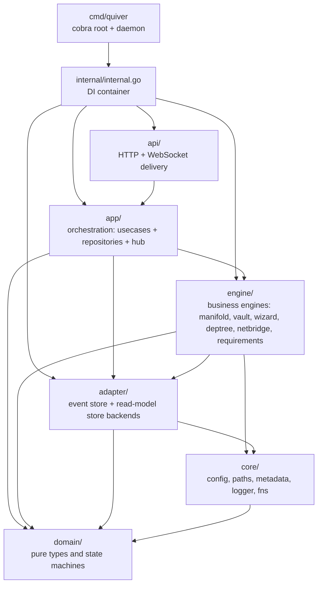
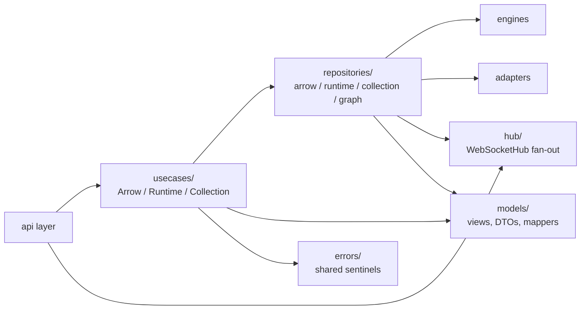
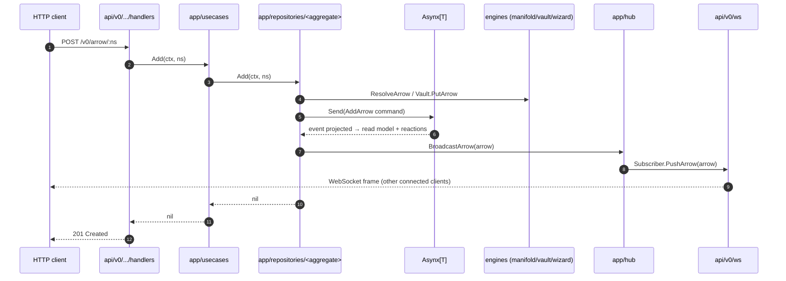
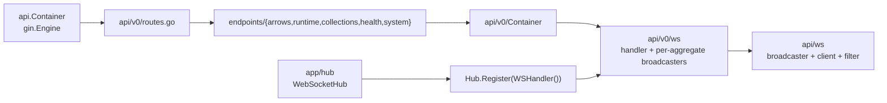
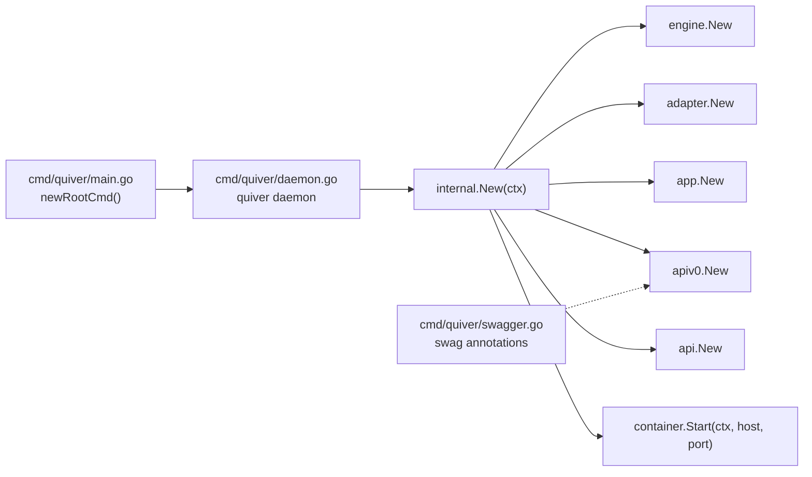

# Quiver — Architecture Overview

## Purpose

This document is a living architectural map of the `quiver.core` repository. It describes how the codebase is organized today: which packages own what, how dependencies flow between layers, and how a request travels from the wire down to domain aggregates and back. It is descriptive, not prescriptive — when the code changes, this file changes with it.

For domain semantics, manifest schemas, and operational behaviour, follow the cross-references at the bottom of each section.

---

## 1. Layer Map

The codebase is organized into six layers under `internal/`, with one binary entry point — `cmd/quiver` — that wires them together. Each layer has a single, narrow responsibility and depends only on layers below it.

| Layer | Path | Responsibility |
|-------|------|---------------|
| `domain/` | `internal/domain/` | Pure types and state machines. No I/O, no imports from other internal packages. |
| `core/` | `internal/core/` | Process-wide singletons and primitives — config, embedded metadata, paths, logger, filesystem/HTTP I/O (`fns`). |
| `adapter/` | `internal/adapter/` | Pluggable storage backends. Event-store and read-model-store implementations (SQLite, in-memory). |
| `engine/` | `internal/engine/` | Stateful business engines. Each is independently constructible and exposes a narrow interface. No engine imports another. |
| `app/` | `internal/app/` | Orchestration. Owns Asynx aggregates, composes engines and adapters into usecases, owns the broadcast hub. |
| `api/` | `internal/api/` | Delivery. Maps HTTP and WebSocket frames to usecase calls and back to DTOs. Knows nothing about Asynx, commands, or domain projections. |

The dependency direction is enforced by the order of construction in `internal.New`: engines and adapters are built first, then app, then api versions are wired into the api container.

---

## 2. Engine Catalog

Engines are independent business components. The `engine.Container` holds one instance of each; the app layer composes them into orchestration flows.

| Engine | Owns | Spec |
|--------|------|------|
| `manifold` | Resolves remote namespaces — fetches raw manifests, translates, compiles per-OS targets, validates against the ruleset. | [manifold.md](manifold.md) |
| `vault` | Per-namespace workdir allocation and TTL-bounded manifest cache on disk. Sweeps stale entries. | [vault.md](vault.md) |
| `wizard` | Sequential step execution (run, fetch, signal, dependencies) with event emission and graceful shutdown. | [wizard.md](wizard.md), [runtime.md](runtime.md) |
| `deptree` | DFS topological sort over a transitive dependency graph with cycle detection. | [deptree.md](deptree.md) |
| `netbridge` | Asynx-backed dynamic port allocation with best-effort UPnP/NAT-PMP forwarding. | [netbridge.md](netbridge.md) |
| `requirements` | OS, CPU, memory, and disk validation against an arrow's declared requirement block. **TODO — package exists but is not wired into the engine container or any usecase yet.** | — |

Engines that need event sourcing (`netbridge`) hold their own private Asynx aggregate inside their `internal/` subtree. The other engines are stateless, save for the on-disk cache in `vault`.

`manifold` decomposes internally into resolver (remote fetch), translator (YAML/markdown → typed model), compiler (OS target compilation), ruleset (validation), and constraint resolvers. `wizard` decomposes into a runtime layer (process spawn, signal, alive checks) and per-step-type handlers.

---

## 3. Application Layer

The app layer is where engines, adapters, and the read/write API meet. It is split into five sibling packages under `internal/app/`.

### 3.1 Usecases

`usecases/` exposes the public surface the api layer consumes. Three usecase interfaces — `ArrowUsecase`, `RuntimeUsecase`, `CollectionUsecase` — wrap workflow logic that spans multiple repositories. The usecase container wires repository callbacks (e.g. `OnRuntimeEnded`, `OnArrowUpgraded`) so cross-aggregate reactions like cascading uninstalls land here, not in the repositories.

### 3.2 Repositories

`repositories/` is the only place that owns Asynx aggregate handles. Four repositories sit side by side:

| Repository | Asynx aggregate | Backing store |
|------------|-----------------|---------------|
| `arrow` | `Asynx[domain.Arrow]` | event store (SQLite) + GORM read model |
| `runtime` | `Asynx[domainRuntime.ArrowRuntime]` | event store (SQLite); transient state recovered on Start |
| `collection` | `Asynx[domain.Collection]` | event store (SQLite) + dedicated read-model SQLite DB |
| `graph` | none — derived projection | dependency-edge SQLite table |

Each repository's `internal/` subtree holds its commands, upcasters, store schema, and reactions. The graph repository is special: it has no aggregate of its own — it subscribes to arrow events and rebuilds the dep-edge table as a projection.

### 3.3 Hub

`hub/` defines the `WebSocketHub` interface and a `Subscriber`-fan-out implementation. Repositories register projections that broadcast arrow, runtime, and collection mutations. The api container registers each api-version's WS handler as a subscriber.

### 3.4 Models

`models/` holds app-layer view types and DTO definitions consumed by both usecases and tests. The `mappers/` subpackage converts between domain aggregates and DTOs without leaking domain mutability across the api boundary.

### 3.5 Errors

`errors/` defines the small sentinel set (`ErrNotFound`, `ErrAlreadyExists`, `ErrStateViolation`, `ErrDependentsExist`, `ErrInvalidNamespace`, `ErrInvalidManifest`, `ErrPlatformNotSupported`, `ErrMissingVariable`, `ErrMethodNotFound`, `ErrFetchFailed`) so usecases and repositories agree on error semantics.

For the per-method usecase contract see [usecases.md](usecases.md). For command names and event projections see [commands.md](commands.md).

---

## 4. Orchestration Story — Where Asynx Lives

Asynx is the event-sourcing kernel. There are four Asynx aggregates in a running daemon:

| Aggregate | Owner | Stream |
|-----------|-------|--------|
| `Asynx[Arrow]` | `app/repositories/arrow` | `arrow.*` |
| `Asynx[ArrowRuntime]` | `app/repositories/runtime` | `runtime.*` |
| `Asynx[Collection]` | `app/repositories/collection` | `collection.*` |
| `Asynx[PortAllocation]` | `engine/netbridge/internal` | `port.*` |

A user-facing mutation flows like this:

Reactions inside the runtime repository drive the long-running work: when `BeginInstall` lands, an Asynx subscription kicks off the wizard execution in a background goroutine, emits `runtime.*` events as steps progress, and the goroutine completes with `runtime.ended` on success or failure. See [subscriptions.md](subscriptions.md) for the full subscription topology.

---

## 5. Delivery Story — HTTP + WebSocket

The api layer is versioned. The shared `api.Container` owns the Gin engine and the connection-fan-out hub. Each `api.Version` — `api/v0` is the only one mounted today — implements `Prefix() / Register() / WSHandler()` and is passed to `api.New` for mounting.

REST and WebSocket on the same path are dispatched at route-time: `dispatch(rest, ws)` checks the `Upgrade` header. Plain `GET /v0/arrow` returns JSON; `Upgrade: websocket` upgrades to a stream filtered by query parameters.

The `api/ws` package contains a generic `Broadcaster[T]` plus client and filter primitives reused across arrow, runtime, and collection streams. Each api version's WS handler holds one broadcaster per aggregate type and receives broadcasts via the `Subscriber` interface.

Middleware is shared across versions: a request logger, request timer, and panic recovery wrap every route. The Gorilla WebSocket upgrader allows all origins (v0 — no auth surface yet).

For the REST endpoint catalog see [http-api.md](http-api.md). For WebSocket framing and filtering rules see [websocket.md](websocket.md).

---

## 6. Domain Layer

`internal/domain/` holds the canonical types every other layer references:

| Group | Types |
|-------|-------|
| Identity | `Namespace`, `Method` |
| Aggregates | `Arrow` (with `ArrowMeta`, `ArrowState`, transitions), `Collection`, `CollectionArrow`, `CollectionArrowEntry` |
| Manifest fragments | `Variable`, `VariableType`, `Requirement`, `Target`, `TargetLifecycle` |
| Runtime sub-tree | `domain/runtime` — `ArrowRuntime`, `Execution`, `ExecutionOutcome`, `StepProgress` and the typed `step/` hierarchy (`Step`, `RunStep`, `FetchStep`, `SignalStep`, `DependenciesStep`) |
| Networking | `domain/netbridge` — `Protocol`, `PortDef` |
| Misc | `OS`, `Credit`, `DependencyEdge` |

The `ArrowState` machine and the runtime `Execution` lifecycle are pure domain logic — their transition tables live in `arrow.go` and `runtime/`. Every layer above consults these tables; nothing else may grow knowledge of valid transitions.

For the full type catalog see [domain.md](domain.md). For namespace and `namespace@ref` versioning see [entities.md](entities.md).

---

## 7. Core Layer

`internal/core/` holds process-singleton primitives. None of them carry business logic.

| Package | Owns |
|---------|------|
| `core/config` | YAML config loader. Embedded `default.yaml` overlaid by `~/.quiver/config.yaml`. Exposes `GetAPI()`, `GetManifold()`, `GetVault()`, `GetNetbridge()`, `GetLogger()`, `GetArrows()`. |
| `core/metadata` | Embedded `metadata.yaml` with version, paths template (`{{home}}/state/events`, etc.), and platform table for resolving raw URLs (GitHub, GitLab, Bitbucket). |
| `core/paths` | Concrete on-disk path resolution with per-path mutex on `MkdirAll`. Bridges metadata templates to absolute paths (`Events()`, `Store()`, `Namespaces()`, `Logs()`, plus `*At(homeDir)` variants for tests). |
| `core/logger` | `slog` initialization. Stderr-only when disabled; rotating file under `logs/Quiver.log` plus stdout when enabled. |
| `core/fns` | FetchNShare — strategy-dispatched filesystem and HTTP I/O (`Read`, `Write`, `Download`, `Fetch`, `Copy`, etc.). Local strategy for paths, remote strategy for `http://` and `https://` URLs. |

`core.Core` (in `core.go`) is a thin façade combining metadata and config; it is not the DI container — `internal.Container` is.

---

## 8. Adapter Layer

`internal/adapter/` holds pluggable storage backends.

| Package | Provides |
|---------|----------|
| `adapter/eventstore/sqlite` | `asynxModels.Store` — SQLite-backed Asynx event log. Used by every Asynx aggregate (`arrow.db`, `runtime.db`, `collection.db`, `netbridge.db`). |
| `adapter/store` | Generic `Store[T, K]` interface with `sqlite/` and `memory/` implementations. Used by repositories that need a queryable read model independent of Asynx (e.g. collection store, dep-edge store). |

`adapter.Container` constructs three event-store handles (arrow, runtime, collection) and tracks them as `io.Closer`s for shutdown. The netbridge event store is constructed inside `engine.New` because it is engine-private.

---

## 9. Binary Layout

The binary is a single Cobra command tree. `quiver daemon` is the only subcommand; it builds the container, logs a startup line, and blocks on `Run(host, port)`. `version` and `buildID` are injected at build time via `-ldflags`. `swagger.go` carries top-level swag annotations consumed by the `swag` generator — the resulting `swagger.json`/`swagger.yaml` are written to `docs/swagger/` for distribution alongside the binary.

`internal.New` is the wiring point — it returns a `Container` exposing each layer and a `Start(ctx, host, port)` method that brings up engines, runs app projections, and serves HTTP. Tests construct partial containers via the `WithHomeDir` option on `engine.New`, `adapter.New`, and `app.New` to isolate filesystem state.

---

## 10. Configuration & Metadata Story

Configuration sources are layered:

1. `internal/core/metadata/metadata.yaml` is embedded at compile time. It declares paths templates (`{{home}}/state/events`, `{{home}}/vault`, etc.), platform raw-URL templates, and product identity. The `home` field has an OS-aware default (`~/.quiver` on Unix, `C:\Users\{{USER}}\Documents\.quiver` on Windows).
2. `internal/core/config/default.yaml` is also embedded — it provides defaults for `api.host`, `api.port`, `manifold.fetch_timeout`, `vault.sweep_interval`, `vault.ttl`, `netbridge`, `logger`, and `arrows.auto_retry`.
3. At process start, `config.Get()` overlays any present fields from `~/.quiver/config.yaml` (resolved via `metadata.GetConfigPath()`) onto the embedded defaults. Missing fields keep their embedded values.

Path resolution is centralized in `core/paths`. Every component asks `paths.Events()`, `paths.Store()`, `paths.Namespaces()`, etc. — never `os.MkdirAll` or string concatenation. Per-path mutexes serialize concurrent first-time creation across goroutines.

CLI flags on `quiver daemon` (`--host`, `--port`) override config values via `api.buildAddr` — empty/zero means "use config".

---

## 11. Cross-References

| Topic | Spec |
|-------|------|
| Namespaces and `namespace@ref` versioning | [entities.md](entities.md) |
| Domain types and state transitions | [domain.md](domain.md) |
| Manifold, resolver, ruleset, compiler | [manifold.md](manifold.md) |
| Vault on-disk layout and TTL sweep | [vault.md](vault.md) |
| Dependency graph topology | [deptree.md](deptree.md) |
| Netbridge port allocation and forwarding | [netbridge.md](netbridge.md) |
| Wizard step execution and signalling | [wizard.md](wizard.md) |
| Process runtime — spawn, signal, alive checks | [runtime.md](runtime.md) |
| Usecase contracts (per method) | [usecases.md](usecases.md) |
| Asynx commands, events, projections | [commands.md](commands.md) |
| Subscription topology | [subscriptions.md](subscriptions.md) |
| REST endpoint catalog | [http-api.md](http-api.md) |
| WebSocket framing and filtering | [websocket.md](websocket.md) |
| Arrow manifest schema (v0) | [manifests/v0/arrow.md](manifests/v0/arrow.md) |
| Arrow versioning rules (v0) | [manifests/v0/versioning.md](manifests/v0/versioning.md) |
| Collection manifest schema (v0) | [manifests/v0/collection.md](manifests/v0/collection.md) |
