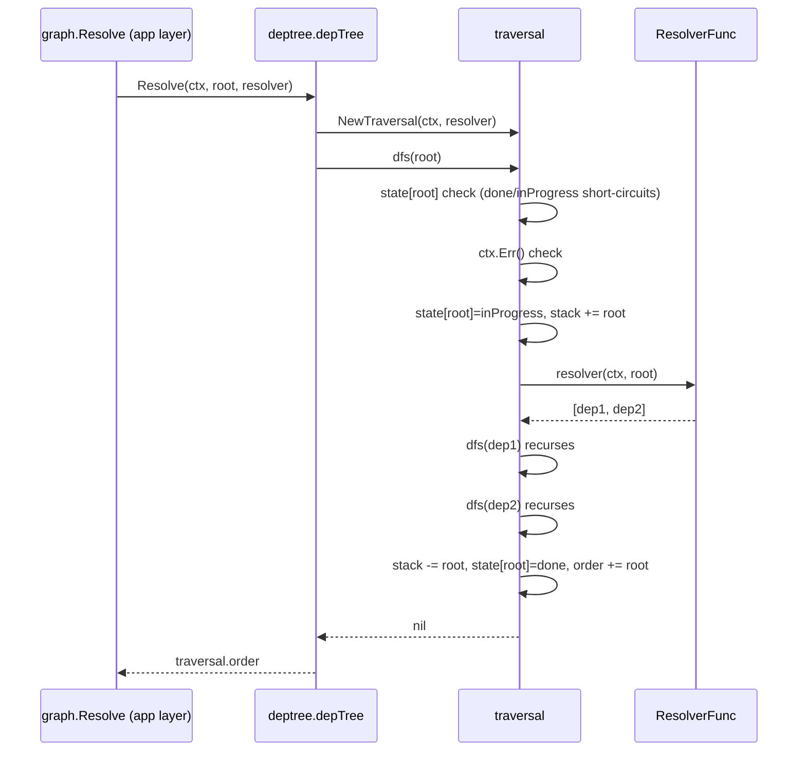
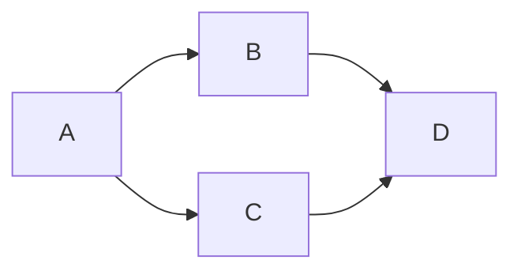

# Quiver — DepTree

## Overview

DepTree is the engine module responsible for **dependency resolution**. Given a root
`domain.Namespace` and a resolver callback that returns each node's direct dependencies,
it walks the graph using DFS topological sort, detects cycles, and returns an installation
order in which every dependency precedes its dependents.

DepTree is pure graph logic. It performs no I/O, owns no state across calls, knows nothing
about manifests, the filesystem, Asynx, or Vault. It receives `domain.Namespace` values from
the caller and returns `[]domain.Namespace` — that is the entirety of its surface area.

**Node identity is `domain.Namespace`.** A namespace string optionally carries an `@ref`
suffix (`github.com/owner/repo@v1.2.3`), and DepTree treats it as an opaque key — two
namespaces that differ in their `@ref` suffix are distinct nodes and are visited separately.
Glob expansion, constraint resolution, and version selection happen in the app layer
**before** the resolver returns; DepTree never sees a glob pattern. See
[manifests/v0/versioning.md](manifests/v0/versioning.md) for the version model and
[domain.md](domain.md) for the `Namespace` and `DependencyEdge` types.

Cross-references: [domain.md](domain.md) · [manifold.md](manifold.md) · [vault.md](vault.md)
· [usecases.md](usecases.md) · [manifests/v0/versioning.md](manifests/v0/versioning.md).

---

## 1. Module

`deptree` — package at `internal/engine/deptree/`. Constructed once during engine container
initialization (`engine/container.go`) and exposed on `engine.Container.DepTree`. The app
layer's graph repository (`internal/app/repositories/graph/`) is the sole caller; it injects
DepTree into its `graphService` and wraps every `Resolve` call with a resolver closure that
fetches manifests through `resolveManifest` and indexes dependency types.

History: PR #110 introduced the DFS topological sort. The earlier `graph` engine package was
deprecated and absorbed into `engine/deptree/` plus the app-layer `graph` repository — the
old `docs/spec/graph.md` was deleted.

### File Layout

| File | Contents |
|------|----------|
| `deptree.go` | `DepTree` interface, `ResolverFunc` type, `New()` constructor, top-level `Resolve` |
| `traversal.go` | `traversal` struct, `NewTraversal`, recursive `dfs`, `buildCycleError` |
| `node_state.go` | `nodeState` enum: `unvisited`, `inProgress`, `done` |
| `errors.go` | `ErrCyclicDependency` sentinel and `CycleError` struct |
| `deptree_test.go` | Unit tests — linear chains, diamond, deep transitive, cycles, self-dep, resolver error, context cancellation, deterministic order, root-always-last |
| `deptree_bench_test.go` | Benchmarks — linear chain (10), diamond, wide (50 deps) |

The mock used by app-layer tests lives at `internal/mocks/deptree.go` and exposes a
`DepTree` struct with `Result []domain.Namespace` and `Err error` fields that
`Resolve` returns verbatim.

---

## 2. Interface Contract

### Types

| Symbol | Description |
|--------|-------------|
| `DepTree` (interface) | Single method: `Resolve(ctx, root domain.Namespace, resolver ResolverFunc) ([]domain.Namespace, error)` |
| `ResolverFunc` | `func(ctx context.Context, ns domain.Namespace) ([]domain.Namespace, error)` — caller-provided lookup that returns the direct dependencies of `ns` |
| `New()` | Constructor — returns `DepTree`. The implementation is the unexported `depTree` struct, which holds no state |

### Resolver Callback Contract

The resolver is the only bridge between DepTree and the rest of the system. It is invoked
exactly once per node that the traversal first encounters (subsequent visits hit the `done`
short-circuit before the resolver runs).

| Aspect | Contract |
|--------|----------|
| Input | `ctx` (DepTree's caller-supplied context) and the namespace whose direct dependencies are requested. |
| Output | `[]domain.Namespace` — the direct dependencies, in the order they should be visited. May be empty or `nil` for leaf nodes. The slice must contain only resolved namespaces (no glob patterns); the caller is responsible for any constraint resolution before returning. |
| Errors | Any non-nil error aborts the entire traversal. DepTree returns the error verbatim — no wrapping, no `errors.Join`, no partial order. |
| Determinism | DepTree visits dependencies in slice order. If the resolver wants reproducible output, it must return a stable order (the production implementation in the graph repository deduplicates and preserves manifest order via `graphinternal.DedupNamespaces`). |
| Side effects | DepTree does not assume idempotency, but the resolver is called at most once per unique namespace per `Resolve` call. |

The graph repository builds the production resolver: it calls
`resolveManifest(ctx, depNs)` (Vault cache then Manifold), looks up the per-OS target, walks
both `target.Tools` and `target.Services`, calls `resolveEdgeNs` to resolve any glob
constraints to a concrete `@ref` via `manifold.ResolveConstraint`, and records the dependency
type (`tool` vs `service`) in a side index keyed by bare namespace. The deduplicated
namespace list is returned to DepTree.

### Properties

- **No caching across calls.** Each `Resolve` invocation creates a fresh `traversal` struct
  with empty state, stack, and order maps; nothing carries over.
- **No I/O.** DepTree performs zero network or filesystem operations; everything external
  is funneled through the resolver.
- **No Asynx coupling.** DepTree emits no events and accepts no command channels.
- **Deterministic for a given resolver.** Output order is fully determined by the resolver's
  return order plus DFS post-order rules.

---

## 3. Algorithm

DepTree implements a recursive **depth-first search topological sort** with three-color
marking. The result is a reverse post-order: dependencies precede dependents and the root
is always the last element of a successful return.

### 3.1 Node States

The traversal tracks each namespace's state in a `map[domain.Namespace]nodeState`. Nodes
absent from the map are implicitly `unvisited`; only `inProgress` and `done` are written.

| State | Meaning | When set |
|-------|---------|----------|
| `unvisited` | Default — never touched by the traversal | Initial state of every namespace |
| `inProgress` | Currently on the recursion stack — its subtree is being explored | Set on entry to `dfs(ns)`; the namespace is also pushed onto `stack` |
| `done` | All descendants resolved and the namespace appended to `order` | Set after the resolver call and recursive descent return; the namespace is also popped from `stack` |

### 3.2 Traversal Procedure

The `traversal` struct holds: the context, the resolver callback, the `state` map, an
ordered `stack` of in-progress namespaces (used purely to reconstruct cycle paths), and the
output `order` slice.

`dfs(ns)` performs these checks in order:

1. If `state[ns] == done`, return immediately — already fully processed (diamond merge).
2. If `state[ns] == inProgress`, build and return a `*CycleError` — the node is on the
   recursion stack so we have closed a cycle.
3. Check `ctx.Err()`; if non-nil (cancel or deadline), return it without calling the
   resolver.
4. Mark `state[ns] = inProgress` and push `ns` onto `stack`.
5. Call the resolver to get direct dependencies.
6. For each dep, recurse into `dfs(dep)`; propagate any error up the call stack.
7. Pop `ns` off `stack`, set `state[ns] = done`, append `ns` to `order`.

The top-level `Resolve` simply constructs a traversal, calls `dfs(root)`, and returns
`traversal.order` on success.

### 3.3 Diagrams

#### Sequence diagram of a single Resolve call



#### Example graph and resulting order



Possible DFS orders for `Resolve(A)` with resolver returning `[B, C]` for A: `[D, B, C, A]`
(B's subtree visited first, D marked done, C re-encounters D and short-circuits) — root
always last; D appears once; the diamond collapses naturally.

### 3.4 Cycle Detection

When `dfs` encounters a namespace already marked `inProgress`, the recursion stack is
guaranteed to contain that namespace. `buildCycleError` walks `stack` from the front to
locate the first index where the offending namespace lives, then returns a `CycleError`
whose `Path` is `stack[startIndex:]` followed by the offending namespace appended a second
time at the end.

| Input graph | `CycleError.Path` |
|-------------|-------------------|
| `A → B → C → A` | `[A, B, C, A]` |
| `A → A` (self-edge) | `[A, A]` |
| `A → B → C → B` (cycle in subtree, not on root) | `[B, C, B]` — only the cycle, not the prefix from A |

The error message renders the path joined by ` -> `, e.g.
`deptree: cyclic dependency detected: github.com/owner/a -> github.com/owner/b -> github.com/owner/a`.
`CycleError.Unwrap()` returns the sentinel `ErrCyclicDependency`, so callers can use
`errors.Is(err, deptree.ErrCyclicDependency)` for a generic check or `errors.As(err,
&cycleErr)` to recover the path.

### 3.5 Why DFS Over Kahn's Algorithm

| Property | DFS post-order (chosen) | Kahn (BFS, in-degree) |
|----------|-------------------------|-----------------------|
| Cycle path extraction | Free — recursion stack carries it | Requires a second pass |
| Implementation | Recursive `dfs` + state map | Pre-pass to compute in-degrees + queue |
| Lazy resolver calls | Yes — only reachable nodes | Yes, but harder to compose |
| Memory | O(V + recursion depth) | O(V) plus queue |

DFS gives diagnostic-quality cycle paths with no extra bookkeeping, which matters because
cycles surface to the user via the install flow's Step 0 failure.

---

## 4. Errors

| Symbol | Type | Source |
|--------|------|--------|
| `ErrCyclicDependency` | sentinel `error` (`"deptree: cyclic dependency detected"`) | `errors.go` |
| `CycleError` | struct with `Path []domain.Namespace`; implements `Error()` and `Unwrap() error` | `errors.go` |

`CycleError.Error()` formats the path with `" -> "` separators using each namespace's
`String()` method (the full namespace, including any `@ref` suffix). `Unwrap()` returns
`ErrCyclicDependency` so the sentinel is reachable via `errors.Is`.

Resolver errors propagate without wrapping. Context errors (`context.Canceled`,
`context.DeadlineExceeded`) are returned directly from the `ctx.Err()` check inside `dfs`
before the resolver is invoked.

---

## 5. Edge Cases

| Case | Resolver behaviour | Result |
|------|--------------------|--------|
| Leaf root (no deps) | Returns `[]` or `nil` | `Resolve` returns `[root]` |
| Linear chain `a → b → c → d` | Each returns the next | `[d, c, b, a]` |
| Diamond `a → {b, c}, b → d, c → d` | Standard | `[d, b, c, a]` (or `[d, c, b, a]` depending on resolver order); `d` appears once; root last |
| Wide root with N independent deps | Returns N siblings | `[dep0, dep1, …, depN-1, root]` — siblings in resolver order, root last |
| Self-edge `a → a` | Returns `[a]` | `CycleError{Path: [a, a]}` |
| Cycle `a → b → c → a` | Standard | `CycleError{Path: [a, b, c, a]}` |
| Resolver error mid-traversal | Returns `(nil, sentinel)` | `Resolve` returns the sentinel; `order` is discarded |
| Pre-cancelled context | n/a | `ctx.Err()` returned from the first `dfs` call before resolver runs |
| Same bare namespace, different `@ref` | Resolver returns both | Both visited as distinct nodes; both appear in `order` |

---

## 6. Caller Wiring

DepTree itself is not aware of these flows; this section describes how the app layer plugs
it in.

### 6.1 graph Repository Wraps DepTree

The graph repository (`internal/app/repositories/graph/graph.go`) injects DepTree and exposes
a higher-level API to the use cases. Forward queries flow through DepTree:

| Repo method | Role | Goes through DepTree? |
|-------------|------|-----------------------|
| `Resolve(ctx, ns) (Plan, error)` | Builds the install plan: DFS via DepTree, then types each entry (`tool` or `service`) using the side index populated during resolution | Yes |
| `Unplan(ctx, ns) (Plan, error)` | Calls `Resolve` then reverses the slice — used for uninstall/orphan ordering (leaves last) | Yes (transitively) |
| `Orphans(ctx, ns) ([]Namespace, error)` | Calls `Resolve` then filters entries whose `HasDependents` returns true (excluding `ns` itself) | Yes (transitively) |
| `HasDependents(ctx, ns, excludeNs) (bool, error)` | Reads the `dep_edges` table directly via `edgeStore.HasAnyDependents` | No — pure DB query |
| `GetDependents(ctx, ns) ([]Namespace, error)` | Reads `dep_edges` via `edgeStore.EdgesToBare` and reconstructs versioned namespaces | No — pure DB query |
| `SyncDependencies(ctx, ns, arrow)` | Persists the per-arrow direct-dep edges to the `dep_edges` SQLite table when manifests are added/updated | No — DB write |
| `RemoveDependencies(ctx, ns)` | Deletes both outgoing and incoming edges for a namespace | No — DB write |
| `DiffDeps(old, new)` | Pure in-memory diff of two manifests' dependency edges by bare namespace | No |

**Reverse-dep queries are app-layer concerns, not DepTree's.** The engine's DepTree exposes
only the forward DFS — no reverse adjacency, no edge index, no namespace registry. Reverse
queries are answered by the graph repository against the `dep_edges` table populated via
Asynx projection (`graphinternal.Register` hooks into the arrow Asynx instance).

### 6.2 Install Flow — Step 0

The install flow injects a synthetic **Step 0** of type `dependencies` ahead of the manifest's
install steps so DepTree resolution is a first-class step in the execution timeline (unified
progress, error capture in `StepProgress.Error`, WebSocket events).

```mermaid
flowchart TD
    Start([POST /v1/arrow/{ns}/_install]) --> Begin[runtime.Begin _install with depStep + install steps]
    Begin --> S0Run[runtime.Advance step 0 running]
    S0Run --> Resolve[graph.Resolve -> deptree.Resolve]
    Resolve -->|CycleError or resolver err| S0Fail[runtime.Advance step 0 failed with error]
    S0Fail --> EndAbsent[runtime.End failed -> state absent]
    Resolve -->|ordered Plan| S0Done[runtime.Advance step 0 completed]
    S0Done --> Loop[For each dep in topo order, install if not already ready]
    Loop -->|any failure| Rollback[Reverse-order uninstall of installed deps]
    Rollback --> EndAbsent
    Loop -->|all ok| RootSteps[Wizard runs root install steps from index 1]
    RootSteps --> EndReady[runtime.End success -> state ready]
    EndReady --> VaultWrite[Vault entry: indirect_dependencies populated]
```

Detailed sequence: see [usecases.md](usecases.md) §Install. The plan is consumed in
topological order (dependencies before dependents); each dep gets its own
`runtime.Begin{_install}` execution with its own Step 0 (potentially recursive).

### 6.3 Uninstall Flow — Reverse Order via `Unplan`

Before `_uninstall` begins, the use case rejects with 422 if `HasDependents` returns true
(another installed arrow still depends on the target). On success, orphan cleanup uses the
graph repository's `Orphans` method (which composes `Resolve` + `HasDependents`), then walks
the orphans in **reverse topological order** (`Unplan` reverses `Resolve`) so leaves are
uninstalled last. DepTree's role is the same DFS — orientation is flipped at the call site,
not inside DepTree.

```mermaid
flowchart TD
    UStart([POST /v1/arrow/{ns}/_uninstall]) --> Check{HasDependents?}
    Check -->|yes| Reject[422 Reject]
    Check -->|no| BeginU[runtime.Begin _uninstall]
    BeginU --> RunSteps[Wizard runs uninstall steps]
    RunSteps --> EndU[runtime.End success -> state removed]
    EndU --> Orphans[graph.Orphans -> Resolve, filter by HasDependents]
    Orphans --> Reverse[Unplan = reverse plan]
    Reverse --> ULoop[For each orphan: uninstall]
    ULoop --> CleanVault[Clean vault entries]
```

### 6.4 Vault Interaction

DepTree never reads or writes Vault. After a successful install, the use case persists the
DFS result on the Vault entry as `indirect_dependencies` (transitive deps not in the
manifest's direct dependency list). Versioning is preserved via the `@ref` suffix on each
namespace string. See [vault.md](vault.md) §4.5.

---

## 7. Constraints

- **No Asynx**, no events, no commands.
- **No I/O** — all external data flows through the resolver callback.
- **No version-conflict logic** — the same bare namespace at two different `@ref`s is two
  distinct nodes; both install. See [manifests/v0/versioning.md](manifests/v0/versioning.md).
- **No glob handling** — globs must be resolved by the caller before the resolver returns.
- **No persistence** — fresh state per `Resolve` call.
- **App layer is the only caller** — the graph repository (and its tests) is currently the
  sole consumer of `engine.Container.DepTree`.
- **Deterministic for a deterministic resolver** — DFS order follows the resolver's slice
  order.

---

## 8. Open Questions

| # | Question | Default if unresolved |
|---|----------|-----------------------|
| 1 | Should `Resolve` accept a max-depth limit to bound runaway resolution? | No limit in v0. |
| 2 | Should cycles be detected across versions of the same bare namespace? (`a@v1 → a@v2 → a@v1`) | Yes — DepTree treats the `@ref`-bearing string as the node key, so `a@v1 → a@v2 → a@v1` is a cycle but `a@v1 → a@v2` is not. The same bare namespace at two refs without a back-edge resolves cleanly to two installs. |
| 3 | Should DepTree expose a streaming or progress channel for very deep graphs? | No — Step 0 progress is a single `running → completed/failed` transition; depth is bounded by manifest size. |
