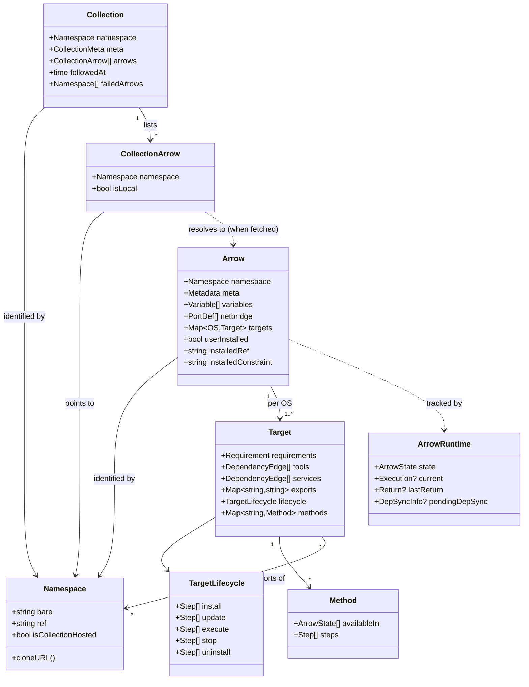

# Quiver — Core Entities

## Overview

Quiver is a decentralized package manager: software is published by hosting a manifest in a Git repository, and installed by referencing the namespace of that repository. There is no central registry. Identity is the source.

The domain model has three primitives:

1. **Arrow** — a package. The thing that gets installed, configured, started, stopped, and removed.
2. **Collection** — a curated list of Arrow references. A discovery and authorship primitive, not an execution unit.
3. **Namespace** — identity. A URL-shaped string that resolves to a Git repository and a file inside it, with an optional `@ref` suffix that pins a version.

Arrows and Collections are aggregates that live in their own manifests and are served by their own repositories. Namespaces are not aggregates — they are the identifiers that bind everything together.

Detailed manifest formats live in companion specs: see [manifests/v0/arrow.md](manifests/v0/arrow.md), [manifests/v0/versioning.md](manifests/v0/versioning.md), and [manifests/v0/collection.md](manifests/v0/collection.md). This document describes the entities themselves — what they are, what they contain, where they live, and how they relate.

---

## 1. Arrow

An Arrow is a unit of software that Quiver can install and manage. The same primitive describes a CLI tool, a long-running game server, a system daemon, or anything in between. What distinguishes them at runtime is which lifecycle hooks the manifest defines, not what kind of software they wrap.

### What an Arrow contains

An Arrow's manifest is split into top-level sections that apply to every platform, plus a per-platform `targets` section that holds everything platform-specific.

The top-level sections are:

- **Metadata** — name, description, license, URL, maintainers, credits, and tags. Not version: an Arrow does not declare its own version, it is the git ref the manifest was resolved at.
- **Variables** — user-configurable parameters: name, type (string, number, boolean, or select), default, optional `min`/`max` (for numbers) or `values` (for selects), description, and a `sensitive` display hint.
- **Netbridge** — declared network ports: name, protocol (`tcp`, `udp`, or `tcp/udp`), default port number, and whether the port is required.

The `targets` section is a map keyed by glob patterns over the six supported platforms (`linux/amd64`, `linux/arm64`, `windows/amd64`, `windows/arm64`, `darwin/amd64`, `darwin/arm64`). Each target carries its own:

- **Requirements** — minimum CPU cores, RAM (in GB), and disk (in GB).
- **Tools** — Arrow dependencies that must be installed before this Arrow but are not started as long-running processes.
- **Services** — Arrow dependencies that must be installed and running before this Arrow runs.
- **Exports** — named values this Arrow makes available to other Arrows that depend on it. The values themselves can be platform-specific.
- **Lifecycle** — five ordered step lists keyed by hook name: `install`, `update`, `execute`, `stop`, and `uninstall`.
- **Methods** — developer-defined custom actions, each gated by an `available_in` list of states it may be invoked in, with its own ordered step list.

Steps within a lifecycle hook or method are one of three concrete types: `run` (execute a shell command), `fetch` (download a file to a local path), or `signal` (send a process signal: graceful, kill, or interrupt). Almost every step field is overrideable — a step can declare a per-platform value for any field while inheriting the rest from a default.

Targets compose. A target may declare `base: <other-target-key>` to inherit from another target in the same manifest; abstract targets (those whose key starts with `_`, by convention `_common`) are never selected at runtime but exist to be inherited from. A glob like `linux/*` matches both Linux architectures; `*` matches everything; an exact key like `darwin/arm64` matches a single platform. At target-resolution time the most specific matching key wins, base chains are flattened, and per-field overrides are collapsed against the actual platform.

There is also a synthetic `dependencies` step type, which is not authored in any manifest. It is injected by the platform as the first step of every install, and represents the dependency-resolution phase. Authored manifests cannot declare it.

### Where an Arrow lives

An Arrow exists in one of two physical forms; both produce the same manifest.

A **standalone Arrow** lives in its own Git repository, with `ARROW.md` (a Markdown file containing a fenced ` ```arrow ` code block) or `arrow.yaml` at the repo root. The namespace is the repository: `github.com/valve/steamcmd`.

An **Arrow inside a Collection** lives as a file inside a Collection repository, named after its AUID (the fourth path segment): `cs2.md` or `cs2.yaml`. The namespace is the Collection's namespace plus the AUID: `github.com/char2cs/gaming.quiver/cs2`.

Both forms accept either Markdown (with a fenced code block) or plain YAML. The resolver tries the Markdown form first. The on-disk filename is the only physical difference between the two forms — the manifest schema is identical.

### Arrow lifecycle

An Arrow has a runtime aggregate, separate from its manifest, that tracks state. The manifest is a static description; the runtime is the live, observable thing the user interacts with.

The runtime states are: `absent`, `installing`, `updating`, `ready`, `running`, `stopping`, `draining`, `detached`, `uninstalling`, `removed`, and `outdated`. Of these, `running`, `stopping`, `draining`, `installing`, and `updating` are considered "active" — work is in progress. `removed` is terminal: an Arrow cannot transition out of `removed`.

Lifecycle transitions are driven by five execution methods, named with a leading underscore so they cannot collide with developer-defined methods:

- `_install` runs the target's `install` steps. It can be entered from `absent`, `removed`, or when no runtime aggregate exists at all (the very first install). On success the Arrow transitions to `ready`; on failure to `absent` (the runtime record exists but the Arrow is not functionally installed; re-install is allowed). `_install` always runs the synthetic `dependencies` step first, walking the dependency graph and ensuring tools and services are installed and (for services) running before the manifest's own install steps execute.
- `_uninstall` runs the target's `uninstall` steps. It can be entered from `ready` (the standard path: `ready → uninstalling → absent` on success, `→ ready` on failure). The use case layer rejects an uninstall when other Arrows still depend on this one.
- `_execute` runs the target's `execute` steps. It transitions `ready → running`. It is also the entry point used internally for service dependencies that need to be running before their dependent installs.
- `_stop` runs the target's `stop` steps. It transitions `running → stopping → ready` on success. The `detached` state is a transient bookkeeping state for runtimes that lost their managed process but still hold a record; from `detached` the runtime can resume to `ready` or proceed to `stopping`.
- `_update` runs the target's `update` steps. It can be entered from `ready` or `outdated`. It is also the path used to reconcile dependency drift: when an Arrow's manifest changes such that its declared dependencies no longer match what is installed, the runtime is marked `outdated` with a `PendingDepSync` record listing added and removed deps. The use case layer then resolves the new dependency set, installs/uninstalls as needed, and runs `_update` to converge.

In addition to these methods, an Arrow may define custom **methods** in its manifest. Methods are not lifecycle transitions — they do not move the Arrow between states. Each method declares which states it is `available_in` (typically `ready`, `running`, or both), and its steps execute in-place without changing state.

The platform records each execution as it runs: the method name, the work directory, the variables that were resolved for the run, the OS process ID once the wizard has spawned it, and a per-step progress record (`pending`, `running`, `completed`, `failed`, plus an optional error). When an execution finishes, its record collapses into a `LastReturn` value on the runtime, preserving the variables and step results so the next execution can inherit from them.

### Identity inside an Arrow

An installed Arrow's identity has two parts. The **namespace** identifies what is installed (which package, at which `@ref`). The **runtime** identifies the running record (state, current execution, last return). They are kept separate so that the catalog can talk about Arrows the user has merely added (manifest known, no runtime yet), the runtime can talk about Arrows that exist as records (e.g. `absent` after a failed install) but are not functional, and dependency-resolution can talk about Arrows that exist as transitive dependencies installed implicitly by another Arrow's install.

Two facts about an installed Arrow are recorded on the catalog aggregate alongside its manifest: `UserInstalled` (true if a human asked for it directly, false if it was pulled in as a dependency) and `InstalledConstraint` (the original constraint string the user asked for, like `@v1.*` or `@latest`, which is preserved separately from the concrete ref the aggregate is keyed by so that updates can re-evaluate the constraint).

---

## 2. Collection

A Collection is a curated list of Arrow references. It is a discovery and authorship primitive — a way for someone to publish "here are Arrows I think belong together" — not a way to install software. Following a Collection does not install any of its Arrows; installing an Arrow does not require any Collection.

In the codebase Collections are the third primitive aggregate. The earlier name "Quiver" survives in product copy and in one historic helper (`IsQuiverHosted` on Namespace, which checks whether a namespace has the four-segment Collection-hosted form), but the manifest schema is `collection@v0` and the domain type is `Collection`.

### What a Collection contains

The manifest has a metadata block — name, description, URL, maintainers, tags, and optional media (icon and banner image URLs) — and an `arrows` list. There is no version: the list names no artifact, and each member is pinned by the `@ref` on its own namespace. The list is heterogeneous: each entry is either a string (treated as an external full namespace), an object with a `path` field (resolved as a local Arrow file inside this Collection's repository), or an object with a `namespace` field (an explicit external reference). Exactly one of `path` or `namespace` is set per entry.

When the platform parses a Collection manifest it derives a normalized list of resolved Arrow references. Each resolved reference carries the final namespace and a flag indicating whether it is local to this Collection or external.

A Collection that the user follows also carries follower-side state: the timestamp at which it was followed, and a list of namespaces that failed to resolve at follow-time (so the UI can mark them as broken without dropping them).

### Where a Collection lives

A Collection lives in a Git repository with `COLLECTION.md` (Markdown with a fenced ` ```collection ` code block) or `collection.yaml` at the repo root. Local Arrows referenced by a `path:` entry live inside the same repository, addressed by their path; the path's last segment becomes the Arrow's AUID. Each local Arrow is itself a real Arrow file at that path, with the same manifest format as a standalone Arrow.

Collections never own Arrows. A Collection that lists `path: cs2` produces a derived namespace `<collection-namespace>/cs2`, but the Arrow file at that location is otherwise an ordinary Arrow — installable directly by namespace, regardless of whether the user has followed the Collection that lists it. A Collection that lists `namespace: github.com/valve/steamcmd` is just a pointer; the external Arrow keeps its own namespace and is unchanged by being listed.

The same Arrow may appear in many Collections without any identity conflict: each Collection's local Arrows get distinct namespaces (because their derived namespaces start with the Collection's URL), and external Arrows always keep their original namespace.

### Collection lifecycle

A Collection has two states from the user's perspective: **followed** or **not followed**. Following a Collection emits a `collection.followed` event that creates a Collection aggregate in the event store, snapshots the manifest, caches every referenced Arrow's manifest (local Arrows are seeded directly from the Collection repo; external Arrows are resolved through the regular fetch path), and records which arrows could not be cached. Unfollowing forgets the aggregate and removes the cached manifest. Not-yet-followed Collections may still appear in the catalog if their manifests were previously fetched and cached; reading one of those goes through the cache, optionally re-resolving when the cache is stale.

Following and unfollowing are independent of any Arrow's install/uninstall. Following a Collection installs nothing; unfollowing a Collection does not uninstall any Arrow that was installed from it.

---

## 3. Namespace

A Namespace is the identifier that binds everything together. It is a URL-shaped string that points at a Git repository and a file inside it, optionally with an `@ref` suffix that pins a version.

### Form

A bare namespace (the part before any `@`) has either three or four `/`-separated segments. Empty segments are not permitted.

The three-segment form, `domain/user/repo`, identifies a Git repository. The repository's content determines what it is: an `ARROW.md` or `arrow.yaml` at the root makes it a standalone Arrow; a `COLLECTION.md` or `collection.yaml` at the root makes it a Collection. A repository cannot be both at once.

The four-segment form, `domain/user/repo/auid`, identifies a single Arrow file inside a Collection repository. The first three segments are the Collection's namespace; the fourth segment is the Arrow Unique ID (AUID). The AUID is a simple identifier — never a URL or further-nested path — and corresponds to the Arrow file inside the Collection (after deriving from a `path:` entry, it is the last segment of that path).

The top three segments together — the Quiver Unique ID, or QUID — always denote a repository. From a four-segment namespace you can extract the QUID by dropping the AUID; from any namespace you can extract the domain by taking the first segment, and you can derive a clone URL of the form `https://<domain>/<user>/<repo>` by joining the first three segments. The four-segment form's AUID is the file basename inside the repo.

### Refs

A namespace may carry an `@ref` suffix that pins a version. Example forms:

- `github.com/valve/steamcmd` — bare, no ref. Treated as `latest` for resolution.
- `github.com/valve/steamcmd@v1.4.2` — pinned to an exact Git tag (or commit, or branch — anything the resolver can fetch).
- `github.com/valve/steamcmd@v1.*` — a glob constraint. The platform resolves this against the repository's available refs to pick a concrete one (typically the highest matching tag).
- `github.com/valve/steamcmd@latest` — the literal string `latest`, which the platform treats specially as "track HEAD."

The bare namespace (everything before `@`) is what determines repository identity; the ref determines which version is fetched and installed. Two namespaces that share a bare form but have different refs are two different installable units that can coexist side by side. Stripping the ref to compare bare forms is a routine operation; replacing the ref on an existing namespace is how upgrades are staged.

A namespace whose ref contains `*` is a glob — it identifies a constraint, not a concrete version, and must be resolved before it can be fetched. The original constraint is preserved on the catalog aggregate (as `InstalledConstraint`) even after it has been resolved to a concrete ref, so that future updates can re-evaluate the constraint against newly published refs. The resolved ref itself is kept nowhere but the aggregate key.

### Resolution

For an arrow namespace, the resolver derives:

- The clone URL — `https://<domain>/<user>/<repo>` — from the first three segments.
- The candidate file paths inside that repo. For a three-segment namespace it tries `ARROW.md` then `arrow.yaml`; for a four-segment namespace it tries `<auid>.md` then `<auid>.yaml`.

For a Collection namespace (always three segments), the resolver tries `COLLECTION.md` then `collection.yaml`.

The platform supports multiple fetch strategies — direct HTTP for known platforms (currently github.com, gitlab.com, bitbucket.org), and Git clone as a fallback. Custom domains are supported by the resolver chain even though there is no special discovery mechanism for them today.

### Identity rules

Three rules together make namespaces collision-free:

1. Domain ownership eliminates collisions at the top level.
2. The bare three-or-four-segment form is unambiguous about which physical file is meant.
3. The `@ref` suffix is part of the installable unit's identity, so two different versions of the same package are two distinct namespaces, not two states of one.

The same AUID under two different Collections is two different Arrows. A standalone Arrow and a Collection-hosted Arrow with the same final segment are two different Arrows. Cross-referencing — a Collection listing the same Arrow via both a local `path:` and an external `namespace:` — is allowed and produces two different entries with two different derived namespaces; the underlying Arrow files may be different files entirely, even if they happen to share a name.

---

## 4. How They Relate



The diagram shows three things at once. Arrows have one Namespace identity but contain a Target per platform, and each Target has its own dependency edges, lifecycle, and methods. ArrowRuntime is a separate aggregate, kept apart from the manifest because it has its own lifecycle and lives even when the manifest is gone. Collections are independent: they reference Arrows by Namespace, but resolving those references back to actual Arrows is a fetch-time operation, not a containment relationship.

The product flow, then, is straightforward in shape: a user installs an Arrow by namespace (directly or via a Collection they have followed for discovery); the platform fetches the manifest, resolves dependencies, installs them in order, runs the Arrow's install steps, and creates an ArrowRuntime that tracks state forward. Lifecycle hooks transition that runtime; methods invoke developer-defined actions inside states; a separate update path reconciles changes when the upstream manifest moves under a constraint. None of this requires the user to follow any Collection, and following a Collection never installs anything on its own.
