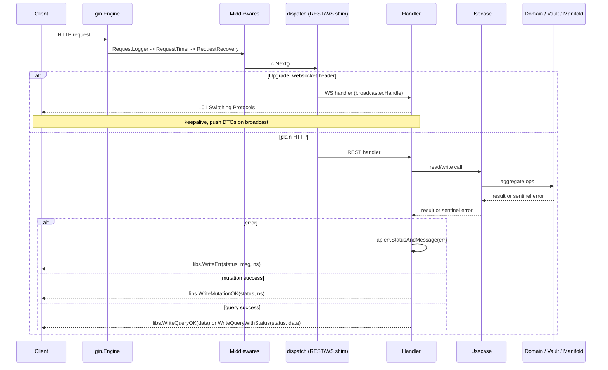
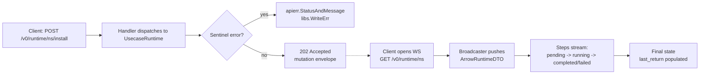

# Quiver — HTTP API

## Overview

The HTTP API is the external interface to Quiver.core. It is an infrastructure module — it accepts HTTP requests, extracts parameters, calls into the use case layer, and returns responses. It has no knowledge of domain commands, Asynx, or execution internals.

The API is mounted as one or more **versions**. Each version implements a small interface (`Prefix`, `Register`, `WSHandler`) and is plugged into the top-level `api.Container` at startup. v0 is the only version shipping today; future versions will live alongside it under their own prefix without touching the v0 package.

Base path: `/v0`

Related specs: [usecases.md](usecases.md) (the layer this API delegates to), [commands.md](commands.md) (underlying state transitions), [websocket.md](websocket.md) (real-time feed served from the same `/v0` base), [domain.md](domain.md) (aggregate definitions).

---

## 1. Versioning

The current release is **v0**. The `v0` prefix is intentional — it advertises that the surface is unstable and that breaking changes are allowed without bumping a major. Once the API stabilises, a parallel `/v1` package will be added; `/v0` will continue to serve old clients until removed.

`api.Container.New` accepts a variadic list of `api.Version` implementations. Each version owns its routes and its WebSocket handler; the version constructor receives the wired `app.Container` and returns the prefix-scoped REST/WS surface. Adding a new version is a one-line change in the bootstrap and a new sibling package — `v0` is never edited again to add `v1`.

The WebSocket fan-out hub (`api.Hub`) is shared across all versions: each version registers its WS handler with the hub at startup, and the use case layer pushes domain events into the hub which then dispatches to every registered handler. v0 maps domain aggregates to v0 DTOs; v1 will map the same aggregates to v1 DTOs.

---

## 2. Namespace Encoding

Namespaces contain `/` characters that conflict with URL path parsing. To avoid ambiguity, **namespaces are percent-encoded into a single path segment**. The Gin engine is configured with `UseRawPath = true` and `UnescapePathValues = true`, so `%2F` reaches the handler decoded.

| Raw Namespace | Encoded Path Segment |
|---|---|
| `github.com/valve/steamcmd` | `github.com%2Fvalve%2Fsteamcmd` |
| `github.com/valve/steamcmd@v1.0.0` | `github.com%2Fvalve%2Fsteamcmd@v1.0.0` |
| `github.com/char2cs/gaming.quiver/cs2` | `github.com%2Fchar2cs%2Fgaming.quiver%2Fcs2` |

The `{ns}` placeholder in all endpoint definitions below refers to the **encoded** form. A namespace may carry an `@ref` suffix (e.g. `@v1.0.0`, `@main`) — some endpoints require it (`DELETE /arrow/{ns}`), others reject it (`GET /arrow/{ns}/manifest`).

---

## 3. Response Envelope

All JSON responses share a single envelope. The same struct serialises mutation, query, and error responses; only the populated fields differ.

| Field | Type | Mutation | Query | Error |
|---|---|---|---|---|
| `success` | bool | `true` | `true` | `false` |
| `error` | string\|null | omitted | omitted | error message |
| `namespace` | string | resource ns | omitted | resource ns (if known) |
| `data` | any | omitted | result body | omitted |

Examples:

Mutation (write success):

```json
{ "success": true, "namespace": "github.com/valve/steamcmd" }
```

Query (read success):

```json
{ "success": true, "data": [ /* list or object */ ] }
```

Error (any verb):

```json
{ "success": false, "error": "not found", "namespace": "github.com/valve/steamcmd" }
```

Two endpoints break the envelope by design and are noted inline in the catalog:

- `GET /health` returns `{"status":"ok"}` with no envelope.
- `GET /collection/{ns}/manifest` returns the raw cached manifest bytes with `Content-Type: application/json`.

---

## 4. Error Format

The HTTP layer maps app-layer sentinel errors to status codes via `apierr.StatusAndMessage`. The use case layer returns wrapped sentinels (`errors.Is`-friendly); the API layer translates them.

| Sentinel | HTTP Status | `error` field |
|---|---|---|
| `ErrNotFound` | 404 | `"not found"` |
| `ErrAlreadyExists` | 409 | `"already exists"` |
| `ErrStateViolation` | 422 | `"state violation"` |
| `ErrMethodNotFound` | 404 | `"method not found"` |
| `ErrFetchFailed` | 502 | `"fetch failed"` |
| `ErrInvalidNamespace` | 400 | `"invalid namespace"` |
| `ErrDependentsExist` | 422 | `"other arrows depend on this arrow"` |
| `ErrPlatformNotSupported` | 422 | `"no target for the current platform"` |
| `ErrMissingVariable` | 422 | `"required variable not provided"` |
| `ErrInvalidManifest` | 422 | `"invalid manifest"` |
| `deptree.ErrCyclicDependency` | 409 | `"cyclic dependency"` |
| anything else | 500 | `"internal error"` |

Validation endpoints (`POST /arrow/{ns}/manifest/validate`, `POST /collection/{ns}/manifest/validate`) are special: when the manifest is structurally parseable but fails rule validation, the response is **422** with the **query envelope** (`success: false`, `data: ValidationResult`) — not the error envelope. Callers read `data.errors[]` for the field-level rule failures.

The `apierr` package additionally exposes constructors for the full 4xx/5xx range (`apierr.NotFound`, `apierr.Conflict`, etc.) used by handlers that want to throw a specific code without going through the sentinel-mapper.

---

## 5. Middleware

`api.Container` installs three middlewares on the root engine, applied in order to every request:

| Middleware | Purpose |
|---|---|
| `RequestLogger` | Wraps the handler chain, logs method/path/status/latency/client IP at info (2xx/3xx), warn (4xx), or error (5xx). Emits structured slog records with `type=http_request`. |
| `RequestTimer` | Stashes `time.Now()` in the gin context under `request_start_time` for downstream consumers (currently informational). |
| `RequestRecovery` | Catches panics, logs them with `type=panic_recovery`, and aborts with 500. |

A shared `middleware.Upgrader` (gorilla/websocket) is exposed for WS handlers; in v0 it accepts all origins (no auth).

WebSocket routing piggybacks on REST endpoints via a `dispatch` shim: REST handlers and WS handlers register on the **same path**, and a wrapper checks the `Upgrade: websocket` header to route the request. This applies to `GET /arrow`, `GET /arrow/{ns}`, `GET /collection`, `GET /collection/{ns}`, `GET /runtime`, and `GET /runtime/{ns}` — see the catalog below for which methods support WS upgrade.

---

## 6. Endpoint Catalog

The v0 surface mounts four resources under `/v0`: **arrow**, **collection**, **runtime**, and **health**. Lifecycle method invocation lives under `/runtime`, **not** under `/arrow/{ns}/{method}` — that path no longer exists.

### 6.1 Arrow

The Arrow resource manages catalog entries: registration, manifest updates, manifest seeding, and validation. Lifecycle methods (`install`, `execute`, `stop`, `uninstall`, custom methods) belong to the Runtime resource (§6.3).

| Method | Path | Summary | Async? |
|---|---|---|---|
| POST | `/arrow/{ns}` | Register an arrow from an existing manifest in the registry | Sync |
| PATCH | `/arrow/{ns}` | Pull the latest manifest from the registry and update | Sync |
| DELETE | `/arrow/{ns}` | Deregister a versioned arrow | Sync |
| GET | `/arrow` | List registered arrows (or upgrade to WS for live updates) | Sync |
| GET | `/arrow/{ns}` | Get full detail for a single arrow (or upgrade to WS) | Sync |
| GET | `/arrow/{ns}/manifest` | Get the resolved raw manifest definition | Sync |
| POST | `/arrow/{ns}/manifest` | Seed a raw YAML manifest into the registry and register the arrow | Sync |
| POST | `/arrow/{ns}/manifest/validate` | Validate a raw YAML manifest without writing it | Sync |

#### POST /arrow/{ns} — Register

Registers the arrow identified by `{ns}` against an existing manifest in the Quiver registry. No request body. Returns **201 Created** with the mutation envelope on success. Errors: 400 (invalid namespace), 404 (manifest not in registry), 409 (already registered), 500.

#### PATCH /arrow/{ns} — Update

Re-fetches the manifest from the upstream registry and updates the local copy. The request body is an optional JSON `UpdateOptions` object — currently a single boolean field `UpgradeRef` (no JSON tag, so the wire name is `UpgradeRef`). When `true`, the installed `@ref` is upgraded to the latest version matching the recorded constraint; otherwise only the manifest is re-resolved. An empty or missing body uses defaults. Returns **200 OK** with the mutation envelope. Errors: 404 (not found), 422 (running — cannot update), 502 (fetch failed), 500.

#### DELETE /arrow/{ns} — Remove

Deregisters a specific versioned arrow. The namespace **must** include an `@ref` qualifier — bare namespaces are rejected with 400 (`"namespace must be versioned (include @ref) for DELETE"`). The use case layer rejects the call if the runtime is active or if other arrows depend on it. Returns **200 OK** on success. Errors: 400 (missing `@ref`), 404 (not found), 422 (state violation, dependents exist), 500.

#### GET /arrow — List

Returns all registered arrows. Optional query parameter `user_installed=true|false` filters to user-installed (or non-user-installed) entries. Each item carries one row per installed version (`versions[]`) — the same arrow can be registered under multiple `@ref` versions.

If the request carries `Upgrade: websocket`, the connection is upgraded and the client receives Arrow DTO pushes on catalog changes — see [websocket.md](websocket.md). The WS stream's `user_installed` filter defaults to `true` when unspecified (the REST endpoint has no such default).

Response shape (query envelope, `data` is a list):

```json
{
  "success": true,
  "data": [
    {
      "namespace": "github.com/valve/steamcmd",
      "name": "SteamCMD",
      "description": "...",
      "tags": ["utility"],
      "versions": [
        { "ref": "v1.0.0", "state": "ready", "installed_at": "2026-04-11T15:33:00Z", "constraint": "^1.0.0" }
      ]
    }
  ]
}
```

`ref` is the ref the row is filed under and is always set — an arrow manifest declares no version of its own, so the ref is the version. Whether that ref is on disk is `installed_at`'s to say: it is the zero time (`0001-01-01T00:00:00Z`) until a successful `_install` stamps it, and returns to zero after an `_uninstall`. See [manifests/v0/versioning.md](manifests/v0/versioning.md).

#### GET /arrow/{ns} — Detail

Returns full detail for a single arrow including current state, the active run (if any), and the most recent completed return. Supports WS upgrade — same dispatch as `GET /arrow`.

The DTO (`ArrowDetailDTO`) carries: `namespace`, `name`, `description`, `license`, `state`, `tags`, `installed_at` (omitted while the arrow is not on disk), `installed_constraint`, `user_installed`, `active_run` (nullable), `last_return` (nullable). `active_run` and `last_return` each contain a method name, variables map, and step list. `last_return` additionally carries an `outcome` (`success` | `failure` | `cancelled`); `active_run` carries a `pid` for service-style executions.

Errors: 404 (not found), 500.

#### GET /arrow/{ns}/manifest — Get Resolved Manifest

Returns the resolved manifest (post-fetch, post-parse) for the arrow at `{ns}`. The namespace **must not** include an `@ref` — adding one returns 400 `"invalid namespace"`. The DTO (`ArrowManifestDTO`) carries the namespace, name, description, version, tags, the variable list, the per-OS targets map, and the full domain `Arrow` aggregate under `manifest`. Errors: 400 (`@ref` set), 404 (not in registry), 502 (fetch failed), 500.

#### POST /arrow/{ns}/manifest — Seed

Accepts a raw YAML manifest in the request body, stores it in the registry, and registers the arrow in one step. Used to publish a new arrow from a local manifest file. `Content-Type: application/x-yaml` is expected but not enforced — the body is read raw via `io.ReadAll`. Returns **201 Created** with the mutation envelope. Errors: 400 (failed to read body), 422 (invalid manifest), 500.

#### POST /arrow/{ns}/manifest/validate — Validate

Parses and rule-validates a raw YAML manifest **without writing** to the registry. The body is the raw manifest (YAML or whatever the manifold parser accepts). Returns the query envelope (`success: true`/`false` matching `data.valid`) with a `ValidationResult`:

- `valid` (bool) — whether the manifest passed
- `errors[]` — field-level rule violations (`field`, `rule`, `message`); omitted when valid
- `supported_platforms[]` / `unsupported_platforms[]` — OS strings derived from the manifest's targets

Status code: **200 OK** if `valid`, **422 Unprocessable Entity** if not. The 422 response is unusual — it carries the **query envelope**, not the error envelope, because the validation result is itself useful payload.

### 6.2 Collection

The Collection resource (formerly named "Quiver" in earlier specs — renamed in PR #168) manages remote arrow catalogs that users can follow. Following a collection caches all of its arrows locally and arranges them under that collection's umbrella. Internally the route group is registered under a package aliased as `quivers`, but the URL prefix and the public spec name are both `collection`.

| Method | Path | Summary | Async? |
|---|---|---|---|
| POST | `/collection/{ns}/follow` | Follow a collection and cache its arrows | Sync |
| DELETE | `/collection/{ns}/follow` | Unfollow a collection | Sync |
| GET | `/collection` | List collections (or upgrade to WS) | Sync |
| GET | `/collection/{ns}` | Get a collection's full detail (or upgrade to WS) | Sync |
| GET | `/collection/{ns}/manifest` | Get the raw cached collection manifest | Sync |
| POST | `/collection/{ns}/manifest` | Seed a raw collection manifest into the registry | Sync |
| POST | `/collection/{ns}/manifest/validate` | Validate a raw collection manifest | Sync |

#### POST /collection/{ns}/follow — Follow

Follows the collection identified by `{ns}`. The use case layer fetches the collection manifest, then iterates its arrow list — local arrows are seeded into the registry, remote arrows are resolved against their upstream. Per-arrow failures are recorded in the collection's `failed_arrows` list (visible in the detail response) but do not abort the follow operation. `Content-Type` is unused — no request body. Returns **201 Created**. Errors: 404 (collection manifest not found), 409 (already followed), 500.

#### DELETE /collection/{ns}/follow — Unfollow

Stops following the collection. The cached arrows remain in the registry; only the follow relationship is removed. Returns **200 OK**. Errors: 404 (not followed), 500.

#### GET /collection — List

Returns the merged list of followed collections plus cached-but-unfollowed collections. Query parameter `followed=true|false` filters the result: `true` returns followed only; `false` returns unfollowed cached only; omitted returns both. Each item carries `namespace`, `name`, `description`, `tags`, `arrow_count`, and a `followed` boolean. Supports WS upgrade.

#### GET /collection/{ns} — Detail

Returns full detail for one collection. The DTO (`CollectionDetailDTO`) includes: `namespace`, `name`, `description`, `url`, `maintainers[]`, `tags[]`, `media` (icon/banner URLs), `arrows[]` (each with its `namespace`, `resolved` flag, and on resolved entries, `name`/`description`), and `followed`. Arrows that failed to resolve during the last follow attempt have `resolved: false` and no further metadata beyond their namespace. Neither the collection nor an entry carries a `version` — the ref is the `@ref` on the `namespace` beside it. Supports WS upgrade. Errors: 404 (not found), 500.

#### GET /collection/{ns}/manifest — Get Manifest (raw)

Returns the cached collection manifest as raw bytes with `Content-Type: application/json`. **This endpoint bypasses the standard envelope** — the response body is the manifest itself. Errors: 404, 500 (these still use the error envelope).

#### POST /collection/{ns}/manifest — Seed

Accepts a raw collection manifest body (YAML or `COLLECTION.md`) and stores it in the vault for the given namespace. Returns **201 Created**. Errors: 400 (failed to read body), 422 (invalid manifest), 500.

#### POST /collection/{ns}/manifest/validate — Validate

Validates a raw collection manifest. Same response convention as the arrow manifest validator: query envelope, **200 OK** when valid, **422** when invalid. The `ValidationResult` shape matches arrow validation but `supported_platforms`/`unsupported_platforms` are empty (collections have no OS targeting).

### 6.3 Runtime

The Runtime resource invokes lifecycle methods on installed arrows and streams execution progress over WebSocket. There is exactly one REST endpoint plus two WS endpoints; lifecycle methods are **always asynchronous** at the HTTP layer.

| Method | Path | Summary | Async? |
|---|---|---|---|
| POST | `/runtime/{ns}/{method}` | Trigger a lifecycle method on an arrow | Async (202) |
| GET | `/runtime` | WebSocket — runtime events for all arrows | n/a |
| GET | `/runtime/{ns}` | WebSocket — runtime events for one arrow | n/a |

#### POST /runtime/{ns}/{method} — Execute

Triggers a lifecycle method. The optional JSON body is `{"variables": {"KEY": "value", ...}}` — if no body or invalid JSON, variables default to empty. The handler dispatches to the use case layer based on the method name:

| `{method}` | Use case call |
|---|---|
| `install` | `Install(ns, vars)` — full dependency-resolved install |
| `uninstall` | `Uninstall(ns, vars)` — reverse-deps check + cascade cleanup |
| `execute` | `Execute(ns, MethodExecute, vars)` — run the manifest's `_execute` |
| `stop` | `Stop(ns)` — stop a running execution; ignores body variables |
| `update` / `_update` | `Execute(ns, MethodUpdate, vars)` — run the manifest's `_update`, with dep-sync handling when state is `outdated` |
| anything else | `Execute(ns, method, vars)` — custom user-defined method |

Returns **202 Accepted** with the mutation envelope as soon as the use case layer accepts the command. Progress is streamed exclusively via the `/runtime` WS endpoints — no polling endpoint exists. Errors: 404 (arrow not found, method not found), 422 (state violation, missing required variable, no platform target, dependents block uninstall), 409 (already running, cyclic dependency), 502 (fetch failed during install), 500.

#### GET /runtime, GET /runtime/{ns} — WebSocket subscriptions

Pure WebSocket endpoints — `dispatch` is not used because there is no REST equivalent. The handler upgrades unconditionally and pushes `ArrowRuntimeDTO` for matching events. The namespace path acts as a **glob filter** — `*` and `?` patterns are honoured by the broadcaster's filter system (see `internal/api/ws/filter.go`). The DTO carries `namespace`, `state`, `active_run`, and `last_return`. See [websocket.md](websocket.md) for connection semantics, ping/pong, and DTO field details.

### 6.4 Health

A single liveness probe with no envelope. Used by container orchestrators and the Quiver electron client to verify the daemon is running.

| Method | Path | Response |
|---|---|---|
| GET | `/health` | **200 OK** with `{"status":"ok"}` (no envelope) |

### 6.5 System

The `system` endpoint folder exists in the codebase under `internal/api/v0/endpoints/system/` but its routes file is empty (`package system` only) and `routes.go` in the v0 router does not register it. **No system endpoints are exposed today.** The folder is reserved for a future addition.

---

## 7. Async vs Sync Summary

| Endpoint | Behavior | Success Status |
|---|---|---|
| `POST /v0/arrow/{ns}` | Sync | 201 |
| `PATCH /v0/arrow/{ns}` | Sync | 200 |
| `DELETE /v0/arrow/{ns}` | Sync | 200 |
| `GET /v0/arrow` | Sync (or WS) | 200 |
| `GET /v0/arrow/{ns}` | Sync (or WS) | 200 |
| `GET /v0/arrow/{ns}/manifest` | Sync | 200 |
| `POST /v0/arrow/{ns}/manifest` | Sync | 201 |
| `POST /v0/arrow/{ns}/manifest/validate` | Sync | 200 (valid) / 422 (invalid) |
| `POST /v0/collection/{ns}/follow` | Sync | 201 |
| `DELETE /v0/collection/{ns}/follow` | Sync | 200 |
| `GET /v0/collection` | Sync (or WS) | 200 |
| `GET /v0/collection/{ns}` | Sync (or WS) | 200 |
| `GET /v0/collection/{ns}/manifest` | Sync (raw bytes) | 200 |
| `POST /v0/collection/{ns}/manifest` | Sync | 201 |
| `POST /v0/collection/{ns}/manifest/validate` | Sync | 200 / 422 |
| `POST /v0/runtime/{ns}/{method}` | **Async** | **202** |
| `GET /v0/runtime` | WS only | 101 (Switching Protocols) |
| `GET /v0/runtime/{ns}` | WS only | 101 |
| `GET /v0/health` | Sync | 200 |

Async endpoints return immediately after the use case layer accepts the command. The client observes execution progress by connecting to the WebSocket feed at `/v0/runtime` or `/v0/runtime/{ns}` ([websocket.md](websocket.md)).

---

## 8. Request Lifecycle



For async lifecycle methods, the response is decoupled from the actual execution:



The 202 only signals that the use case layer accepted the command (e.g. state machine allowed the transition); the actual install/execute/stop work runs in the runtime engine and is observable only via the WS channel.

---

## 9. Cross-References

- [websocket.md](websocket.md) — full WebSocket protocol, DTO shapes, filter semantics, ping/pong cadence.
- [usecases.md](usecases.md) — the business-logic layer this API delegates to; canonical contract for what each handler does.
- [commands.md](commands.md) — the underlying state-machine commands that lifecycle methods translate into.
- [domain.md](domain.md) — Arrow, Collection, ArrowRuntime aggregates and their fields.
- [manifests/v0/arrow.md](manifests/v0/arrow.md) — manifest YAML schema accepted by the seed/validate endpoints.
- [vault.md](vault.md) — where seeded manifests and cached collections live on disk.
