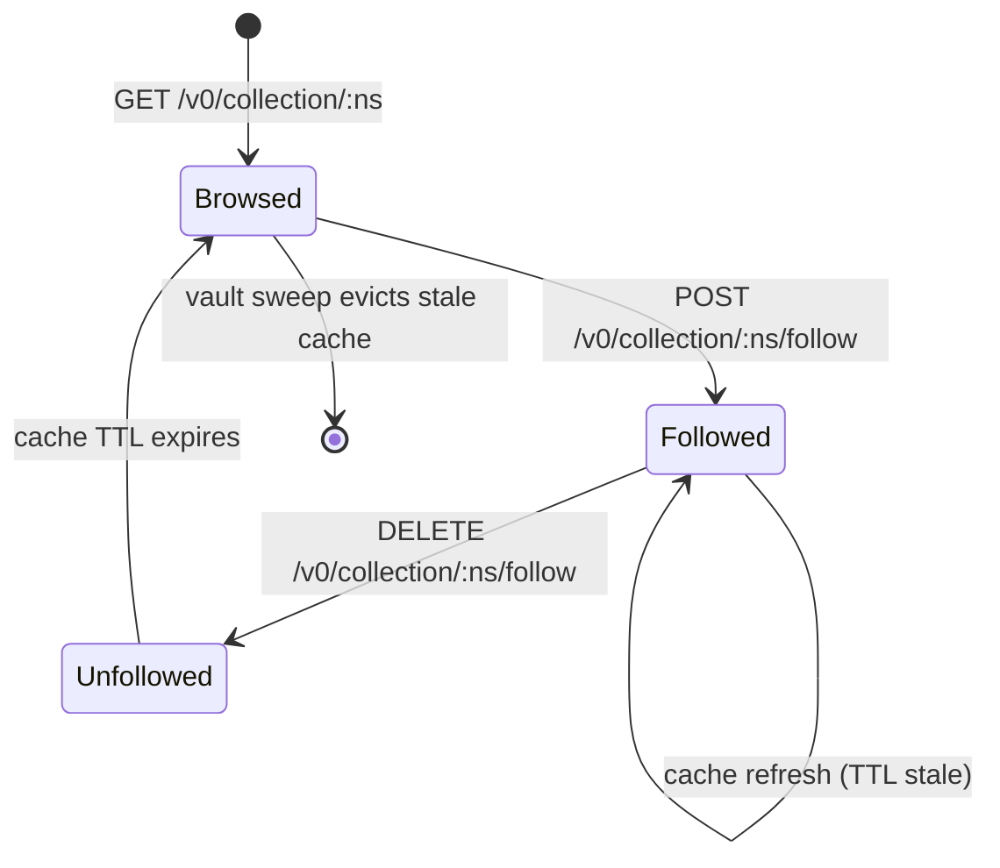
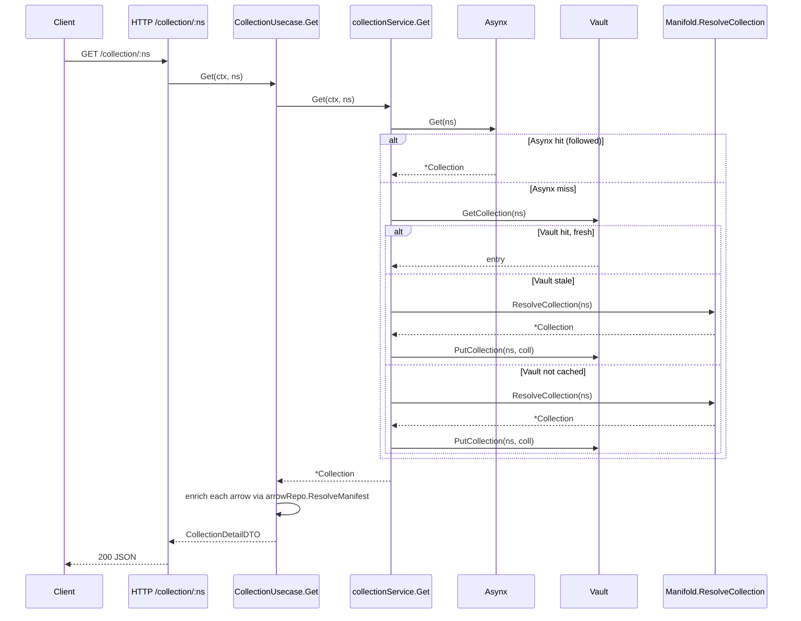
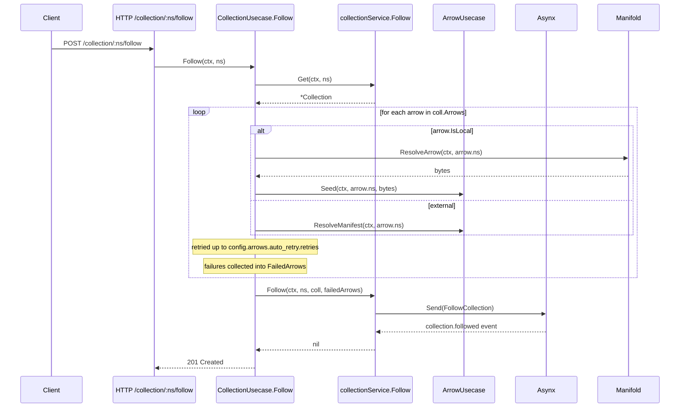

# Collection Manifest v0

## Overview

A **Collection** is a curated set of arrow references — the discovery and authorship primitive of Quiver. Think of it as a personal bookmark list or playlist of arrows: a namespace-addressed document that names the arrows a user wants to surface, group, or share. A Collection is **not** an execution unit — it does not install, run, or compose arrows; it merely points to them.

This spec describes the on-disk manifest format, the schema validation rules, the lifecycle a Collection follows in the engine and app layers, and the HTTP surface exposed under `/v0/collection`.

A Collection has no version of its own — neither the list nor its entries declare one. Every ref in play belongs to a namespace: the Collection's, or a member's. See [§3.1](#31-metadata-fields) and [§8](#8-versioning).

Cross-references: [arrow.md](arrow.md) · [manifold.md](../../manifold.md) · [vault.md](../../vault.md) · [domain.md](../../domain.md) · [http-api.md](../../http-api.md) · [usecases.md](../../usecases.md)

---

## 1. File forms

A Collection manifest can live as either of two file forms inside the source repository. Both carry identical YAML payloads.

| Form | Filename | Notes |
|------|----------|-------|
| Plain YAML | `collection.yaml` | Top-level YAML document. |
| Markdown wrapper | `COLLECTION.md` | Human-readable markdown that **must** contain a single ` ```collection ` fenced code block whose body is the YAML payload. The first such block wins; later blocks are ignored. |

The resolver tries `COLLECTION.md` first, then `collection.yaml` (`internal/engine/manifold/resolver/resolver.go` — `ResolveCollection`). If the source is `COLLECTION.md`, the translator extracts the fenced block via `extractCollectionCodeblock` and feeds the inner YAML to the same parser used for `collection.yaml`.

The fence header must be exactly `` ```collection `` on its own line. ` ```yaml `, ` ```arrow `, or any other fence is ignored, mirroring the arrow-side `` ```arrow `` convention.

---

## 2. Schema declaration

Every Collection manifest declares its schema as the first key:

```yaml
schema: "collection@v0"
```

The translator parses the `schema:` field as `<schema-type>@<version>`, requires `schema-type == "collection"`, and dispatches to the matching version module. Only `v0` is registered today (`internal/engine/manifold/translator/collection/v0/`).

The JSON schema (`v0/schema.json`) enforces the pattern `^collection@`. Unknown schema versions return `unsupported quiver version: <version>` from the registry.

---

## 3. Manifest structure

A complete v0 manifest has two top-level sections: `metadata` (required) and `arrows` (optional in schema, required by ruleset for valid collections).

```yaml
schema: "collection@v0"

metadata:
  name: "Gaming Collection"
  description: "Game servers and utilities curated by char2cs"
  url: "https://gaming.example.com"
  maintainers:
    - "char2cs"
  tags:
    - "gaming"
    - "servers"
  media:
    icon: "https://example.com/icon.png"
    banner: "https://example.com/banner.png"

arrows:
  - path: servers/cs2                       # local arrow, lives in this repo
  - path: tools/minecraft                   # local arrow
  - namespace: github.com/valve/steamcmd    # external arrow, full namespace
  - github.com/valve/steamcmd               # string shorthand, external
```

### 3.1 Metadata fields

| Field | Required | Description |
|-------|----------|-------------|
| `name` | yes | Human-readable display name. |
| `description` | yes | One-line summary shown in lists and detail views. |
| `url` | no | Project homepage. |
| `maintainers` | no | List of maintainer handles or names. |
| `tags` | no | Free-form tags used for browsing and filtering. |
| `media.icon` | no | URL to a square icon image. |
| `media.banner` | no | URL to a wide banner image. |

The JSON schema marks `name` and `description` as `required` and rejects unknown keys at metadata level (`additionalProperties: false`). The Ruleset re-checks that `name` and `description` are non-empty after translation.

**There is no `version:` field.** A Collection is a curated list of arrows, and each member carries its own `namespace@ref` (§3.2). A version on the list itself names no artifact: nothing is fetched at it, nothing resolves against it, and it is the only string in the manifest that no other fact can contradict — so it could say anything and stay true of nothing. Which revision of the list a client is reading is the Collection's own `@ref` (§8), which reaches every response through `namespace`.

A `version:` key under `metadata:` is tolerated and ignored. The schema still lists the property — metadata sets `additionalProperties: false`, so dropping it would turn the key into a hard validation error — but no Go type models it, so the authored value has nowhere to land and is discarded during translation. Old manifests keep validating unchanged; they simply no longer influence anything. Write nothing there.

### 3.2 Arrow entries

The `arrows` array enumerates the arrows the Collection points to. Each entry takes one of three forms — they are all mutually exclusive on a per-entry basis.

| Form | Example | Resulting namespace |
|------|---------|---------------------|
| Local (object, `path` only) | `path: servers/cs2` | `<bare collection ns>/cs2` |
| External (object, `namespace` only) | `namespace: github.com/valve/steamcmd` | `github.com/valve/steamcmd` |
| External (string shorthand) | `github.com/valve/steamcmd` | `github.com/valve/steamcmd` |

The custom `UnmarshalYAML` on `arrowEntryV0` (`v0/types.go`) handles both scalar (string) and mapping (object) nodes. A scalar node is treated as the `Namespace` field; a mapping node decodes `path` and `namespace` directly.

#### Local namespace derivation

For local entries (`path` set, `namespace` empty), the manifold computes the resolved namespace by appending the **last segment** of the `path` to the **bare namespace** of the Collection itself:

```
collection ns: github.com/char2cs/gaming.collection@v1.0.0
entry:        path: servers/cs2

bare ns:      github.com/char2cs/gaming.collection
last segment: cs2

resolved:     github.com/char2cs/gaming.collection/cs2
```

Intermediate path segments (`servers/`) are discarded for namespace purposes — they represent the on-disk location inside the source repo, not the addressable identity. Local arrows have `IsLocal: true` set on the resolved `CollectionArrow`.

If the path produces an empty trailing segment (e.g. `path: ""` or `path: "/"`), the manifold returns `manifold: arrow path %q produces an empty namespace segment`.

#### External entries

External entries (`namespace` set, `path` empty) are passed through verbatim. The namespace must already be a fully qualified value (`domain/user/repo` or `domain/user/repo/auid`); short names like `cs2` are not promoted. Resolved entries have `IsLocal: false`.

No `description` or other arrow fields appear on an entry — that information is read from the arrow itself at resolution time.

#### Member refs

An entry's namespace string already supports the `@ref` suffix, so an external member behaves exactly like any other namespace: pinned when it carries a ref, and resolved through the refless chain when it does not (see [versioning.md §6](./versioning.md#6-refless-resolution)).

Local entries are different. A local member's namespace is derived from the Collection's **bare** namespace, so the ref is dropped during derivation — and the derived value (`github.com/char2cs/gaming.collection/cs2`) names a file inside a repository, not a repository with tags or releases of its own. There is nothing for the refless chain to resolve against.

A local member must therefore carry an explicit ref, and the only ref that is true of it is the Collection's own — the file was read at that ref (§8). A local entry that cannot be given one is rejected at collection-parse time rather than silently resolving to a default branch.

---

## 4. Validation rules

Validation runs in two phases inside `manifold.ParseCollection` after YAML translation:

### 4.1 Pre-derivation: `ValidateCollectionEntries`

Defined in `internal/engine/manifold/ruleset/collection/arrow_entry.go`. Runs against the raw `[]CollectionArrowEntry` before namespace derivation.

| Rule | Field | Message |
|------|-------|---------|
| `exclusive_fields` | `arrows[i]` | `arrow entry must have either path or namespace, not both` |
| `required_field` | `arrows[i]` | `arrow entry must have either path or namespace` |

Errors collect into a single `RuleErrors` slice rather than failing on the first violation.

### 4.2 Post-derivation: `ValidateCollection`

Runs against the assembled `*domain.Collection` (`internal/engine/manifold/ruleset/ruleset.go`).

| Rule | Field | Message |
|------|-------|---------|
| `required` (name) | `name` | `name is required` |
| `required` (description) | `description` | `description is required` |
| `required` (arrows) | `arrows` | `arrows list must not be empty` |
| `duplicate_namespace` | `arrows` | `duplicate arrow namespace %q` (one per duplicate seen) |

Duplicate detection (`duplicate_namespaces.go`) compares **resolved** namespaces — local and external arrows are normalised to their final namespace before comparison, so `path: tools/x` and `namespace: github.com/.../tools/x` would clash if the bare collection namespace produced the same suffix.

The JSON schema layer (`v0/schema.json`) provides a structural pre-check before either ruleset phase runs: it enforces the metadata key set, that each arrow entry is either a string or an object with at most `path` / `namespace`, and that `additionalProperties: false` holds at the document, metadata, and entry levels.

---

## 5. Domain model

`internal/domain/collection.go` defines the in-memory shape.

| Type | Purpose |
|------|---------|
| `Collection` | Aggregate combining manifest data, follow state, and resolution failures. Persisted by Asynx (followed) and Vault (cached). |
| `CollectionMeta` | Manifest metadata block (name, description, url, maintainers, tags, media). |
| `CollectionMedia` | Icon + banner URL pair. |
| `CollectionArrowEntry` | Raw translator output; exactly one of `Path` / `Namespace` set. |
| `CollectionArrow` | Resolved arrow reference. Holds the final `Namespace` and an `IsLocal` flag. |

`Collection.Arrows` is the resolved list (after derivation); the raw `CollectionArrowEntry` values live transiently inside `translator.CollectionModule.Entries` between translation and rule application and are not stored.

Collection identity is `Namespace` (e.g. `github.com/char2cs/gaming.collection@v1.0.0`). Like arrows, the `@ref` segment pins a specific git ref; collections without a ref resolve at the repository default branch.

---

## 6. Lifecycle

A Collection moves through three states from a user's standpoint.



- **Browsed** — the Collection has been resolved (and possibly cached) but the user has not opted in. It exists in the vault under `namespaces/<ns>/collection.json` if it was cached, or only in transient memory if it has never been fetched.
- **Followed** — the user has explicitly subscribed via `POST /collection/:ns/follow`. The Collection lives in the Asynx event store as a `collection.followed` aggregate; the projection writes a row to the SQLite `collections` table for fast list reads.
- **Unfollowed** — `DELETE /collection/:ns/follow` calls `Asynx.Forget`, which fires `OnForget` and prunes the projection row. As a side effect the repository also calls `vault.DeleteCollection` to remove the cached envelope; if that fails it logs a warning but does not block the unfollow.

Cache freshness for both Browsed and Followed states is governed by Vault's TTL sweep (`vault.sweep_interval`, default 5 min, ttl default 24 h). A stale `collection.json` triggers a re-resolve through Manifold on the next `Get`.

### 6.1 Get flow



If the manifold call fails for a stale entry, the repository returns the existing stale aggregate rather than erroring — best-effort serving keeps the UI populated when the network is unavailable.

### 6.2 Follow flow



Caching every referenced arrow is part of Follow rather than Get so the user has a working local copy of every arrow the moment they subscribe. Auto-retry behaviour is driven by `config.arrows.auto_retry` (`enabled` + `retries`); a count of `0` retries means a single attempt with no fallback.

Already-followed namespaces return `apperrors.ErrAlreadyExists` (mapped to HTTP 409) — `FollowCollection.Validate` rejects re-application of the command at the asynx layer.

### 6.3 FailedArrows

When a referenced arrow fails to resolve during Follow, its namespace is appended to `coll.FailedArrows` instead of failing the whole Follow. The Follow command persists the aggregate with this list intact; subsequent `GET` enrichment uses the list to skip per-arrow `ResolveManifest` calls and emit `Resolved: false` entries with no name or description fields populated.

This keeps a Collection partially usable: the user sees every reference — namespace and ref included, since those come from the manifest and not from the failed lookup — with a flag distinguishing the ones that resolved cleanly from the ones that didn't. There is no automatic retry of failed arrows post-Follow; recovery happens on the next Follow re-issue or out-of-band arrow seed.

---

## 7. Vault storage

The vault has two namespace-scoped roots; the Collection envelope lives under the per-namespace tree, not the flat manifest cache used by arrows. Disk layout (`internal/engine/vault/`):

```
~/.quiver/
  namespaces/
    github.com/
      char2cs/
        gaming.collection@v1.0.0/        ← directory uses the full collection namespace, ref included
          collection.json                ← Collection envelope (this spec)
        gaming.collection/               ← bare-namespace tree holds derived local arrow workdirs
          cs2/                           ← workdir for github.com/char2cs/gaming.collection/cs2
          minecraft/                     ← workdir for github.com/char2cs/gaming.collection/minecraft
```

The collection envelope and its derived local-arrow workdirs are siblings under different namespace directories: the envelope tree key is the full namespace (with `@ref`), while local arrow namespaces are derived from the **bare** namespace (`BareNamespace()` strips the ref) and live at separate paths. Each local arrow has its own vault entry — flat manifest cache file in `~/.quiver/vault/` plus a workdir under `~/.quiver/namespaces/`.

`collection.json` payload (`internal/engine/vault/manifest.go` — `quiverOnDisk`):

```json
{
  "collection": {
    "Namespace": "github.com/char2cs/gaming.collection@v1.0.0",
    "FollowedAt": "...",
    "FailedArrows": ["..."],
    "Meta": { "Name": "...", ... },
    "Arrows": [{"Namespace": "...", "IsLocal": true}, ...]
  },
  "cached_at": "2026-05-09T18:32:00Z"
}
```

The vault stores the **resolved** aggregate, not the raw YAML — derivation has already happened by the time `PutCollection` is called. This is in contrast to arrows, where the vault holds raw `arrow.yaml` / `ARROW.md` bytes verbatim; collections write a single JSON envelope keyed by `cached_at`.

| Method | Role |
|--------|------|
| `Vault.PutCollection(ctx, ns, coll)` | Writes `collection.json` atomically. Returns the resolved on-disk path. |
| `Vault.GetCollection(ctx, ns)` | Returns `(*CollectionVaultEntry, path, err)`. Returns `ErrStale` together with the entry when TTL expired; returns `ErrNotCached` if the file doesn't exist. |
| `Vault.DeleteCollection(ctx, ns)` | Idempotent removal of `collection.json`. Workdir trees and arrow caches are not touched. |
| `Vault.ListCachedCollections(ctx)` | Walks `namespacesPath` for any directory containing `collection.json` and returns its namespace. Used by `List(followed=false)` to surface cached-but-not-followed collections. |

Sweep behaviour: `sweepQuivers` walks `namespacesPath`, reads only the `cached_at` field of each `collection.json`, and deletes entries older than `ttl`. Arrow workdirs derived under the collection are not affected by collection sweeping — they are independent vault entries with their own TTLs.

---

## 8. Versioning

One dimension identifies a Collection version: the `@ref` on its namespace, e.g. `@v1.0.0`, `@latest`, `@release-jan-2026`. It drives which git ref the resolver fetches, and it is what the aggregate, the vault envelope and every API response are keyed and filed by.

`metadata.version` was a second, authored dimension declared not to have to match the first. That was the whole defect: two strings for one thing, one of them checked against nothing. A repo tagged `release-jan-2026` could declare `version: "2.0.0"` and no code path anywhere could tell which of the two a client should believe, because the manifest version was fetched at the ref that contradicted it. It is gone — see [§3.1](#31-metadata-fields) for the tolerate-and-ignore rule that keeps existing manifests parsing.

Pinning works the same way it does for arrows: a Collection followed at `github.com/char2cs/gaming@v1.0.0` and one followed at `github.com/char2cs/gaming@v2.0.0` are distinct aggregates with separate vault and asynx entries.

Local arrows derived from a Collection inherit the Collection's **bare** namespace as their prefix (`BareNamespace()` strips the `@ref` during derivation). They have no release stream of their own; they live inside the Collection's repo and are resolved at the Collection's ref, which is the ref they must be given back before they can be installed — an arrow manifest declares no version of its own (see [versioning.md §7](./versioning.md#7-the-ref-is-the-version)).

---

## 9. HTTP API

Endpoints are mounted by `internal/api/v0/endpoints/collections/routes.go` under the v0 group.

| Method | Path | Description |
|--------|------|-------------|
| `GET`    | `/v0/collection` | List collections. Filter: `?followed=true` / `?followed=false` / unset for both. |
| `GET`    | `/v0/collection/:ns` | Detail view of a collection (browsed, cached, or followed). |
| `POST`   | `/v0/collection/:ns/follow` | Follow a collection — resolves manifest, caches every arrow, persists the aggregate. |
| `DELETE` | `/v0/collection/:ns/follow` | Unfollow — forgets the asynx aggregate and removes the vault envelope. |
| `GET`    | `/v0/collection/:ns/manifest` | Returns a JSON projection of the resolved manifest (namespace + meta + arrow namespaces). |
| `POST`   | `/v0/collection/:ns/manifest` | Seed a raw manifest (`COLLECTION.md` or `collection.yaml` body) into the vault without following. |
| `POST`   | `/v0/collection/:ns/manifest/validate` | Parse and validate a raw manifest body, returning structured errors and validity flag. |

`GET /v0/collection` and `GET /v0/collection/:ns` also accept a WebSocket upgrade — the `dispatch` helper routes upgraded connections to the WebSocket handler injected at construction (`quiverWS`).

### 9.1 List filter semantics

| Query | Behaviour |
|-------|-----------|
| (omitted) | Returns all known collections — followed first, then cached-but-not-followed via `vault.ListCachedCollections`. |
| `?followed=true` | Followed only (asynx projection only). |
| `?followed=false` | Cached but not followed — diff between `ListCachedCollections` and the followed set. |

### 9.2 DTO shapes

JSON wire format (`internal/api/v0/dto/collection_*.go`):

```yaml
# CollectionListItemDTO
namespace:    string
name:         string
description:  string
tags:         [string]
arrow_count:  int
followed:     bool

# CollectionDetailDTO
namespace:    string
name:         string
description:  string
url:          string   # omitempty
maintainers:  [string]
tags:         [string]
media:        { icon: string, banner: string }   # omitempty fields
arrows:       [CollectionArrowDTO]
followed:     bool

# CollectionArrowDTO
namespace:    string
resolved:     bool
name:         string   # omitempty
description:  string   # omitempty
```

Neither shape carries a `version`. The Collection's own ref is the `@ref` on its `namespace`; a member's ref is the `@ref` on the member's `namespace`. A scalar restating either would be a copy of the field beside it, and on a member it would be worse than redundant: it was populated only on the resolved branch, so two entries pinned at the same ref reported it differently depending on whether an unrelated manifest fetch had succeeded.

`resolved: false` indicates either an arrow that lives in `FailedArrows` (was never resolvable at follow time) or an arrow whose post-Follow `ResolveManifest` returned an error during enrichment. Name and description are populated on a best-effort basis from the underlying arrow's manifest when resolution succeeded; `namespace` comes from the Collection manifest and is present either way.

### 9.3 Validation response

`POST /:ns/manifest/validate` returns HTTP 200 (valid) or HTTP 422 (invalid) with a body containing:

```yaml
valid:  bool
errors: [{ field: string, rule: string, message: string }]
supported_platforms:   [string]    # always [] for collection validation
unsupported_platforms: [string]    # always [] for collection validation
```

The platform fields exist for symmetry with the arrow validation result; collections do not have platform targets and these arrays are always empty.

The validator parses the manifest using a synthetic namespace (`validation.dummy/collection`) so that local-arrow derivation can run end-to-end and surface schema, ruleset, and entry errors uniformly.

---

## 10. Repository layer (`internal/app/repositories/collection/`)

The collection repository spans Asynx (followed state) and Vault (cache).

| Method | Source of truth | Notes |
|--------|-----------------|-------|
| `Follow(ctx, ns, coll, failedArrows)` | Asynx | Sends `FollowCollection` command. Sets `coll.Namespace` and `coll.FailedArrows` before send; `FollowedAt` is set inside the command. Returns `ErrAlreadyExists` on re-follow. |
| `Unfollow(ctx, ns)` | Asynx + Vault | Existence check via `axCollection.Exists`, then `Forget`, then `vault.DeleteCollection` (best effort). Returns `ErrNotFound` if not followed. |
| `Get(ctx, ns)` | Asynx → Vault → Manifold | Three-tier lookup. Stale vault entries trigger a manifold re-resolve, falling back to the stale aggregate on resolve error. |
| `List(ctx)` | Projection store | Reads from the `collections` SQLite table. Returns followed collections only — cached-but-not-followed are surfaced via the usecase using `ListCachedCollections`. |
| `IsFollowed(ctx, ns)` | Asynx | Thin wrapper over `axCollection.Exists`. |
| `OnCollectionFollowed(fn)` / `OnCollectionUnfollowed(fn)` | Asynx | Subscriber registration for downstream listeners. |

The asynx aggregate emits a single event per follow:

```
event:    collection.followed
aggregateID: <namespace string>
payload:  domain.Collection (FollowedAt set, Namespace + FailedArrows from command)
snapshot: yes (ShouldSnapshot returns true)
```

The store projection (`internal/app/repositories/collection/internal/store/store.go`) listens to that event and persists a JSON-encoded `collection_row` keyed by namespace. `OnForget` deletes the same row.

---

## 11. Out of scope (v0)

- Composition / playlist semantics — Collections do not declare an execution order or runtime arguments. Future work may layer a Playlist primitive on top.
- Per-entry overrides — entries cannot pin an arrow ref different from the arrow's own namespace; a Collection cannot say "use steamcmd@v2 instead of @latest".
- Collection-level dependency graphs — Collections do not declare dependencies between their referenced arrows.
- Collection-level events for per-arrow resolution failures — `FailedArrows` is exposed via `Get` but not as a separate event stream.
- Auto-retry backoff — retry uses a fixed count with no jitter; advanced retry policy is a future config addition.
