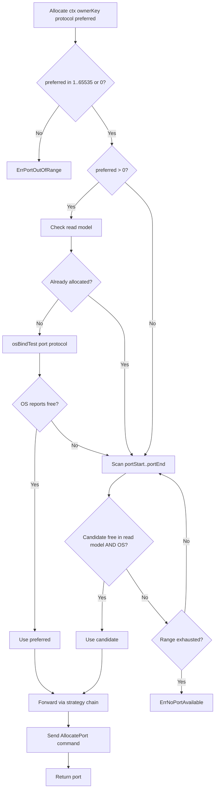
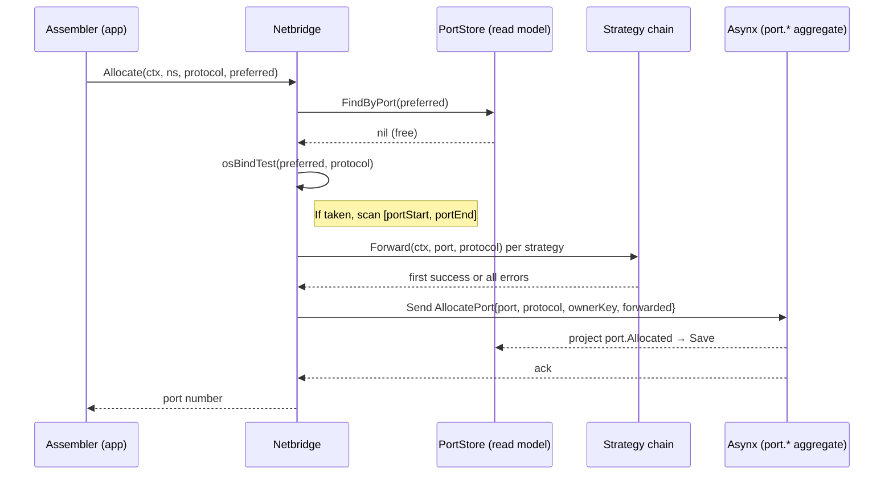
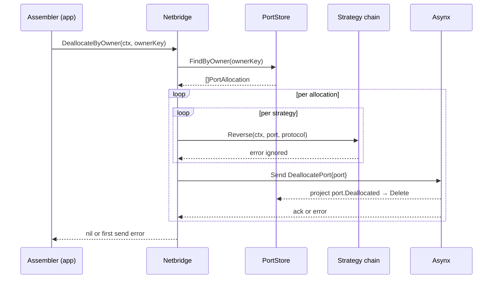
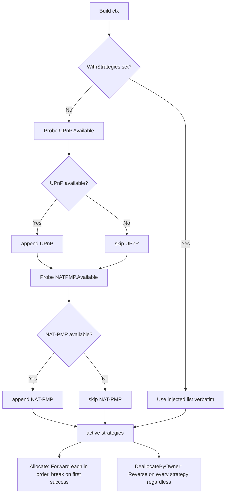

# Quiver — Netbridge

Related specs: [domain.md](domain.md) · [manifests/v0/arrow.md](manifests/v0/arrow.md) · [usecases.md](usecases.md) · [architecture.md](architecture.md)

## 1. Purpose

Netbridge owns dynamic **TCP/UDP port allocation** and best-effort **router port forwarding** for arrows that need to expose network endpoints (game servers, web services, etc.).

When the assembler resolves variables for an execution, it walks the arrow's `netbridge:` block and asks Netbridge for a port per entry. Netbridge picks an available port number, attempts to open it on the local router, persists the allocation, and returns the port number to the caller. The caller binds the port name (e.g., `GAME_PORT`) to that number in the variable map.

Allocations are **ephemeral** and **owner-scoped**. They are released in bulk by an opaque `ownerKey` — the assembler uses the arrow namespace string. Netbridge does not interpret the key.

The package lives at `internal/engine/netbridge`. The container in `internal/engine/container.go` constructs one Netbridge per process, backed by a SQLite event store at `events/netbridge.db`.

---

## 2. Public Interface

A single interface, defined in `netbridge.go`:

| Method | Signature (informal) | Description |
|---|---|---|
| `Allocate` | `(ctx, ownerKey, protocol, preferred) → (port int, err error)` | Find an available port matching the protocol, attempt forwarding (best-effort), persist the allocation, return the port number. |
| `DeallocateByOwner` | `(ctx, ownerKey) → err error` | Release every port allocated under `ownerKey`. Reverse forwarding for each (best-effort), then emit `DeallocatePort` per port. |

`protocol` is `domain/netbridge.Protocol`. `preferred = 0` means "no preference — pick any port from the ephemeral range". `preferred ∈ [1, 65535]` means "use this port if free, otherwise scan the ephemeral range".

There is no per-port deallocation method on the public interface. Deallocation is always grouped by owner.

---

## 3. Domain Models

Netbridge consumes two types from `internal/domain/netbridge`. These are the manifest-level intent — what the arrow author wrote — not the runtime allocation record.

### `Protocol` (`internal/domain/netbridge/protocol.go`)

| Constant | Value | Helpers |
|---|---|---|
| `ProtocolTCP` | `"tcp"` | `IsTCP()`, `IsValid()`, `String()` |
| `ProtocolUDP` | `"udp"` | `IsUDP()`, `IsValid()`, `String()` |
| `ProtocolTCPUDP` | `"tcp/udp"` | `IsTCPUDP()`, `IsValid()`, `String()` |

Any other value is invalid. The TCP/UDP combined value triggers two underlying mappings during forwarding and two binds during availability checks.

### `PortDef` (`internal/domain/netbridge/port_def.go`)

The manifest port intent. One entry per `netbridge:` item in `arrow@v0`.

| Field | Type | Notes |
|---|---|---|
| `Name` | `string` | Variable name exported into the execution environment (e.g., `GAME_PORT`). Required. |
| `Protocol` | `Protocol` | One of the three protocol constants. |
| `Default` | `int` | Preferred port. `0` means no preference. Must fall in `[MinPort, MaxPort]` (= `[1, 65535]`) when non-zero. |
| `Required` | `bool` | If `true` and allocation fails, the assembler aborts the execution. If `false`, the failure is silently skipped. |

`PortDef.Validate()` enforces non-empty name, in-range default, and valid protocol. Duplicate-name detection is enforced one layer up by the manifold ruleset (`internal/engine/manifold/ruleset/arrow/netbridge.go`), not by the engine.

### `PortAllocation` (`internal/engine/netbridge/internal/ports/port_allocation.go`)

The aggregate state — the runtime record of a granted port. Lives in netbridge's internal subpackage so it never leaks across the public interface.

| Field | Type | Notes |
|---|---|---|
| `Port` | `int` | Aggregate ID. The actual port number that was allocated. |
| `Protocol` | `domain/netbridge.Protocol` | Copied from the request. |
| `OwnerKey` | `string` | The opaque grouping key supplied by the caller. |
| `Forwarded` | `bool` | `true` iff at least one strategy successfully opened the port on the router. |

The struct also carries a GORM `primaryKey` tag on `Port` and a `TableName()` method (`port_allocations`) for the SQLite-backed read model.

---

## 4. Builder

Netbridge is constructed via the builder in `builder.go`.

| Method | Required | Default if omitted |
|---|---|---|
| `WithEventStore(asynx/models.Store)` | Yes | Build returns `ErrBuildFailed`. |
| `WithStore(PortStore)` | No | In-memory `PortStore` (`store.NewPortMemory()`). |
| `WithStrategies([]Strategy)` | No | Auto-discovered: UPnP probed first, NAT-PMP probed second; only those whose `Available(ctx)` returned `true` are retained. |
| `WithEphemeralPortRange(start, end)` | No | `config.GetNetbridge().EphemeralPortStart` / `EphemeralPortEnd` (defaults to `49152` / `65535` from embedded `default.yaml`). |

`Build(ctx)` performs:

1. Validates `eventStore` is non-nil → wraps `ErrBuildFailed` if missing.
2. Constructs an Asynx instance for the `ports.PortAllocation` aggregate with sharding `{Shards: 8, QueueDepth: 1000}`.
3. Resolves the read model (injected or in-memory).
4. Resolves the ephemeral port range.
5. Kicks off **strategy discovery** in a background goroutine (or, if `WithStrategies` was set, ships the injected slice through the channel synchronously). The result is delivered through a buffered channel of size 1.
6. Calls the internal `newNetbridge` constructor, which subscribes the projection handler (`projections.HandlePortEvent`) to the `port.*` event family.
7. Returns the wired `Netbridge` implementation.

The strategy channel is **lazily** read on first call to `Allocate` or `DeallocateByOwner` via a `sync.Once`. The probe goroutine is launched at `Build()` time so it can run concurrently with whatever the caller does next; the receive only blocks the first allocation if discovery has not yet completed. Subsequent calls reuse the cached slice.

---

## 5. Allocation Flow

### Port search algorithm (`allocation.go`)



`isPortAvailable` first consults the read model (rejects ports already tracked by Netbridge), then runs `osBindTest`. The OS test calls `net.Listen("tcp", ":port")` for TCP, `net.ListenPacket("udp", ":port")` for UDP, or both for `tcp/udp`. Listeners are closed immediately. A failed bind is treated as "port in use" — *not* an error to propagate. Read-model errors do propagate.

### Forwarding step

After a port is chosen but before persistence:

| Step | Detail |
|---|---|
| 1 | Lazily resolve the strategy slice (first call only). |
| 2 | Iterate strategies in priority order. |
| 3 | First `Forward(ctx, port, protocol)` that returns `nil` sets `forwarded = true` and breaks the loop. |
| 4 | If every strategy errors (or the slice is empty), `forwarded = false`. |
| 5 | Send `AllocatePort{Port, Protocol, OwnerKey, Forwarded}` through Asynx. |

Forwarding failure does **not** fail `Allocate`. The port is still allocated locally. The `Forwarded` flag on the persisted aggregate records whether external reachability was achieved.

### Sequence



---

## 6. Deallocation Flow

`DeallocateByOwner(ctx, ownerKey)`:



Notable details, all confirmed in `netbridge.go`:

- `Reverse` is called on **every** strategy in the chain (no early break, unlike `Forward`). Errors are silently discarded.
- A failed `DeallocatePort` send aborts the loop and returns the error — remaining ports stay allocated and must be retried.
- A read-model error on `FindByOwner` returns immediately; nothing is reversed or sent.
- An unknown `ownerKey` returns `nil` (empty result set; loop never runs).

---

## 7. Strategy Pattern

The strategy interface in `internal/strategies/strategy.go`:

| Method | Purpose |
|---|---|
| `Name() string` | Human label for logs (`"UPnP"`, `"NAT-PMP"`). |
| `Available(ctx) bool` | Probe — used at builder time to filter the chain. |
| `Forward(ctx, port, protocol) error` | Open a router mapping for the port. |
| `Reverse(ctx, port, protocol) error` | Tear down the router mapping. |

Two implementations ship today, both in `internal/strategies/`:

| Strategy | File | Probe condition | Mapping behaviour |
|---|---|---|---|
| UPnP | `upnp.go` | At least one IGD client returned by `internetgateway2.NewWANIPConnection1ClientsCtx`. | `AddPortMapping(remoteHost="", external=internal=port, internalClient=local-IPv4, lease=3600s, description="quiver")`. `tcp/udp` issues two calls. |
| NAT-PMP | `natpmp.go` | Default gateway discovered AND `GetExternalAddress()` succeeds. | `AddPortMapping(proto, port, port, lifetime=3600)`. Reverse uses the same call with `lifetime=0` (NAT-PMP convention). `tcp/udp` issues two calls. |

There is no "manual" strategy. Manual mappings are out of scope — if the user has already opened a port on their router, Netbridge does not detect it and will simply mark `Forwarded=false` if both auto strategies fail. The local allocation still succeeds.

### Selection / fallback



Probing happens **once per process** — kicked off in a goroutine at `Build()` and consumed once on first allocation behind a `sync.Once`. Network topology changes mid-session are not detected; restart the process to re-probe. Adding a new strategy means adding an entry to the `all := []strategies.Strategy{...}` slice in `builder.go`'s `discoverStrategies` and implementing the four interface methods. The public surface is unaffected.

---

## 8. Persistence: Asynx Aggregate + Read Model

Netbridge owns a private Asynx aggregate keyed by port number (`AggregateID = strconv.Itoa(c.Port)`).

### Commands (`internal/commands`)

| Command | Validates against current state | Event emitted | Resulting aggregate |
|---|---|---|---|
| `AllocatePort{Port, Protocol, OwnerKey, Forwarded}` | Fails with `asynxModels.ErrValidation` if `current != nil && current.Port != 0` (port already live). | `port.Allocated` | New `PortAllocation` with the requested fields. |
| `DeallocatePort{Port}` | Fails with `asynxModels.ErrValidation` if `current == nil` (no allocation to remove). | `port.Deallocated` | Zero-value `PortAllocation` (clears state). |

Neither command snapshots (`ShouldSnapshot()` returns `false`).

The duplicate-allocation race is *not* surfaced: `Allocate` checks the read model first via `findAvailablePort`, so the validate-time failure indicates a TOCTOU race that the search would normally avoid.

### Projection (`internal/projections/port_events.go`)

A single handler subscribes to `port.*`:

| Event | Action |
|---|---|
| `port.Allocated` | `readModel.Save(ctx, evt.Aggregate)` |
| `port.Deallocated` | `readModel.Delete(ctx, evt.PreviousAggregate.Port)` |
| anything else | no-op |

Save/Delete errors are silently ignored — the read model is best-effort. The Asynx event log remains the source of truth.

### Read model interface

`store.PortStore` (in `internal/store/store.go`) embeds the generic `adapterstore.Store[ports.PortAllocation, int]` and adds two specialised lookups:

| Method | Returns |
|---|---|
| `Save(ctx, alloc)` | error |
| `Delete(ctx, id int)` | error |
| `FindByKey(ctx, id int)` | `*PortAllocation, error` |
| `FindAll(ctx)` | `[]PortAllocation, error` |
| `FindByPort(ctx, port int)` | `*PortAllocation, error` (alias for `FindByKey`) |
| `FindByOwner(ctx, ownerKey)` | `[]PortAllocation, error` |

The package ships two implementations: in-memory (`memory.go`, default) and SQLite-backed (`sqlite.go`, used in production via `NewPortSQLite`). Both delegate to the generic adapter store. `FindByOwner` is implemented as a linear scan of `FindAll()` — not indexed.

---

## 9. Lifecycle Coupling with Arrows

Netbridge has no concept of "arrow" or "execution"; it just sees `ownerKey` strings. The app layer at `internal/app/repositories/runtime/internal/assembler/internal/variables.go` is the integration point.

| Arrow lifecycle event | Netbridge interaction |
|---|---|
| Manifest validation | `manifold/ruleset/arrow/netbridge.go` runs `PortDef.Validate()` per entry and rejects duplicate names. No allocation yet. |
| Variable assembly (any method execution) | For each `arrow.Netbridge` entry, `Allocate(ctx, namespace, port.Protocol, port.Default)` is called. Result `→ vars[port.Name] = strconv.Itoa(allocated)`. On error: abort if `Required`, skip otherwise. This is **layer 4** of the 6-layer variable resolution pipeline (between manifest defaults and stored vars from last execution). |
| Method execution begins | Already allocated — no extra Netbridge work. |
| Method execution ends | App layer calls `DeallocateByOwner(ctx, namespace)` to release everything for that namespace. See [usecases.md § Port deallocation](usecases.md) for the exact timing relative to `_install` / `_execute` / `_stop` / `_uninstall`. |
| Arrow uninstall | Same as method end — `DeallocateByOwner` is called once `_uninstall` finishes. |

The assembler currently uses the **bare namespace string** as the owner key. Two simultaneous executions of the same arrow would share the key — and the second `Allocate` for the same `preferred` port would fall back to the ephemeral range because the first execution's allocation is already in the read model. There is no per-execution scoping.

---

## 10. Configuration

`internal/core/config/default.yaml`:

| Key | Type | Default | Effect |
|---|---|---|---|
| `config.netbridge.enabled` | bool | `true` | Read by callers; Netbridge itself does not gate behaviour on this. |
| `config.netbridge.ephemeral_port_start` | int | `49152` | Lower bound of the fallback scan range. |
| `config.netbridge.ephemeral_port_end` | int | `65535` | Upper bound of the fallback scan range. |

Accessed via `config.GetNetbridge()`. Overridden per-instance by `Builder.WithEphemeralPortRange(start, end)`. The built-in defaults follow IANA's recommended ephemeral/dynamic range.

---

## 11. Error Categories

Sentinels exported from `errors.go`:

| Error | Returned when | Wrap pattern |
|---|---|---|
| `ErrNoPortAvailable` | The fallback scan exhausted `[portStart, portEnd]` without finding a free port. | bare sentinel |
| `ErrPortOutOfRange` | `preferred` is non-zero and outside `[1, 65535]`. | `fmt.Errorf("%w: %d", ErrPortOutOfRange, preferred)` |
| `ErrBuildFailed` | `Build(ctx)` is missing the event store, or Asynx itself failed to construct. | `fmt.Errorf("%w: %s", ErrBuildFailed, "missing EventStore")` or `fmt.Errorf("%w: %w", ErrBuildFailed, err)` |

Other error sources:

| Source | Surfacing |
|---|---|
| Read-model query (`FindByPort`, `FindByOwner`) | Propagated verbatim from `Allocate` / `DeallocateByOwner`. |
| OS bind test | Failure interpreted as "port in use", not surfaced as an error. |
| Strategy `Forward` | Each strategy's error is swallowed; only the cumulative `Forwarded` flag is preserved. |
| Strategy `Reverse` | Always swallowed during deallocation. |
| Asynx `Send` | Propagated. `AllocatePort` returns the asynx error to the caller; `DeallocatePort` aborts the deallocation loop on first error. |
| Asynx projection (`Save` / `Delete`) | Discarded — the event log is authoritative. |

There is no public error for "duplicate allocation" — the search algorithm prevents it from being attempted, and if it ever races through, asynx returns its generic `ErrValidation` which propagates as the wrapped Send error.

---

## 12. Internal Package Layout

```
internal/engine/netbridge/
├── netbridge.go               # Netbridge interface + service implementation
├── builder.go                 # Builder, strategy discovery goroutine, defaults
├── allocation.go              # findAvailablePort, isPortAvailable, osBindTest
├── errors.go                  # Sentinel errors
├── allocation_bench_test.go
├── allocation_test.go
├── netbridge_test.go
└── internal/
    ├── ports/
    │   └── port_allocation.go         # Aggregate state struct
    ├── commands/
    │   ├── allocate_port.go           # AllocatePort command
    │   └── deallocate_port.go         # DeallocatePort command
    ├── projections/
    │   └── port_events.go             # port.* → PortStore handler
    ├── store/
    │   ├── store.go                   # PortStore interface
    │   ├── port_store.go              # Shared portStore wrapper
    │   ├── memory.go                  # NewPortMemory (in-memory adapter)
    │   └── sqlite.go                  # NewPortSQLite (sqlite-backed adapter)
    ├── strategies/
    │   ├── strategy.go                # Strategy interface
    │   ├── upnp.go                    # UPnP IGD via huin/goupnp
    │   └── natpmp.go                  # NAT-PMP via jackpal/go-nat-pmp
    └── mocks/
        ├── always_available_strategy.go
        ├── err_find_by_owner_read_model.go
        ├── memory_event_store.go
        └── stub_read_model.go
```

Note: `domain/netbridge.Protocol` and `domain/netbridge.PortDef` come from the **domain layer**, not from a netbridge-internal `ports` package. The internal `ports` package only owns the runtime aggregate state (`PortAllocation`).

---

## 13. Constraints and Invariants

- **Owner-scoped**, not arrow-scoped. Netbridge does not import from `internal/domain/arrow`-style packages — only `domain/netbridge` for the manifest types.
- **Best-effort forwarding.** Allocation succeeds even when both UPnP and NAT-PMP fail; the caller observes external reachability through the `Forwarded` field on the persisted aggregate.
- **Concurrent strategy discovery.** Probing starts in a goroutine at `Build()` time but the caller never blocks on it; the first allocation receives the result through a buffered channel guarded by `sync.Once`.
- **No interface-leak of strategies.** UPnP, NAT-PMP, and IGD types are confined to `internal/strategies`. The public `Netbridge` interface mentions ports and protocols only.
- **Event log is the source of truth.** The read model is rebuildable from the asynx stream. Read-model writes during projection are silently ignored if they fail.
- **Sequential allocation.** Each `Allocate` call is independent. The assembler rolls back partial allocations on a `Required` failure by calling `DeallocateByOwner` (or the next execution's deallocation will pick up orphans, since the owner key is the namespace).
- **No port stability across executions.** A new execution may receive a different number than the previous one if the preferred port has been claimed elsewhere in the meantime.

---

## 14. Cross-references

| Topic | Spec |
|---|---|
| `PortDef` location in the manifest schema | [manifests/v0/arrow.md § netbridge](manifests/v0/arrow.md) (line ~91) |
| Variable resolution layer 4 (Netbridge ports) | [usecases.md § resolveVariables](usecases.md) (priority 4) |
| Port deallocation timing relative to lifecycle methods | [usecases.md § Port deallocation](usecases.md) |
| `PortDef` and `Protocol` as domain types | [domain.md § Supporting Types](domain.md) |
| Container wiring (event store + Build) | `internal/engine/container.go` |
