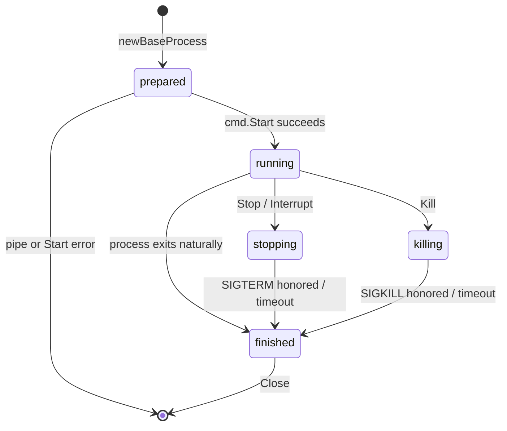
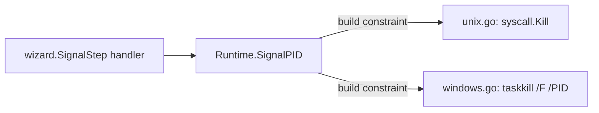
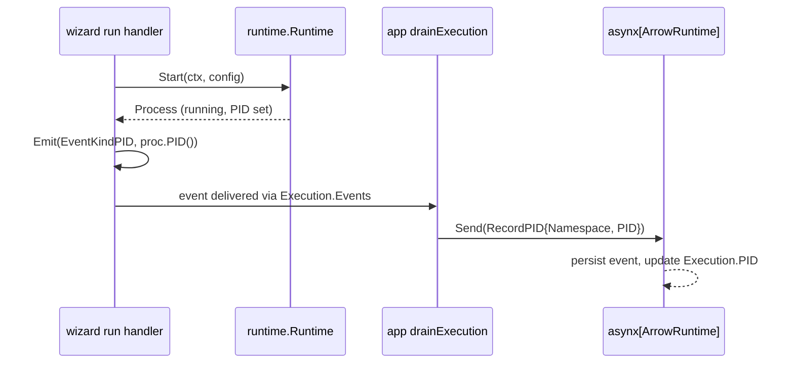
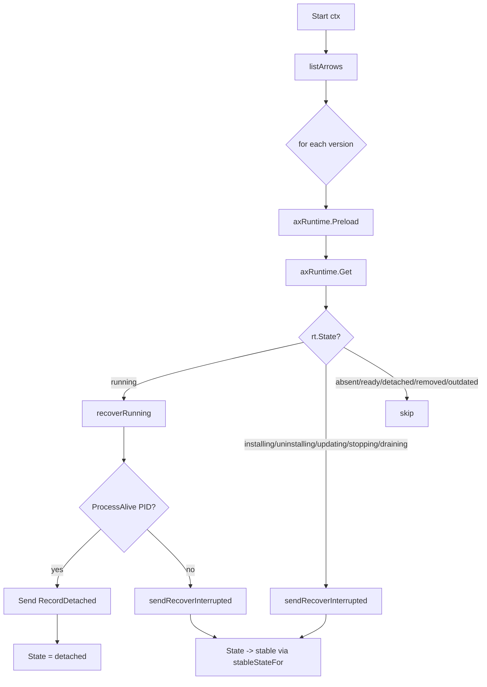
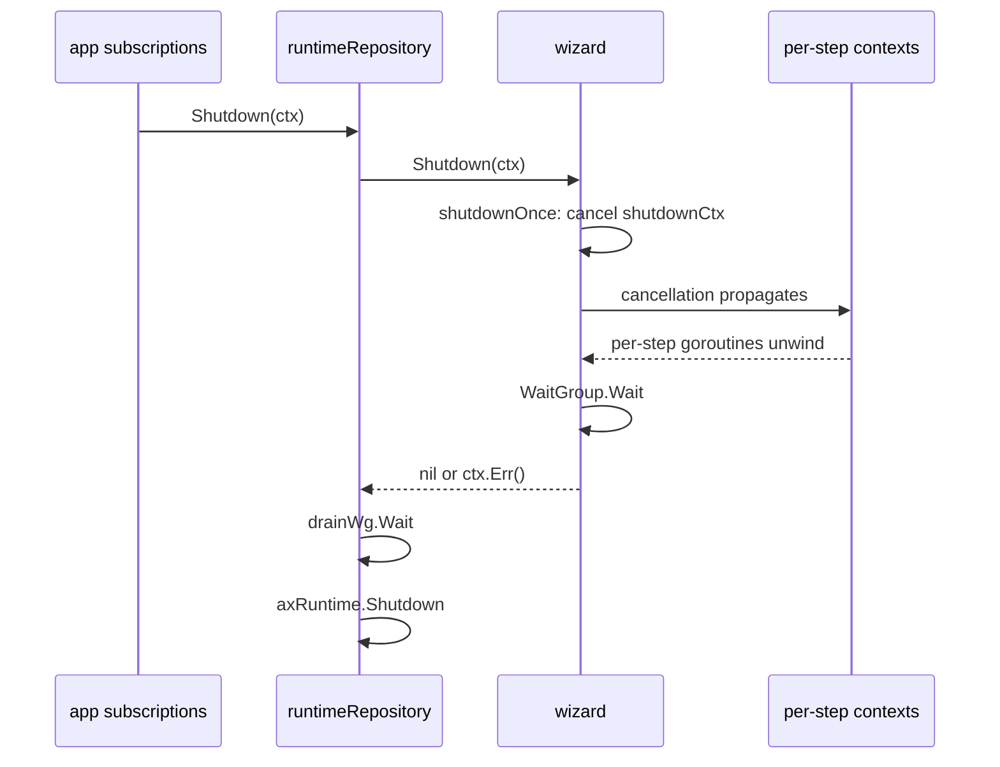

# Quiver — Runtime Module

## Overview

Runtime is a submodule of the Wizard. It is pure infrastructure for spawning and controlling OS processes — it has no knowledge of Asynx, namespaces, arrows, or domain concepts. The Wizard's step handlers (RunStep, SignalStep) call into Runtime; Runtime hands back a `Process` handle and a way to signal an arbitrary PID.

Runtime is **stateless**. It does not maintain a process table, does not assign keys, and does not track namespace-to-process mappings. Each `Start` call returns a fresh `Process` whose lifetime is owned entirely by the caller (the step handler). When a step ends, its process handle goes out of scope.

PID durability is **not** Runtime's concern. The app layer (`internal/app/repositories/runtime/`) writes `Execution.PID` into the `ArrowRuntime` asynx aggregate via the `RecordPID` event-sourced command. On startup, the same app layer reconciles persisted PIDs against running OS processes using `Runtime.ProcessAlive(pid)`. See [PID Persistence and Crash Recovery](#pid-persistence-and-crash-recovery).

Two internal layers under `internal/engine/wizard/internal/runtime/`:

| Layer | Path | Role |
|-------|------|------|
| Facade | `runtime.go` | Public `Runtime` interface — `Start`, `SignalPID`, `ProcessAlive` |
| Process | `internal/process/` | Per-process lifecycle: pipes, output capture, Stop/Kill/Interrupt, Wait |

The `internal/models/` subpackage holds `Config`, `Status`, and process-level sentinel errors.

---

## Public API

The Runtime interface is intentionally minimal. The Wizard (and only the Wizard) imports it.

| Method | Purpose |
|--------|---------|
| `Start(ctx, *Config) → (Process, error)` | Spawn an OS process; returns a started handle (the constructor calls `cmd.Start` before returning). |
| `SignalPID(ctx, pid, SignalKind) → error` | Deliver a signal directly to a known PID, no handle required. |
| `ProcessAlive(pid) → bool` | Check whether a PID currently corresponds to a live OS process. |
| `NewConfig([]string) → *Config` | Helper that returns a `Config` with sensible defaults. |

There is no `Get` builder, no `GetByKey`, no `Shutdown`. The Wizard owns its own `Shutdown(ctx)` and uses the per-process `Stop` / `Kill` methods plus context cancellation to terminate work.

### Why `SignalPID` exists

`Start` returns a `Process` whose `Stop`/`Kill`/`Interrupt` operate on an in-memory handle. After a Quiver process restart, the original handle is gone — but the spawned arrow process may still be alive. `SignalPID` is the bridge: given a persisted PID, deliver a signal via raw syscall. This is the SignalStep path during recovery.

---

## Config

`Config` is the entire input to `Start`. The Wizard's run-step handler builds it from a `RunStep`.

| Field | Type | Default | Notes |
|-------|------|---------|-------|
| `Command` | `[]string` | required | argv; `Validate` rejects empty. |
| `WorkDir` | `string` | `"."` | Process CWD. |
| `Env` | `map[string]string` | empty | Merged into `cmd.Environ()`; not replacing it. |
| `Timeout` | `time.Duration` | `0` (none) | Reserved; not enforced inside Runtime — the Wizard wraps `ctx` with `context.WithTimeout` before calling `Start`. |
| `KillTimeout` | `time.Duration` | `30s` | Bound on `Kill`'s wait for `<-Done()`. |
| `StopTimeout` | `time.Duration` | `30s` | Bound on `Stop` and `Interrupt`'s wait. |
| `BufferSize` | `int` | `200` (out) / `100` (err) | Channel sizes for `StreamOutput`/`StreamError`. |
| `ShellWrap` | `bool` | `false` | When true, command is wrapped in the platform shell — see [Shell Wrapping](#shell-wrapping). |

`Validate()` returns `ErrEmptyCommand` for an empty argv and `ErrInvalidTimeout` for any negative duration.

---

## Process Interface

Returned by `Runtime.Start` already in the `running` state — the constructor (`newProcess` → `startCommon`) calls `cmd.Start()` before returning. There is no separate `Start` method on `Process`.

| Method | Returns | Notes |
|--------|---------|-------|
| `ID()` | `string` | Random UUID v4 (`uuid.New()`), assigned in `newBaseProcess`. Opaque to callers. |
| `PID()` | `int` | `cmd.Process.Pid`; `0` if `cmd.Process` is nil. |
| `Status()` | `Status` | Current status — see table below. |
| `Done()` | `<-chan struct{}` | Closes when the wait goroutine finishes. |
| `Stop(ctx)` | `error` | SIGTERM (Unix) / `Process.Kill` (Windows). |
| `Kill(ctx)` | `error` | SIGKILL (Unix) / `Process.Kill` (Windows). |
| `Interrupt(ctx)` | `error` | SIGINT (Unix) / falls back to `Kill` (Windows). |
| `Wait(ctx)` | `error` | Blocks on `Done()` or `ctx.Err()`. |
| `Close()` | `error` | Closes the output handler's channels (idempotent). |
| `ExitCode()` | `int` | `-1` until the wait goroutine sets it from `cmd.ProcessState`. |
| `Output()` / `Error()` | `string` | Accumulated stdout / stderr. |
| `StreamOutput()` / `StreamError()` | `<-chan string` | Per-line streaming channels. |

### Status Values

| Status | Meaning |
|--------|---------|
| `prepared` | Returned by `newBaseProcess`; transitions to `running` inside `startCommon` after `cmd.Start()` succeeds. Callers do not observe this — `Start` returns when status is already `running`. |
| `running` | Live OS process. |
| `stopping` | `Stop` (or `Interrupt`) is in flight. |
| `killing` | `Kill` is in flight. |
| `finished` | Wait goroutine observed `cmd.Wait()` return; `ExitCode` is set; `Done()` is closed. |

`Status.IsActive()` returns true for `running`, `stopping`, `killing`. `Status.IsFinished()` returns true only for `finished`.

---

## Process Lifecycle

The wait goroutine launched by `startCommon` is the single source of the `finished` transition. It calls `cmd.Wait()`, joins the stdout/stderr scanner goroutines, then under lock sets `exitCode` from `cmd.ProcessState.ExitCode()`, sets status to `finished`, closes the output handler, and closes the `done` channel.

### Stop / Kill / Interrupt — Internal Pattern

All three share `stopWithTimeout(ctx, timeout, send, transitioning)`:

1. Call `send()` — the platform-specific signal delivery closure.
2. Set status to the `transitioning` value (`stopping` or `killing`).
3. If `timeout > 0`, wrap `ctx` with that deadline.
4. `select` on `<-Done()` versus `<-ctx.Done()`. Deadline → return `ErrKillTimeout` wrapped. Cancellation → return `ctx.Err()`.

`Stop` rejects calls when status is not `running` (returns `ErrInvalidState`). `Kill` does not — it can be issued even from `stopping` or `killing` to escalate.

### Unix Signal Map (`unix.go`, build `darwin || linux`)

| Method | Signal |
|--------|--------|
| `Stop` | `syscall.SIGTERM` |
| `Kill` | `cmd.Process.Kill()` (SIGKILL) |
| `Interrupt` | `syscall.SIGINT` |

`SysProcAttr{Setpgid: true}` is set so that signals reach descendants of shell-wrapped commands.

`Kill` treats `os.ErrProcessDone` as a benign race: it then waits on `Done()` or the kill timeout, returning nil either way.

### Windows Signal Map (`windows.go`, build `windows`)

| Method | Behavior |
|--------|----------|
| `Stop` | `cmd.Process.Kill()` (TerminateProcess); status set to `stopping` to distinguish intent. |
| `Kill` | `cmd.Process.Kill()`; status set to `killing`. |
| `Interrupt` | Falls back to `Kill`. |

`isProcessGone(err)` recognises `os.ErrProcessDone`, `syscall.EINVAL`, and the strings "invalid argument" / "access is denied" / "process already finished" as benign races and converts them into a wait on `Done()` with the configured timeout.

---

## Shell Wrapping

`Config.ShellWrap` is a flag (not a builder method). When true, the command is rebuilt inside `newProcess` by joining the argv with spaces and re-wrapping:

| Build tag | Wrapper |
|-----------|---------|
| `darwin || linux` (`unix.go`) | `["sh", "-c", joined]` |
| `windows` (`windows.go`) | `["cmd.exe", "/C", joined]` |

The Wizard's run-step handler always sets `ShellWrap = true` so that `&&`, redirects, and other shell features in arrow commands work as authored.

---

## SignalPID — Direct Signal to a PID

`SignalPID` lets the Wizard signal a process for which it holds no `Process` handle — typically because the PID was loaded from the persisted `ArrowRuntime.Execution.PID` after a crash, and the original handle is gone.

### Unix mapping (`unix.go`)

| `SignalKind` | `syscall.Signal` |
|--------------|------------------|
| `SignalKindGraceful` | `SIGTERM` |
| `SignalKindKill` | `SIGKILL` |
| `SignalKindInterrupt` | `SIGINT` |

Invalid PIDs (`pid <= 0`) and unknown kinds return errors before the syscall.

### Windows mapping (`windows.go`)

Windows has no SIGTERM equivalent. All three kinds (`Graceful`, `Kill`, `Interrupt`) shell out to `taskkill /F /PID <pid>`. The graceful intent is lost on Windows — this is documented at the call site.

---

## ProcessAlive

A liveness probe used by the app layer's crash-recovery flow.

| Build tag | Implementation |
|-----------|----------------|
| `darwin || linux` (`unix.go`) | `syscall.Kill(pid, 0) == nil`, with `pid > 0` guard. |
| `windows` (`windows.go`) | Returns `false` unconditionally — a deliberate "safe default" that pushes recovery into the dead-PID path on Windows. |

The Wizard re-exports this as `Wizard.ProcessAlive(pid)`.

---

## Output Capture

`outputHandler` (in `base_process.go`) owns:

- A `bytes.Buffer` for accumulated stdout, another for stderr.
- A bounded `chan string` for live stdout lines, another for stderr.
- A close gate (`closed` + `closeMu`) so concurrent writes after `close()` are dropped silently.

Buffer sizes default to 200 (out) / 100 (err); `Config.BufferSize`, when positive, overrides to `BufferSize` and `BufferSize / 2` respectively. When a channel is full, the line is dropped and a `slog.Warn` is logged — backpressure is never applied to the OS process.

The two scanner goroutines use `bufio.Scanner` with a 10 MiB max-token buffer, sufficient for long log lines without unbounded growth.

`Close()` closes the channels exactly once. The wait goroutine also calls `close()` on the handler when the process exits, so external `Close()` calls are usually redundant but always safe.

---

## Build-Tag Pattern

Platform-specific code lives in two pairs of files:

| Pair | Unix file (`darwin || linux`) | Windows file |
|------|-------------------------------|--------------|
| Process struct & lifecycle ops | `process/unix.go` | `process/windows.go` |
| `ProcessAlive` and `SignalPID` impls | same `process/unix.go` | same `process/windows.go` |

There is no Linux-only file; Linux and Darwin share `unixProcess`. The shared implementation lives in `process/base_process.go` (no build tag).

The facade (`runtime.go`) does still carry an `os string` field and an `isSupportedOS` switch over `darwin|linux|windows`. This is **constructor-only validation**, not runtime dispatch — once `New()` returns, no code reads `r.os`. The dispatch is fully resolved at compile time by the build tags on `process/*.go`.

---

## Error Surface

Sentinel errors are defined in `runtime/internal/models/errors.go` and re-exported on the facade for callers using `errors.Is`.

| Error | Source | Meaning |
|-------|--------|---------|
| `ErrEmptyCommand` | `Config.Validate` | argv was empty. |
| `ErrInvalidTimeout` | `Config.Validate` | A timeout duration was negative. |
| `ErrInvalidState` | `Stop` (Unix), state guards | Operation requires `running`. |
| `ErrNoProcess` | Windows `Stop` / `Kill` | `cmd.Process` was nil. |
| `ErrKillTimeout` | `stopWithTimeout` | Wait deadline exceeded after sending the signal. |
| `ErrInvalidSignal` | `signalPID` (Unix) | Unknown `SignalKind`. |
| `ErrUnsupportedOS` | facade `New` | `runtime.GOOS` not in `{darwin, linux, windows}`. |

Windows `signalPID` returns a free-form error for unknown kinds rather than `ErrInvalidSignal` — callers should not rely on `errors.Is` for that path on Windows.

---

## PID Persistence and Crash Recovery

Runtime itself does not persist anything. PID durability and reconciliation are app-layer responsibilities, implemented in `internal/app/repositories/runtime/`.

### Where the PID lives

The PID is a field on `domainRuntime.Execution`, which is the in-flight execution embedded in the `ArrowRuntime` aggregate. That aggregate is owned by an asynx event store keyed on `domain.Namespace`. In a typical filesystem deployment, the asynx persistence layer writes events under the user data directory (e.g. `~/.quiver/asynx/...`). The exact path and format are asynx's concern — Runtime does not see them.

### How the PID is recorded

`run.handler.Execute` calls `req.Emit` with `EventKindPID` immediately after `runtime.Start`. The wizard's `drainExecution` loop translates that into a `RecordPID` command on the asynx aggregate. From that moment the PID is durable.

### How recovery uses it

`runtimeRepository.Start(ctx)` (called once at app startup) invokes `RecoverTransients`, which:

1. Lists every persisted Arrow.
2. For each, preloads the `ArrowRuntime` aggregate from asynx.
3. Switches on `rt.State`:

`recoverRunning` reads `rt.Execution.PID`, asks `wizard.ProcessAlive(pid)`, and:

- **Alive** → sends `RecordDetached`. The arrow transitions to `ArrowStateDetached` — the OS process is still running but Quiver no longer holds a `Process` handle. The user must `stop` and restart it to regain full lifecycle control.
- **Dead** (or `pid == 0`) → sends `RecoverInterrupted`. `stableStateFor` maps the transient state to a safe stable one (`installing/uninstalling/updating → absent`; `running/stopping/draining → ready`).

Other transient states (`installing`, `uninstalling`, `updating`, `stopping`, `draining`) skip the PID check and go straight to `RecoverInterrupted` — no useful recovery is possible mid-step.

### How a recovered detached process is later signalled

When the user invokes `stop` on a detached arrow, the wizard's `RunRequest.PID` carries the persisted PID into the execution. The signal-step handler reads `req.PID` and calls `runtime.SignalPID(ctx, req.PID, sig)` — no `Process` handle is needed.

---

## Shutdown

Runtime has no `Shutdown` of its own. The Wizard owns shutdown:

Cancellation reaches a live `Process` through Go's standard `exec.CommandContext` — that is what Runtime currently uses (`exec.CommandContext(ctx, ...)` in `newBaseProcess`). When the context cancels, Go's stdlib delivers `os.Kill` (SIGKILL on Unix) to the process. There is **no** SIGTERM-then-grace-then-SIGKILL escalation at the Runtime level today; graceful stop is opt-in via an explicit `Stop` call (e.g. through a `_stop` method's SignalStep) before shutdown.

The app layer's SIGTERM/SIGINT handler — which routes to `runtimeRepository.Shutdown` — is documented in [subscriptions.md § Shutdown](subscriptions.md#shutdown--app-layer-sigterm-handler).

---

## Cross-References

- **Wizard** ([wizard.md](wizard.md)) — Runtime's only consumer. The wizard's run-step handler builds `Config`, calls `Start`, emits the PID event, and waits. The signal-step handler calls `SignalPID` using the request's PID. The wizard re-exports `ProcessAlive`.
- **Subscriptions** ([subscriptions.md](subscriptions.md)) — App-layer SIGTERM/SIGINT handler that drives shutdown into `runtimeRepository.Shutdown` → `wizard.Shutdown`.
- **Domain** ([domain.md](domain.md)) — `ArrowRuntime`, `Execution.PID`, `ArrowStateDetached`, `ArrowStateRunning` and the state-machine transitions referenced by `RecordDetached` and `RecoverInterrupted`.
- **Step domain** (`internal/domain/runtime/step/`) — `SignalKind` constants (`Graceful`, `Kill`, `Interrupt`) consumed by `SignalPID`.

---

## Summary

| Aspect | Reality |
|--------|---------|
| **Role** | Wizard submodule — process spawn, output capture, signal delivery. |
| **Domain awareness** | None. |
| **In-memory tracking** | None. No process table; the caller owns every handle. |
| **Process identity** | Random UUID v4 (`ID()`) and OS PID (`PID()`). No deterministic key. |
| **PID persistence** | Owned by app layer via asynx `RecordPID` event on `ArrowRuntime`. |
| **Crash recovery** | App layer reconciles persisted `Execution.PID` against `Wizard.ProcessAlive(pid)`; alive → `RecordDetached`, dead → `RecoverInterrupted`. |
| **Platform support** | `darwin`, `linux` (shared `unixProcess`), `windows` (separate). |
| **Signal API** | Per-handle `Stop`/`Kill`/`Interrupt`; PID-only via `SignalPID`. |
| **Windows liveness** | `ProcessAlive` always returns false — recovery treats Windows PIDs as dead. |
| **Graceful shutdown** | Not built into Runtime. Step handlers receive context cancellation; orderly stop is achieved via an explicit Stop step in the arrow's `_stop` method. |
| **Shell wrapping** | `Config.ShellWrap` flag → `sh -c` (Unix) or `cmd.exe /C` (Windows) chosen by build tag. |
| **Output** | Buffered + per-line streaming channels with drop-on-full back-off. |
