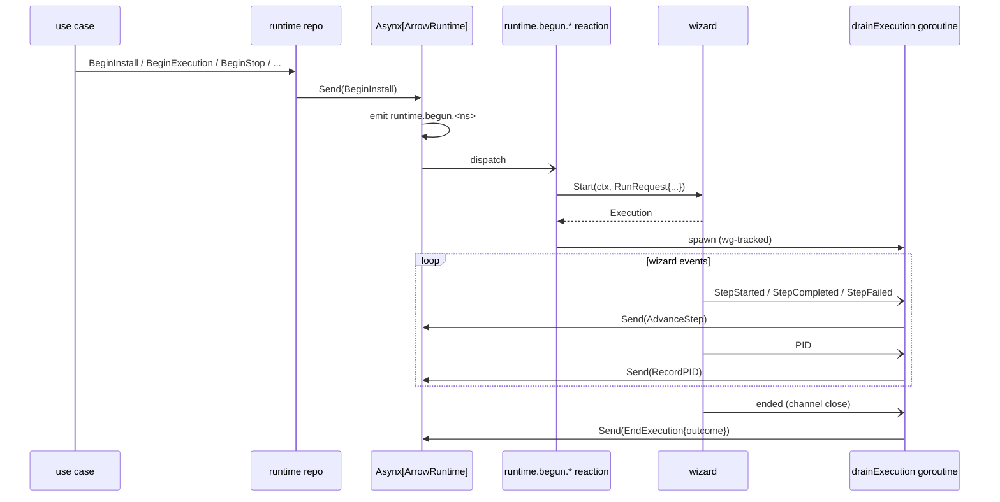
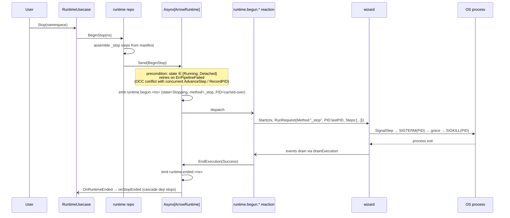

# Quiver — Subscriptions & Handlers

## Overview

Subscriptions are the reactive layer. When a command is sent to an Asynx instance and an event is emitted, every registered handler whose pattern matches the event name fires asynchronously. Subscriptions wire the system together: cross-aggregate reactions, read-model projections, hub broadcasts, and execution-side-effect drains all live here.

`Asynx[T].Subscribe(pattern, handler)` matches event names against an anchored regex compiled from the pattern via `asynx.Topic`. Patterns are split into three segments by the first two dots (`{aggregate}.{action}.{id}`); literal segments are regex-quoted, a `*` in the trailing position becomes `.*` (greedy — id may contain dots), a `*` in the middle becomes `[^.]+` (one segment, no dots). All call sites in this layer use either `asynx.Topic("aggregate.action.*")` for namespaced events or a literal string like `"collection.followed"` for non-namespaced events. The handler receives an `Event[T]` envelope carrying both `Aggregate` (state after the command) and `PreviousAggregate` (state before). Asynx also exposes `OnForget(handler)`, which is invoked when an aggregate is forgotten via `Asynx[T].Forget(id)` — semantically a fourth "removal" channel separate from regular event names.

No read projections double as the query layer: `Asynx[T].Get()` is the canonical query path. Projections that exist write to side stores (catalog SQLite, graph dep edges, collection SQLite) for queries that the event store cannot answer directly (cross-aggregate listings, dependency graph lookups).

Three Asynx instances are subscribed across the app layer:

| Instance | Aggregate | Event name shape |
|---|---|---|
| `Asynx[domain.Arrow]` | Arrow catalog entries | `arrow.<verb>.<namespace>` |
| `Asynx[domainRuntime.ArrowRuntime]` | Per-arrow runtime state | `runtime.<verb>.<namespace>` |
| `Asynx[domain.Collection]` | Collection (followed quivers) | `collection.followed` (literal, not namespaced) |

The fourth Asynx instance in the codebase — `Asynx[ports.PortAllocation]` in `engine/netbridge` — is engine-internal and not exposed to the app layer; it is excluded from this spec.

Cross-references: see [domain.md](domain.md) for aggregate definitions, [commands.md](commands.md) for the commands that emit each event, [usecases.md](usecases.md) for the use-case orchestration that wires reactions, [websocket.md](websocket.md) for the hub layer that pushes broadcasts to clients, [wizard.md](wizard.md) for the stateless execution engine driven by the runtime reaction, and [runtime.md](runtime.md) for crash recovery and the PID-based stop path.

---

## Categories

Subscriptions fall into four categories, each with a distinct purpose and registration site:

| Category | What it does | Registered in |
|---|---|---|
| **Internal reactions** | In-process side effects on top of the same aggregate (e.g. drain wizard events back into Asynx) | Repository constructors |
| **Read-model projections** | Maintain SQLite tables that answer cross-aggregate queries | Repository constructors |
| **Use-case wiring** | Cross-aggregate orchestration (cascading uninstalls, arrow upgrade cleanup) | `app/usecases/container.go` and `app/repositories/container.go::wireCallbacks()` |
| **Hub broadcasts** | Push the full domain aggregate to the WebSocket fan-out hub | `app/repositories/container.go::RegisterHubProjections()` |

The repository layer registers internal reactions and read-model projections in its constructors. The app/repositories container wires cross-repository callbacks (`Arrow → Graph`, `Arrow → Runtime`) and exposes a separate `RegisterHubProjections` step that the app container calls after the WebSocket hub is built. The usecase layer subscribes to the public callback API (`OnRuntimeEnded`, `OnArrowUpgraded`) for cross-aggregate workflows that span more than one repository.

There is no longer a single "StopCoordinator" subscription. The previous design had a `runtime.MarkStopping` subscription that called `wizard.Cancel(namespace)`; PR #155's stateless wizard refactor removed that surface entirely. See [Stop Path](#stop-path) below.

---

## Catalog — All Subscriptions

The table below enumerates every `Subscribe` and `OnForget` registration in the app layer, in the order each repository registers them at construction. Use-case-layer wiring is listed separately afterward.

### Arrow Repository — `Asynx[domain.Arrow]`

| Pattern | Where registered | Purpose |
|---|---|---|
| `OnForget` | `arrow/arrow.go::New()` | Vault `DeleteWorkDir` for the forgotten namespace |
| `arrow.added.*` | `arrow/internal/store/.../projections/projections.go::Register()` | Catalog storage save (versions table) + `hub.BroadcastArrow` |
| `arrow.upgraded.*` | `arrow/internal/store/.../projections/projections.go::Register()` | Catalog storage save + `hub.BroadcastArrow` |
| `arrow.updated.*` | `arrow/internal/store/.../projections/projections.go::Register()` | Catalog storage save + `hub.BroadcastArrow` |
| `arrow.installed.*` | `arrow/internal/store/.../projections/projections.go::Register()` | Catalog storage save (stamps `InstalledAt`) + `hub.BroadcastArrow` |
| `OnForget` | `arrow/internal/store/.../projections/projections.go::Register()` | Catalog storage version cleanup (drops the row when no versions remain) + `hub.BroadcastArrow` |
| `arrow.added.*` | `graph/internal/projections.go::Register()` | Persist dep edges into `dep_edges` SQLite table |
| `arrow.upgraded.*` | `graph/internal/projections.go::Register()` | Persist dep edges (replaces old version row) |
| `arrow.updated.*` | `graph/internal/projections.go::Register()` | Persist dep edges (idempotent upsert per `from_namespace`+`from_version`) |
| `OnForget` | `graph/internal/projections.go::Register()` | Drop all dep edges for the forgotten arrow |
| `arrow.added.*` | `arrow/arrow.go::OnArrowAdded()` (callback API) | Public registration shape — wired by container |
| `arrow.updated.*` | `arrow/arrow.go::OnArrowUpdated()` (callback API) | Public registration shape — wired by container |
| `arrow.upgraded.*` | `arrow/arrow.go::OnArrowUpgraded()` (callback API) | Public registration shape — wired by usecases |
| `OnForget` | `arrow/arrow.go::OnArrowRemoved()` (callback API) | Public registration shape — wired by container |

The `arrow.user_installed.<namespace>` event (emitted by `SetUserInstalled` to flip the `UserInstalled` flag) has **no subscribers** today. The state change still lands in the event store and is visible via `Asynx[Arrow].Get()`, but no projection or callback fires. The catalog projection's pattern set is `arrow.added.*`, `arrow.upgraded.*`, `arrow.updated.*`, `arrow.installed.*` — `arrow.user_installed.*` is intentionally absent.

### Runtime Repository — `Asynx[domainRuntime.ArrowRuntime]`

| Pattern | Where registered | Purpose |
|---|---|---|
| `runtime.begun.*` | `runtime/internal/reactions.go::RegisterReactions()` | Starts a `wizard.Start()` execution and a goroutine that drains its events back into Asynx via `AdvanceStep`, `RecordPID`, and `EndExecution` commands |
| `runtime.begun.*` | `runtime/runtime.go::OnRuntimeBegun()` (callback API) | Public registration shape — wired to hub |
| `runtime.ended.*` | `runtime/runtime.go::OnRuntimeEnded()` (callback API) | Public registration shape — wired to hub and to usecases (`onRuntimeEnded`) |
| `runtime.recovered.*` | `runtime/runtime.go::OnRuntimeRecovered()` (callback API) | Public registration shape — wired to hub |
| `runtime.detached.*` | `runtime/runtime.go::OnRuntimeDetached()` (callback API) | Public registration shape — wired to hub |
| `runtime.pid_recorded.*` | `runtime/runtime.go::OnRuntimePIDRecorded()` (callback API) | Public registration shape — wired to hub |
| `runtime.outdated.*` | `runtime/runtime.go::OnRuntimeOutdated()` (callback API) | Public registration shape — wired to hub |
| `runtime.outdated_cleared.*` | `runtime/runtime.go::OnRuntimeOutdatedCleared()` (callback API) | Public registration shape — wired to hub |
| `runtime.step_advanced.*` | `runtime/runtime.go::OnRuntimeStepAdvanced()` (callback API) | Public registration shape — wired to hub. This is the high-frequency feed — fires on every `AdvanceStep` |

The runtime repository does not expose `OnForget(runtime)` as a public callback. `Runtime.Forget(ns)` is invoked from the arrow `OnArrowRemoved` callback (see use-case wiring) to drop the runtime aggregate when the arrow is forgotten.

### Collection Repository — `Asynx[domain.Collection]`

| Pattern | Where registered | Purpose |
|---|---|---|
| `collection.followed` (literal) | `collection/collection.go::registerProjections()` | Save the followed collection into the collections SQLite store |
| `OnForget` | `collection/collection.go::registerProjections()` | Delete the followed collection from the collections SQLite store |
| `collection.followed` (literal) | `collection/collection.go::OnCollectionFollowed()` (callback API) | Public registration shape — wired to hub |
| `OnForget` | `collection/collection.go::OnCollectionUnfollowed()` (callback API) | Public registration shape — wired to hub |

The collection event name is a single literal string — `FollowCollection.EventName()` returns `"collection.followed"` without a namespace suffix. The pattern passed to `Subscribe` is the same literal. Aggregate isolation still works because Asynx routes each event to the correct aggregate instance via the command's `AggregateID()` method (`c.Collection.Namespace.String()`).

---

## Use-Case Wiring

The repository container's `wireCallbacks()` registers cross-repository handlers using each repository's public callback API:

| Source callback | Reaction |
|---|---|
| `Arrow.OnArrowAdded` | `Graph.SyncDependencies(ctx, ns, &arrow)` |
| `Arrow.OnArrowUpdated` | `Graph.SyncDependencies(ctx, ns, arrow)` |
| `Arrow.OnArrowRemoved` | `Graph.RemoveDependencies(ctx, ns)` then `Runtime.Forget(ctx, ns)` |

The use-case container (`app/usecases/container.go`) registers two further callbacks:

| Source callback | Reaction |
|---|---|
| `Runtime.OnRuntimeEnded` | `runtimeUsecase.onRuntimeEnded` — cascades stops/uninstalls of orphaned dependencies (see [usecases.md § Stop Cascade](usecases.md)) |
| `Arrow.OnArrowUpgraded` | `runtimeUsecase.onArrowUpgraded` — diffs old vs new arrow deps; either marks runtime outdated for dep-sync or kicks a fresh install if no deps changed |

`OnRuntimeEnded` is the linchpin of the stop and uninstall cascades. It dispatches on `rt.LastReturn.Method`:

- **`MethodStop`** → `onStopEnded` cascades stops to non-shared service deps and may auto-uninstall the just-stopped arrow if it was a non-user-installed dep with no remaining live parents.
- **`MethodUninstall`** → `onUninstallEnded` walks the dep plan and stops/uninstalls each non-user-installed dep with no other live parents.
- All other methods fall through with no side effect.

---

## Hub Broadcasts

`RegisterHubProjections(hub)` runs after the app container has built the WebSocket hub and wires all eight runtime callbacks plus both collection callbacks to the hub's broadcast methods. This is where the "websocket feed" subscriptions live; it is not the catalog hub feed for arrows — those are wired directly inside the catalog projection (one fewer hop).

| Source callback | Hub method | DTO pushed |
|---|---|---|
| `Runtime.OnRuntimeBegun` | `BroadcastArrowRuntime` | `ArrowRuntime` |
| `Runtime.OnRuntimeEnded` | `BroadcastArrowRuntime` | `ArrowRuntime` |
| `Runtime.OnRuntimeRecovered` | `BroadcastArrowRuntime` | `ArrowRuntime` |
| `Runtime.OnRuntimeDetached` | `BroadcastArrowRuntime` | `ArrowRuntime` |
| `Runtime.OnRuntimePIDRecorded` | `BroadcastArrowRuntime` | `ArrowRuntime` |
| `Runtime.OnRuntimeOutdated` | `BroadcastArrowRuntime` | `ArrowRuntime` |
| `Runtime.OnRuntimeOutdatedCleared` | `BroadcastArrowRuntime` | `ArrowRuntime` |
| `Runtime.OnRuntimeStepAdvanced` | `BroadcastArrowRuntime` | `ArrowRuntime` |
| `Collection.OnCollectionFollowed` | `BroadcastCollection` | `Collection` |
| `Collection.OnCollectionUnfollowed` | `BroadcastCollection` | `Collection{Namespace: ns}` (zero-valued except for the namespace, signalling deletion) |

Arrow broadcasts go through the catalog projection directly: the projection calls `hub.BroadcastArrow(evt.Aggregate)` after the storage save (or after the on-forget cleanup) instead of via a separate `OnArrowAdded`/`OnArrowUpdated` callback wiring. This keeps the projection's storage write and the broadcast on the same goroutine and event order.

### WebSocket DTO Push Map

The hub fans out to all registered API-version `Subscriber`s. The current v0 subscriber pushes JSON-serialized DTOs to its `Broadcaster[T]` clients on the routes below. See [websocket.md](websocket.md) for the connection lifecycle, namespace filtering (`StreamDef.Namespace`), and DTO field schemas.

| Domain event | API v0 channel(s) | Subscriber DTO |
|---|---|---|
| `arrow.added.*` | `/v0/arrow`, `/v0/arrow/:ns` | `dto.ArrowDTO` |
| `arrow.upgraded.*` | `/v0/arrow`, `/v0/arrow/:ns` | `dto.ArrowDTO` |
| `arrow.updated.*` | `/v0/arrow`, `/v0/arrow/:ns` | `dto.ArrowDTO` |
| `arrow.installed.*` | `/v0/arrow`, `/v0/arrow/:ns` | `dto.ArrowDTO` |
| Asynx forget on arrow | `/v0/arrow`, `/v0/arrow/:ns` | `dto.ArrowDTO` |
| `runtime.begun.*` | `/v0/runtime`, `/v0/runtime/:ns` | `dto.ArrowRuntimeDTO` |
| `runtime.step_advanced.*` | `/v0/runtime`, `/v0/runtime/:ns` | `dto.ArrowRuntimeDTO` |
| `runtime.pid_recorded.*` | `/v0/runtime`, `/v0/runtime/:ns` | `dto.ArrowRuntimeDTO` |
| `runtime.ended.*` | `/v0/runtime`, `/v0/runtime/:ns` | `dto.ArrowRuntimeDTO` |
| `runtime.recovered.*` | `/v0/runtime`, `/v0/runtime/:ns` | `dto.ArrowRuntimeDTO` |
| `runtime.detached.*` | `/v0/runtime`, `/v0/runtime/:ns` | `dto.ArrowRuntimeDTO` |
| `runtime.outdated.*` | `/v0/runtime`, `/v0/runtime/:ns` | `dto.ArrowRuntimeDTO` |
| `runtime.outdated_cleared.*` | `/v0/runtime`, `/v0/runtime/:ns` | `dto.ArrowRuntimeDTO` |
| `collection.followed` | `/v0/collection`, `/v0/collection/:ns` | `dto.QuiverDTO` (namespace filter via `StreamDef.Namespace`) |
| Asynx forget on collection | `/v0/collection`, `/v0/collection/:ns` | `dto.QuiverDTO` (zero aggregate carrying the namespace) |

`runtime.step_advanced.*` is the high-frequency message — it fires on every step transition (`Running` → `Completed`/`Failed`). Runtime events push only on the runtime channels; the arrow catalog channels see no runtime traffic.

There is no `runtime.begun.*` namespace separation between Begin-Install / Begin-Execution / Begin-Stop / Begin-Update / Begin-Uninstall: all five commands emit the same `runtime.begun.<namespace>` event name, with the method discriminated by `rt.Execution.Method` inside the aggregate body. Subscribers that need the method must read the aggregate.

---

## Internal Reactions — The Wizard Drain

The single internal reaction is the runtime repository's `runtime.begun.*` subscription that wires Asynx events back into the wizard. It is the entire mechanism by which the system runs lifecycle steps:



Every wizard event becomes another Asynx command on the same `ArrowRuntime` aggregate. Those commands emit further events (`runtime.step_advanced.*`, `runtime.pid_recorded.*`, `runtime.ended.*`) that the WebSocket hub picks up. This single subscription closes the loop: a `Begin*` command from the use-case layer eventually produces an `EndExecution` event that triggers the cascade callbacks in the use-case layer.

The drain goroutine is registered with the repository's `drainWg` via `tryAddDrain()`. `Runtime.Shutdown` closes the gate (no new drains accepted) and waits for in-flight drains to finish before shutting down the wizard and the Asynx instance.

---

## Stop Path

There is no longer a `StopCoordinator` subscription. The stateless wizard refactor (PR #155) removed `wizard.Cancel(namespace)` and the per-namespace `context.CancelFunc` registry. Stop is now driven entirely by emitting a fresh `BeginStop` command — a normal Asynx command path, not a subscription side effect.



Two concurrent goroutines run during stop:

1. The original `_execute` drain goroutine continues to drain wizard events for the long-lived `_execute` execution. Its `RunRequest.Method == MethodExecute`. When the OS process exits (because `_stop` killed it), the `_execute` wizard reports outcome `Success`/`Failed`, and the drain emits an `EndExecution` for the execute cycle.
2. The new `_stop` execution starts in parallel via the `runtime.begun.*` reaction firing for the `BeginStop` event. It runs the manifest's stop steps (typically a `SignalStep` with `SIGTERM`/`SIGKILL`), and on completion emits its own `EndExecution`.

Because both `EndExecution` commands target the same aggregate ID, OCC ordering is enforced by Asynx's per-aggregate sharding. The use-case layer's `onRuntimeEnded` reaction sees both — `MethodExecute`'s end is a no-op (no cascade match), and `MethodStop`'s end triggers `onStopEnded` to cascade dep stops.

The retry loop in `runtime.go::BeginStop` (5 attempts on `ErrPipelineFailed`) handles the race where the drain goroutine concurrently sends an `AdvanceStep` or `RecordPID` between the `Validate` and the actual append, causing OCC to bump the version. `ErrValidation` is never retried — it means the arrow is not in a stoppable state.

See [wizard.md § Cancel / Stop Flow](wizard.md#cancel--stop-flow) for the wizard-side perspective and the per-execution `runCtx` / `shutdownCtx` plumbing.

---

## Crash Recovery

`Runtime.Start(ctx)` calls `runtimeinternal.RecoverTransients` once at startup. This is **not** a subscription — it is a synchronous reconciliation pass that emits `RecordDetached` or `RecoverInterrupted` commands per persisted aggregate.

| Persisted state | Pre-existing PID? | `ProcessAlive(pid)`? | Command emitted |
|---|---|---|---|
| `Running` | yes | true | `RecordDetached` → `runtime.detached.<ns>` (state → Detached) |
| `Running` | no, or pid dead | — | `RecoverInterrupted` → `runtime.recovered.<ns>` (state → Ready) |
| `Installing` / `Uninstalling` / `Updating` / `Stopping` / `Draining` | — | — | `RecoverInterrupted` → `runtime.recovered.<ns>` (state → Absent for install/uninstall/update; Ready for stopping/draining) |
| `Ready` / `Absent` / `Detached` / `Removed` / `Outdated` | — | — | no-op (already stable) |

The hub broadcasts these events through the runtime callback wiring, so the WebSocket frontend sees the state-corrected aggregate immediately on daemon startup.

See [runtime.md § PID Persistence and Crash Recovery](runtime.md#pid-persistence-and-crash-recovery) and [wizard.md § Crash Recovery](wizard.md#crash-recovery) for the full reconciliation algorithm.

---

## Shutdown

There is no SIGTERM/SIGINT signal handler in `cmd/quiver/daemon.go` today. `daemon.go` calls `internal.Container.Start(ctx, host, port)`, which blocks on `c.API.Run(host, port)` (Gin's `Run`). When Gin returns, the goroutine returns and the process exits without calling `App.Shutdown` or the engine container's shutdown hooks.

`App.Shutdown(ctx)` exists and delegates to `Runtime.Shutdown(ctx)`, which:

1. Calls `wizard.Shutdown(ctx)` — cancels the wizard's `shutdownCtx` so all in-flight wizard goroutines exit, then waits for the wizard's own waitgroup.
2. Closes the drain gate (`drainClosed = true`) so no further drain goroutines spawn from late-arriving `runtime.begun.*` events.
3. Waits for any in-flight drain goroutines (`drainWg.Wait()`).
4. Calls `axRuntime.Shutdown(ctx)` to stop the Asynx instance.

Because nothing wires this to a process signal, in practice the daemon currently terminates abruptly. Subscriptions stop firing the moment the process dies; partial executions are surfaced on the next start by `RecoverTransients`.

See [wizard.md § Shutdown](wizard.md#shutdown) and [runtime.md § Shutdown](runtime.md#shutdown) for the engine-side details.

---

## Event Fan-Out — Diagram

A single command from the use-case layer cascades through Asynx and any matching subscriptions in parallel:

```mermaid
flowchart LR
  CMD[Use case sends command<br/>e.g. AddArrow] --> AX[(Asynx[Arrow])]
  AX -->|emit arrow.added.ns| FAN((fan-out))
  FAN --> CATPROJ[catalog projection<br/>save row + BroadcastArrow]
  FAN --> GRAPHPROJ[graph projection<br/>save dep edges]
  FAN --> CB1[OnArrowAdded callback<br/>Graph.SyncDependencies]
  CATPROJ --> HUB[(WebSocket Hub)]
  HUB --> WS[/v0/arrow + /v0/arrow/:ns/]

  RT[Use case sends BeginInstall] --> AXR[(Asynx[ArrowRuntime])]
  AXR -->|emit runtime.begun.ns| RFAN((fan-out))
  RFAN --> REAC[runtime.begun.* reaction<br/>wizard.Start + drain]
  RFAN --> RHUB[OnRuntimeBegun → BroadcastArrowRuntime]
  REAC --> AXR
  AXR -->|step_advanced / pid_recorded / ended| RHUB2[OnRuntime* hub callbacks]
  RHUB2 --> HUB

  COL[Use case sends FollowCollection] --> AXC[(Asynx[Collection])]
  AXC -->|emit collection.followed| CFAN((fan-out))
  CFAN --> CSTORE[collection store save]
  CFAN --> CHUB[OnCollectionFollowed → BroadcastCollection]
  CHUB --> HUB
```

Each handler runs on its own goroutine (Asynx `ShardingOpts{Shards: 8, QueueDepth: 1000}`); ordering is preserved per-aggregate but not across aggregates. Failures in one handler do not block others — projections log and swallow transient I/O errors; callback errors are logged at `error` level.

---

## Summary

There are no longer separate "coordinator" and "websocket" sections — every subscription is just a handler on one of three Asynx instances, registered either directly inside a repository constructor or via the public callback API consumed by the repository / use-case containers. The single notable behavioral change from the previous spec is that **stop is no longer a subscription**: it is a `BeginStop` command, processed through the same `runtime.begun.*` reaction that handles every other lifecycle method.
