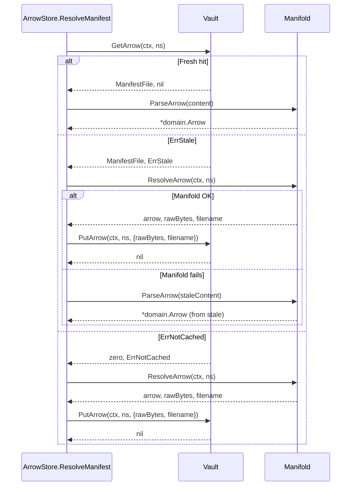
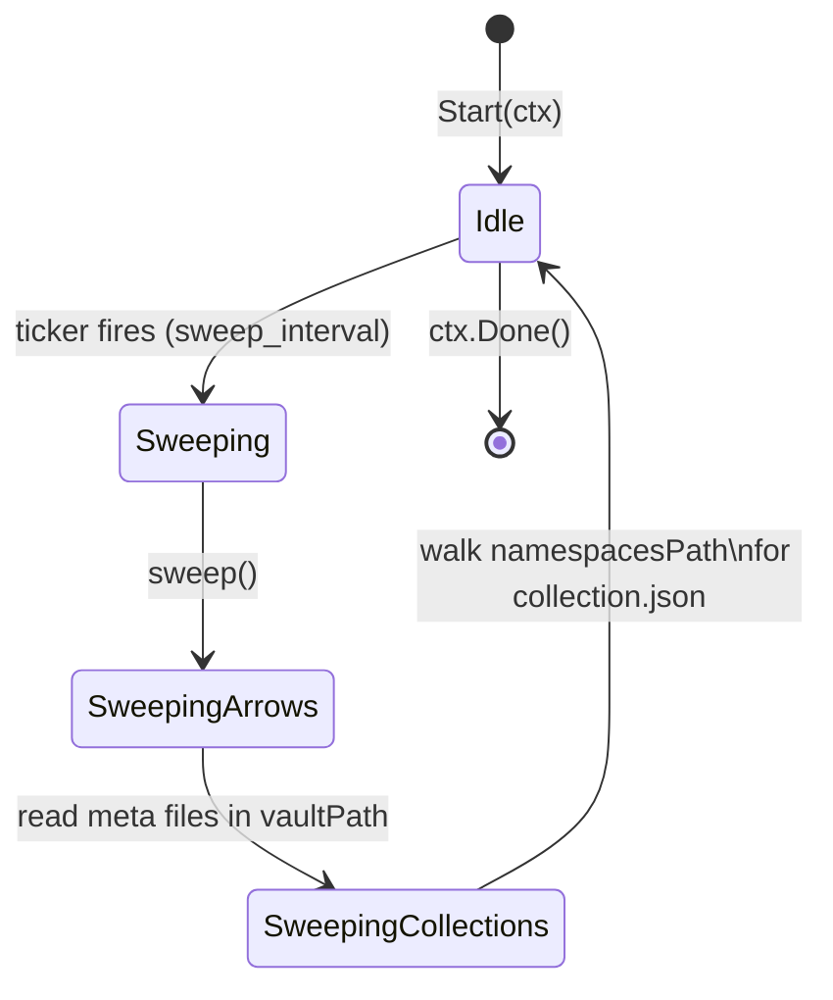

# Quiver — Vault

## Overview

Vault is the engine module that owns the **per-namespace home directory** on disk and the **cached raw manifest store**. It is the canonical source of truth for two things:

1. The location of the namespace workdir — every arrow and collection has a unique directory derived from its namespace, used by the wizard and runtime as `WorkDir`.
2. A TTL-bounded cache of raw manifest bytes (arrow YAML or `ARROW.md`) and JSON-serialised collection aggregates, fetched by Manifold.

Vault performs filesystem I/O only. It does not parse manifests, does not know about Asynx, does not call the network. Parsing happens in Manifold; Vault stores the bytes verbatim. Domain assembly (`*domain.Arrow`) is computed by callers from the raw bytes Vault returns.

Cross-references: [manifold.md](manifold.md) · [deptree.md](deptree.md) · [manifests/v0/versioning.md](manifests/v0/versioning.md)

---

## 1. Module location

Package: `internal/engine/vault`

| File | Responsibility |
|------|----------------|
| `vault.go` | `Vault` interface + `quiverFilename` constant |
| `store.go` | `store` struct, constructors `New` / `NewWithClock`, all interface dispatch, per-namespace locking, workdir handling |
| `manifest.go` | Arrow manifest read/write/delete/rename, collection JSON envelope read/write/delete, list versions, list cached collections, atomic write helper, namespace path acquisition |
| `vault_entry.go` | `ManifestFile`, `CollectionVaultEntry`, `VaultMetadata` |
| `sweep.go` | TTL sweep over arrow meta files and collection JSON files |
| `errors.go` | `ErrNotCached`, `ErrStale`, `ErrInvalidNamespace` |

The engine container (`internal/engine/container.go`) constructs Vault via `vault.New(vaultPath, namespacesPath, 0)` and calls `Container.Start(ctx)` which spawns the sweep goroutine.

---

## 2. Interface

| Method | Purpose |
|--------|---------|
| `GetArrow(ctx, ns) (ManifestFile, error)` | Read cached raw manifest. Returns `ErrNotCached` if absent. Returns `ErrStale` *with* the file content when TTL expired. |
| `PutArrow(ctx, ns, file) error` | Write raw manifest verbatim, write meta sidecar, ensure namespace workdir exists. |
| `DeleteArrow(ctx, ns) error` | Idempotent delete of the manifest + meta files. |
| `RenameArrow(ctx, oldNs, newNs) error` | Move manifest + meta from one namespace key to another (used during version upgrades). |
| `ListVersions(ctx, ns) ([]string, error)` | List all `@ref` values cached under the same bare namespace. |
| `GetCollection(ctx, ns) (*CollectionVaultEntry, string, error)` | Read cached `Collection` aggregate JSON. Same `ErrStale` / `ErrNotCached` semantics. Returns the on-disk path. |
| `PutCollection(ctx, ns, collection) (string, error)` | Write a collection envelope as `collection.json` inside the namespace workdir. Returns the path written. |
| `DeleteCollection(ctx, ns) error` | Idempotent delete of `collection.json`. |
| `ListCachedCollections(ctx) ([]Namespace, error)` | Walk `namespacesPath` and list every namespace that contains a `collection.json`. |
| `WorkDir(ctx, ns) (string, error)` | Return the namespace workdir path, creating it on first call. Single source of truth — callers must not compute paths themselves. |
| `DeleteWorkDir(ctx, ns) error` | Remove the workdir tree. The cache (manifest + meta) is preserved. Prunes empty parent directories up to (but not including) `namespacesPath`, clearing macOS Finder metadata as needed. |
| `Start(ctx)` | Launch the sweep goroutine. Sweeps every `vault.sweep_interval` (default 5 min); exits when `ctx` is cancelled. |

All method signatures take `context.Context` for cancellation propagation, even for operations that perform purely synchronous filesystem work — this is consistent with the engine's envelope-typed interfaces introduced alongside the manifold port.

---

## 3. Path resolution

Vault never resolves absolute paths itself. The engine container injects two roots into the constructor:

| Argument | Default source | Meaning |
|----------|---------------|---------|
| `vaultPath` | `metadata.GetVaultPath()` → `{{home}}/vault` | Flat directory holding arrow manifest cache files. |
| `namespacesPath` | `metadata.GetNamespacesPath()` → `{{home}}/namespaces` | Per-namespace tree holding workdirs and collection envelopes. |

`{{home}}` is platform-specific:

| OS | Home root |
|----|-----------|
| macOS / Linux | `~/.quiver` |
| Windows | `C:\Users\{{USER}}\Documents\.quiver` |

Path templates are defined in `internal/core/metadata/metadata.yaml`; resolution happens in `core/metadata` (template substitution + `filepath.FromSlash`). Directory creation for the named roots is the responsibility of `core/paths`. Vault `MkdirAll`s its own subdirectories on-demand at `Put`/`WorkDir` time.

The engine accepts `engine.WithHomeDir(dir)` for tests and isolated environments — it routes through `metadata.GetVaultPathAt(dir)` / `metadata.GetNamespacesPathAt(dir)` so the entire layout is rooted under an arbitrary directory.

---

## 4. Disk layout

```
~/.quiver/
  vault/                                                     ← flat manifest cache
    github.com%2Fvalve%2Fsteamcmd%40latest.yaml              ← raw manifest bytes
    github.com%2Fvalve%2Fsteamcmd%40latest.meta.json         ← VaultMetadata sidecar
    github.com%2Fvalve%2Fsteamcmd%40v1.2.3.yaml
    github.com%2Fvalve%2Fsteamcmd%40v1.2.3.meta.json
    github.com%2Fdiscord%2Fdiscord.md                        ← `ARROW.md` source — extension preserved
    github.com%2Fdiscord%2Fdiscord.meta.json
  namespaces/                                                ← per-namespace tree
    github.com/
      valve/
        steamcmd@latest/                                     ← workdir for steamcmd@latest
          steamcmd.sh                                        ← wizard-owned
          linux32/
        steamcmd@v1.2.3/                                     ← parallel workdir
      char2cs/
        gaming.collection/
          collection.json                                    ← collection envelope
          cs2/                                               ← arrow workdir under collection
            cs2_ds
```

Two distinct keying strategies coexist:

| Concern | Key | Encoding | Location |
|---------|-----|----------|----------|
| Arrow manifest cache | full `Namespace` (bare + `@ref`) | `url.PathEscape` to a flat filename | `vaultPath/` |
| Arrow workdir | full `Namespace` (bare + `@ref`) | `filepath.FromSlash`; the literal `@ref` becomes a directory segment | `namespacesPath/<ns-path>/` |
| Collection envelope | full `Namespace` (collections are unversioned in practice) | `filepath.FromSlash` | `namespacesPath/<ns-path>/collection.json` |

The flat layout for the manifest cache exists because two manifest filenames (`arrow.yaml` vs `ARROW.md`) cannot collide inside the same directory — encoding the namespace into the filename and keeping the original extension solves both ambiguity and case-insensitive filesystems.

Different versions (`@v1.2.3`, `@latest`) of the same bare namespace share a parent directory inside `namespacesPath/` and produce distinct sibling subdirectories whose name embeds the `@ref` segment.

---

## 5. Data model

### 5.1 `ManifestFile`

| Field | Type | Description |
|-------|------|-------------|
| `Content` | `[]byte` | Raw manifest bytes — written verbatim, returned verbatim. |
| `Filename` | `string` | Source filename, used to pick the on-disk extension (`.yaml`, `.md`). Stored in the meta sidecar so the matching content file can be re-located on read. |

### 5.2 `VaultMetadata`

| Field | Type | Description |
|-------|------|-------------|
| `CachedAt` | `time.Time` | Wall-clock time at which `PutArrow` was called. Used to compute staleness against the configured TTL. |
| `Filename` | `string` | Original filename — required to reconstruct the manifest path on `Get`. |

`Source`, `EvictionTTL`, `OS` from the previous design are *not* present. TTL is a single global value from config, not per-entry. Source URL is reconstructible from the namespace via `Namespace.CloneURL()`.

### 5.3 `CollectionVaultEntry`

| Field | Type | Description |
|-------|------|-------------|
| `Collection` | `*domain.Collection` | The full collection aggregate (meta, members, follow timestamp, failed arrows). |
| `Metadata` | `VaultMetadata` | Only `CachedAt` is populated for collections — `Filename` is unused. |

On-disk representation (private to `manifest.go`):

| JSON field | Source |
|-----------|--------|
| `collection` | `*domain.Collection` marshalled directly |
| `cached_at` | clock at `PutCollection` time |

Collections do not carry a separate sidecar — the cached_at timestamp is part of the same `collection.json` file.

---

## 6. Caching semantics

### 6.1 TTL and staleness

| Value | Source |
|-------|--------|
| Default TTL | 24 h (hard-coded fallback in `New`) |
| Override | `vault.ttl` in `config.yaml` parsed via `time.ParseDuration` |
| Default sweep interval | 5 m (hard-coded fallback) |
| Sweep override | `vault.sweep_interval` in `config.yaml` |

`GetArrow` returns:

| Cache state | Returned `error` | Returned `ManifestFile` |
|-------------|------------------|-------------------------|
| Fresh hit (TTL not expired) | `nil` | populated |
| Stale (TTL expired but on-disk) | `ErrStale` | populated — caller may refresh or fall back |
| Miss (no meta or no manifest file) | `ErrNotCached` | zero value |
| Read error | wrapped error | zero value |
| Invalid namespace | `ErrInvalidNamespace` | zero value |

`GetCollection` mirrors this contract for the collection envelope.

The stale-but-still-returned shape is deliberate: callers (resolver, collection service) use the stale content as a graceful-degradation fallback when Manifold cannot reach the upstream repository.

### 6.2 Cache-first resolution sequence

The arrow store resolver lives at `internal/app/repositories/arrow/internal/store/resolver.go`. It is the canonical Vault + Manifold composition site for arrows.



Collections follow the same pattern in `internal/app/repositories/collection/collection.go` — the `Get` method first asks Asynx (followed collections live there), then falls back to `vault.GetCollection`, with identical fresh / stale / miss handling.

### 6.3 Sweep state



Per tick:

1. `sweepArrows` lists `vaultPath`, finds every `*.meta.json`, reads it, and calls `deleteArrow` for any whose `CachedAt + ttl` is in the past. Both manifest and meta files are removed; the encoded namespace is `url.PathUnescape`d to recover the key.
2. `sweepQuivers` (despite the name — it operates on collections) walks `namespacesPath` until it hits files named `collection.json`, reads only the `cached_at` field, and deletes envelopes past TTL.

Sweep ignores read errors silently. The sweep goroutine has no retry — the next tick reattempts.

---

## 7. Namespace workdir

`WorkDir(ctx, ns)` resolves to `namespacesPath/<filepath.FromSlash(ns)>` and `MkdirAll`s with mode `0o700`. It is called by:

- `assembler.AssembleExecution` — sets `ResolvedExecution.WorkDir` for the runtime.
- `assembler/internal/variables.go` — sets the `WORKDIR` and per-dependency workdir variables for execution.
- `PutArrow` — creates the workdir as a side effect of caching a manifest.

`DeleteWorkDir(ctx, ns)` is wired to the arrow `OnForget` projection (`internal/app/repositories/arrow/arrow.go`) so unfollowing an arrow tears down build artifacts. The cache files in `vaultPath` survive — re-installation does not need to re-fetch the manifest if the TTL has not expired.

`acquireNamespace` (used by collection methods) resolves the workdir path through `filepath.Clean` and rejects results that escape `namespacesPath`, returning `ErrInvalidNamespace`. `WorkDir` itself uses the simpler path validation in `Namespace.Validate()` and trusts the namespace format check; the join is still safe because `filepath.FromSlash` does not collapse `..` segments and the validator rejects empty or wrongly-segmented namespaces.

---

## 8. Indirect dependencies

The previous spec carried `IndirectDependencies` as a field on `VaultEntry` and described a lifecycle around install / uninstall. The current implementation does not. There is no field for indirect deps in `ManifestFile`, `VaultMetadata`, or `CollectionVaultEntry`, and `PutArrow` accepts no such argument. Indirect-dependency knowledge lives only in DepTree's resolution output and in the Asynx `*domain.Arrow` aggregate (via `Edges`); Vault stores raw bytes and is never consulted to discover transitive dependencies.

---

## 9. Concurrency

| Lock | Scope | Acquired by |
|------|-------|-------------|
| `s.mu` (`sync.RWMutex`) | The map of per-namespace mutexes | `namespaceLock` getter/creator |
| Per-namespace `sync.Mutex` (lazy) | One per namespace key | All Get/Put/Delete/Rename operations on that namespace |

Both reads (`GetArrow`, `GetCollection`) and writes (`PutArrow`, `PutCollection`, `DeleteArrow`, `DeleteCollection`) acquire the per-namespace mutex — there is no read/write distinction at the vault level. The shared `s.mu` is only used to serialise lazy creation of new per-namespace mutexes.

`RenameArrow` acquires both `oldNs` and `newNs` locks in a deterministic order (lexicographic) to avoid lock-order deadlocks.

Every `Put*` writes to a temp file in the destination directory and `os.Rename`s into place — concurrent unlocked tools (e.g. an external process tailing the vault) observe an atomic switch rather than a partial write.

---

## 10. Lifecycle integration

| Trigger | Vault call | Site |
|---------|-----------|------|
| Arrow added (manifest fetched fresh) | `PutArrow` | `arrow/internal/store/resolver.go` (`fetchAndCache`) |
| Arrow added from a stale cache hit | `PutArrow` after re-fetch | resolver `resolveStale` |
| Manifest seeded from raw bytes | `PutArrow(ARROW.md)` | `arrow.Seed` |
| Arrow removed (`Forget`) | `DeleteWorkDir` | `OnForget` projection in `arrow.go` |
| Arrow upgraded | `DeleteArrow(newNs)` → `RenameArrow(oldNs, newNs)` → `PutArrow(newNs, …)` | `arrow.UpgradeVersion` |
| Collection followed / fetched | `PutCollection` | `collection.Get` (`fetchAndCache`, `resolveStale`) |
| Collection unfollowed | `DeleteCollection` | `collection.Unfollow` |
| Step assembly | `WorkDir` | `runtime/internal/assembler/assembler.go` |
| Variable resolution | `WorkDir` for self and dependency edges | `runtime/internal/assembler/internal/variables.go` |
| Engine startup | `Start(ctx)` to begin sweeping | `engine.Container.Start` |

Forget-as-a-Service (asynx v0.4.0) supplies the `OnForget` event that the arrow repository wires to `DeleteWorkDir`. The collection repository wires its own `OnForget` to `DeleteCollection` symmetrically. Vault has no Asynx import — all reaction wiring happens in the app layer.

---

## 11. Errors

| Error | Cause | Caller behaviour |
|-------|-------|------------------|
| `ErrNotCached` | No meta file (or no manifest content) for the namespace | Fetch from Manifold and `PutArrow` / `PutCollection` |
| `ErrStale` | Meta exists, content exists, but `now - CachedAt > ttl` | Refresh from Manifold; if refresh fails, parse the stale content |
| `ErrInvalidNamespace` | `Namespace.Validate()` failed, or path traversal attempt detected by `acquireNamespace` | Treat as a programmer error; do not retry |

All other I/O failures (read, write, marshal, rename) propagate as wrapped errors using `fmt.Errorf("vault …: %w", err)`. Deletes are idempotent — `DeleteArrow` and `DeleteCollection` swallow `os.ErrNotExist`.

---

## 12. Constraints

- No network I/O.
- No manifest parsing — bytes in, bytes out.
- No knowledge of Asynx, the runtime, or the wizard.
- Sole owner of namespace workdir path resolution under `namespacesPath`.
- Sole owner of TTL evaluation for cached manifests.
- Idempotent `Delete*` operations; deterministic-order locking on `RenameArrow`.
- Not a data backup. Sweep evicts; callers must accept that any cached entry can vanish on the next tick.
