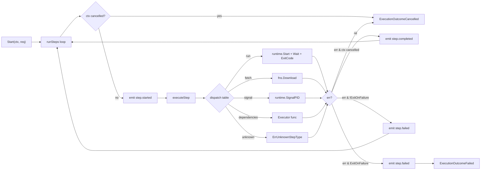
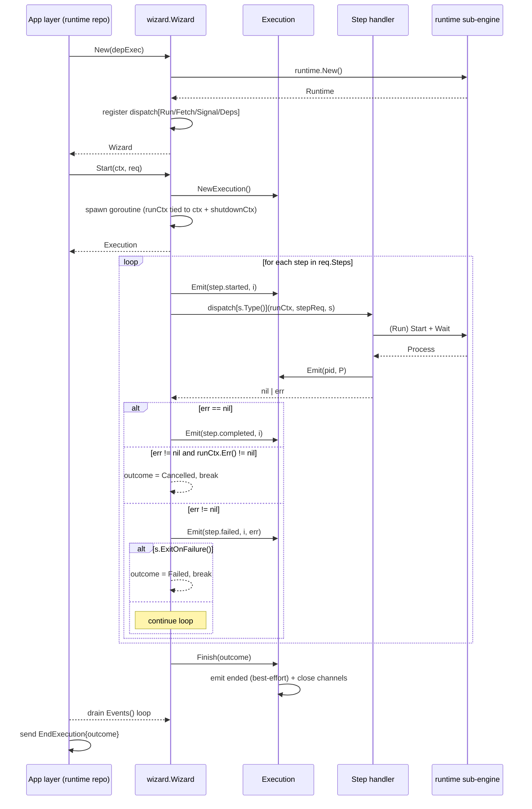
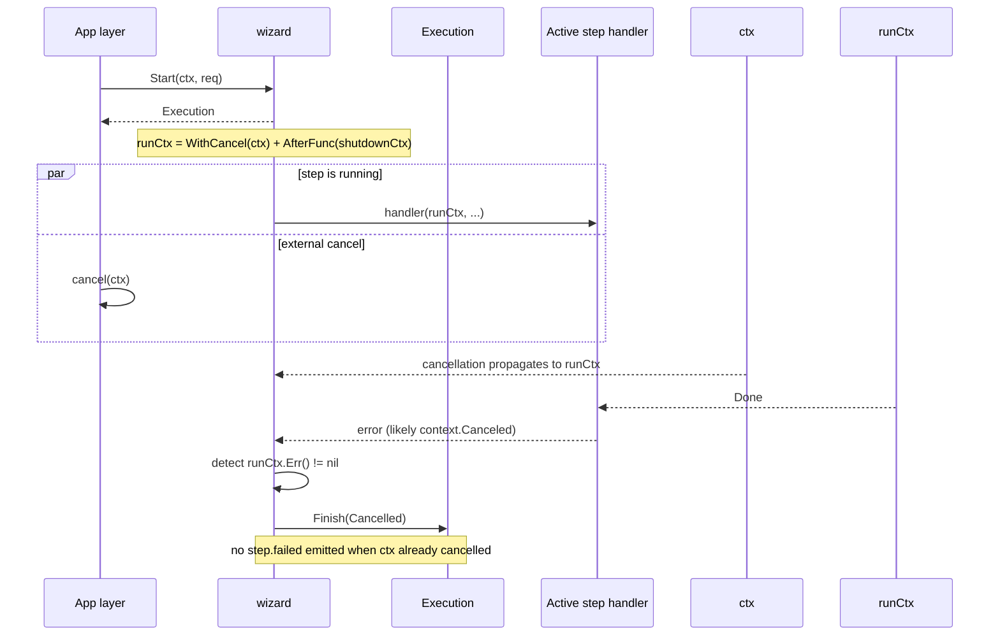
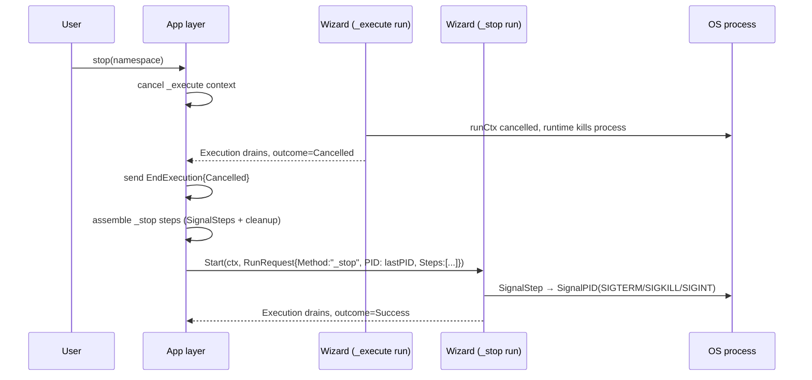
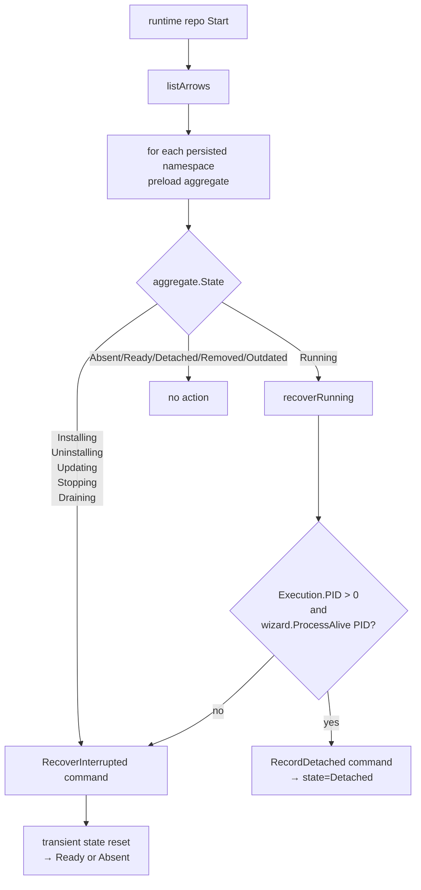

# Quiver — Wizard Engine

## Purpose

The Wizard is a step-execution coordinator. Given an arrow namespace, a method (`_install`, `_execute`, `_stop`, `_uninstall`, `_update`), a list of fully resolved steps, and a resolved variables map, the Wizard runs the steps sequentially in a background goroutine and reports progress to the caller through an event channel.

The Wizard is pure infrastructure: it has no knowledge of arrow lifecycle state, asynx aggregates, vault, or any application concept. It receives a `RunRequest`, returns an `Execution` handle, and emits events. The use case / app layer owns variable resolution, manifest interpretation, working-directory allocation, and translating Wizard events into asynx commands.

The package layout under `internal/engine/wizard/`:

| Path | Role |
|------|------|
| `wizard.go` | Public `Wizard` interface, `New`, `Start`, `Shutdown`, `ProcessAlive` |
| `internal/models/` | `RunRequest`, `Event`, `EventKind`, `Execution`, `ExecutionImpl` |
| `internal/step/` | `Handler[S]` generic interface, `Request` carrier |
| `internal/step/run/` | `RunStep` handler — spawns OS processes |
| `internal/step/download/` | `FetchStep` handler — HTTP download via `internal/core/fns` |
| `internal/step/signal/` | `SignalStep` handler — sends OS signals to a PID |
| `internal/step/dependencies/` | `DependenciesStep` handler — calls an injected `Executor` |
| `internal/runtime/` | Process spawn/signal sub-engine (see `runtime.md`) |
| `internal/mocks/` | Test doubles |

The `runtime/` subdirectory has its own spec at `runtime.md`; this document describes only the wizard engine itself.

---

## Stateless Architecture

The Wizard holds no per-namespace state. Concretely, the `wizard` struct contains only:

| Field | Purpose |
|-------|---------|
| `dispatch` | Read-only `StepType → DispatchFn` table populated in `New` |
| `runtime` | The shared process sub-engine |
| `shutdownCtx` / `cancel` | A single root context cancelled by `Shutdown` to abort every active run |
| `wg` | Tracks active `Start` goroutines so `Shutdown` can wait for them |
| `done` | Closed once `wg` drains, signaling `Shutdown` completion |
| `mu` / `shutting` / `shutdownOnce` | Guards re-entrant or post-shutdown `Start` calls |

There is no map of `namespace → cancel`, no map of `namespace → process`, and no `Cancel(namespace)` method. Every `Start` call is independent — the wizard does not even check for duplicate namespaces.

### Why this matters

Crash recovery and concurrency become trivial. The wizard never has to reconcile in-memory state with persisted state, because there is no in-memory state to reconcile. After a crash and restart, the wizard begins life empty; the app layer is responsible for re-driving any executions that were transient at the time of the crash, and for detaching any process that survived the crash via PID lookup.

### Cancel semantics under the stateless model

The wizard exposes no cancel verb. Cancellation is delivered through one of two contexts wired into every running step:

| Source | Effect |
|--------|--------|
| `ctx` passed to `Start(ctx, req)` | When the caller cancels its context, `Start` derives a `runCtx` from it; cancellation propagates through every step handler (timeouts, `proc.Wait`, HTTP download, signal dispatch) |
| `Shutdown(ctx)` | Cancels the wizard-level `shutdownCtx`; via `context.AfterFunc` this also cancels every active `runCtx`, abandoning all in-flight executions |

To stop a running `_execute`, the app layer cancels the per-execution context (or invokes `Shutdown` for a wholesale teardown). The actual graceful-stop semantics — sending `SIGTERM`/`SIGKILL` in a sequence — live in the arrow's `_stop` lifecycle steps, which the app layer dispatches as a separate `Start` call with its own `RunRequest` containing `SignalStep`s targeting the previously recorded PID.

---

## Public Interface

### Wizard

The `Wizard` interface exposes three methods.

| Method | Behavior |
|--------|----------|
| `Start(ctx, req) Execution` | Launches a goroutine to execute `req.Steps` sequentially; returns the `Execution` handle immediately |
| `Shutdown(ctx) error` | Cancels every active execution's root context, waits (bounded by `ctx`) for goroutines to drain, returns `nil` on success or `ctx.Err()` on timeout |
| `ProcessAlive(pid) bool` | Reports whether the OS process with the given PID is currently running; delegated to the runtime sub-engine. Used by app-layer crash recovery to decide between "detach to running process" and "recover interrupted state" |

`Shutdown` is idempotent (`sync.Once`). After `Shutdown` is invoked, any further `Start` call returns an `Execution` that is immediately finished with `ExecutionOutcomeCancelled`.

### Constructor

`New(depExec stepdeps.Executor) (Wizard, error)`

A single argument: the dependency-step executor function. Passing `nil` makes every `DependenciesStep` a no-op (used in tests and in lifecycles where dependency resolution is delegated outside the wizard). The constructor builds the runtime sub-engine via `runtime.New()` (which fails with `ErrUnsupportedOS` outside `darwin`/`linux`/`windows`), then registers the four built-in handlers in the dispatch table.

### RunRequest

| Field | Meaning |
|-------|---------|
| `Namespace` | Arrow namespace (used as the `NSKey` in step requests) |
| `Method` | Lifecycle method name (carried through but not interpreted) |
| `Variables` | Fully resolved environment variables; passed verbatim to handlers |
| `Steps` | Resolved domain steps (see `manifests/v0/arrow.md`) |
| `WorkDir` | Absolute working directory for processes and relative `FetchStep` destinations; allocated by `vault` |
| `PID` | Pre-existing OS PID. Non-zero only during crash recovery, when a detached process survived a restart and `SignalStep`s in `_stop` need to target it directly |

The wizard does not look up `WorkDir` or resolve variables — both arrive ready to use. Variable resolution layering happens in the app layer (`internal/app/repositories/runtime/internal/assembler`), not here.

### Execution

The handle returned from `Start` exposes three accessors.

| Accessor | Description |
|----------|-------------|
| `Events() <-chan Event` | Buffered channel (capacity 16); all step events arrive here, terminated by an `EventKindEnded` event followed by channel close. `Emit` is non-blocking — events dropped on a full buffer are silently lost |
| `Done() <-chan struct{}` | Closed when the execution finishes. `Outcome()` is valid after this fires |
| `Outcome() ExecutionOutcome` | Final outcome (`success`, `failed`, `cancelled`); set under a mutex before the channels close |

Because `Emit` is non-blocking, `EventKindEnded` may be dropped if the consumer falls behind. `Outcome()` is the authoritative completion signal.

---

## Events

Five event kinds, all carried in a single `Event` struct.

| Kind | Fields populated | When emitted |
|------|------------------|--------------|
| `step.started` | `StepIndex` | Before each step's handler runs |
| `step.completed` | `StepIndex` | After a step's handler returns `nil` |
| `step.failed` | `StepIndex`, `Err` | After a step's handler returns a non-nil error and the context is not yet cancelled |
| `pid` | `PID` | Emitted by the run handler immediately after `runtime.Start` returns a process; carries the OS PID |
| `ended` | `Outcome` | Best-effort terminal event emitted by `Finish` before channels close |

The app layer subscribes to these via `drainExecution` in `internal/app/repositories/runtime/internal/hooks.go`, translating each into an asynx command:

| Wizard event | Asynx command |
|--------------|---------------|
| `step.started` | `AdvanceStep{ToStatus: running}` |
| `step.completed` | `AdvanceStep{ToStatus: completed}` |
| `step.failed` | `AdvanceStep{ToStatus: failed, Error: …}` |
| `pid` | `RecordPID{PID: …}` |
| `ended` | (loop exits; `EndExecution{Outcome: exec.Outcome()}` follows) |

The Wizard does not call asynx, never knows about step indexing offsets, and never edits aggregate state — the hook layer owns that translation.

---

## Step Types

The dispatch table is fixed at construction time. Four step types map to four handlers; an unknown step type returns `ErrUnknownStepType` and is reported as `step.failed` (treated as a normal step failure, honoring the step's `ExitOnFailure`).

| Step type | Handler | Description |
|-----------|---------|-------------|
| `run` | `internal/step/run` | Spawns a shell-wrapped command; emits `EventKindPID` after start; blocks on `Wait`; non-zero exit returns `ErrNonZeroExit` |
| `fetch` | `internal/step/download` | Downloads URL → `WorkDir`-relative or absolute destination via `internal/core/fns`; expands `${VAR}` references using `req.Vars` |
| `signal` | `internal/step/signal` | Sends a `SignalKind` (graceful/kill/interrupt) directly to `req.PID`; returns `ErrNoProcess` if `PID <= 0` |
| `dependencies` | `internal/step/dependencies` | Calls the `Executor` injected at `New`; if `nil`, a no-op |

### Step Request

Every handler receives a `step.Request` derived from the `RunRequest` plus per-execution context.

| Field | Source |
|-------|--------|
| `NSKey` | `req.Namespace.String()` |
| `WorkDir` | `req.WorkDir` |
| `Vars` | `req.Variables` |
| `OSArch` | `runtime.GOOS + "/" + runtime.GOARCH`, computed per call; used to resolve `Overrideable[T]` step fields to their platform-specific value |
| `PID` | `req.PID` (pre-existing PID for recovery) |
| `Emit` | The `Execution.Emit` function — handlers use it to push events mid-step (currently only the run handler emits `pid`) |

### Per-step timeouts

`RunStep`, `FetchStep`, and `SignalStep` each carry an `Overrideable[string]` `Timeout` field. When non-empty, the handler resolves it for the current OS, parses it as a Go `time.Duration`, and derives a `context.WithTimeout` from the parent context. The fetch handler additionally disables the underlying HTTP client's default timeout (`config.WithTimeout(0)`) so the wrapping context deadline becomes the sole authority — preventing the 30s default from firing before a longer step timeout takes effect.

### Step type / handler dispatch



---

## Variable Resolution Layering

The wizard receives steps already resolved for the host OS — the app layer's assembler walks the manifest, picks the platform target, applies variables, and produces a flat `[]step.Step`. The wizard performs only the small remaining resolutions:

| Resolution | Where it happens |
|------------|------------------|
| Manifest → flat step list (target selection, variable defaults) | App layer (`assembler`) before `Start` |
| Variable map injected into process env | `RunStep` handler — sets `config.Env = req.Vars` |
| `${VAR}` placeholders in fetch URL/destination | `FetchStep` handler — `os.Expand(..., req.Vars)` |
| `Overrideable[T]` per-OS field selection | Each handler — `field.Resolve(req.OSArch.String())` |

The wizard never touches the manifest schema, never reads from vault, and never consults configuration. Everything it needs is in the `RunRequest`.

---

## Execution Flow — Sequence



---

## Cancel / Stop Flow

The wizard has no API for surgical cancellation. Two cancellation paths exist, both tied to contexts.

### Per-execution cancel via caller's context



The `runSteps` loop checks `ctx.Err()` both before each iteration (skipping unstarted steps) and after each handler returns (suppressing a stale `step.failed` event in favor of the cancel outcome). The final `runSteps` return also re-checks `ctx.Err()` to convert a "success" path into `Cancelled` if the cancel landed mid-final-step.

### Graceful stop of a running arrow

For a managed arrow, "stop" is not a wizard concern — it is a separate `Start` call from the app layer with `_stop` lifecycle steps:



`SignalStep` does not consult any registry — it operates on `req.PID`, which the app layer carries forward from the previous `_execute`'s `RecordPID` event. This is what makes the wizard truly stateless across executions.

### Process registry — none

There is no `processKeys` or `executions` map. The runtime sub-engine's `SignalPID` is a pass-through to OS-level `kill(pid, sig)`. The "process registry" of the original PR #114 spec was removed by PR #155.

---

## Crash Recovery

The wizard contributes two primitives to crash recovery; the app layer drives the actual reconciliation.

### Wizard primitives

| Primitive | Behavior |
|-----------|----------|
| `Wizard.ProcessAlive(pid)` | Forwards to `runtime.IsAlive(pid)`. On Unix this performs a `kill(pid, 0)` probe. On Windows it returns `false` (safe default — assume dead, force interrupted recovery) |
| `RunRequest.PID` | Optional pre-existing PID. Non-zero values flow through to handlers (notably `SignalStep`) so a freshly constructed wizard can act on a process that survived a crash without ever having spawned it |

### App-layer flow on startup



The wizard itself starts empty; `RecoverTransients` (in `internal/app/repositories/runtime/internal/recovery.go`) walks the persisted aggregates and either:

- **Detaches** — if `Execution.PID > 0` and the OS still has that process, the aggregate is marked `Detached` (the process keeps running unmanaged; the wizard remains uninvolved).
- **Recovers interrupted** — for any namespace stuck in a transient state (`Installing`/`Uninstalling`/`Updating`/`Stopping`/`Draining`, or `Running` without a live PID), an `RecoverInterrupted` command resets the aggregate back to a stable state, leaving no in-flight execution for the wizard to reconcile.

The PID is persisted through the `RecordPID` asynx command (sent by `drainExecution` when the wizard emits `EventKindPID`). On the next boot, that field is the only bridge from the previous wizard generation to the new one.

### Wizard stateless refactor consequences

| Before PR #155 | After PR #155 |
|----------------|---------------|
| Wizard held `executions map[ns]CancelFunc` | No map; cancel via caller's `ctx` |
| Wizard held `processKeys map[ns]string` | No map; `SignalStep` reads `req.PID` |
| `Cancel(namespace)` method on Wizard | Removed; no method |
| Recovery had to reconcile in-memory wizard state with persisted state | Wizard starts empty; recovery only touches persisted aggregates |
| `SignalStep` looked up a `Process` handle by key | `SignalPID` is a stateless OS-level call |

---

## Shutdown

`Shutdown(ctx)` is the only wizard-wide control verb.

```mermaid
sequenceDiagram
  participant App
  participant Wiz as wizard
  participant Exec1 as Active Execution A
  participant Exec2 as Active Execution B

  App->>Wiz: Shutdown(ctx)
  Wiz->>Wiz: shutdownOnce: shutting=true; cancel(shutdownCtx)
  par AfterFunc on Exec A
    Wiz->>Exec1: cancel runCtx
    Exec1-->>Exec1: handlers unwind, Finish(Cancelled)
  and AfterFunc on Exec B
    Wiz->>Exec2: cancel runCtx
    Exec2-->>Exec2: handlers unwind, Finish(Cancelled)
  end
  Wiz->>Wiz: wg.Wait → close(done)
  alt ctx not expired
    Wiz-->>App: nil
  else ctx expired first
    Wiz-->>App: ctx.Err()
    Note over Wiz: cleanup continues in background
  end
```

After the first `Shutdown`, the `shutting` flag short-circuits new `Start` calls — they receive an `Execution` already finished with `Cancelled`, no goroutine is spawned, and no handler runs.

---

## Error Handling

The wizard returns no domain-wrapped error type. Step handlers return raw errors (sentinels where useful, e.g. `ErrNonZeroExit`, `ErrNoProcess`, `ErrInvalidSignal`); the wizard delivers them verbatim in the `step.failed` event's `Err` field. The app layer is responsible for any logging, classification, or user-facing translation.

The single sentinel exposed at the public boundary is `ErrUnknownStepType` (re-exported from `internal/models`), surfaced when the dispatch table has no entry for a step's type.

---

## Cross-References

| Topic | Spec |
|-------|------|
| Process spawn, signaling, OS abstraction | [`runtime.md`](runtime.md) |
| Step types, manifest grammar, lifecycle methods | [`manifests/v0/arrow.md`](manifests/v0/arrow.md) |
| Use-case orchestration, assembler, hook drainage | [`usecases.md`](usecases.md) |
| Asynx command surface (`BeginExecution`, `AdvanceStep`, `RecordPID`, `EndExecution`) | [`commands.md`](commands.md) |
| Subscription topology (`runtime.begun.*`) and crash recovery wiring | [`subscriptions.md`](subscriptions.md) |
