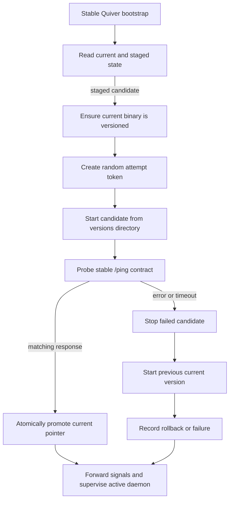

# Quiver Self-Update — Iteración 3: bootstrap e instalaciones versionadas

**Estado:** Propuesta revisada según devolución del team

**Issue:** [#163 — Quiver managing itself](https://github.com/rabbytesoftware/quiver.core/issues/163)

**Target:** `develop`

## 1. Veredicto

El enfoque es válido y es la opción recomendada para continuar.

La mejora central consiste en no sobrescribir el binario funcional para probar un candidato. Cada release se guarda en un directorio inmutable y versionado; el bootstrap inicia el candidato desde allí y solamente actualiza el puntero `current` después de verificar que el nuevo daemon levantó correctamente.

Esto convierte el rollback en una selección de versión, no en una reparación de archivos:

```text
direct replacement:
backup -> replace -> test -> restore on failure

versioned activation:
start candidate -> test -> promote pointer on success
                         -> keep previous pointer on failure
```

La propuesta introduce de manera explícita un bootstrap estable. Funcionalmente cumple el rol de un launcher, pero sigue siendo parte de Quiver: no es un package manager, una aplicación adicional ni un servicio de terceros.

## 2. Respuesta a la propuesta del team

El flujo propuesto es correcto con dos ajustes:

1. El bootstrap no debería terminar inmediatamente después del health check si desktop, systemd o algún otro supervisor está siguiendo su PID. Para el MVP puede permanecer como padre del daemon, reenviar señales y esperar su finalización.
2. Las versiones pueden vivir físicamente en el workdir de la Arrow de Quiver, pero ese subárbol debe tener ownership explícito del updater y quedar protegido de `DeleteWorkDir`.

El resto del razonamiento se mantiene:

- El bootstrap corre antes de `internal.New`.
- El daemon anterior ya terminó y el bootstrap no ocupa el socket.
- El candidato abre los stores y ocupa el socket normal.
- Un probe correlacionado valida exactamente ese intento.
- El candidato solamente se vuelve `current` después de responder correctamente.
- La versión anterior permanece intacta y lista para rollback.

## 3. Layout propuesto

Tomando como namespace de sistema el indicado por el team:

```text
github.com/rabbytesoftware/quiver
```

el layout puede vivir en su workdir:

```text
~/.quiver/namespaces/github.com/rabbytesoftware/quiver/
├── versions/
│   ├── 25.9.0-4b2c.../
│   │   ├── quiver
│   │   └── artifact.json
│   └── 25.9.1-980a.../
│       ├── quiver
│       └── artifact.json
└── update/
    ├── current.json
    ├── staged.json
    ├── attempt.json
    └── history.jsonl
```

En Windows el ejecutable sería `quiver.exe`.

Propiedades del layout:

- `<version>-<digest>` hace que cada instalación sea inmutable y content-addressed.
- `current.json` selecciona la versión activa y conserva la selección anterior.
- `staged.json` describe un candidato descargado y verificado.
- `attempt.json` permite recuperar una activación interrumpida.
- El historial es diagnóstico; no es la fuente de verdad para arrancar.
- Todos los paths almacenados deben ser relativos al workdir y validados contra path traversal.

El namespace debe confirmarse como decisión definitiva porque los documentos anteriores usaban `github.com/rabbytesoftware/quiver.core`.

## 4. Compatibilidad con Vault

El código actual permite usar ese workdir, pero requiere una protección adicional:

- `Vault.WorkDir` crea un path durable bajo `~/.quiver/namespaces/<namespace>`.
- El sweep de TTL elimina manifests y metadata vencida; no elimina el workdir.
- `Vault.DeleteWorkDir` sí ejecuta `os.RemoveAll` sobre todo el workdir.
- El repositorio de Arrows llama `DeleteWorkDir` cuando una Arrow es olvidada.

Por lo tanto, no alcanza con asumir que la Arrow built-in nunca será removida desde la UI. Debe existir una garantía de sistema:

- La Arrow de Quiver no puede ser olvidada, removida ni desinstalada mediante operaciones comunes.
- El cleanup genérico de Vault no puede alcanzar `versions/` mientras haya una versión referenciada.
- El updater es el único dueño de la retención dentro de `versions/` y `update/`.

El bootstrap corre antes de construir Vault. No debería abrir el índice de Vault solamente para resolver el path. Conviene agregar un resolver determinístico de path en `internal/core/paths` y hacer que Vault y bootstrap compartan esa única función.

## 5. Flujo de primera migración

En el primer arranque con soporte de auto-update todavía existe un único binario instalado fuera de `versions/`.

El bootstrap debe crear una base conocida para rollback:

1. Obtener el ejecutable actual mediante `os.Executable()`.
2. Calcular su digest real.
3. Crear `versions/<current-version>-<digest>/`.
4. Copiar allí el binario actual sin modificar el original.
5. Verificar que la copia produzca el mismo digest.
6. Crear `current.json` apuntando a esa versión.
7. Continuar con la evaluación del candidato.

Esta operación es idempotente: si el directorio y la metadata coinciden, no vuelve a copiar.

## 6. Flujo de activación



Pasos detallados:

1. El entrypoint estable comienza antes de `internal.New`.
2. Adquiere un lock exclusivo de bootstrap/update.
3. Lee y valida `current.json`, `staged.json` y cualquier intento interrumpido.
4. Garantiza que la versión actual exista dentro de `versions/`.
5. Genera un token aleatorio para este intento.
6. Inicia el candidato desde su directorio versionado.
7. El candidato ejecuta su arranque normal, incluyendo `internal.New`, recuperación y bind del socket.
8. El bootstrap consulta `/ping` hasta alcanzar un timeout.
9. Si versión, digest y token coinciden, promueve el candidato mediante `current.json`.
10. Si falla, termina el candidato, conserva el puntero anterior e inicia la versión previa.
11. Registra el resultado y conserva la evidencia necesaria para diagnóstico.

## 7. Contrato estable de readiness

Actualmente Quiver expone:

```text
GET /v0/health -> {"status":"ok"}
GET /versions  -> version + build_id + API versions
```

Ninguno identifica un intento de actualización concreto. Se propone agregar un endpoint mínimo y no versionado porque debe mantenerse compatible con bootstraps anteriores:

```text
GET /ping
```

Respuesta durante un intento:

```json
{
  "success": true,
  "data": {
    "status": "ready",
    "version": "25.9.1",
    "build_id": "123",
    "digest": "980a...",
    "attempt_token": "random-per-attempt-value"
  }
}
```

El token se genera localmente y se pasa al candidato mediante una variable de entorno reservada, nunca como argumento visible en el listado de procesos. No concede permisos: solamente evita confundir la respuesta del candidato con otro daemon que ya estuviera escuchando.

El endpoint es válido como señal de readiness porque el listener actual se crea después de:

- Construir engines, adapters, app y API en `internal.New`.
- Abrir event stores, snapshots y read models.
- Ejecutar la recuperación síncrona de runtimes mediante `App.Start`.
- Crear y servir el listener.

El bootstrap debe comparar los cuatro valores esperados. Un `200 OK` sin identidad coincidente no promueve el candidato.

## 8. Puntero `current`

El puntero no debe ser un path remoto ni una cadena libre. Debe guardar identidad verificable:

```json
{
  "schema": 1,
  "generation": 4,
  "current": {
    "version": "25.9.1",
    "digest": "980a...",
    "executable": "versions/25.9.1-980a.../quiver"
  },
  "previous": {
    "version": "25.9.0",
    "digest": "4b2c...",
    "executable": "versions/25.9.0-4b2c.../quiver"
  },
  "promoted_at": "2026-08-14T00:00:00Z"
}
```

Reglas:

- El path debe ser relativo y quedar contenido en el workdir de sistema.
- El digest del archivo debe verificarse antes de cada promoción.
- La escritura debe usar archivo temporal, flush y reemplazo atómico.
- La implementación de reemplazo atómico necesita archivos específicos por plataforma.
- Un pointer corrupto no puede causar la ejecución de un path arbitrario.
- `current` y `previous` deben cambiar en una sola escritura del pointer para no quedar desincronizados.

Una alternativa futura es usar dos slots de puntero con contador de generación. Eso evita depender de que todas las plataformas tengan exactamente la misma semántica de replace sobre un archivo existente.

## 9. Ownership del proceso

Este punto modifica el paso “marca al candidato como actual y termina”.

Si el bootstrap fue iniciado por desktop, systemd, launchd o Windows Service Manager, terminar puede hacer que el supervisor:

- Interprete que Quiver terminó.
- Mate también al proceso hijo.
- Inicie una segunda copia.
- Pierda la capacidad de enviar señales al daemon real.

Para un MVP uniforme se recomienda:

```text
external owner -> stable bootstrap -> active versioned daemon
```

El bootstrap permanece durante la sesión y:

- No abre el socket de Quiver.
- Reenvía SIGINT/SIGTERM o el mecanismo equivalente.
- Espera la salida del daemon hijo.
- Devuelve un exit code coherente al owner externo.
- Puede aplicar el rollback si el candidato falla durante la ventana de validación.

Esto convierte al bootstrap en un supervisor mínimo y estable. Si el proyecto no acepta un proceso padre permanente, será necesario definir un protocolo específico con la aplicación desktop y backends diferentes para service managers.

En Unix puede evaluarse `exec` para reemplazar el proceso conservando el PID una vez elegida la versión. Windows no ofrece la misma semántica, por lo que no resuelve por sí solo el objetivo multiplataforma.

## 10. Arranques posteriores

Una vez promovido un candidato, el ejecutable público estable continúa siendo el punto de entrada:

```text
user/service starts quiver
  -> bootstrap reads current.json
  -> bootstrap validates selected binary
  -> bootstrap starts versions/<current>/quiver
  -> bootstrap validates /ping for the selected binary
  -> versioned daemon skips bootstrap recursion
```

El child debe recibir una marca interna que indique que ya fue seleccionado por el bootstrap. De lo contrario, cada binario versionado volvería a leer `current` y se produciría recursión.

El bootstrap debería validar el daemon seleccionado en cada arranque, no solamente durante una promoción. Si `current` deja de iniciar en un arranque futuro, puede intentar `previous`, verificarlo y actualizar la selección. Esto cubre fallos que aparezcan después de la primera ventana de promoción.

El formato de `current.json` debe ser deliberadamente estable. Un bootstrap antiguo seguirá siendo el entrypoint en futuros releases. Actualizar el propio bootstrap puede diseñarse después y no debe formar parte del primer MVP.

## 11. Rollback

El rollback ya no necesita restaurar archivos:

1. No promover `current` si el candidato falla.
2. Terminar el candidato y esperar su salida.
3. Iniciar la versión todavía seleccionada por `current.json`.
4. Verificar su `/ping` con un nuevo token de intento.
5. Registrar resultado, versión, digest, etapa y error.

Si una versión que ya había sido promovida falla en un arranque posterior, el bootstrap usa el campo `previous` del mismo pointer, lo verifica y solamente entonces invierte la selección.

Se deben conservar como mínimo:

- La versión `current`.
- La versión anterior a `current`.
- El candidato `staged`, mientras el intento sea recuperable.

El garbage collector solamente puede borrar versiones que no estén referenciadas por `current`, `staged`, un intento activo o la política de previous-version retention.

## 12. Compatibilidad de datos

El nuevo layout reduce el riesgo sobre ejecutables, pero no sobre datos.

El candidato abre SQLite, event stores, snapshots y configuración antes de responder `/ping`. Si ejecuta una migración incompatible, iniciar la versión anterior puede fallar aunque su binario siga intacto.

Para el MVP:

- Los releases automáticos deben mantener compatibilidad hacia atrás.
- No deben existir migraciones destructivas antes de readiness.
- Los cambios de schema deben ser aditivos o reversibles.
- La metadata firmada debe declarar la versión mínima de datos.
- Un candidato incompatible debe rechazarse antes de ejecutarlo.

Las migraciones irreversibles requieren otro flujo y quedan fuera del auto-update automático.

## 13. Estados mínimos

```text
idle
checking
downloading
verified
staged
probing
promoted
rollback_starting
rolled_back
failed
```

`current.json` es la fuente de verdad de selección. `attempt.json` describe una transición; no debe poder contradecir silenciosamente al pointer.

## 14. Seguridad

- Verificar firma de metadata antes de descargar.
- Verificar tamaño y digest antes de mover a `versions/`.
- Hacer inmutables los directorios versionados desde la perspectiva del updater.
- Rechazar downgrades salvo rollback local explícito.
- Validar que todos los paths permanezcan dentro del workdir reservado.
- Usar permisos exclusivos del usuario de Quiver.
- Mantener un único lock de bootstrap/update.
- No aceptar versión, digest, token ni executable path desde requests externas.
- No promover un candidato que responda con un token distinto.
- No abrir, crear ni ejecutar artefactos a partir de un path previamente validado. Esas operaciones deben encapsularse por plataforma mediante handles o `dirfd` con semántica no-follow, evitando ventanas TOCTOU.
- No borrar la versión anterior hasta confirmar una política de retención segura.

## 15. Alcance recomendado del primer código

La arquitectura ya está suficientemente definida para comenzar por un spike, no todavía por todo el updater end-to-end.

Primer corte recomendado:

1. Resolver el layout de versiones dentro del workdir protegido.
2. Modelar y validar `current.json`, `staged.json` y `attempt.json`.
3. Implementar escrituras atómicas por plataforma con tests de fallo.
4. Agregar el `/ping` estable con versión, digest y token.
5. Implementar un bootstrap de prueba que inicie un candidato fixture.
6. Probar success, timeout, wrong token, wrong digest, crash y rollback.
7. Validar process ownership en Linux, macOS y Windows antes de integrar descarga real.

La integración con Manifold, Vault y releases puede construirse después de comprobar que el bootstrap y el ownership funcionan en las tres familias de sistema operativo.

## 16. Decisiones pendientes

- [ ] Confirmar `github.com/rabbytesoftware/quiver` como namespace built-in definitivo.
- [ ] Aceptar que el entrypoint estable funciona como bootstrap/launcher de Quiver.
- [ ] Decidir si el bootstrap permanece como supervisor durante toda la sesión.
- [ ] Definir el contrato con la aplicación desktop y service managers.
- [ ] Proteger `versions/` y `update/` de `DeleteWorkDir`.
- [ ] Definir el mecanismo atómico de `current` en Windows.
- [ ] Seleccionar Ed25519 o Sigstore para la metadata de release.
- [ ] Definir timeout y criterio exacto de readiness.
- [ ] Definir retención de versiones y límite de disco.
- [ ] Excluir formalmente migraciones irreversibles del auto-update.

## 17. Criterios de aceptación

1. El entrypoint puede seleccionar una versión sin ejecutar `internal.New` en el bootstrap.
2. La versión vigente queda copiada y verificada en su directorio content-addressed.
3. El candidato se ejecuta sin modificar la versión vigente.
4. Solamente el candidato correcto puede satisfacer el probe de readiness.
5. `current` cambia únicamente después de un probe exitoso.
6. Un timeout o crash conserva el pointer anterior.
7. El bootstrap puede iniciar y verificar la versión anterior después del fallo.
8. Un intento interrumpido se reconcilia de manera determinística al próximo arranque.
9. Ningún cleanup genérico elimina una versión referenciada.
10. El owner externo observa un único lifecycle coherente del daemon.
11. El comportamiento está probado en Linux, macOS y Windows AMD64.

## 18. Respuesta corta para el team

> Sí, es válido y me parece mejor que reemplazar el ejecutable directamente. Guardar releases inmutables en `versions/<version>-<digest>`, probar el candidato y recién después mover `current` hace que el rollback sea selección de versión y no reparación de archivos. El workdir de la Arrow built-in sirve físicamente: el sweep de Vault no lo borra, aunque tenemos que proteger `versions/` del `DeleteWorkDir` que se ejecuta al olvidar una Arrow. Haría dos ajustes al flujo: `/ping` debe ser un contrato estable con version, digest y token del intento, y el bootstrap no debería terminar sin más si desktop/systemd sigue su PID; para el MVP puede quedarse como supervisor mínimo, reenviar señales y esperar al daemon hijo. Con esas condiciones, iría por este diseño y empezaría con un spike de bootstrap + pointer atómico + health/rollback antes de integrar las descargas reales.
