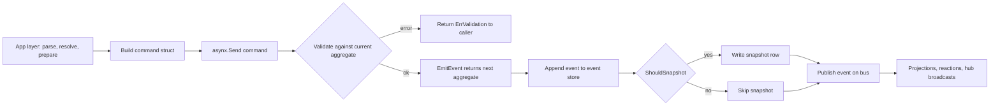

# Quiver — Command Catalog

## Overview

Commands are the only way state changes in this system. Each command is a pure struct that satisfies the Asynx `Command[T]` contract. The contract is purely behavioural — every command must:

- Identify the aggregate it targets (`AggregateID`).
- Validate the current aggregate snapshot against the command's intent (`Validate`). Validation must be a pure function of the input plus the current state — no I/O, no side effects, no cross-aggregate reads.
- Produce the next aggregate value (`EmitEvent`). The function must also be pure, returning a fresh value rather than mutating in place.
- Declare its event name (`EventName`) and whether the projection should write a snapshot afterwards (`ShouldSnapshot`).

All real work — git fetch, manifest parse, dependency resolution, port allocation, process launch, variable resolution, vault writes — happens in the app layer (services, use cases, reactions) before `asynx.Send()`. Commands are inert records of intent; the event log is the source of truth, and projections read events back to populate query stores.

Aggregate removal does not always require a command. The Asynx kernel exposes a `Forget(aggregateID)` operation that emits a tombstone via the projection's `OnForget` hook. Both `arrow.Remove` and `collection.Unfollow` flow through `Forget`, not through dedicated commands. Commands therefore cover state transitions inside the lifetime of the aggregate; removal is a separate kernel-level mechanism that fires `OnForget` subscribers for downstream cleanup.

### Naming Convention

Event names use dot notation: `aggregate.action`. Several runtime commands share an event family — for example, every `Begin*` command emits a `runtime.begun.<namespace>` event so subscribers can listen with one regex. Commands that target a single aggregate instance suffix the namespace string to the event name (`arrow.added.github.com/org/repo@v1.0.0`), enabling per-instance `Listen` semantics. Aggregate-wide subscribers use wildcard topics (`arrow.added.*`).

| Pattern | Example |
|---|---|
| Aggregate-wide subscribe | `arrow.added.*`, `runtime.begun.*` |
| Per-instance subscribe | `runtime.ended.github.com/org/repo@v1.0.0` |
| Cross-aggregate subscribe (collection / port) | `collection.followed`, `port.Allocated` |

### Snapshot Policy

`ShouldSnapshot()` controls whether Asynx writes a snapshot row after applying the event. Snapshots speed up replay by giving projections a fast-forward starting point. The current policy is:

- **Snapshot on durable transitions.** Anything that changes the aggregate's identity, state, or installation status writes a snapshot. Examples: `arrow.added`, `arrow.upgraded`, `runtime.begun`, `runtime.ended`, `runtime.detached`, `runtime.recovered`, `runtime.outdated`, `collection.followed`.
- **No snapshot for high-frequency or transient updates.** Step progress and PID recording fire many times per execution and would bloat the snapshot table without saving meaningful replay time. Examples: `runtime.step_advanced`, `runtime.pid_recorded`.
- **No snapshot for short-lived port allocations.** Port aggregates are tiny and recycle frequently; snapshotting on every allocation would dominate disk traffic without a payoff.

The aggregate replay flow with this mixed policy is shown below.

---

## Arrow Commands

`Arrow` is the catalog aggregate. It carries the parsed manifest fields (meta, variables, netbridge ports, target binaries), installation flags (`UserInstalled`, `InstalledAt`, `InstalledRef`, `InstalledConstraint`), and an upgrade pointer (`UpgradedFromNs`). Arrows have no execution state — that lives on `ArrowRuntime`. The aggregate identity is the namespace string `host.tld/org/repo@ref` (the `@ref` form is primary — distinct refs of the same repo are independent aggregates).

Removal is performed via `axArrow.Forget(namespace)`, not a dedicated command. The repository checks `Exists` first and returns `ErrNotFound` if the aggregate is unknown. Forget triggers `OnArrowRemoved` reactions: graph dependency cleanup, runtime forget, and vault work-dir deletion.

| Command | Event Name | Snapshot | Validates | Aggregate Identity |
|---|---|---|---|---|
| `AddArrow` | `arrow.added.<ns>` | yes | `current == nil` (aggregate must not exist) | namespace |
| `SetUserInstalled` | `arrow.user_installed.<ns>` | yes | `current != nil` | namespace |
| `MarkInstalled` | `arrow.installed.<ns>` | yes | `current != nil` | namespace |
| `UpdateArrowManifest` | `arrow.updated.<ns>` | yes | `current != nil` | namespace |
| `UpgradeArrow` | `arrow.upgraded.<ns>` | yes | `current == nil` (the new namespace must not yet exist) | new namespace |

### `AddArrow` (`arrow.added`)

Triggered when the app layer has resolved a constraint, fetched the manifest from manifold, and parsed it into the domain model. The command writes a fresh `Arrow` aggregate carrying meta, variables, netbridge port definitions, the per-OS targets map, the user-install flag, and the original install constraint. It rejects re-adding an existing aggregate; if the aggregate already exists the repository instead emits `SetUserInstalled` so a transitive dependency that the user later requests directly is promoted in place.

### `SetUserInstalled` (`arrow.user_installed`)

Promotes an existing arrow to user-installed status without mutating any other field. Used when a user explicitly installs an arrow that was previously pulled in only as a transitive dependency. Validation requires the aggregate to exist.

### `MarkInstalled` (`arrow.installed`)

Stamps `InstalledAt` (timestamp) and `InstalledRef` (the resolved git ref/version actually installed) on the aggregate. Fired from the post-execution hook after a successful `_install` lifecycle run. Validation only requires the aggregate to exist; the lifecycle layer is responsible for ordering.

### `UpdateArrowManifest` (`arrow.updated`)

Replaces meta, variables, netbridge port definitions, and per-OS targets in place. Sent when the manifold layer reports a refreshed manifest (new tag, edited file, or seeded payload via the API). Installation flags are preserved. Validation requires the aggregate to exist.

### `UpgradeArrow` (`arrow.upgraded`)

Creates a new aggregate at the upgraded namespace (`@v2.0.0`) that copies state from the previous one (`@v1.0.0`). The command stores `UpgradedFromNs` pointing at the old namespace so reactions can coordinate cleanup of the old aggregate, vault rename, and runtime forget. Validation requires the new namespace to be absent — versions are independent aggregates, never overwritten in place.

---

## ArrowRuntime Commands

`ArrowRuntime` carries the live execution context for an Arrow: the current `State` (one of `absent`, `installing`, `ready`, `running`, `stopping`, `detached`, `uninstalling`, `updating`, `outdated`, `draining`, `removed`), an optional `Execution` block (method name, step progress array, variables, PID, work directory), the most recent `LastReturn` (method, outcome, completed steps, variables snapshot), and an optional `PendingDepSync` describing dependency drift discovered while the arrow was idle.

Lifecycle methods are constants in the `domain` package: `MethodInstall`, `MethodUninstall`, `MethodUpdate`, `MethodStop`, plus the user-supplied method name passed to `BeginExecution`. Each `Begin*` command produces the event `runtime.begun.<ns>` so subscribers can observe execution start uniformly regardless of method.

| Command | Event Name | Snapshot | Validates |
|---|---|---|---|
| `BeginInstall` | `runtime.begun.<ns>` | yes | `current == nil` OR `Execution == nil` AND state is `absent`/`removed` |
| `BeginUninstall` | `runtime.begun.<ns>` | yes | state is `ready`, `Execution == nil` |
| `BeginExecution` | `runtime.begun.<ns>` | yes | `Execution == nil`; state matches `AvailableIn` (default `ready` when empty) |
| `BeginStop` | `runtime.begun.<ns>` | yes | state is `running` or `detached`; not already stopping |
| `BeginUpdate` | `runtime.begun.<ns>` | yes | state is `outdated` or `ready` |
| `EndExecution` | `runtime.ended.<ns>` | yes | `Execution != nil` |
| `AdvanceStep` | `runtime.step_advanced.<ns>` | no | `Execution != nil` |
| `RecordPID` | `runtime.pid_recorded.<ns>` | no | `Execution != nil` |
| `RecordDetached` | `runtime.detached.<ns>` | yes | current state has a transition to `detached` |
| `RecoverInterrupted` | `runtime.recovered.<ns>` | yes | current state is transient (`installing`, `uninstalling`, `updating`, `running`, `stopping`, `draining`) |
| `MarkOutdated` | `runtime.outdated.<ns>` | yes | aggregate absent OR state is `ready` |

### `BeginInstall` (`runtime.begun`)

Starts the install lifecycle. Sent by the use case layer after the assembler resolved variables, expanded steps from the manifest, and produced a work directory. Validation accepts a fresh aggregate (first install) or an existing one whose state is `absent` or `removed` and which has no in-flight execution. The emitted aggregate sets `State = installing` and seeds `Execution` with method `_install`, the pre-resolved steps marked `pending`, the variable map, and the work directory.

### `BeginUninstall` (`runtime.begun`)

Starts the uninstall lifecycle. Validation requires `State == ready` and no in-flight execution. The emitted aggregate sets `State = uninstalling`, replaces `Execution` with the uninstall method block, and preserves `LastReturn` from the prior run for diagnostic continuity.

### `BeginExecution` (`runtime.begun`)

Starts a custom or built-in `_execute`-style method from `ready` (or another whitelist supplied via the `AvailableIn` field). Validation rejects nil aggregates and any in-flight execution. When `AvailableIn` is empty the only allowed source state is `ready`; otherwise the current state must appear in the list — the use case layer populates `AvailableIn` from `method.AvailableIn` in the manifest. The emitted aggregate sets `State = running` and seeds `Execution` with the requested method.

### `BeginStop` (`runtime.begun`)

Signals intent to halt a running or detached arrow. Validation requires `State == running` or `State == detached` and forbids re-entry while a stop is already in progress. The emitted aggregate sets `State = stopping`, replaces `Execution` with the `_stop` method block, and preserves the prior PID so the reaction can locate the process. If concurrent `AdvanceStep`/`RecordPID` writes from the running execution cause an OCC conflict, the repository retries the send up to five times before surfacing `ErrStateViolation`.

### `BeginUpdate` (`runtime.begun`)

Starts the update lifecycle. Validation requires `State == outdated` or `State == ready` (an opportunistic update is allowed even before `MarkOutdated` fires). The emitted aggregate sets `State = updating`, seeds `Execution` with the `_update` method block, preserves `LastReturn`, and explicitly clears `PendingDepSync` because the update consumes the drift the marker recorded.

### `EndExecution` (`runtime.ended`)

Terminates whatever execution is in progress and records its outcome (`success`, `failed`, `cancelled`). Validation requires `Execution != nil`. The emitted aggregate clears `Execution`, packs the just-finished method, outcome, steps, and variable snapshot into `LastReturn`, and chooses the next state via a method-and-outcome lookup: install success → `ready`, install non-success → `absent`, uninstall success → `absent`, uninstall non-success → `ready`, all other methods → `ready`.

### `AdvanceStep` (`runtime.step_advanced`)

Records that one step inside the active execution changed status (`pending → running`, `running → completed`, `running → failed`). Carries an optional error string for failed steps. Fires many times per execution; this is the real-time progress feed for the WebSocket hub. No snapshot — replays reapply the sequence cheaply.

### `RecordPID` (`runtime.pid_recorded`)

Captures the OS process ID that the wizard launched. Stored on the active `Execution` so a later `BeginStop` can recover it. No snapshot.

### `RecordDetached` (`runtime.detached`)

Transitions an arrow whose process survived a Quiver restart into the `detached` state. Validation defers to the domain state machine's `CanTransitionTo(detached)`; the emitted aggregate clears `Execution` (Quiver no longer monitors the process) but keeps `LastReturn` for diagnostics. The user must explicitly stop and restart the arrow to bring it back under Quiver's supervision.

### `RecoverInterrupted` (`runtime.recovered`)

Resets an arrow caught in a transient state at startup back to a stable state. Mapping: `installing`/`uninstalling`/`updating` → `absent` (partial work cannot be trusted); `running`/`stopping`/`draining` → `ready` (the process is gone — the alive-PID branch uses `RecordDetached` instead). Validation rejects stable states (`absent`, `ready`, `detached`, `removed`, `outdated`) so recovery is idempotent.

### `MarkOutdated` (`runtime.outdated`)

Records that a graph re-evaluation discovered dependency drift while the arrow was idle. The command carries the lists of added and removed dependency namespaces. Validation accepts either a fresh aggregate (no runtime yet) or `State == ready`; any other state means there is already work in progress and the marker would race. The emitted aggregate sets `State = outdated` and stores the drift in `PendingDepSync`. `BeginUpdate` later clears it.

---

## Collection Commands

`Collection` is the followed-quiver aggregate. It carries the namespace, the parsed `COLLECTION.md` markdown manifest, the list of arrows that failed to materialise during follow, and a `FollowedAt` timestamp. The aggregate identity is the collection namespace string. Like Arrow, removal flows through `Forget` rather than a command — `Unfollow` calls `axCollection.Forget(namespace)`, which fires `OnCollectionUnfollowed` subscribers and triggers vault cleanup.

| Command | Event Name | Snapshot | Validates |
|---|---|---|---|
| `FollowCollection` | `collection.followed` | yes | `current == nil` |

### `FollowCollection` (`collection.followed`)

Triggered when the user follows a collection through the API. The use case layer fetches and parses the markdown manifest, attempts to install each declared arrow (recording failures in `failedArrows`), and then sends this command. Validation rejects already-followed namespaces with `ErrAlreadyExists`. The emitted aggregate stamps the current time as `FollowedAt`. The event name carries no namespace suffix — the kernel routes by `AggregateID` and projections subscribe with the bare event name.

---

## PortAllocation Commands

`PortAllocation` is the netbridge engine's aggregate. Each port (TCP or UDP, specific number) is a distinct aggregate identified by the port string. The aggregate carries the port number, protocol, owner key (the consumer that holds the lease), and a flag indicating whether external port forwarding has been configured. Snapshots are intentionally disabled on both commands — port aggregates are short-lived and easy to replay from raw events.

| Command | Event Name | Snapshot | Validates |
|---|---|---|---|
| `AllocatePort` | `port.Allocated` | no | `current == nil` or zero-valued (port currently unallocated) |
| `DeallocatePort` | `port.Deallocated` | no | `current != nil` (port currently allocated) |

### `AllocatePort` (`port.Allocated`)

Records that a caller leased a specific port. Validation rejects the command if a non-zero allocation already exists for that port. The emitted aggregate stores the port, protocol, owner key, and forwarding flag.

### `DeallocatePort` (`port.Deallocated`)

Releases a port. Validation requires an existing allocation. The emitted aggregate is the zero value of `PortAllocation`, which the kernel treats as "available" for the next `AllocatePort`.

---

## Cross-References

- `domain.md` defines `Arrow`, `ArrowRuntime`, `Collection`, `Namespace`, `OS`, `Target`, lifecycle methods, and the runtime state machine that command validation relies on.
- `subscriptions.md` enumerates which projections, reactions, and hub broadcasts listen to each event topic.
- `usecases.md` describes the orchestration layer that resolves manifests, runs the assembler, calls dependency resolution, and finally sends the commands documented here.
- `runtime.md` and `arrow/lifecycle.md` walk through the install / execute / stop / uninstall / update flows command by command.
- `netbridge.md` explains the port allocation engine that wraps the `PortAllocation` aggregate.
