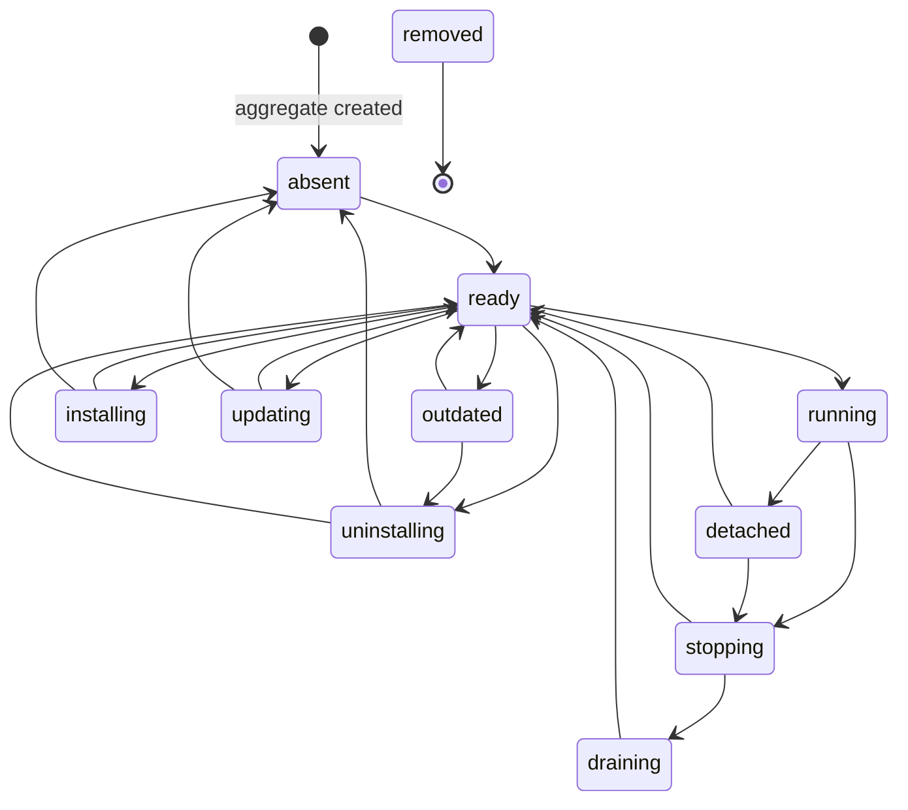
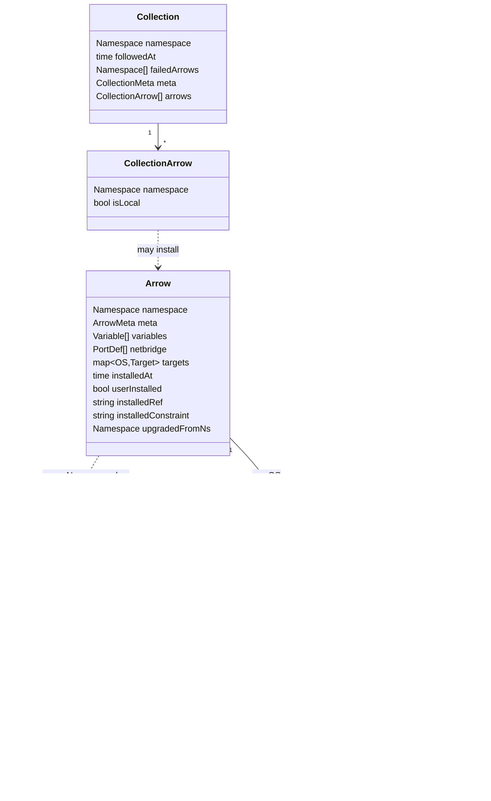

# Quiver — Domain Model

## Overview

The `internal/domain` package is the pure model. It defines the value types, enums,
identity rules, and state machines that the rest of the system rotates around.
There are no repositories, services, or I/O concerns here — just the shapes and
invariants the app and engine layers preserve.

Three persistent aggregates live in this layer:

| Aggregate     | Identity (key)                            | Source file                                  |
|---------------|-------------------------------------------|----------------------------------------------|
| `Arrow`       | `Namespace` (carries an `@ref` suffix)    | `internal/domain/arrow.go`                   |
| `ArrowRuntime`| `Namespace` (the same namespace as Arrow) | `internal/domain/runtime/arrow_runtime.go`   |
| `Collection`  | `Namespace` (3-segment, no `@ref`)        | `internal/domain/collection.go`              |

The Arrow aggregate is the canonical record of an installed `namespace@ref` — its
manifest data, target compilation, and bookkeeping. The runtime aggregate is the
volatile execution context for that same namespace. The collection aggregate is a
followed catalog of arrows.

Asynx persists each aggregate as an event log: every command emits an event whose
payload is a JSON Patch (RFC 6902) diff of the aggregate before and after the
transition. Snapshots are written periodically so that replay does not require
walking the entire log on every read. Fat aggregates are tolerated — only the
fields that changed appear in any one diff.

Cross-references:
[entities.md](entities.md) ·
[manifests/v0/versioning.md](manifests/v0/versioning.md) ·
[manifests/v0/arrow.md](manifests/v0/arrow.md) ·
[commands.md](commands.md) ·
[subscriptions.md](subscriptions.md)

---

## 1. Identity: `Namespace`

`Namespace` is the single string-typed identifier used across the domain. It is
the aggregate key for `Arrow`, `ArrowRuntime`, and `Collection`. A namespace has
two parts joined by `@`:

```
domain.tld/user/repo[/auid][@ref]
```

The bare portion (left of `@`) names the software; the optional ref names the
git revision. The same namespace without a ref refers to the software in the
abstract; the same namespace with a ref refers to one specific installed
version.

| Form                                         | Bare segments | Has ref | Meaning                                            |
|----------------------------------------------|---------------|---------|----------------------------------------------------|
| `github.com/valve/steamcmd`                  | 3             | no      | Standalone arrow, version unspecified              |
| `github.com/valve/steamcmd@v1.2.3`           | 3             | yes     | Standalone arrow at tag `v1.2.3`                   |
| `github.com/char2cs/gaming.quiver/cs2`       | 4             | no      | Quiver-hosted arrow `cs2` inside a collection      |
| `github.com/char2cs/gaming.quiver/cs2@main`  | 4             | yes     | The same arrow at branch `main`                    |

Validation rules (`Namespace.Validate`):

- Must not be empty.
- Bare portion must split into 3 or 4 non-empty segments by `/`.

Helpers:

- `BareNamespace()` strips `@ref`.
- `Ref()` returns the ref portion (or `""`).
- `IsGlob()` is true when the ref contains `*`.
- `WithRef(r)` returns a fresh namespace with the ref replaced (`""` clears it).
- `GetQUID()` returns the first three segments — the **Quiver-Unique IDentifier**
  for either an arrow or a collection.
- `GetAUID()` returns the fourth segment when present (Quiver-hosted arrows
  only).
- `IsQuiverHosted()` is true when the namespace has 4 bare segments.
- `Domain()` returns the first segment (e.g. `github.com`).
- `CloneURL()` synthesises an HTTPS URL from the first three segments.

The constant `VersionLatestRef = "latest"` denotes the head of the default
branch; constants `MethodInstall`, `MethodUninstall`, `MethodUpdate`,
`MethodExecute`, and `MethodStop` (all underscore-prefixed) are the reserved
lifecycle method names.

---

## 2. `Arrow` aggregate

The `Arrow` struct is the canonical record for one installed `namespace@ref`.
The same struct doubles as a parsed-but-not-yet-installed manifest (vault and
manifold contexts) — in those uses the installation fields stay zero.

### Fields

| Field                  | Type                                | Purpose                                                               |
|------------------------|-------------------------------------|-----------------------------------------------------------------------|
| `Namespace`            | `Namespace`                         | Aggregate key. Always carries `@ref` for installed arrows.            |
| `ArrowMeta`            | embedded                            | Display metadata — see below.                                         |
| `Variables`            | `[]Variable`                        | User-configurable parameters declared by the manifest.                |
| `Netbridge`            | `[]netbridge.PortDef`               | Required network ports.                                               |
| `Targets`              | `map[OS]Target`                     | Per-OS execution recipes — already compiled from manifest globs.      |
| `InstalledAt`          | `time.Time`                         | Timestamp written when the install transitions to `ready`.            |
| `UserInstalled`        | `bool`                              | True when a user explicitly installed this arrow; false for deps.     |
| `InstalledRef`         | `string`                            | The exact resolved ref recorded at install time.                      |
| `InstalledConstraint`  | `string`                            | The original ref/constraint the user (or parent) requested.           |
| `UpgradedFromNs`       | `Namespace`                         | Set only on the `arrow.upgraded.*` event so reactions can clean up.   |

`ArrowMeta` carries: `Name`, `Description`, `Version`, `License`, `URL`,
`Maintainers []Credit`, `Credits []Credit`, `Tags []string`. Maximum lengths
`MaxNameLength = 255` and `MaxDescriptionLength = 1000` apply.

A `Credit` is `{Name, Email, URL}`; only `Name` is required.

### Identity & versioning

Each installed `(namespace, ref)` pair is a **distinct aggregate**. There is no
single Arrow that owns a list of versions. `pkg@v1.0` and `pkg@v2.0` are two
separate aggregates with two separate event streams; deduplication, dependency
resolution, and uninstall walk them independently.

When a user runs `quiver remove`, only arrows with `UserInstalled = true` are
candidates; dependency-only arrows are removed by orphan detection on uninstall.

### Manifest mode vs installed mode

| Use site                      | `InstalledAt` | `UserInstalled`/`InstalledRef`/`InstalledConstraint` | Notes                          |
|-------------------------------|---------------|-------------------------------------------------------|--------------------------------|
| Vault entry / manifold output | zero          | zero/empty                                            | Pure manifest data             |
| Arrow aggregate (installed)   | non-zero      | populated                                             | Result of an install command   |

The same struct serves both modes; the app layer decides which fields are valid
in each context.

---

## 3. `ArrowState` and the runtime state machine

`ArrowState` is a string enum defined alongside `Arrow` because it is meaningful
to both the runtime aggregate and the manifest-time `Method.AvailableIn`
declarations.

| Constant                  | Value             |
|---------------------------|-------------------|
| `ArrowStateAbsent`        | `"absent"`        |
| `ArrowStateInstalling`    | `"installing"`    |
| `ArrowStateUpdating`      | `"updating"`      |
| `ArrowStateReady`         | `"ready"`         |
| `ArrowStateRunning`       | `"running"`       |
| `ArrowStateStopping`      | `"stopping"`      |
| `ArrowStateDraining`      | `"draining"`      |
| `ArrowStateDetached`      | `"detached"`      |
| `ArrowStateUninstalling`  | `"uninstalling"`  |
| `ArrowStateRemoved`       | `"removed"`       |
| `ArrowStateOutdated`      | `"outdated"`      |

`IsActive()` returns true for `running`, `stopping`, `draining`, `installing`,
`updating`. `CanTransitionTo(target)` consults the explicit transition map
declared at the top of `arrow.go` and shown below — every edge in the diagram
appears in that map.



`removed` is terminal — the transition map for it is empty. The only path that
reaches `removed` is `uninstalling` followed by an explicit removal event in
the runtime store, after `uninstalling` itself transitions to `absent`.

### Update preserves the prior install

`updating` is only reachable from `ready`, and failures fall back to `ready` —
the previous installation is never destroyed by a failed update. Only a
successful `_uninstall` (via `absent` then `removed`) ever clears an arrow.

---

## 4. `Target` and `TargetLifecycle`

A `Target` is one OS-specific execution recipe inside an Arrow. The `Targets`
map on the Arrow aggregate is keyed by `OS` after compilation (manifest-level
globs and underscore-prefixed abstract targets are resolved at vault time, not
domain time).

| `Target` field   | Type                          | Purpose                                                       |
|------------------|-------------------------------|---------------------------------------------------------------|
| `Requirements`   | `Requirement`                 | CPU / RAM / disk minimums for this OS.                        |
| `Tools`          | `[]DependencyEdge`            | Install-time arrow dependencies.                              |
| `Services`       | `[]DependencyEdge`            | Runtime arrow dependencies (must be running for `_execute`).  |
| `Exports`        | `map[string]string`           | Static key/value exports made available to dependents.        |
| `Lifecycle`      | `TargetLifecycle`             | The five reserved step lists.                                 |
| `Methods`        | `map[string]Method`           | Developer-defined custom actions.                             |

`TargetLifecycle` carries five named `step.StepList` slices: `Install`, `Update`,
`Execute`, `Stop`, `Uninstall`. Each corresponds to one of the underscore
methods. `Update` is an authored override of the default install→uninstall→
install dance.

---

## 5. `OS` enum

`OS` is a string of the form `goos/goarch`. The valid set is closed:

| Constant         | Value             | OS family | Architecture |
|------------------|-------------------|-----------|--------------|
| `OSLinuxAMD64`   | `linux/amd64`     | Linux     | amd64        |
| `OSLinuxARM64`   | `linux/arm64`     | Linux     | arm64        |
| `OSWindowsAMD64` | `windows/amd64`   | Windows   | amd64        |
| `OSWindowsARM64` | `windows/arm64`   | Windows   | arm64        |
| `OSDarwinAMD64`  | `darwin/amd64`    | macOS     | amd64        |
| `OSDarwinARM64`  | `darwin/arm64`    | macOS     | arm64        |

`AllOS()` enumerates them. Predicates `IsLinux`, `IsWindows`, `IsDarwin`,
`IsAMD64`, `IsARM64` partition the set. `CurrentOS()` joins
`runtime.GOOS + "/" + runtime.GOARCH` and returns it as-is — unrecognised
combinations (e.g. `freebsd/amd64`) round-trip through the type but fail
`IsValid()`.

---

## 6. Variables

`Variable` describes one user-configurable parameter declared in the manifest.

| Field         | Type           | Notes                                                          |
|---------------|----------------|----------------------------------------------------------------|
| `Name`        | `string`       | Required; max 255 chars.                                       |
| `Description` | `string`       | Free text.                                                     |
| `Default`     | `string`       | Used when the user does not supply a value.                    |
| `Values`      | `[]string`     | When non-empty, restricts allowed values (select-style).       |
| `Min`/`Max`   | `int`          | Numeric bounds; `Max > 0 && Min > Max` is rejected.            |
| `Sensitive`   | `bool`         | Hides the value from logs and the wizard echo.                 |
| `Type`        | `VariableType` | One of `string`, `number`, `boolean`, `select`.                |

`Variable.Validate()` enforces: non-empty name, name length, the min/max sanity
check, and `Default` membership in `Values` when `Values` is non-empty.

`VariableType` values:

| Constant              | Value       |
|-----------------------|-------------|
| `VariableTypeString`  | `string`    |
| `VariableTypeNumber`  | `number`    |
| `VariableTypeBoolean` | `boolean`   |
| `VariableTypeSelect`  | `select`    |

The `IsString`, `IsNumber`, `IsBoolean`, `IsSelect`, and `IsValid` predicates
are pointer methods on `VariableType`.

---

## 7. `Requirement`

| Field      | Type | Min  |
|------------|------|------|
| `CpuCores` | int  | 1    |
| `MemoryGB` | int  | 1    |
| `DiskGB`   | int  | 1    |

`IsValid()` returns true iff every field meets its minimum. `Validate()` returns
an error naming the first violated field. There is **no** OS list here —
platform coverage is expressed by which keys appear in the `Targets` map.

---

## 8. `Method`

| Field         | Type                | Notes                                                    |
|---------------|---------------------|----------------------------------------------------------|
| `AvailableIn` | `[]ArrowState`      | The runtime states from which the method is callable.    |
| `Steps`       | `step.StepList`     | The same step list type used by lifecycle stages.        |

The reserved underscore methods (`_install`, `_uninstall`, `_update`, `_execute`,
`_stop`) are not stored here — they live as `TargetLifecycle` fields. Authors
add named methods (`backup`, `flush-cache`, …) gated by their valid states.

---

## 9. `DependencyEdge`

A resolved dependency link between two arrows. Used inside `Target.Tools` and
`Target.Services`.

| Field        | Type        | Notes                                                                      |
|--------------|-------------|----------------------------------------------------------------------------|
| `Namespace`  | `Namespace` | Concrete resolved namespace, ref included.                                 |
| `Constraint` | `string`    | The original declared constraint, preserved so `_update` can re-resolve.   |
| `Type`       | `DepType`   | `tool` or `service`.                                                       |

`DepType` values: `ToolDep = "tool"`, `ServiceDep = "service"`. Tools must be
present at install time; services must be running at execute time.

---

## 10. `netbridge` subpackage

Two value types model network port requirements.

`PortDef` (`internal/domain/netbridge/port_def.go`):

| Field      | Type       | Notes                                  |
|------------|------------|----------------------------------------|
| `Name`     | `string`   | Required.                              |
| `Protocol` | `Protocol` | One of `tcp`, `udp`, `tcp/udp`.        |
| `Default`  | `int`      | Optional; `[1, 65535]` when non-zero.  |
| `Required` | `bool`     | When true, missing assignment fails.   |

`Protocol` constants: `ProtocolTCP`, `ProtocolUDP`, `ProtocolTCPUDP`. Predicates
`IsTCP`, `IsUDP`, `IsTCPUDP`, `IsValid` are exported.

`PortDef.Validate()` rejects empty names, out-of-range defaults, and unknown
protocols.

---

## 11. `runtime` subpackage — the `ArrowRuntime` aggregate

The runtime aggregate captures the volatile lifecycle state for one installed
namespace. It is created lazily when an `_install` execution begins and
recovered on process restart.

### `ArrowRuntime`

| Field            | Type            | Purpose                                                         |
|------------------|-----------------|-----------------------------------------------------------------|
| `Ref`            | `Namespace`     | Aggregate key — same `namespace@ref` as the matching Arrow.     |
| `State`          | `ArrowState`    | Current state from §3.                                          |
| `Execution`      | `*Execution`    | Non-nil only while a method is in flight.                       |
| `LastReturn`     | `*Return`       | The most recent finished execution's outcome.                   |
| `PendingDepSync` | `*DepSyncInfo`  | Signals a post-update reconciliation owed by the runtime.       |

`DepSyncInfo` carries `AddedDeps []Namespace` and `RemovedDeps []Namespace` so
the dep-sync reaction knows what changed.

### `Execution`

| Field       | Type                 | Notes                                                           |
|-------------|----------------------|-----------------------------------------------------------------|
| `Method`    | `string`             | Method name (`_install`, `_execute`, `backup`, …).              |
| `Steps`     | `[]StepProgress`     | One entry per step in the resolved list.                        |
| `Variables` | `map[string]string`  | Values resolved at execution start.                             |
| `PID`       | `int`                | Process id of the spawned child (for `_execute`).               |
| `WorkDir`   | `string`             | Working directory of the child.                                 |

### `Return`

| Field       | Type                | Notes                                                  |
|-------------|---------------------|--------------------------------------------------------|
| `Method`    | `string`            | Same as `Execution.Method` of the finished run.        |
| `Outcome`   | `ExecutionOutcome`  | `success` / `failed` / `cancelled`.                    |
| `Steps`     | `[]StepProgress`    | Final per-step status.                                 |
| `Variables` | `map[string]string` | Snapshot of resolved variables.                        |

### `StepProgress` & `StepStatus`

`StepProgress` carries `Index int`, `Status StepStatus`, `Error *string`, and a
`Step` field whose value is the executed step (overrideable fields collapsed).
The struct has explicit JSON marshaling so the polymorphic `Step` round-trips
through `step.StepList`.

| `StepStatus`           | Value         |
|------------------------|---------------|
| `StepStatusPending`    | `pending`     |
| `StepStatusRunning`    | `running`     |
| `StepStatusCompleted`  | `completed`   |
| `StepStatusFailed`     | `failed`      |

| `ExecutionOutcome`            | Value         |
|-------------------------------|---------------|
| `ExecutionOutcomeSuccess`     | `success`     |
| `ExecutionOutcomeFailed`      | `failed`      |
| `ExecutionOutcomeCancelled`   | `cancelled`   |

---

## 12. `runtime/step` subpackage — the step model

`Step` is the polymorphic execution unit shared by `TargetLifecycle` and
`Method.Steps`.

The `Step` interface exposes:

| Method          | Returns       | Purpose                                                             |
|-----------------|---------------|---------------------------------------------------------------------|
| `Type()`        | `StepType`    | Discriminator for serialisation and dispatch.                       |
| `Title()`       | `string`      | Human-readable label for UI/logs.                                   |
| `ExitOnFailure()` | `bool`      | Whether step failure aborts the rest of the list (default `true`). |
| `Resolve(os)`   | `Step`        | Returns a copy with overrideable fields collapsed for `os`.         |

All concrete steps embed `BasicStep` (private fields written by
`newBasicStep`).

### Step types

| `StepType` constant     | Value           | Authored | Notes                                                                |
|-------------------------|-----------------|----------|----------------------------------------------------------------------|
| `StepTypeRun`           | `run`           | yes      | Executes a shell command.                                            |
| `StepTypeFetch`         | `fetch`         | yes      | Downloads a URL to a path with optional checksum.                    |
| `StepTypeSignal`        | `signal`        | yes      | Sends a cross-platform process signal.                               |
| `StepTypeDependencies`  | `dependencies`  | no       | Synthetic step injected by the app layer at index 0 of `_install`.   |

### `RunStep`

| Field      | Type                    | Notes                          |
|------------|-------------------------|--------------------------------|
| `Command`  | `Overrideable[string]`  | Shell command line.            |
| `Elevated` | `Overrideable[bool]`    | True invokes sudo / runas UAC. |
| `Timeout`  | `Overrideable[string]`  | Duration string (e.g. `30s`).  |

### `FetchStep`

| Field      | Type                   | Notes                                                  |
|------------|------------------------|--------------------------------------------------------|
| `URL`      | `Overrideable[string]` | Source URL.                                            |
| `To`       | `Overrideable[string]` | Destination path.                                      |
| `Checksum` | `Overrideable[string]` | `<algo>:<hex-digest>` form, e.g. `sha256:abc…`.        |
| `Timeout`  | `Overrideable[string]` | Duration string.                                       |

### `SignalStep`

| Field     | Type                          | Notes                                                  |
|-----------|-------------------------------|--------------------------------------------------------|
| `Signal`  | `Overrideable[SignalKind]`    | One of `graceful`, `kill`, `interrupt`.                |
| `Timeout` | `Overrideable[string]`        | Duration string.                                       |

`SignalKind` constants: `SignalKindGraceful` (SIGTERM / Stop-Process),
`SignalKindKill` (SIGKILL / `taskkill /F`), `SignalKindInterrupt` (SIGINT /
`GenerateConsoleCtrlEvent`). Cross-platform by design — never raw POSIX names.

### `DependenciesStep`

A marker step. Its constructor pins `exitOnFailure = true`. The app layer
injects it as Step 0 of every `_install` execution; manifests must not author
it. The wizard never receives it directly — Step 0 progress is reported by the
app layer.

### `Overrideable[T]`

A generic value type that can vary by `goos/goarch`.

| Field     | Type             | Notes                                                |
|-----------|------------------|------------------------------------------------------|
| `Default` | `T`              | Value used when no OS-specific override matches.     |
| `OSArch`  | `map[string]T`   | Keys: exact `goos/goarch` strings or glob patterns.  |

`Resolve(osArch)` returns the override for `osArch` if present, else `Default`.
After `Step.Resolve(os)` runs on a concrete step, every `Overrideable` field is
collapsed so `OSArch` is empty and `Default` holds the resolved value.

JSON form is forgiving: a scalar JSON value becomes `Default`; an object is
read as a map whose `default` key (if present) becomes `Default` and whose
remaining keys populate `OSArch`. Marshalling is symmetric — empty `OSArch`
emits the bare scalar, otherwise an object including the `default` key.

### `StepList`

`StepList` is `[]Step` with a custom JSON codec. On unmarshal it reads the
`type` discriminator and dispatches to the right concrete step factory; on
marshal each step writes its own `type` field. This is the wire format Asynx
events use to record step progress.

---

## 13. `Collection` aggregate

A `Collection` is a followed catalog of arrows (formerly known as a "Quiver" at
the entity level — the type was renamed to avoid confusion with the product).
The aggregate captures both the manifest content and the user-local follow
state.

| Field          | Type                  | Notes                                                          |
|----------------|-----------------------|----------------------------------------------------------------|
| `Namespace`    | `Namespace`           | 3-segment namespace, no `@ref`. Aggregate key.                 |
| `FollowedAt`   | `time.Time`           | Set when the collection is first followed.                     |
| `FailedArrows` | `[]Namespace`         | Arrows the collection declares but that failed to translate.   |
| `Meta`         | `CollectionMeta`      | Display metadata.                                              |
| `Arrows`       | `[]CollectionArrow`   | Resolved member arrows.                                        |

`CollectionMeta` fields: `Name`, `Version`, `Description`, `URL`,
`Maintainers []string`, `Tags []string`, `Media CollectionMedia`. The
`CollectionMedia` value carries `Icon` and `Banner` URLs.

`CollectionArrowEntry` is the raw translator output before namespace derivation
— exactly one of `Path` or `Namespace` is set. After translation each entry
becomes a `CollectionArrow{Namespace, IsLocal}` where `IsLocal` is true for
arrows hosted inside the collection repo (Quiver-hosted) and false for
externally-referenced arrows.

---

## 14. Aggregate relationships



`Arrow` and `ArrowRuntime` share the same `Namespace` (with ref) but live in
distinct event streams. Neither type imports the other; the app layer
coordinates them. `Collection` is independent — following a collection never
implicitly creates an Arrow; users still install arrows by namespace.

---

## 15. Asynx events and aggregate state

Each command targets exactly one aggregate. The Asynx event payload is an
RFC 6902 JSON Patch describing the diff between the aggregate before the
command applied and the aggregate after. Replay reconstructs current state by
folding the patches in order; periodic snapshots truncate the replay window.

Implications for the domain:

- Aggregates are JSON-serialisable. Polymorphic step types use the
  discriminator-based codec on `StepList` so diffs round-trip correctly.
- `StepProgress` has explicit `MarshalJSON` / `UnmarshalJSON` for the same
  reason — the inner `Step` is interface-typed.
- Display metadata on `Arrow` is updated by emitting an event whose patch
  rewrites the relevant fields; older events stay valid.
- The `UpgradedFromNs` field on `Arrow` only appears in the diff for the
  `arrow.upgraded.*` event so reactions can pick up the cleanup target without
  needing to walk the prior aggregate.
- `ArrowRuntime` events flow through one stream per `Namespace` with ref —
  installing two refs of the same software produces two independent event
  histories.

For the full event catalogue, see [commands.md](commands.md) and
[subscriptions.md](subscriptions.md). For Arrow-manifest semantics that feed
into the `Targets` field, see [manifests/v0/arrow.md](manifests/v0/arrow.md) and
[manifests/v0/versioning.md](manifests/v0/versioning.md).
