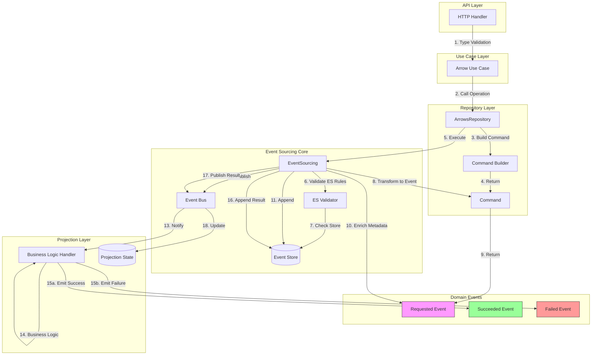

# Arrow Repository Workflow - Spec Driven Development

## Overview

This specification describes the workflow for the Arrow Repository using an Event Sourcing architecture with Command-Query Responsibility Segregation (CQRS) principles. The repository acts as the interface between the use case layer and the event sourcing system, transforming business operations into commands that produce events.

## Core Principles

### Separation of Concerns

The system is divided into three distinct layers:

1. **HTTP Handler Layer** - Validates request structure and data types (format, length, character patterns) **You should not implement any handlers. Just the repository**
2. **Repository/Command Layer** - Validates Event Sourcing rules (aggregate existence, state transitions)
3. **Projection Handler Layer** - Validates business logic (requirements, dependencies, resource availability)

### Asynchronous Command Execution

All commands execute asynchronously. The repository returns immediately after publishing the Requested event. Clients must poll for Succeeded or Failed events to determine the final outcome.

### Event Lifecycle Pattern

Every operation follows a three-phase event lifecycle:

1. **Requested** - User intent is recorded (emitted by repository)
2. **Succeeded** - Operation completed successfully (emitted by projection handler)
3. **Failed** - Operation failed with error details (emitted by projection handler)

## Architecture Flow

## Command Pattern

### Command Structure

Commands are lightweight data transfer objects that represent user intent. Each command contains:

- **Business Data** - The actual payload (namespace, path, variables, etc.)
- **Request Metadata** - Client context (IP address, user ID, request context)
- **Validation Method** - Custom Event Sourcing validation logic

Commands do NOT contain:
- Type validation logic (HTTP handler's responsibility)
- Business validation logic (projection handler's responsibility)
- Event Sourcing metadata (version, correlation ID, event ID, timestamp)
- Idempotency control (managed by events, not commands)

### Command Interface

Every command must implement three methods:

1. **GetAggregateID** - Returns the identifier for the aggregate this command targets
2. **Validate** - Performs Event Sourcing validation using the EventSourcing helper methods
3. **ToRequestedEvent** - Transforms the command into a Requested event with business data only

### Command Builder Pattern

Each command has a dedicated builder that provides a fluent API for construction. Builders only handle data population, not validation rules or idempotency flags. This keeps builders clean and prevents coupling between different command types.

**Important:** Idempotency is controlled by the events that commands create, not by the commands themselves. Each event type implements ShouldCheckIdempotency to control its deduplication behavior.

## Repository Operations

### AddArrow Operation

#### Purpose
Records the user's intent to add a new arrow to the system.

#### Input Parameters
- Namespace (string) - The unique identifier for the arrow
- Path (string) - URL or file path to the arrow definition
- Force (boolean) - Whether to bypass requirement checks
- Client IP (string) - IP address of the requesting client

#### Event Sourcing Validation
- Aggregate must NOT exist, OR
- Aggregate exists but does NOT have a Succeeded AddArrow event

#### Flow
1. Create AddArrowCommand using builder
2. Populate command with business data
3. Add request metadata (client IP, request context)
4. Execute command through EventSourcing system
5. EventSourcing automatically generates idempotency key from command content
6. Return immediately (async execution)

#### Automatic Deduplication
- ArrowAddArrowRequested event has idempotency enabled
- EventSourcing serializes event to JSON
- Generates UUIDv5 from JSON content
- Checks idempotency store (separate database) for duplicate
- If duplicate found, returns cached result immediately
- If new event, processes normally

#### Events Produced
- **arrow.AddArrow.Requested** - Records the add request
- **arrow.AddArrow.Succeeded** - (Later, by projection handler)
- **arrow.AddArrow.Failed** - (Later, by projection handler)

### RemoveArrow Operation

#### Purpose
Records the user's intent to remove an existing arrow from the system.

#### Input Parameters
- Namespace (string) - The unique identifier for the arrow to remove
- Force (boolean) - Whether to force removal even if dependencies exist
- Client IP (string) - IP address of the requesting client

#### Event Sourcing Validation
- Aggregate MUST exist

#### Flow
1. Create RemoveArrowCommand using builder
2. Populate command with business data
3. Add request metadata (client IP, request context)
4. Execute command through EventSourcing system
5. EventSourcing automatically generates idempotency key from command content
6. Return immediately (async execution)

#### Events Produced
- **arrow.RemoveArrow.Requested** - Records the remove request
- **arrow.RemoveArrow.Succeeded** - (Later, by projection handler)
- **arrow.RemoveArrow.Failed** - (Later, by projection handler)

### ExecuteMethod Operation

#### Purpose
Records the user's intent to execute a method on an existing arrow.

#### Input Parameters
- Namespace (string) - The unique identifier for the arrow
- Method (string) - The name of the method to execute
- Variables (map[string]string) - Key-value pairs for method variables
- Client IP (string) - IP address of the requesting client

#### Event Sourcing Validation
- Aggregate MUST exist
- Aggregate MUST have a Succeeded AddArrow event
- Current event stream state MUST NOT show an active execution

#### Custom Validation
This operation requires checking the event stream to determine current execution state. The validation method:
1. Retrieves the event stream for the aggregate
2. Analyzes the stream to determine current state
3. Rejects if any method is currently executing
4. Rejects if the arrow is in "exiting" state

#### Flow
1. Create ExecuteMethodCommand using builder
2. Populate command with business data (namespace, method, variables)
3. Add request metadata (client IP, request context)
4. Execute command through EventSourcing system
5. EventSourcing automatically generates idempotency key from command content
6. Return immediately (async execution)

#### Events Produced
- **arrow.ExecuteMethod.Requested** - Records the execution request
- **arrow.ExecuteMethod.Started** - (Later, by projection handler)
- **arrow.ExecuteMethod.ProgressUpdated** - (Multiple, by projection handler)
- **arrow.ExecuteMethod.Succeeded** - (Later, by projection handler)
- **arrow.ExecuteMethod.Failed** - (Later, by projection handler)

### StopMethod Operation

#### Purpose
Records the user's intent to stop a currently executing method.

#### Input Parameters
- Namespace (string) - The unique identifier for the arrow
- Method (string) - The name of the method to stop

#### Event Sourcing Validation
- Aggregate MUST exist
- Current event stream MUST show the specified method is executing

#### Status
Not yet implemented - placeholder for future development.

### GetArrow Operation

#### Purpose
Retrieves the current state of an arrow aggregate.

#### Input Parameters
- Namespace (string) - The unique identifier for the arrow

#### Event Sourcing Validation
- Aggregate MUST exist

#### Flow
1. Check aggregate existence in event store
2. Return aggregate identifier if exists
3. Return error if not found

#### Note
This is a query operation, not a command. It does NOT produce events. Future implementation will use projection state for efficient queries.

### ListArrows Operation

#### Purpose
Retrieves a list of all arrow aggregates in the system.

#### Input Parameters
None

#### Event Sourcing Validation
None - this is a read-only query

#### Flow
Returns an empty map for now. Future implementation will query projection state for efficient listing.

#### Note
This is a query operation, not a command. It does NOT produce events.

## Command-to-Event Transformation

### Transformation Point

The transformation from Command to Event happens inside the EventSourcing system's ExecuteCommand method. The sequence is:

1. Repository creates and configures a Command
2. Repository passes Command to EventSourcing
3. EventSourcing validates the Command's ES rules
4. EventSourcing calls Command's ToRequestedEvent method
5. Command creates a minimal Event with business data only
6. EventSourcing enriches the Event with infrastructure metadata
7. EventSourcing persists and publishes the enriched Event

### Metadata Separation

**Command provides:**
- Business payload data
- Request metadata (client IP, user context, request ID)

**Event provides:**
- Business payload data from command
- Idempotency flag (whether to check for duplicates)

**EventSourcing adds:**
- Event ID (UUID v4)
- Aggregate version (from event store)
- Correlation ID (UUID v4, for tracking related events)
- Parent ID (for event causality chains)
- Timestamp (when event was created)
- Event version (schema version)
- Idempotency key (UUIDv5 generated from event content, if event enables checking)

This separation ensures Commands remain focused on business intent, Events control their own deduplication behavior, and EventSourcing handles all infrastructure concerns.

## Event Definitions

### Requested Events

These events record user intent and are created immediately when a command is executed.

#### ArrowAddArrowRequested
Records that a user has requested to add a new arrow.

**Payload:**
- Namespace - The unique identifier for the arrow
- Path - URL or file path to the arrow definition
- ForceAdd - Whether to bypass requirement checks

**Metadata:**
- client_ip - IP address of the requesting client
- idempotency_key - UUIDv5 automatically generated from command content

#### ArrowRemoveArrowRequested
Records that a user has requested to remove an existing arrow.

**Payload:**
- Namespace - The unique identifier for the arrow
- Force - Whether to force removal

**Metadata:**
- client_ip - IP address of the requesting client
- idempotency_key - UUIDv5 automatically generated from command content

#### ArrowExecuteMethodRequested
Records that a user has requested to execute a method on an arrow.

**Payload:**
- Namespace - The unique identifier for the arrow
- Method - The name of the method to execute
- ExecutionID - UUID v4 generated for this execution
- Variables - Key-value pairs for method variables

**Metadata:**
- client_ip - IP address of the requesting client
- idempotency_key - UUIDv5 automatically generated from command content

### Succeeded Events

These events record successful completion of operations and are created by projection handlers after business logic validation.

#### ArrowAddArrowSucceeded
Records that an arrow was successfully added to the system.

**Payload:**
- Namespace - The unique identifier for the arrow
- Arrow - Full arrow domain object with all metadata

**Metadata:**
- client_ip - Original client IP
- idempotency_key - Original idempotency key (inherited from Requested event)
- duration_ms - Time taken to complete the operation

#### ArrowRemoveArrowSucceeded
Records that an arrow was successfully removed from the system.

**Payload:**
- Namespace - The unique identifier for the arrow

**Metadata:**
- client_ip - Original client IP
- idempotency_key - Original idempotency key (inherited from Requested event)
- duration_ms - Time taken to complete the operation

#### ArrowExecuteMethodSucceeded
Records that a method execution completed successfully.

**Payload:**
- Namespace - The unique identifier for the arrow
- Method - The name of the method that executed
- ExecutionID - UUID v4 for this execution
- Result - Execution result data (exit code, etc.)

**Metadata:**
- client_ip - Original client IP
- idempotency_key - Original idempotency key (inherited from Requested event)
- duration_ms - Time taken to complete the operation

### Failed Events

These events record failed operations and are created by projection handlers when business logic validation or execution fails.

#### ArrowAddArrowFailed
Records that an arrow addition failed.

**Payload:**
- Namespace - The unique identifier for the arrow
- Error - Error details (code, message)

**Metadata:**
- client_ip - Original client IP
- idempotency_key - Original idempotency key (inherited from Requested event)
- duration_ms - Time taken before failure
- retryable - Whether the operation can be retried

#### ArrowRemoveArrowFailed
Records that an arrow removal failed.

**Payload:**
- Namespace - The unique identifier for the arrow
- Error - Error details (code, message)

**Metadata:**
- client_ip - Original client IP
- idempotency_key - Original idempotency key (inherited from Requested event)
- duration_ms - Time taken before failure
- retryable - Whether the operation can be retried

#### ArrowExecuteMethodFailed
Records that a method execution failed.

**Payload:**
- Namespace - The unique identifier for the arrow
- Method - The name of the method that failed
- ExecutionID - UUID v4 for this execution
- CurrentStep - Which step failed (for progress tracking)
- TotalSteps - Total steps in the execution
- Error - Error details (code, message)

**Metadata:**
- client_ip - Original client IP
- idempotency_key - Original idempotency key (inherited from Requested event)
- duration_ms - Time taken before failure
- retryable - Whether the operation can be retried

## Event Organization

Events should be organized by operation lifecycle, not by event type. Each operation's complete event lifecycle (Requested, Succeeded, Failed) should be defined together in a single file.

**File Structure:**
- add_arrow.go - All AddArrow events (Requested, Succeeded, Failed)
- remove_arrow.go - All RemoveArrow events (Requested, Succeeded, Failed)
- execute_method.go - All ExecuteMethod events (Requested, Started, ProgressUpdated, Succeeded, Failed)

This organization makes it easy to understand the complete lifecycle of each operation.

## Validation Responsibility Matrix

| Validation Type | Layer | Examples |
|----------------|-------|----------|
| **Format/Structure** | HTTP Handler | UUID format, string length, regex patterns, JSON structure |
| **Event Sourcing Rules** | Command | Aggregate existence, event history, state transitions |
| **Business Logic** | Projection Handler | Requirements check, dependency resolution, resource availability |

## Error Handling

### Repository Level
The repository returns errors immediately for:
- Command validation failures (ES rules not met)
- Event creation failures (ToRequestedEvent errors)
- Event store append failures (database errors)
- Event bus publish failures (messaging errors)

### Projection Handler Level
The projection handler emits Failed events for:
- Business validation failures (requirements not met)
- Execution failures (process crashed)
- Resource failures (out of memory)
- External service failures (download failed)

### Client Responsibility
Clients must:
1. Check for immediate errors from repository
2. Poll for Succeeded or Failed events using correlation ID
3. Handle timeout scenarios (no response within reasonable time)
4. Implement retry logic for retryable failures

## Idempotency

Operations support automatic idempotency through per-event content-based deduplication:

1. Repository creates command with business data
2. Command creates event with business payload
3. Event specifies whether it needs idempotency checking (ShouldCheckIdempotency)
4. If enabled, EventSourcing serializes event to canonical JSON
5. EventSourcing generates UUIDv5 from JSON content
6. EventSourcing checks idempotency store (same storage as events) for duplicate
7. If duplicate found, returns cached result immediately (no processing)
8. If new event, processes normally and stores idempotency record
9. Idempotency records expire after twenty-four hours

### Key Features

**Per-Event Control:**
- Each event type decides if it needs idempotency
- Critical operations (AddArrow, RemoveArrow, ExecuteMethod) enable checking
- Non-critical operations can skip checking for performance
- Flexibility based on semantic meaning

**Automatic Detection:**
- No client coordination required
- No idempotency headers needed
- Events with identical content are automatically deduplicated

**Deterministic:**
- Same event content always produces same UUIDv5
- Reproducible across different systems
- Based on actual event payload, not timestamps or infrastructure metadata

**Content-Based:**
- Duplicate detection based on business data (namespace, path, variables, etc.)
- Client IP and other metadata excluded from key generation
- Only the actual business intent is considered

**Separate Storage:**
- Uses separate but matching storage type (SQLite, memory, etc.)
- EventStore: `db/{name}.db` - stores events
- IdempotencyStore: `db/{name}_idempotency.db` - stores deduplication records
- Independent databases for clean separation of concerns
- Consistent storage characteristics

This prevents duplicate operations automatically if clients retry requests that produce identical events.

## Future Enhancements

### Projection-Based Queries
Current GetArrow and ListArrows operations query the event store directly. Future implementation will use materialized projections for efficient queries.

### Command Replay
The command pattern enables command replay for:
- Debugging (replay failed commands)
- Testing (replay production commands in staging)
- Auditing (review what users attempted)

### Event Versioning
Event schema versions will enable:
- Schema evolution without breaking changes
- Event upcasting (transform old events to new schema)
- Multiple schema versions in same store

### Saga Pattern
Complex multi-step operations will use sagas:
- Coordinate multiple aggregates
- Handle distributed transactions
- Implement compensating actions for failures

## Summary

The Arrow Repository workflow implements a clean Event Sourcing architecture with:
- Async command execution
- Clear separation of validation concerns
- Three-phase event lifecycle (Requested, Succeeded, Failed)
- Per-event idempotency control (each event decides if it needs deduplication)
- Automatic content-based deduplication (no client coordination needed)
- Separate idempotency store with matching storage type
- Flexible command validation
- Clean command-to-event transformation
- Deterministic duplicate detection using UUIDv5
- Two databases: events and idempotency records

This architecture enables scalability, auditability, and maintainability while keeping each layer focused on its specific responsibilities. The per-event idempotency system ensures that critical events are deduplicated transparently while allowing non-critical events to skip checking for performance, all without requiring clients to manage idempotency keys. Separate databases provide clean separation of concerns.
