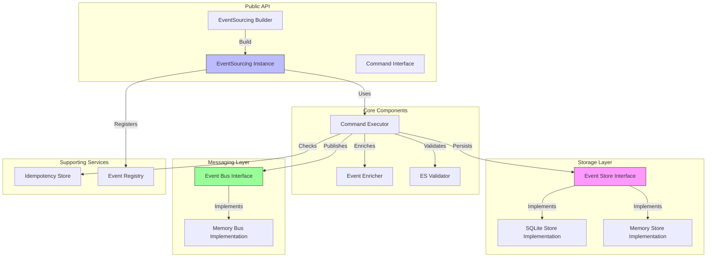
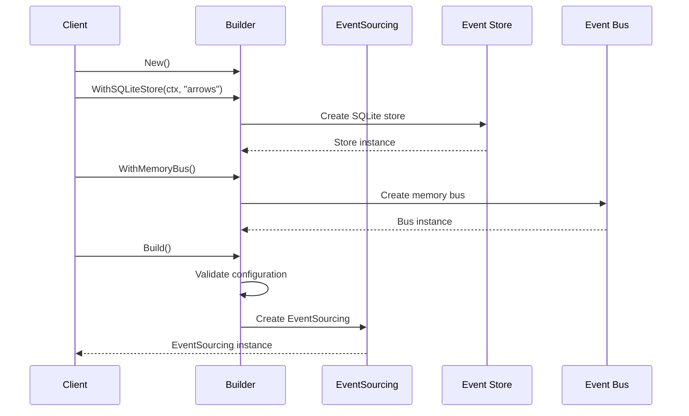
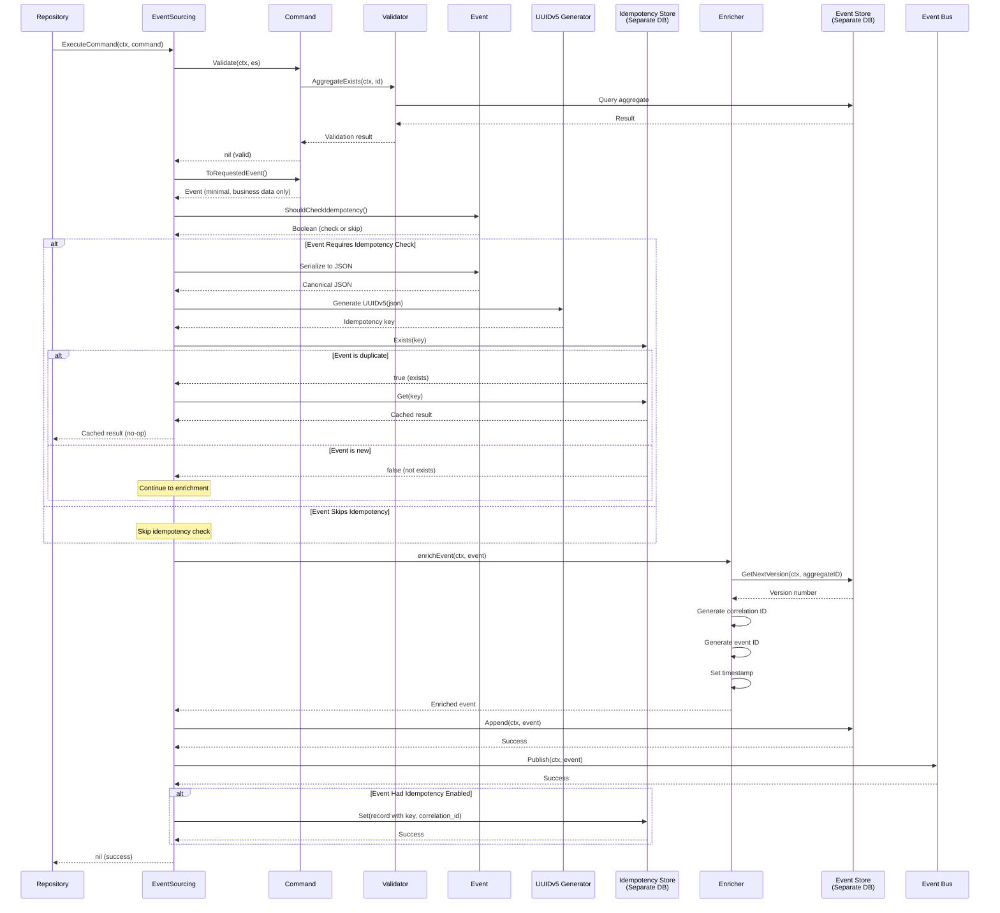
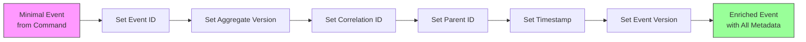
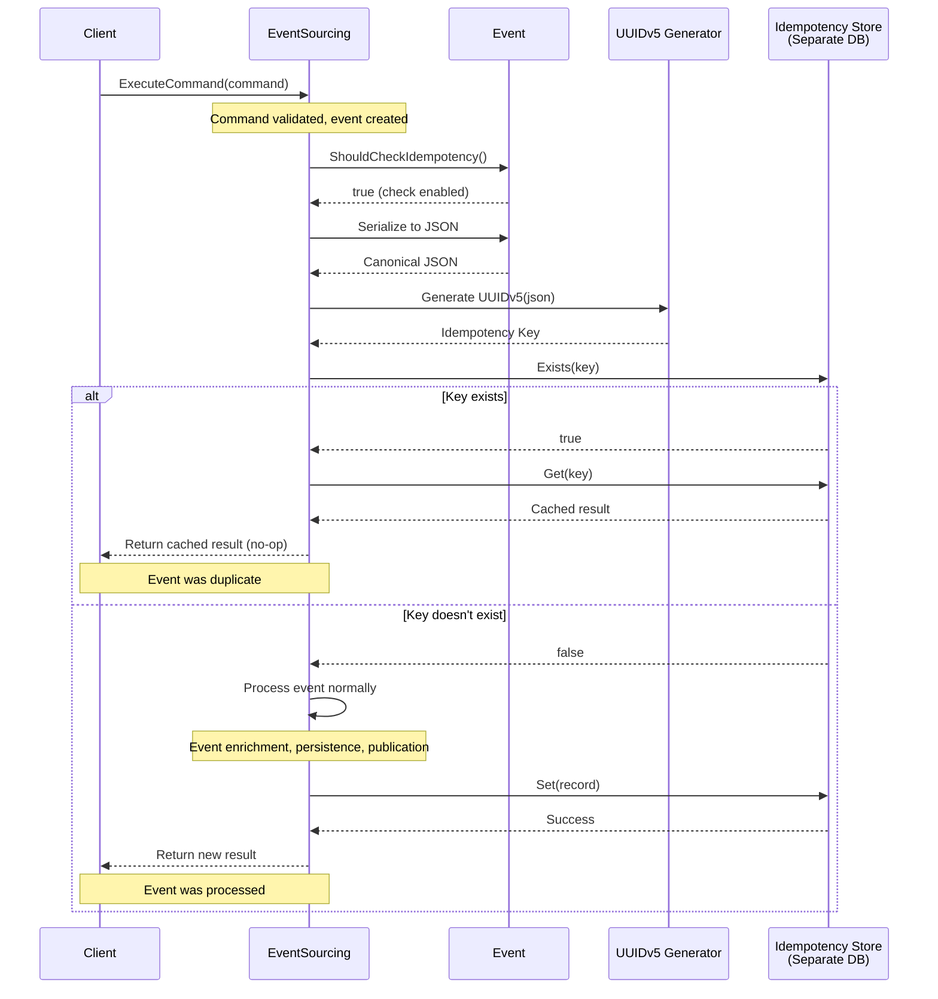

# EventSourcing System - Spec Driven Development

## Overview

This specification describes the design and implementation requirements for the EventSourcing system. The system provides the core infrastructure for event-driven architecture using Event Sourcing and CQRS patterns. It manages event persistence, publication, idempotency, and command execution.

## Core Responsibilities

The EventSourcing system is responsible for:

1. **Command Execution** - Processing commands and transforming them into events
2. **Event Storage** - Persisting events in an append-only event store
3. **Event Publication** - Publishing events to subscribers via an event bus
4. **Metadata Enrichment** - Adding infrastructure metadata to events automatically
5. **Idempotency** - Preventing duplicate event processing
6. **Aggregate Management** - Tracking aggregate versions and existence
7. **Event Stream Retrieval** - Reconstructing event streams for aggregates

## Architecture Overview



## Builder Pattern

### Purpose
The EventSourcing system uses a fluent builder pattern for initialization. This provides:
- Clear, readable configuration
- Compile-time safety for required components
- Flexibility for optional components
- Testability with different configurations

### Builder Flow



### Builder Methods

#### New
Creates a new builder instance with default configuration. Returns a builder ready for configuration.

#### WithSQLiteStore
Configures the event store to use SQLite persistence via the existing database module.

**Parameters:**
- Context - For cancellation and timeout
- Database name - Name of the database file (e.g., "arrows")

**Behavior:**
- Uses `internal/core/database` module for storage
- Creates EventStore: `database.NewDatabase[Event](ctx, "{database_name}")`
  - File location: `db/{database_name}.db`
  - Auto-creates `events` table with GORM schema
- Creates IdempotencyStore: `database.NewDatabase[IdempotencyRecord](ctx, "{database_name}_idempotency")`
  - File location: `db/{database_name}_idempotency.db`
  - Auto-creates `idempotency_records` table with GORM schema
- Leverages existing connection pooling from database module
- Leverages existing GORM auto-migration
- Returns builder for chaining

**Database Module Integration:**
- Both stores use the same `internal/core/database` infrastructure
- Consistent database configuration (path, pragmas, etc.)
- Reuses existing repository pattern
- Two separate SQLite files for separation of concerns

#### WithMemoryBus
Configures the event bus to use in-memory pub/sub.

**Behavior:**
- Creates in-memory event bus
- Supports multiple subscribers per event type
- Synchronous event delivery
- Returns builder for chaining


#### Build
Finalizes configuration and creates the EventSourcing instance.

**Behavior:**
- Validates that required components are configured
- Creates EventSourcing instance
- Initializes internal registry
- Returns EventSourcing instance or error

**Validation:**
- Event store must be configured (required)
- Event bus must be configured (required)

### Usage Example Flow

The system is initialized as follows:

1. Client calls New to create builder
2. Client configures store with `WithSQLiteStore(ctx, "arrows")`
3. Client configures bus with `WithMemoryBus()`
4. Client calls Build to get EventSourcing instance
5. Builder validates configuration
6. Builder initializes EventStore using `database.NewDatabase[Event](ctx, "arrows")`
   - Creates `db/arrows.db` with `events` table
7. Builder initializes IdempotencyStore using `database.NewDatabase[IdempotencyRecord](ctx, "arrows_idempotency")`
   - Creates `db/arrows_idempotency.db` with `idempotency_records` table
8. Builder creates and returns EventSourcing instance

**Database Module Integration:**
- Both stores leverage `internal/core/database` module
- Consistent database configuration and behavior
- Two separate SQLite files for clear separation of concerns
- Reuses existing GORM infrastructure

## Command Interface

### Purpose
Commands represent user intent and must be transformed into events. The command interface defines the contract that all commands must implement.

### Interface Methods

#### GetAggregateID
Returns the unique identifier for the aggregate this command targets.

**Returns:** String identifier (namespace, ID, etc.)

**Purpose:** Identifies which aggregate stream to append events to

#### Validate
Performs Event Sourcing validation using helper methods from the EventSourcing instance.

**Parameters:**
- Context - For cancellation and timeout
- EventSourcing instance - Provides helper methods for validation

**Returns:** Error if validation fails, nil if valid

**Validation Types:**
- Aggregate existence checks
- Event history checks (has specific event type occurred)
- State checks (current aggregate state)
- Custom business rules specific to the command

**Note:** This does NOT validate types or formats (HTTP handler's job) or business logic (projection handler's job)

#### ToRequestedEvent
Transforms the command into a Requested event containing only business data.

**Returns:** Event instance with business payload

**Behavior:**
- Creates event with command's business data
- Includes request metadata (client IP, user context, etc.)
- Does NOT set version, correlation ID, event ID, or timestamp
- Returns minimal event for EventSourcing to enrich
- The returned event will have its own idempotency flag

## Event Interface

### Purpose
Events represent facts that have occurred in the system. The event interface defines the contract that all events must implement.

### Interface Methods

#### GetEventID
Returns the unique identifier for this specific event instance.

**Returns:** UUID v4 string

#### GetAggregateID
Returns the identifier of the aggregate this event belongs to.

**Returns:** String identifier

#### GetAggregateType
Returns the type of aggregate this event belongs to.

**Returns:** String type (arrow, quiver, etc.)

#### GetEventType
Returns the type of event.

**Returns:** String type (arrow.AddArrow.Requested, etc.)

#### GetAggregateVersion
Returns the version of the aggregate after this event is applied.

**Returns:** Integer version number

#### GetCorrelationID
Returns the correlation ID that groups related events together.

**Returns:** UUID v4 string

#### GetParentID
Returns the ID of the event that caused this event (for causality chains).

**Returns:** Pointer to UUID v4 string (nil for root events)

#### GetTimestamp
Returns the time when this event occurred.

**Returns:** Time struct

#### GetMetadata
Returns additional metadata about the event.

**Returns:** Map of string keys to any value

#### SetAggregateVersion
Sets the version of the aggregate (called by EventSourcing during enrichment).

**Parameters:** Integer version number

#### SetCorrelationID
Sets the correlation ID (called by EventSourcing during enrichment).

**Parameters:** UUID v4 string

#### SetEventID
Sets the event ID (called by EventSourcing during enrichment).

**Parameters:** UUID v4 string

#### SetTimestamp
Sets the timestamp (called by EventSourcing during enrichment).

**Parameters:** Time struct

#### ShouldCheckIdempotency
Returns whether this specific event should perform idempotency checking.

**Returns:** Boolean (true to check, false to skip)

**Purpose:** Allows each event type to control its own idempotency behavior

**Use Cases:**
- Return false for naturally idempotent operations (queries, status checks)
- Return false for operations that should execute multiple times
- Return true for critical operations that must not be duplicated (AddArrow, RemoveArrow, ExecuteMethod)
- Each event type decides based on its semantic meaning

**Default Recommendation:** Return true for all state-changing events (Requested events)

## Command Execution Flow



### Execution Steps

#### Step 1: Command Validation
The command validates its own Event Sourcing rules:
- Calls helper methods on EventSourcing instance
- Checks aggregate existence if required
- Checks event history if required
- Checks current state if required
- Returns error if validation fails

#### Step 2: Event Creation
The command transforms itself into a Requested event:
- Creates event with business payload data
- Includes request metadata
- Returns minimal event without ES metadata
- Event will have its own idempotency flag

#### Step 3: Event Idempotency Flag Check
EventSourcing checks if this specific event requires idempotency checking:
- Calls event's ShouldCheckIdempotency method
- Returns boolean indicating whether to perform duplicate detection
- If false, skips all idempotency-related steps
- If true, proceeds with serialization and key generation
- Each event type decides based on its semantic meaning

#### Step 4: Event Serialization and Key Generation (Conditional)
If the event requires idempotency checking:
- Serializes event to canonical JSON (sorted keys, no whitespace)
- Generates UUIDv5 from JSON string using event namespace
- Creates deterministic, reproducible identifier
- Same event content always produces same key

#### Step 5: Idempotency Check (Conditional)
If idempotency is enabled for this event:
- Queries idempotency store (uses same storage backend as events)
- Looks up generated UUIDv5 in idempotency table
- If found and not expired, returns cached result immediately (event not persisted)
- If not found, continues to event enrichment
- Prevents duplicate event processing automatically

#### Step 7: Event Enrichment
EventSourcing enriches the event with infrastructure metadata:
- Queries event store for next aggregate version
- Generates correlation ID if not present
- Generates event ID (UUID v4)
- Sets timestamp to current time
- Sets event version (schema version)

#### Step 8: Event Persistence
Appends the enriched event to the event store:
- Writes to storage (SQLite, memory, etc.)
- Uses atomic operations
- Maintains append-only guarantee
- Returns error if persistence fails

#### Step 9: Event Publication
Publishes the event to the event bus:
- Notifies all subscribers for this event type
- Delivers events synchronously (memory bus)
- Returns error if publication fails

#### Step 10: Idempotency Recording (Conditional)
If the event had idempotency enabled, stores the idempotency record:
- Creates record with UUIDv5 key, correlation ID, and response
- Stores event type and payload for verification
- Uses same storage backend as events (SQLite, memory, etc.)
- Sets expiration time (24 hours from now)
- Enables future duplicate detection
- Skipped if event has idempotency disabled

#### Step 11: Return Result
Returns nil for success or error if any step failed.

## Event Store Interface

### Purpose
The Event Store is the persistence layer for events. It provides an append-only log of all events in the system.

### Required Methods

#### Append
Appends a new event to the store.

**Parameters:**
- Context - For cancellation and timeout
- Event - The event to append

**Returns:** Error if append fails

**Behavior:**
- Writes event to storage atomically
- Maintains append-only guarantee (no updates or deletes)
- Increments aggregate version automatically
- Returns error if write fails or version conflict occurs

#### GetByAggregate
Retrieves all events for a specific aggregate.

**Parameters:**
- Context - For cancellation and timeout
- Aggregate ID - The aggregate to retrieve events for

**Returns:** Slice of events, ordered by version

**Behavior:**
- Queries storage for all events with matching aggregate ID
- Orders events by aggregate version ascending
- Returns empty slice if aggregate not found
- Returns error if query fails

#### GetNextVersion
Gets the next version number for an aggregate.

**Parameters:**
- Context - For cancellation and timeout
- Aggregate ID - The aggregate to get version for

**Returns:** Next version number (integer)

**Behavior:**
- Queries storage for highest version of aggregate
- Returns highest version plus one
- Returns one if aggregate doesn't exist
- Returns error if query fails

#### AggregateExists
Checks if an aggregate has any events in the store.

**Parameters:**
- Context - For cancellation and timeout
- Aggregate ID - The aggregate to check

**Returns:** Boolean (true if exists), error if query fails

**Behavior:**
- Queries storage for any events with aggregate ID
- Returns true if at least one event found
- Returns false if no events found
- Returns error if query fails

### SQLite Store Implementation

The EventSourcing system uses the existing `internal/core/database` module for all storage needs.

#### Database Module Integration

**Location:** `internal/core/database/`

**Usage:**
- EventStore: `database.NewDatabase[Event](ctx, "arrows")`
- IdempotencyStore: `database.NewDatabase[IdempotencyRecord](ctx, "arrows_idempotency")`

**Features Provided by Database Module:**
- GORM-based SQLite driver
- Automatic schema migration (AutoMigrate)
- Connection pooling
- Database file management in `db/` directory
- Consistent configuration (from `internal/core/config`)

#### Schema Design

The EventStore uses an events table with the following structure:

**events table:**
- event_id - UUID v4 (primary key)
- aggregate_id - String identifier (indexed)
- aggregate_type - String type (indexed)
- aggregate_version - Integer (indexed with aggregate_id)
- event_type - String type (indexed)
- correlation_id - UUID v4 (indexed)
- parent_id - UUID v4 nullable (indexed)
- timestamp - ISO8601 datetime (indexed)
- payload - JSON blob (the event-specific data)
- metadata - JSON blob (request metadata)
- event_version - String (schema version)

**Indexes:**
- Primary key on event_id
- Composite index on (aggregate_id, aggregate_version) for versioning
- Index on aggregate_id for retrievals
- Index on correlation_id for correlation queries
- Index on event_type for projection queries
- Index on timestamp for time-based queries

#### Database File Location

Database files are managed by the `internal/core/database` module:
- Base path: Configured in `internal/core/config` (default: `db/`)
- EventStore: `db/{name}.db` (e.g., `db/arrows.db`)
- IdempotencyStore: `db/{name}_idempotency.db` (e.g., `db/arrows_idempotency.db`)

#### Connection Management

Connection management is handled by the `internal/core/database` module:
- GORM with SQLite driver
- Connection pooling for concurrent access
- Silent logging mode (configurable via GORM)
- Automatic directory creation
- Proper connection cleanup via `Close()` method

#### Atomic Operations

All write operations must be atomic:
- Use GORM transactions for event appends
- Check version conflicts before committing
- Rollback on any error
- Maintain data integrity
- Leverage GORM's transaction support

## Event Bus Interface

### Purpose
The Event Bus provides publish-subscribe messaging for events. It enables decoupled event handling through projections and handlers.

### Required Methods

#### Publish
Publishes an event to all subscribers.

**Parameters:**
- Context - For cancellation and timeout
- Event - The event to publish

**Returns:** Error if publication fails

**Behavior:**
- Notifies all subscribers registered for this event type
- Delivers events in order
- Returns error if any subscriber fails (memory bus)

#### Subscribe
Registers a handler for a specific event type.

**Parameters:**
- Event type - String identifier for event type
- Handler - Function to call when event occurs

**Returns:** Error if subscription fails

**Behavior:**
- Adds handler to subscriber list for event type
- Supports multiple handlers per event type
- Handlers called in registration order

### Memory Bus Implementation

The memory bus provides in-process pub/sub:

**Storage Structure:**
- Map of event type to slice of handler functions
- Handlers stored in registration order

**Delivery Semantics:**
- Synchronous delivery (blocks until all handlers complete)
- In-order delivery within event type
- No retry on failure
- Error if any handler fails

**Thread Safety:**
- Use mutex for concurrent access
- Lock when adding subscribers
- Lock when publishing events

**Use Cases:**
- Single-process applications
- Testing
- Development

## Event Enrichment

### Purpose
Event enrichment adds infrastructure metadata to events automatically. This ensures all events have consistent metadata without requiring commands to manage it.

### Enrichment Process



### Metadata Fields

#### Event ID
- Auto-generated UUID v4
- Uniquely identifies this event instance
- Set if not already present

#### Aggregate Version
- Queried from event store (next version for aggregate)
- Increments with each new event
- Ensures event ordering and optimistic locking

#### Correlation ID
- Auto-generated UUID v4 if not present
- Groups related events together
- Inherited from parent event if specified
- Enables event correlation tracking

#### Parent ID
- References the event that caused this event
- Nil for root events (user-initiated)
- Set by projection handlers when emitting result events
- Enables causality chain tracking

#### Timestamp
- Current server time (UTC)
- ISO8601 format
- Records when event occurred
- Used for time-based queries and TTL

#### Event Version
- Schema version for the event payload
- Enables schema evolution
- Set to current event schema version
- Defaults to "1.0" if not specified

### Enrichment Rules

1. **Never Overwrite Existing Values** - If a field is already set, don't change it
2. **Generate Required Fields** - Event ID and timestamp must always be generated
3. **Query Version** - Aggregate version must be queried from store
4. **Inherit Correlation** - Use existing correlation ID or generate new one
5. **Preserve Parent** - Keep parent ID if set (for causality)

## Validation Helpers

### Purpose
The EventSourcing instance provides helper methods for commands to use during validation. These helpers abstract common Event Sourcing validation patterns.

### Helper Methods

#### AggregateExists
Checks if an aggregate has any events in the event store.

**Parameters:**
- Context - For cancellation and timeout
- Aggregate ID - The aggregate to check

**Returns:** Boolean (exists), error

**Usage:** Commands use this to validate that an aggregate exists before operating on it

#### HasSucceededEvent
Checks if a specific Succeeded event exists in an aggregate's history.

**Parameters:**
- Context - For cancellation and timeout
- Aggregate ID - The aggregate to check
- Event type prefix - The event type to look for (e.g., "arrow.AddArrow")

**Returns:** Boolean (has succeeded), error

**Behavior:**
- Retrieves event stream for aggregate
- Checks for events matching "{prefix}.Succeeded"
- Returns true if at least one found
- Returns false if none found

**Usage:** Commands use this to validate that a prerequisite operation has completed successfully

#### GetEvents
Retrieves the complete event stream for an aggregate.

**Parameters:**
- Context - For cancellation and timeout
- Aggregate ID - The aggregate to retrieve

**Returns:** Event stream object, error

**Usage:** Commands use this for complex validation that requires analyzing the event stream (e.g., checking current execution state)

### Event Stream Object

The event stream provides helper methods for analyzing event history:

#### HasSucceededEvent
Checks if stream contains a Succeeded event with given prefix.

**Parameters:** Event type prefix string

**Returns:** Boolean

#### GetCurrentState
Reconstructs current aggregate state from events.

**Returns:** State object with current status

**Behavior:**
- Applies all events in order
- Builds up current state
- Returns state snapshot

#### IsExecuting
Checks if a method is currently executing.

**Returns:** Boolean

**Behavior:**
- Looks for ExecuteMethod.Started without matching Succeeded/Failed
- Returns true if unfinished execution found

#### GetLastExecutionFor
Gets the last execution attempt for a specific method.

**Parameters:** Method name string

**Returns:** Execution object or nil

**Behavior:**
- Finds most recent ExecuteMethod.Requested for method
- Returns execution details

## Idempotency Store

### Purpose
The idempotency store prevents duplicate processing of events by automatically detecting identical event payloads. Each event decides whether it needs idempotency checking, and the store uses its own separate storage instance.

### Per-Event Idempotency Control

Each event type controls its own idempotency behavior:

1. **Event Created** - Command transforms into a Requested event
2. **Idempotency Check** - Event's ShouldCheckIdempotency method is called
3. **Conditional Processing** - If true, perform idempotency check; if false, skip
4. **Separate Storage** - Uses its own dedicated storage instance (separate from event store)

### Automatic Idempotency Key Generation

For events that enable idempotency checking, keys are generated automatically from event content:

1. **Event Content** - EventSourcing receives event from command
2. **JSON Serialization** - Event is serialized to canonical JSON format
3. **UUIDv5 Generation** - JSON string is used to generate deterministic UUIDv5
4. **Duplicate Check** - Generated UUID is checked against idempotency store (separate database)
5. **Deduplication** - If UUID exists, return cached result; otherwise process event

This approach ensures:
- Events with identical content produce identical keys
- No client coordination required
- Automatic duplicate detection
- Deterministic and reproducible
- Each event type controls its own behavior
- Separate storage for clean separation of concerns

### Idempotency Record Structure

Each record contains:
- **ID** - UUIDv5 generated from event JSON (primary key)
- **EventType** - Type of event that was executed
- **EventPayload** - Original event JSON for verification
- **CorrelationID** - Links to the event in the event stream
- **Response** - Serialized response data
- **CreatedAt** - When record was created
- **ExpiresAt** - When record should be deleted (24 hours after creation)

### UUIDv5 Generation Details

The UUIDv5 is generated as follows:
- **Namespace** - Use UUID namespace for events (application-specific constant)
- **Name** - Canonical JSON representation of the event
- **Algorithm** - SHA-1 hash as per UUIDv5 specification
- **Output** - Deterministic UUID that is always the same for identical events

**Canonical JSON Requirements:**
- Sorted keys alphabetically
- No whitespace
- Consistent number formatting
- UTF-8 encoding
- Only include business data (exclude infrastructure metadata like timestamps, event IDs)

### Store Interface Methods

The idempotency store uses a separate but matching storage backend type (SQLite, Memory, etc.).

#### Exists
Checks if an event with this content has been processed before.

**Parameters:**
- Context - For cancellation and timeout
- Key - The UUIDv5 generated from event JSON

**Returns:** Boolean (exists), error

**Behavior:**
- Queries idempotency store (separate storage instance)
- Looks in idempotency_records table/structure
- Returns true if found and not expired
- Returns false if not found or expired

#### Get
Retrieves the cached result for an event.

**Parameters:**
- Context - For cancellation and timeout
- Key - The UUIDv5 generated from event JSON

**Returns:** Idempotency record, error

**Behavior:**
- Queries idempotency store (separate storage instance)
- Returns full record if found
- Returns error if not found

#### Set
Stores a new idempotency record after successful event execution.

**Parameters:**
- Context - For cancellation and timeout
- Record - The record to store

**Returns:** Error if storage fails

**Behavior:**
- Inserts new record into idempotency store
- Sets expiration time to 24 hours from now
- Returns error if insert fails

### Idempotency Flow



### Expiration Policy

Idempotency records expire after twenty-four hours:
- Prevents unbounded storage growth
- Balances retry window with storage costs
- After expiration, identical commands will be processed again
- Expired records are cleaned up automatically via database queries

### Storage Implementation

The idempotency store uses the `internal/core/database` module, same as EventStore:

**Database Module Integration:**
- Uses `database.NewDatabase[IdempotencyRecord](ctx, "{name}_idempotency")`
- Leverages existing GORM infrastructure
- Automatic schema migration via GORM AutoMigrate
- Consistent with EventStore implementation

**Implementation Details:**
- EventStore: `database.NewDatabase[Event](ctx, "arrows")`
  - File: `db/arrows.db`
  - Table: `events`
- IdempotencyStore: `database.NewDatabase[IdempotencyRecord](ctx, "arrows_idempotency")`
  - File: `db/arrows_idempotency.db`
  - Table: `idempotency_records`
- Two separate SQLite database files
- Independent connection pools (managed by database module)
- Auto-migration for schema updates (GORM AutoMigrate)
- Clean separation of concerns

**Schema (GORM Model):**
```
IdempotencyRecord struct:
- ID (UUID, primary key, gorm tag) - The UUIDv5 from event
- EventType (string) - Type identifier for the event
- EventPayload (text) - Original JSON for verification
- CorrelationID (UUID) - Links to event in event stream
- Response (text) - Serialized response
- CreatedAt (time.Time, gorm tag) - Record creation time
- ExpiresAt (time.Time, gorm tag, indexed) - Expiration time for cleanup
```

**Indexes:**
- Primary key on ID (GORM default)
- Index on ExpiresAt for efficient cleanup queries (GORM index tag)
- Index on CreatedAt for time-based queries (GORM index tag)

### Cleanup Process

Expired records should be cleaned up periodically in the idempotency store:

**Cleanup Strategy:**
- Run periodic cleanup job (e.g., every hour)
- Use GORM to query idempotency_records where expires_at is less than current time
- Delete matched records in batches
- Operates on separate idempotency database via database module
- Log cleanup statistics

**Query Pattern (using GORM):**
- Access IdempotencyStore repository
- Query: `Where("expires_at < ?", time.Now())`
- Delete in batches to avoid long locks
- Use GORM's batch delete functionality
- Iterate until no more expired records

## Event Registry

### Purpose
The event registry maintains a mapping of event types to their concrete implementations. This enables deserialization of events from storage.

### Registration

Events must be registered before the system can deserialize them:
- Call RegisterEvent with an instance of each event type
- Registry stores type information
- Used during event store retrieval to deserialize JSON

### Usage Pattern

Registration should happen during system initialization:
1. Create EventSourcing instance
2. Register all known event types
3. Begin processing commands

## Error Handling

### Error Categories

#### Validation Errors
Returned when command validation fails:
- Aggregate doesn't exist when required
- Aggregate exists when shouldn't
- Required event not found in history
- Invalid state for operation

**Handling:** Return error immediately to caller

#### Storage Errors
Returned when event store operations fail:
- Database connection failed
- Write failed
- Version conflict (optimistic locking)
- Query failed

**Handling:** Return error immediately, may be retryable

#### Bus Errors
Returned when event publication fails:
- Handler execution failed
- Handler not found
- Bus unavailable

**Handling:** Event is persisted but not published, requires manual intervention

#### Idempotency Errors
Returned when idempotency operations fail:
- Store unavailable
- Record corrupted

**Handling:** Log error but continue (idempotency is best-effort)

### Error Response Format

All errors should include:
- Error code (for programmatic handling)
- Error message (human-readable)
- Context (what operation failed)
- Cause (underlying error if any)

## Concurrency and Thread Safety

### Thread-Safe Components

All public methods must be thread-safe:
- ExecuteCommand can be called concurrently
- Subscribe can be called while events are publishing
- Multiple goroutines can query event store simultaneously

### Locking Strategy

Use fine-grained locking:
- Event store uses database transactions for atomicity
- Event bus uses mutex only during subscribe/publish
- Idempotency store uses database transactions
- No global locks across components

### Version Conflicts

Handle optimistic locking conflicts:
- Event store checks aggregate version before append
- Returns error if version mismatch detected
- Caller should retry with updated version
- Maximum retry count to prevent infinite loops

## Performance Considerations

### Event Store Performance

Optimize for append operations:
- Writes are more frequent than reads
- Use prepared statements
- Batch writes when possible
- Index on aggregate_id for fast retrieval

### Event Bus Performance

Memory bus is synchronous:
- Handlers block publication
- Keep handlers fast
- Use separate goroutines for slow operations
- Consider async bus for production

### Memory Management

Prevent memory leaks:
- Close database connections properly
- Limit event stream size in memory
- Clean up expired idempotency records
- Implement event stream pagination

## Testing Support

### Test Helpers

The system should provide test helpers:
- Test database instances (separate test databases)
- Memory bus for isolated tests
- Event builder helpers
- Test cleanup utilities

### Test Scenarios

Support testing of:
- Command validation (exists/not exists)
- Event enrichment (metadata added correctly)
- Idempotency (duplicate detection)
- Version conflicts (optimistic locking)
- Error handling (all error paths)
- Database integration (using test databases)

## Future Enhancements

### Snapshotting
Optimize aggregate reconstruction with periodic snapshots:
- Store aggregate state at version N
- Replay only events after snapshot
- Reduces memory and CPU for long-lived aggregates

### Event Upcasting
Support schema evolution:
- Transform old event schemas to new schemas
- Enable backward compatibility
- Maintain single current schema in memory

### Distributed Event Bus
Replace memory bus with distributed bus:
- Kafka, RabbitMQ, or NATS
- Async event delivery
- At-least-once delivery
- Event replay support

### Event Projections
Build read models from events:
- Subscribe to event types
- Build materialized views
- Enable efficient queries
- Eventual consistency

### Command Scheduling
Support delayed command execution:
- Schedule commands for future execution
- Support cron-like schedules
- Enable recurring commands

## Summary

The EventSourcing system provides:
- Builder pattern for initialization with SQLite storage
- Integration with existing `internal/core/database` module
- Command execution with validation and enrichment
- Event persistence in append-only store
- Event publication via memory-based event bus
- Per-event idempotency control using UUIDv5 from event content
- Separate idempotency store using database module
- Helper methods for command validation
- Thread-safe concurrent operation
- Support for testing and development

The system separates concerns cleanly:
- Commands express intent
- Events record facts
- Event Store provides event persistence (via database module)
- Idempotency Store provides duplicate detection (via database module)
- Memory Bus enables reactions
- Enrichment handles infrastructure metadata
- Each event controls its own idempotency behavior

Key Features:
- **Database Module Integration** - Leverages existing `internal/core/database` infrastructure
- **Per-Event Control** - Each event decides if it needs idempotency checking
- **Automatic Deduplication** - Events are automatically deduplicated based on content
- **Deterministic Keys** - UUIDv5 generation ensures same event produces same key
- **No Client Coordination** - Clients don't need to manage idempotency keys
- **Content-Based** - Duplicate detection based on actual event content, not metadata
- **Separate Databases** - Two SQLite files: `{name}.db` for events, `{name}_idempotency.db` for deduplication
- **GORM-Based** - Uses GORM for schema management, migrations, and queries
- **Memory Bus** - In-process event bus for synchronous event delivery

This design enables scalable, auditable, and maintainable event-driven architecture with per-event duplicate prevention control, clean separation of concerns, and consistent database infrastructure.

