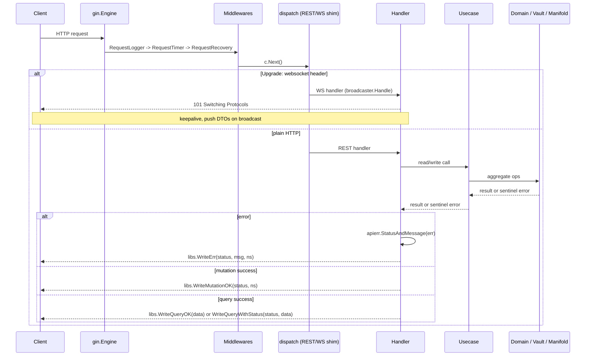
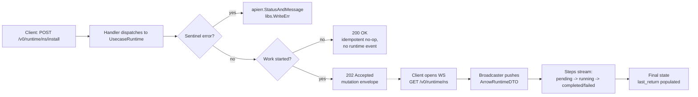

# Quiver — HTTP API

## Overview

The HTTP API is the external interface to Quiver.core. It is an infrastructure module — it accepts HTTP requests, extracts parameters, calls into the use case layer, and returns responses. It has no knowledge of domain commands, Asynx, or execution internals.

The API is mounted as one or more **versions**. Each version implements a small interface (`Prefix`, `Register`, `WSHandler`) and is plugged into the top-level `api.Container` at startup. v0 is the only version shipping today; future versions will live alongside it under their own prefix without touching the v0 package.

Base path: `/v0`

Related specs: [usecases.md](usecases.md) (the layer this API delegates to), [commands.md](commands.md) (underlying state transitions), [websocket.md](websocket.md) (real-time feed served from the same `/v0` base), [domain.md](domain.md) (aggregate definitions).

---

## 1. Versioning

The current release is **v0**. The `v0` prefix is intentional — it advertises that the surface is unstable and that breaking changes are allowed without bumping a major. Once the API stabilises, a parallel `/v1` package will be added; `/v0` will continue to serve old clients until removed.

`api.Container.New` accepts a variadic list of `api.Version` implementations. Each version owns its routes and its WebSocket handler; the version constructor receives the wired `app.Container` and returns the prefix-scoped REST/WS surface. Adding a new version is a one-line change in the bootstrap and a new sibling package — `v0` is never edited again to add `v1`.

The WebSocket fan-out hub (`api.Hub`) is shared across all versions: each version registers its WS handler with the hub at startup, and the use case layer pushes domain events into the hub which then dispatches to every registered handler. v0 maps domain aggregates to v0 DTOs; v1 will map the same aggregates to v1 DTOs.

---

## 2. Namespace Encoding

Namespaces contain `/` characters that conflict with URL path parsing. To avoid ambiguity, **namespaces are percent-encoded into a single path segment**. The Gin engine is configured with `UseRawPath = true` and `UnescapePathValues = true`, so `%2F` reaches the handler decoded.

| Raw Namespace | Encoded Path Segment |
|---|---|
| `github.com/valve/steamcmd` | `github.com%2Fvalve%2Fsteamcmd` |
| `github.com/valve/steamcmd@v1.0.0` | `github.com%2Fvalve%2Fsteamcmd@v1.0.0` |
| `github.com/char2cs/gaming.quiver/cs2` | `github.com%2Fchar2cs%2Fgaming.quiver%2Fcs2` |

The `{ns}` placeholder in all endpoint definitions below refers to the **encoded** form. A namespace may carry an `@ref` suffix (e.g. `@v1.0.0`, `@main`) — some endpoints require it (`DELETE /arrow/{ns}`), others reject it (`GET /arrow/{ns}/manifest`).

---

## 3. Response Envelope

All JSON responses share a single envelope. The same struct serialises mutation, query, and error responses; only the populated fields differ.

| Field | Type | Mutation | Query | Error |
|---|---|---|---|---|
| `success` | bool | `true` | `true` | `false` |
| `error` | string\|null | omitted | omitted | error message |
| `namespace` | string | resource ns | omitted | resource ns (if known) |
| `data` | any | omitted | result body | omitted |

Examples:

Mutation (write success):

```json
{ "success": true, "namespace": "github.com/valve/steamcmd" }
```

Query (read success):

```json
{ "success": true, "data": [ /* list or object */ ] }
```

Error (any verb):

```json
{ "success": false, "error": "not found", "namespace": "github.com/valve/steamcmd" }
```

Two endpoints break the envelope by design and are noted inline in the catalog:

- `GET /health` returns `{"status":"ok"}` with no envelope.
- `GET /collection/{ns}/manifest` returns the raw cached manifest bytes with `Content-Type: application/json`.

---

## 4. Error Format

The HTTP layer maps app-layer sentinel errors to status codes via `apierr.StatusAndMessage`. The use case layer returns wrapped sentinels (`errors.Is`-friendly); the API layer translates them.

| Sentinel | HTTP Status | `error` field |
|---|---|---|
| `ErrNotFound` | 404 | `"not found"` |
| `ErrAlreadyExists` | 409 | `"already exists"` |
| `ErrStateViolation` | 422 | `"state violation"` |
| `ErrMethodNotFound` | 404 | `"method not found"` |
| `ErrFetchFailed` | 502 | `"fetch failed"` |
| `ErrInvalidNamespace` | 400 | `"invalid namespace"` |
| `ErrDependentsExist` | 422 | `"other arrows depend on this arrow"` |
| `ErrPlatformNotSupported` | 422 | `"no target for the current platform"` |
| `ErrMissingVariable` | 422 | `"required variable not provided"` |
| `ErrInvalidManifest` | 422 | `"invalid manifest"` |
| `deptree.ErrCyclicDependency` | 409 | `"cyclic dependency"` |
| anything else | 500 | `"internal error"` |

Validation endpoints (`POST /arrow/{ns}/manifest/validate`, `POST /collection/{ns}/manifest/validate`) are special: when the manifest is structurally parseable but fails rule validation, the response is **422** with the **query envelope** (`success: false`, `data: ValidationResult`) — not the error envelope. Callers read `data.errors[]` for the field-level rule failures.

The `apierr` package additionally exposes constructors for the full 4xx/5xx range (`apierr.NotFound`, `apierr.Conflict`, etc.) used by handlers that want to throw a specific code without going through the sentinel-mapper.

---

## 5. Middleware

`api.Container` installs three middlewares on the root engine, applied in order to every request:

| Middleware | Purpose |
|---|---|
| `RequestLogger` | Wraps the handler chain, logs method/path/status/latency/client IP at info (2xx/3xx), warn (4xx), or error (5xx). Emits structured slog records with `type=http_request`. |
| `RequestTimer` | Stashes `time.Now()` in the gin context under `request_start_time` for downstream consumers (currently informational). |
| `RequestRecovery` | Catches panics, logs them with `type=panic_recovery`, and aborts with 500. |

A shared `middleware.Upgrader` (gorilla/websocket) is exposed for WS handlers; in v0 it accepts all origins (no auth).

WebSocket routing piggybacks on REST endpoints via a `dispatch` shim: REST handlers and WS handlers register on the **same path**, and a wrapper checks the `Upgrade: websocket` header to route the request. This applies to `GET /arrow`, `GET /arrow/{ns}`, `GET /collection`, `GET /collection/{ns}`, `GET /runtime`, and `GET /runtime/{ns}` — see the catalog below for which methods support WS upgrade.

---

## 6. Endpoint Catalog

The v0 surface mounts four resources under `/v0`: **arrow**, **collection**, **runtime**, and **health**. Lifecycle method invocation lives under `/runtime`, **not** under `/arrow/{ns}/{method}` — that path no longer exists.

### 6.1 Arrow

The Arrow resource manages catalog entries: registration, version checks, manifest seeding, and validation. Every `{ns}` is a catalog identity `namespace@selector` — the selector (a channel, constraint, pinned ref or commit) never changes for the life of the row, so the path stays valid across updates. A refless `{ns}` reaches the preferred catalogued row. See [manifests/v0/versioning.md](manifests/v0/versioning.md). Lifecycle methods (`install`, `execute`, `stop`, `uninstall`, custom methods) belong to the Runtime resource (§6.3).

| Method | Path | Summary | Async? |
|---|---|---|---|
| POST | `/arrow/{ns}` | Register an arrow from an existing manifest in the registry | Sync |
| PATCH | `/arrow/{ns}` | Re-check the selector; advance a row nothing is installed from | Sync |
| DELETE | `/arrow/{ns}` | Deregister an arrow | Sync |
| GET | `/arrow` | List registered arrows (or upgrade to WS for live updates) | Sync |
| GET | `/arrow/{ns}` | Get full detail for a single arrow (or upgrade to WS) | Sync |
| GET | `/arrow/{ns}/manifest` | Get the manifest as its author wrote it | Sync |
| GET | `/arrow/{ns}/readme` | Get the manifest's prose | Sync |
| GET | `/arrow/{ns}/dependents` | List arrows that depend on this one | Sync |
| GET | `/arrow/{ns}/dependencies` | Get the resolved dependency plan | Sync |
| GET | `/arrow/{ns}/channels` | List the channels the repository publishes | Sync |
| POST | `/arrow/{ns}/manifest` | Adopt a raw manifest as a pin of `{ns}`'s own ref | Sync |
| POST | `/arrow/{ns}/adopt` | Register `{ns}` as already installed at a declared ref | Sync |
| POST | `/arrow/{ns}/manifest/validate` | Validate a raw YAML manifest without writing it | Sync |

#### POST /arrow/{ns} — Register

Registers the arrow identified by `{ns}`. The ref after `@` is the selector the row follows, classified once against the repository's refs and stored; a refless `{ns}` is registered under the repository's default channel (`stable` when it has stable releases). The manifest is fetched at the commit the selector points at. No request body. Returns **201 Created** with the mutation envelope on success. Re-registering is idempotent and returns 201: an existing row is left as it is, and one that exists only as a dependency is promoted to user-installed. Errors: 400 (invalid namespace, or a selector that names no channel, ref, glob or commit), 404 (manifest or default channel not found), 409 (a concurrent registration of the same identity won the race, or another identity's workdir occupies this identity's path (a directory an earlier layout created under a spelling that differs only by case): remove that identity first), 502 (fetch failed), 500. When Fletcher could not synthesize a manifest for a repository without an `ARROW.md`, the 404 is the same as for any missing manifest; the not-fletchable reason (`host_unsupported`, `no_release_assets`, `no_usable_asset`, `no_digest`, `low_confidence`) stays in the wrapped error chain and never reaches the response.

#### PATCH /arrow/{ns} — Update

Re-checks the row's selector against a live ref snapshot and records what is ahead as `available`. No request body. What happens next depends on the row:

| Row | Effect | `data` |
|---|---|---|
| Current | Nothing | Empty result, no `available` |
| Installed | Stays where it is — only `POST /runtime/{ns}/update` runs update steps | `available: {ref, commit}` |
| Not installed | Advanced in place to `available` at once | `added_deps`, `removed_from_manifest`, `constrained_deps` |

Returns **200 OK** with the mutation-result envelope (`UpdateResultDTO` under `data`: `added_deps`, `removed_from_manifest`, `safe_to_uninstall`, `constrained_deps`, and `available` when set). Errors: 400 (invalid namespace), 404 (not found, or the selector no longer resolves), 409 (advancing an uninstalled row, when another identity's workdir occupies this identity's path (a directory an earlier layout created under a spelling that differs only by case): remove that identity first), 422 (state violation), 502 (fetch failed), 500.

#### DELETE /arrow/{ns} — Remove

Deregisters one catalog row, addressed by its identity (`namespace@selector`) or by the bare namespace, which reaches the preferred catalogued row. The use case layer rejects the call if the runtime is active or if other arrows depend on it. Returns **200 OK** on success. Errors: 404 (not found), 422 (state violation, dependents exist), 500.

#### GET /arrow — List

Returns all registered arrows, grouped by bare namespace. Optional query parameter `user_installed=true|false` filters to user-installed (or non-user-installed) entries. Each item carries one entry per catalog row (`versions[]`) — the same repository can be registered under several selectors.

If the request carries `Upgrade: websocket`, the connection is upgraded and the client receives Arrow DTO pushes on catalog changes — see [websocket.md](websocket.md). The WS stream's `user_installed` filter defaults to `true` when unspecified (the REST endpoint has no such default).

Response shape (query envelope, `data` is a list):

```json
{
  "success": true,
  "data": [
    {
      "namespace": "github.com/valve/steamcmd",
      "name": "SteamCMD",
      "description": "...",
      "tags": ["utility"],
      "versions": [
        { "ref": "stable", "resolved_ref": "v1.0.0", "state": "ready", "installed_at": "2026-04-11T15:33:00Z", "last_used_at": "2026-08-01T09:30:00Z" }
      ]
    }
  ]
}
```

`ref` is the selector the row is filed under and is always set. `resolved_ref` is the ref the row resolved to — the version, since an arrow manifest declares none of its own — and is empty only for a row that never resolved one. Whether anything is on disk is `installed_at`'s to say: it is omitted until a successful `_install` stamps it, and again after an `_uninstall`. `last_used_at` is stamped when a successful `_execute` run completes, and is omitted while the row has never been run. See [manifests/v0/versioning.md](manifests/v0/versioning.md).

#### GET /arrow/{ns} — Detail

Returns full detail for a single arrow including current state, the active run (if any), and the most recent completed return. Supports WS upgrade — same dispatch as `GET /arrow`.

The DTO (`ArrowDetailDTO`) carries: `namespace`, `name`, `description`, `license`, `state`, `tags`, `installed_at` (omitted while the arrow is not on disk), `last_used_at` (omitted while the arrow has never been run), `user_installed`, `selector_kind` (`pin`, `channel`, `constraint` or `commit`), `resolved_ref`, `installed_commit`, `available` (`{ref, commit}`, omitted when current), `outdated` (true exactly when `available` is set), `origin`, `inference` (omitted unless inferred), `active_run` (nullable), `last_return` (nullable). `active_run` and `last_return` each contain a method name, variables map, and step list. `last_return` additionally carries an `outcome` (`success` | `failed` | `cancelled`) and the `execution_id` of the run it ended; `active_run` carries a `pid` for service-style executions.

**Origin and inference.** `origin` is `declared` (the repository ships an `ARROW.md` / `arrow.yaml`) or `inferred` (Fletcher synthesized the manifest). An inferred arrow also carries `inference`:

| Field | Meaning |
|---|---|
| `generator` | Heuristics that produced the manifest, e.g. `fletcher/1` |
| `confidence` | `high` \| `medium` \| `low` |
| `warnings` | Omitted when empty; any of `assumed_arch`, `emulated`, `windows_exe_unverified`, `name_mismatch`, `unpinned_rolling_tag` |

The arrow list items (`GET /arrow`) carry `origin` (always present) and `confidence` (omitted unless the arrow is inferred); discovery search results carry both, each omitted when empty. Search results from the vault lane (arrows Quiver has cached but not catalogued) report them too: the vault index stores the generator name and confidence.

**Expose results.** Exposure is reported as ordinary steps of the run. An `_install` or `_update` of an arrow that declares `expose` entries ends with one step of type `expose` per entry (title `Expose <kind> <name>`): `completed` when the entry was placed; `completed` with a `note` (for example `nothing exposed: no executable found`) and no `error` when an `auto` entry resolved to nothing — expected when a manifest declares both a `cli` and a `desktop` `auto` entry and the archive holds only one; `failed`, with the reason in `error`, when Quiver declined it — for example a name owned by another arrow or by the user. A failed `expose` step never fails the run. An `_uninstall` of such an arrow starts with one step of type `unexpose` (`Remove exposed entries`).

An uncatalogued namespace resolves live, the way an add would, and reports state `absent` and the `selector_kind` an add would record (best-effort: a remote whose refs cannot be listed leaves it `pin`). Reading a catalogued row whose last version check is older than `arrows.version_check_ttl` launches a new check in the background; the response does not wait for it. Errors: 404 (not found), 422, 502 (fetch failed), 500.

#### GET /arrow/{ns}/manifest — Get Resolved Manifest

Returns the resolved manifest (post-fetch, post-parse) for the arrow at `{ns}`. The DTO (`ArrowManifestDTO`) carries `namespace`, `name`, `description`, `tags`, `variables`, `targets`, and under `manifest` the manifest as its author wrote it: `{metadata, variables, netbridge, targets, readme}`. Row state (selector, resolved and available refs, install and use stamps) is never here; it belongs to the detail. Errors: 404 (not found), 422, 502 (fetch failed), 500.

#### GET /arrow/{ns}/channels — Channels

Lists the channels the repository publishes, for picking a selector at install time: `{channels: [{name, kind, latest, count, members}]}`. `kind` is `ordered` (tags the classifier sorted into a named channel such as `stable` or `beta`, `members` highest first) or `pointer` (a tag the classifier could not place — a rolling tag such as `nightly` — or, only for a repository with no tags at all, the default branch). The order is the one a refless add picks its default channel from: `stable` first, then other ordered channels, then pointers. Errors: 404, 502, 500.

#### POST /arrow/{ns}/manifest — Seed

Accepts a raw manifest in the request body and adopts it as a **pin of `{ns}`'s own ref**: a new user-installed row when the identity is absent, a manifest replacement when it exists. `{ns}` must carry a ref. Used to register an arrow from a local manifest file. `Content-Type: application/x-yaml` is expected but not enforced — the body is read raw via `io.ReadAll`. Returns **201 Created** with the mutation envelope. Errors: 400 (failed to read body, or a namespace without a ref or with an empty ref component), 409 (a concurrent registration of the same identity won the race), 422 (invalid manifest), 500.

#### POST /arrow/{ns}/adopt — Adopt installed

Registers `{ns}` under the identity `POST /arrow/{ns}` would file it under (the ref after `@` is the selector; a refless `{ns}` follows the repository's default channel), but as **already installed at `resolved_ref`** rather than at what the selector points at now. For a client that installed itself and announces the build it runs (Quiver Desktop's own arrow): the next version check then offers the update that build actually needs. Body: `{"resolved_ref": "<ref>"}` (JSON; unknown fields are ignored).

`resolved_ref` is checked against a live ref snapshot. It must be a tag or branch the repository holds (else 404) and one the selector could resolve to (else 400): a member of the channel (a pointer channel, or the default-branch fallback, admits only its own ref), a tag the constraint's glob matches, the pin's own ref, or — for a commit selector — the selector itself or a ref at a commit it prefixes. The manifest is fetched at that ref's commit and written through the same adoption `quiver.core` uses for itself ([versioning.md §10](manifests/v0/versioning.md)): a new user-installed row, an in-place advance when the row stands elsewhere (the identity never changes), or nothing when it is already there. `/adopt` declares the catalog state only and leaves the runtime untouched: a client that also needs the arrow's installed state detected (the `preinstalled:` probe) must `POST /arrow/{ns}` first and then call `/adopt` — the order the tests cover. Returns **201 Created** with the mutation envelope, including when nothing changed. Errors: 400 (invalid namespace, a body that is not JSON, a missing `resolved_ref`, or a ref the selector could never resolve to), 404 (repository or ref not found), 409 (a concurrent registration of the same identity won the race, as for `POST /arrow/{ns}`), 422 (invalid manifest at the ref), 502 (fetch failed), 500.

#### POST /arrow/{ns}/manifest/validate — Validate

Parses and rule-validates a raw YAML manifest **without writing** to the registry. The body is the raw manifest (YAML or whatever the manifold parser accepts). Returns the query envelope (`success: true`/`false` matching `data.valid`) with a `ValidationResult`:

- `valid` (bool) — whether the manifest passed
- `errors[]` — field-level rule violations (`field`, `rule`, `message`); omitted when valid
- `supported_platforms[]` / `unsupported_platforms[]` — OS strings derived from the manifest's targets

Status code: **200 OK** if `valid`, **422 Unprocessable Entity** if not. The 422 response is unusual — it carries the **query envelope**, not the error envelope, because the validation result is itself useful payload.

### 6.2 Collection

The Collection resource (formerly named "Quiver" in earlier specs — renamed in PR #168) manages remote arrow catalogs that users can follow. Following a collection caches all of its arrows locally and arranges them under that collection's umbrella. Internally the route group is registered under a package aliased as `quivers`, but the URL prefix and the public spec name are both `collection`.

| Method | Path | Summary | Async? |
|---|---|---|---|
| POST | `/collection/{ns}/follow` | Follow a collection and cache its arrows | Sync |
| DELETE | `/collection/{ns}/follow` | Unfollow a collection | Sync |
| GET | `/collection` | List collections (or upgrade to WS) | Sync |
| GET | `/collection/{ns}` | Get a collection's full detail (or upgrade to WS) | Sync |
| GET | `/collection/{ns}/manifest` | Get the raw cached collection manifest | Sync |
| POST | `/collection/{ns}/manifest` | Seed a raw collection manifest into the registry | Sync |
| POST | `/collection/{ns}/manifest/validate` | Validate a raw collection manifest | Sync |

#### POST /collection/{ns}/follow — Follow

Follows the collection identified by `{ns}`. The use case layer fetches the collection manifest, then iterates its arrow list — local arrows are seeded into the registry, remote arrows are resolved against their upstream. Per-arrow failures are recorded in the collection's `failed_arrows` list (visible in the detail response) but do not abort the follow operation. `Content-Type` is unused — no request body. Returns **201 Created**. Errors: 404 (collection manifest not found), 409 (already followed), 500.

#### DELETE /collection/{ns}/follow — Unfollow

Stops following the collection. The cached arrows remain in the registry; only the follow relationship is removed. Returns **200 OK**. Errors: 404 (not followed), 500.

#### GET /collection — List

Returns the merged list of followed collections plus cached-but-unfollowed collections. Query parameter `followed=true|false` filters the result: `true` returns followed only; `false` returns unfollowed cached only; omitted returns both. Each item carries `namespace`, `name`, `description`, `tags`, `arrow_count`, and a `followed` boolean. Supports WS upgrade.

#### GET /collection/{ns} — Detail

Returns full detail for one collection. The DTO (`CollectionDetailDTO`) includes: `namespace`, `name`, `description`, `url`, `maintainers[]`, `tags[]`, `media` (icon/banner URLs), `arrows[]` (each with its `namespace`, `resolved` flag, and on resolved entries, `name`/`description`), and `followed`. Arrows that failed to resolve during the last follow attempt have `resolved: false` and no further metadata beyond their namespace. Neither the collection nor an entry carries a `version` — the ref is the `@ref` on the `namespace` beside it. Supports WS upgrade. Errors: 404 (not found), 500.

#### GET /collection/{ns}/manifest — Get Manifest (raw)

Returns the cached collection manifest as raw bytes with `Content-Type: application/json`. **This endpoint bypasses the standard envelope** — the response body is the manifest itself. Errors: 404, 500 (these still use the error envelope).

#### POST /collection/{ns}/manifest — Seed

Accepts a raw collection manifest body (YAML or `COLLECTION.md`) and stores it in the vault for the given namespace. Returns **201 Created**. Errors: 400 (failed to read body), 422 (invalid manifest), 500.

#### POST /collection/{ns}/manifest/validate — Validate

Validates a raw collection manifest. Same response convention as the arrow manifest validator: query envelope, **200 OK** when valid, **422** when invalid. The `ValidationResult` shape matches arrow validation but `supported_platforms`/`unsupported_platforms` are empty (collections have no OS targeting).

### 6.3 Runtime

The Runtime resource invokes lifecycle methods on installed arrows and streams execution progress over WebSocket. There is exactly one REST endpoint plus two WS endpoints; lifecycle methods are **always asynchronous** at the HTTP layer.

| Method | Path | Summary | Async? |
|---|---|---|---|
| POST | `/runtime/{ns}/{method}` | Trigger a lifecycle method on an arrow | Async (202; 200 for an idempotent no-op) |
| GET | `/runtime` | WebSocket — runtime events for all arrows | n/a |
| GET | `/runtime/{ns}` | WebSocket — runtime events for one arrow | n/a |

#### POST /runtime/{ns}/{method} — Execute

Triggers a lifecycle method. The optional JSON body is `{"variables": {"KEY": "value", ...}}` — if no body or invalid JSON, variables default to empty. The handler dispatches to the use case layer based on the method name:

| `{method}` | Use case call |
|---|---|
| `install` | `Install(ns, vars)` — full dependency-resolved install |
| `uninstall` | `Uninstall(ns, vars)` — reverse-deps check + cascade cleanup |
| `execute` | `Execute(ns, MethodExecute, vars)` — run the manifest's `_execute` |
| `stop` | `Stop(ns)` — stop a running execution; ignores body variables |
| `update` / `_update` | `Update(ns, vars)` — the update bracket: re-resolve the selector, stop if running, stage the target manifest, sync dependency changes, run the target's `update` steps, and advance the row in place only if the target is unmoved when they succeed. A row with nothing ahead begins nothing and the response is **200** (idempotent no-op; no runtime event follows). A row whose previous update has not settled — still updating, or its steps ended and its commit has not landed (`settling: true`) — is refused with **422** (state violation) and runs nothing. The only route that runs update steps; see [manifests/v0/versioning.md §8](manifests/v0/versioning.md) |
| anything else | `Execute(ns, method, vars)` — custom user-defined method |

Returns **202 Accepted** with the mutation envelope as soon as the use case layer accepts the command. The exceptions are idempotent no-ops, answered **200** with the same envelope and followed by no runtime event: `install` of an arrow that is already installed, and `update` of an arrow with nothing newer. Progress is streamed exclusively via the `/runtime` WS endpoints — no polling endpoint exists. Errors: 404 (arrow not found, method not found), 422 (state violation, missing required variable, no platform target, dependents block uninstall), 409 (already running, cyclic dependency, or another identity's workdir occupies this identity's path (a directory an earlier layout created under a spelling that differs only by case): remove that identity first — no step runs, and removing the arrow still succeeds), 502 (fetch failed during install), 500.

#### GET /runtime, GET /runtime/{ns} — WebSocket subscriptions

Pure WebSocket endpoints — `dispatch` is not used because there is no REST equivalent. The handler upgrades unconditionally and pushes `ArrowRuntimeDTO` for matching events. The namespace path acts as a **glob filter** — `*` and `?` patterns are honoured by the broadcaster's filter system (see `internal/api/ws/filter.go`). The DTO carries `namespace`, `state`, `active_run`, and `last_return`. A plain (non-upgraded) `GET` answers the same DTO as a snapshot, and adds `settling: true` for a row whose update has not committed yet ([manifests/v0/versioning.md §8](manifests/v0/versioning.md)). `settling` is a REST-only field: WebSocket events never carry it, so an idle decision (such as the CLI stopping a daemon it booted) must use the REST runtime read. See [websocket.md](websocket.md) for connection semantics, ping/pong, and DTO field details.

### 6.3.1 UI

Registered from `internal/api/v0/endpoints/ui/routes.go`. Serves the interface an arrow opened with a `ui` step ([surface.md](surface.md)).

| Method | Path | Summary |
|---|---|---|
| ANY | `/ui/{ns}/*path` | Proxy the arrow's open surface |

Behind the same bearer gate as the rest of `/v0`: enforced when the daemon is bound to `tcp://`, a no-op on `unix://`. No extra TCP listener exists for the interface; it rides the daemon's own. Any method is accepted. The `/v0/ui/{ns}` prefix is stripped before the request reaches the surface and the query string is forwarded as net/http sanitises it (parameters it cannot parse, such as ones containing a semicolon, are dropped). WebSocket upgrades ride the same route. `Authorization` and `Cookie` headers are removed before the request reaches the arrow. `{ns}` is resolved through the runtime (`GetRuntime`), so a refless namespace reaches the preferred row like the other routes. A `static` surface answers only `GET` and `HEAD` (405 otherwise).

| Status | When |
|---|---|
| (the arrow's own) | Surface open and answering |
| 404 | Unknown arrow |
| 502 | The arrow's socket does not answer (`arrow surface unavailable`) |
| 503 | The arrow has no open surface (no running method opened one, or it ended) |
| 500 | Any other failure opening the surface |

### 6.4 Search

Registered from `internal/api/v0/endpoints/search/routes.go`.

| Method | Path | Summary |
|---|---|---|
| GET | `/search?q=&limit=&os=` | Offline search over the catalog and the vault index ("Lane A") |
| POST | `/search/discover` | Start a network discovery pass; **202** with a job id |
| GET | `/search/discover/{job}` | Job summary; with `Upgrade: websocket`, the result stream ([websocket.md § 3.4](websocket.md)) |

**Matching (Lane A, vault lane).** The query is split on whitespace. A vault row matches when every token appears, case-insensitively, as a substring of the arrow's namespace (so the owner and repository name count), name, description, or one of its tags. Trigram FTS only ranks the matches (name above tags above description, then stars); rows it cannot score rank after those it can. This is why a one- or two-character query, a multi-word query, or an arrow whose only match is its repository name is found, and why an arrow a discovery pass indexed is found again by the query that discovered it. The catalog lane still uses a single trigram phrase over name, description and tags.

**Limit.** `limit` (default 25, cap 100) counts arrows, not refs: the vault lane keeps every ref of the best-ranked bare namespaces, and the merged answer is cut to `limit` only after ranking and grouping.

**OS filter.** `os` selects arrows whose compiled targets include that platform, in both lanes. The discovery stream applies the same rule to its own results through `?os=` on the WebSocket, so passing the same value to both keeps them consistent.

**Stream vs. re-query.** Every result a discovery pass streams has been written to the vault index before it is emitted, so the re-query for the same text (same `os`, `limit` large enough for the result set) returns it, keyed by the same bare `namespace`. The stream is unranked and its rows describe only what the pass knew; clients replace it with the re-query once the stream closes. A contract test (`internal/api/v0/dto/search_contract_test.go`) pins the shared key.

#### 6.4.1 Home

Registered from `internal/api/v0/endpoints/home/routes.go`. Query-less recommendations for the desktop home, served from a local snapshot.

| Method | Path | Summary |
|---|---|---|
| GET | `/home` | The shelves and whether a refresh is running |
| POST | `/home/refresh` | Start a refresh; **202** with no body |

`GET /home` answers from the local snapshot and the vault index and never reaches a git host, so it is instant and works offline. Body, wrapped like every query:

```json
{
  "success": true,
  "data": {
    "shelves": [
      {
        "id": "popular",
        "title": "Popular",
        "refreshed_at": "2026-09-30T12:00:00Z",
        "arrows": []
      }
    ],
    "refreshing": false
  }
}
```

`arrows` holds one `SearchResultDTO` each, the same shape `GET /search` returns (`installed` says the catalog holds the arrow; `source` is provenance data, not a label). `refreshed_at` is `null` for a shelf that has never been filled. `shelves` is `[]` when `recommendation.enabled` is false. A client titles a shelf by `title` only and never names a host. `POST /home/refresh` joins a refresh already running; progress is read by polling `GET /home` while `refreshing` is true. Both answer **503** when the daemon was built without discovery. Configuration and refresh algorithm: [usecases.md § 2.5](usecases.md).

### 6.5 Health

A single liveness probe with no envelope. Used by container orchestrators and the Quiver electron client to verify the daemon is running.

| Method | Path | Response |
|---|---|---|
| GET | `/health` | **200 OK** with `{"status":"ok"}` (no envelope) |

### 6.6 System

Registered from `internal/api/v0/endpoints/system/routes.go`.

| Method | Path | Summary | Async? |
|---|---|---|---|
| GET | `/config` | Read the daemon configuration | Sync |
| PATCH | `/config` | Patch the daemon configuration | Sync |
| GET | `/system/path` | Report whether `~/.quiver/bin` is on `PATH` | Sync |
| POST | `/system/path` | Put `~/.quiver/bin` on `PATH` (explicit user action) | Sync |
| POST | `/system/shutdown` | Ask the daemon to shut down gracefully and return the process to wait for | Sync |

#### GET /system/path — PATH status

Returns the query envelope with a `PathStatusDTO`:

| Field | Meaning |
|---|---|
| `bin_dir` | Absolute path of `~/.quiver/bin`, where `cli` expose entries live on macOS and Linux (on Windows each command's own folder goes on the user `Path` instead) |
| `on_path` | Whether `bin_dir` is on the daemon's current `PATH` |
| `configured` | Whether it is configured to stay there: the Quiver block in the shell rc files on unix, the user `Path` on Windows |
| `files` | Where that configuration is checked and written: the shell rc files on unix, the user `Path` location on Windows (always an array, possibly empty) |

Errors: 500.

#### POST /system/path — PATH setup

Adds `bin_dir` to `PATH` — only ever on this explicit call, never on its own. On unix it appends a block to the shell rc files (never prepends); on Windows it appends to the user `Path` and broadcasts `WM_SETTINGCHANGE`, so Explorer and newly opened terminals pick it up. Idempotent: once configured, calling it again changes nothing. Returns **200 OK** with the updated `PathStatusDTO`. A shell already running does not see the change until it is restarted. The CLI equivalents are `quiver path status` and `quiver path setup`.

Errors: 500.

#### POST /system/shutdown: graceful shutdown

Asks the daemon to leave through the same graceful sequence a SIGTERM takes it through. Returns **200 OK** with a `ShutdownDTO` (`pid`, `exe`, `args`) naming the process that is going away, so the caller can wait for that pid and the socket to disappear and then start the same command again. It is what `quiver self-update` uses to replace the daemon's binary. Over `tcp://` it needs a bearer token like every other route.

Errors: 422 (the daemon was built without a way to stop itself), 500.

---

## 7. Async vs Sync Summary

| Endpoint | Behavior | Success Status |
|---|---|---|
| `POST /v0/arrow/{ns}` | Sync | 201 |
| `PATCH /v0/arrow/{ns}` | Sync | 200 |
| `DELETE /v0/arrow/{ns}` | Sync | 200 |
| `GET /v0/arrow` | Sync (or WS) | 200 |
| `GET /v0/arrow/{ns}` | Sync (or WS) | 200 |
| `GET /v0/arrow/{ns}/manifest` | Sync | 200 |
| `GET /v0/arrow/{ns}/readme` | Sync | 200 |
| `GET /v0/arrow/{ns}/dependents` | Sync | 200 |
| `GET /v0/arrow/{ns}/dependencies` | Sync | 200 |
| `GET /v0/arrow/{ns}/channels` | Sync | 200 |
| `POST /v0/arrow/{ns}/manifest` | Sync | 201 |
| `POST /v0/arrow/{ns}/adopt` | Sync | 201 |
| `POST /v0/arrow/{ns}/manifest/validate` | Sync | 200 (valid) / 422 (invalid) |
| `POST /v0/collection/{ns}/follow` | Sync | 201 |
| `DELETE /v0/collection/{ns}/follow` | Sync | 200 |
| `GET /v0/collection` | Sync (or WS) | 200 |
| `GET /v0/collection/{ns}` | Sync (or WS) | 200 |
| `GET /v0/collection/{ns}/manifest` | Sync (raw bytes) | 200 |
| `POST /v0/collection/{ns}/manifest` | Sync | 201 |
| `POST /v0/collection/{ns}/manifest/validate` | Sync | 200 / 422 |
| `POST /v0/runtime/{ns}/{method}` | **Async** | **202** (200 when there is nothing to do: `install` of an installed arrow, `update` with nothing newer) |
| `GET /v0/runtime` | WS only | 101 (Switching Protocols) |
| `GET /v0/runtime/{ns}` | WS only | 101 |
| `ANY /v0/ui/{ns}/*path` | Proxy | the arrow's own status; 404 / 502 / 503 as in §6.3.1 |
| `GET /v0/health` | Sync | 200 |
| `GET /v0/system/path` | Sync | 200 |
| `POST /v0/system/path` | Sync | 200 |
| `POST /v0/system/shutdown` | Sync | 200 |

Async endpoints return immediately after the use case layer accepts the command. The client observes execution progress by connecting to the WebSocket feed at `/v0/runtime` or `/v0/runtime/{ns}` ([websocket.md](websocket.md)).

---

## 8. Request Lifecycle



For async lifecycle methods, the response is decoupled from the actual execution:



The 202 only signals that the use case layer accepted the command (e.g. state machine allowed the transition); the actual install/execute/stop/update work runs in the runtime engine and is observable only via the WS channel. A 200 means nothing was started (an idempotent no-op), so a client must not wait for runtime events.

---

## 9. Cross-References

- [websocket.md](websocket.md) — full WebSocket protocol, DTO shapes, filter semantics, ping/pong cadence.
- [usecases.md](usecases.md) — the business-logic layer this API delegates to; canonical contract for what each handler does.
- [commands.md](commands.md) — the underlying state-machine commands that lifecycle methods translate into.
- [domain.md](domain.md) — Arrow, Collection, ArrowRuntime aggregates and their fields.
- [manifests/v0/arrow.md](manifests/v0/arrow.md) — manifest YAML schema accepted by the seed/validate endpoints.
- [vault.md](vault.md) — where seeded manifests and cached collections live on disk.
