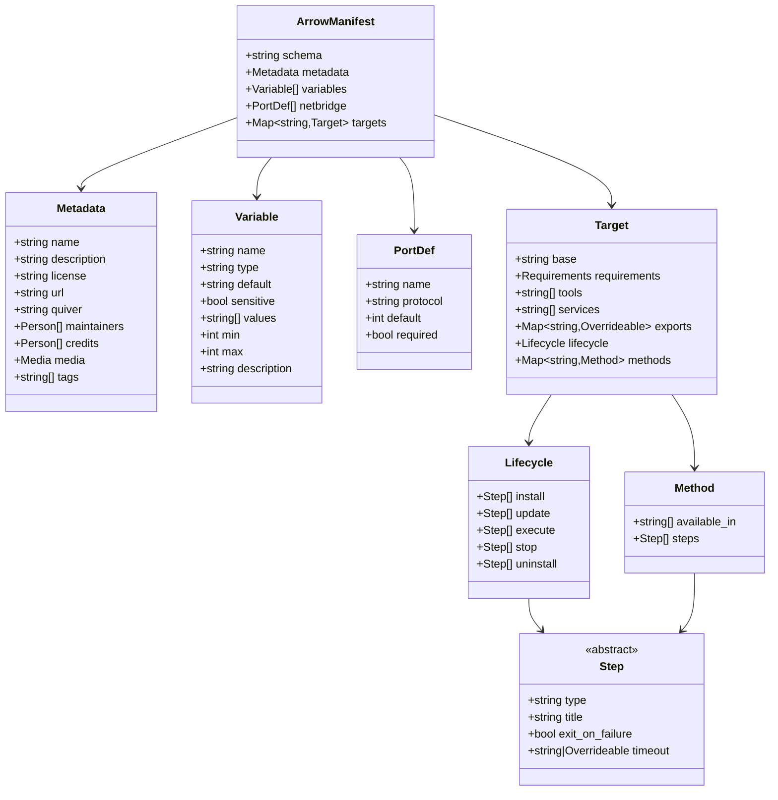
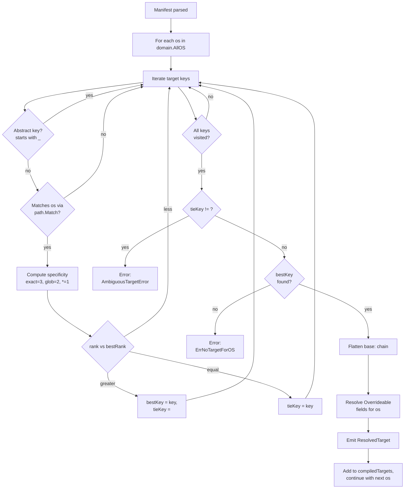

# Arrow Manifest — `arrow@v0` Spec

This document is the normative specification for the `arrow@v0` manifest format. All tooling
must conform to this document.

Cross-references: [versioning.md](./versioning.md) · [domain.md](../../domain.md) ·
[manifold.md](../../manifold.md) · [deptree.md](../../deptree.md) ·
[netbridge.md](../../netbridge.md)

---

## 1. Overview

An Arrow manifest describes a piece of software Quiver can install, run, and manage. It is
expressed as YAML — either standalone, embedded in a fenced markdown block, or contained
inside a Collection. The `arrow@v0` format introduces:

- **Per-platform `targets:`** as the first-class mechanism for expressing platform-specific
  recipes (`linux/amd64`, `darwin/arm64`, `linux/*`, `*`, etc.).
- **`base:` inheritance** between targets so platforms that share most of their recipe can
  reuse a common parent.
- **`Overrideable[T]` scalars** that handle per-arch variance within a single glob target —
  typically a download URL or binary name.
- **`tools:` / `services:` / `exports:`** as the explicit Arrow-to-Arrow relationship surface,
  replacing a single flat `dependencies:` list.

Pre-refactor manifests (no `targets:` section) are rejected at parse time. See
[§15 Migration note](#15-migration-note).

### 1.1 Progressive complexity tiers

Not every Arrow needs every feature. The format is designed so simple cases stay simple:

| Tier | Pattern | Typical use case |
|------|---------|-----------------|
| **1 — Universal** | Single `*` target, no `base:`, no Overrideable | Cross-platform, identical steps everywhere |
| **2 — Platform-aware** | Multiple targets, optional `base:`, optional Overrideable | Platform-specific steps or downloads |
| **3 — Multi-Arrow system** | `exports:`, `services:`, Overrideable on exports | Arrows that coordinate with other Arrows |

Developers should start at the lowest tier that covers their needs.

---

## 2. File forms

An `arrow@v0` manifest is delivered to Quiver in one of three file forms. The translator
accepts all three through the same entry point — it sniffs for a markdown fenced block first,
falling back to bare YAML.

| Form | Filename convention | Where it lives | Encoding |
|------|---------------------|----------------|----------|
| Standalone YAML | `arrow.yaml` | A repository whose root holds a single Arrow | YAML |
| Collection-scoped YAML | `<auid>.yaml` | A `quiver-hosted` repository whose root holds a Collection; one file per Arrow under the collection's directory | YAML |
| Markdown form | `ARROW.md` / `<auid>.md` | Anywhere either of the above is accepted | Markdown with a fenced ` ```arrow ` block (see §2.1) |

The choice between `arrow.yaml` and `<auid>.yaml` is purely a matter of where the Arrow lives:
a stand-alone repository uses `arrow.yaml`; an Arrow that ships inside a Collection uses
`<auid>.yaml`. The manifest body is identical in both cases.

### 2.1 Markdown form

When the file is markdown (`ARROW.md` / `<auid>.md`), Quiver extracts the **first** fenced
codeblock whose opening fence is exactly the four characters ` ``` ` followed immediately by
the word `arrow`. Schematically:

    # My Arrow

    Some prose describing the Arrow for human readers.

    ```arrow
    schema: "arrow@v0"
    metadata:
      name: example
    targets:
      "*":
        lifecycle:
          install: []
          uninstall: []
    ```

    Any other prose can follow.

Extraction rules (`internal/engine/manifold/translator/markdown.go`):

- Only the first ` ```arrow ` block is read; subsequent ones are ignored.
- Other fence languages (`yaml`, `bash`, etc.) are not treated as Arrow content.
- An unclosed block is rejected.
- Carriage returns (`\r`) are stripped — CRLF and LF inputs are equivalent.
- An empty block is allowed structurally but will fail later validation (no `schema:`).

Once extracted, the YAML inside the block is passed through the same parser, schema validator,
mapper, and ruleset as a `arrow.yaml` file. There is no other difference between the two forms.

### 2.2 Schema declaration

Every manifest body must declare its schema as the first concern. Two YAML keys are accepted —
`schema:` is canonical, and `manifest:` is a legacy alias preserved by the translator
(`internal/engine/manifold/translator/parse.go::extractSchemaField`):

```yaml
schema: "arrow@v0"     # canonical
```

```yaml
manifest: "arrow@v0"   # legacy alias — accepted, but prefer `schema:`
```

The value must match `<schema-type>@<version>`. For an Arrow manifest:

- `<schema-type>` must be exactly `arrow`.
- `<version>` must be `v0` (the only version currently registered in `arrow.Registry`).

Any deviation is a parse-time error.

---

## 3. Top-level structure

```yaml
schema: "arrow@v0"           # required — exactly this string

metadata:                    # required (name is mandatory)
  name: string               # required — display name (≤ 255 chars)
  description: string        # optional — short one-line description (≤ 1000 chars)
  license: string            # optional — SPDX identifier
  url: string                # optional — homepage or documentation URL
  quiver: string             # optional — Quiver namespace this Arrow belongs to
  maintainers:               # optional
    - name: string           # required within entry
      email: string          # optional
      url: string            # optional
  credits:                   # optional — attribution to upstream authors
    - name: string
      email: string          # optional
      url: string            # optional
  media:                     # optional
    icon: string             # URL to icon image
    banner: string           # URL to banner image
  tags:                      # optional — free-form strings for store discovery
    - string

variables:                   # optional — manifest-level user-configurable parameters
  - name: string             # required — identifier used in ${VAR} interpolation
    type: string             # optional — one of: string, number, boolean, select
    default: string          # optional — default value (always a YAML string)
    description: string      # optional
    sensitive: boolean       # optional — display hint only, not a security boundary
    values: [string]         # optional — allowed values; required when type is select
    min: integer             # optional — minimum value (numeric variables)
    max: integer             # optional — maximum value (numeric variables)

netbridge:                   # optional — declared port intent
  - name: string             # required — identifier used in ${PORT} interpolation
    protocol: string         # required — one of: tcp, udp, tcp/udp
    default: integer         # optional — default port (1..65535 if non-zero)
    required: boolean        # optional (default: false)

targets:                     # required — at least one entry; see §4
  <target-key>:
    base: string             # optional — parent target key (see §5)
    requirements:            # optional — minimum system resources
      cpu_cores: integer     # ≥ 1
      ram_gb: integer        # ≥ 1
      disk_gb: integer       # ≥ 1
    tools:                   # optional — install-time tools/libraries
      - string               # namespace, optionally versioned
    services:                # optional — runtime service Arrows
      - string
    exports:                 # optional — named values exposed to dependents
      <name>: string         # plain string OR Overrideable map (§6)
    lifecycle:               # required in every concrete (non-abstract) target
      install:   [steps]     # required if uninstall is present, see §8.3
      update:    [steps]     # optional — standalone (no pair)
      execute:   [steps]     # optional — service kind only
      stop:      [steps]     # optional — required only if execute is present
      uninstall: [steps]     # required if install is present (may be `[]`)
    methods:                 # optional — developer-defined custom actions
      <method-name>:
        available_in: [string]   # required — states (ready / running)
        steps: [steps]
```

The top-level `variables:` and `netbridge:` sections are the Arrow's public contract — the
form the user fills in before install and the ports Netbridge allocates. Both are global:
they apply uniformly across all platforms and never live inside a target. Per-platform scalar
variance in step commands is handled by Overrideable fields (§6), not by variables.

**There is no `version:` field.** A manifest is always fetched at a git ref, and the ref is
the version — `ArrowMeta.Version` is populated from the ref the manifest resolved at, never
parsed from the YAML. A manifest that restated its own version had to be edited in the very
commit that got tagged, and when the two drifted nothing detected it. See
[versioning.md](./versioning.md) for the resolution rules and `${REF}` (§10.1) for using the
ref inside steps.

A `version:` key under `metadata:` is tolerated and ignored. The schema still lists the
property — `Metadata` sets `additionalProperties: false`, so dropping it would turn the key
into a hard validation error — but no Go type models it, so the authored value is discarded
during translation and never reaches the aggregate. Old manifests keep validating unchanged;
they simply no longer influence anything. Write nothing there.

### 3.1 Manifest tree



The on-disk shape is mapped into the runtime types defined in `internal/domain/` —
`domain.Arrow`, `domain.Target`, `domain.TargetLifecycle`, `domain.Variable`,
`domain.Requirement`, `domain.Method`, and `netbridge.PortDef`. See [domain.md](../../domain.md)
for the runtime contract.

---

## 4. Targets

### 4.1 Target key forms

Every key in `targets:` is one of three forms:

| Form | Example | Description |
|------|---------|-------------|
| Exact | `linux/amd64` | Matches exactly one concrete `GOOS/GOARCH` |
| Glob | `linux/*`, `*/arm64`, `*` | Standard glob — `*` matches any single path segment |
| Abstract | `_common`, `_unix` | Key starts with `_`; never selected at runtime |

Concrete `GOOS/GOARCH` values Quiver recognises (`internal/domain/os.go`):

```
linux/amd64    linux/arm64
windows/amd64  windows/arm64
darwin/amd64   darwin/arm64
```

Any other `GOOS/GOARCH` is unrecognised and the runtime cannot match it.

### 4.2 Target selection — flowchart



`SelectTarget(os)` lives in `internal/engine/manifold/translator/arrow/v0/selector.go`; the
all-OS loop lives in `internal/engine/manifold/compiler/compiler.go`. The compiler skips an
OS that returns `ErrNoTargetForOS` (the Arrow simply does not support that platform) but
fails the whole add operation on `AmbiguousTargetError` or any other selection error.

### 4.3 Compilation result

The aggregate stores the compiled result on the `Arrow` value as a `map[OS]Target`
(`Targets map[OS]Target` in `domain/arrow.go`). At runtime the app layer does a single map
lookup using `domain.CurrentOS()`; a missing key means "this Arrow does not support your
platform".

Platform compatibility is **implicit**: the keys of the compiled `Targets` map are exactly
the supported platform set. No separate declaration is needed.

If zero OS values compile successfully, the Arrow is rejected at validation time
(`ValidateCompiled` in `ruleset.go` raises `no_supported_platform`).

### 4.4 Specificity ranking

Among all non-abstract keys that match a given runtime OS:

| Rank | Form | Examples |
|------|------|----------|
| 3 | Exact | `linux/amd64`, `darwin/arm64` |
| 2 | One wildcard, non-catch-all | `linux/*`, `*/arm64` |
| 1 | Catch-all | `*` |

The highest rank wins. A tie between two keys with equal rank is a parse-time
`AmbiguousTargetError` — no two equally-specific keys may both match the same concrete
`GOOS/GOARCH`.

### 4.5 Abstract targets

A target whose key starts with `_` is abstract:

- It is never selected at runtime and never appears in the compiled `Targets` map.
- It may only be referenced via `base:`.
- It may omit `lifecycle:` entirely (useful as a base that only provides exports, methods, or
  a partial lifecycle).
- The `OverrideableCoverageRule` skips abstract targets — coverage is only enforced on
  concrete targets where it would actually matter at runtime.

---

## 5. `base:` inheritance

### 5.1 Purpose

`base:` allows a concrete (or abstract) target to inherit all fields from a single parent
target and selectively override what differs. It replaces copy-paste between platforms that
share most of their recipe.

```yaml
targets:
  _common:
    lifecycle:
      execute:
        - type: run
          command: ./server
          title: Starting server
          timeout: 10s
      stop:
        - type: signal
          signal: graceful
          timeout: 10s
          exit_on_failure: false
      uninstall: []

  "linux/*":
    base: _common
    lifecycle:
      install:
        - type: run
          command: ./setup.sh
          title: Installing
          timeout: 5m
      # execute, stop, uninstall inherited from _common
```

### 5.2 Override rules

The `base:` chain is walked in `selector.go::flattenBaseChain`. After flattening, child fields
override parent fields with these rules:

| Field category | Behavior |
|----------------|----------|
| Scalar requirement values (`cpu_cores`, `ram_gb`, `disk_gb`) | Child non-zero values override parent; zero means inherit |
| `tools:` and `services:` lists | Child overrides parent wholesale when non-`nil` |
| `exports:` map | Key-by-key merge; child entries override matching parent entries |
| `methods:` map | Key-by-key merge; child entries override matching parent entries |
| Lifecycle hooks (`install`, `update`, `execute`, `stop`, `uninstall`) | Child non-`nil` list wins wholesale; `nil` means inherit. An empty list `[]` is **not** `nil` — it is an explicit "I declare this hook empty" |

The rule is intentional and consistent: **what you write, you own**. If a child target
declares a lifecycle hook (even `[]`), it owns that hook entirely; if it does not declare it,
the base's version applies unchanged.

### 5.3 Constraints

- **Single parent only.** `base:` takes one key — multi-parent inheritance is not supported.
- **No cycles.** A chain that revisits a key is a `cyclic_base` error
  (`base_integrity.go::checkBaseChain`).
- **Parent must exist.** Referencing a missing target key is a `missing_base` error.

---

## 6. Overrideable fields

### 6.1 Purpose and scope

`Overrideable[T]` (defined in `internal/domain/runtime/step/overrideable.go`) handles scalar
variance within an otherwise-identical recipe. Its natural home is inside glob targets, where
the containing target matches multiple concrete `GOOS/GOARCH` values and a single scalar
(typically a download URL or binary name) differs per arch.

The Overrideable scalar fields are exactly:

| Step type | Overrideable fields |
|-----------|---------------------|
| `run` | `command`, `elevated`, `timeout` |
| `fetch` | `url`, `to`, `checksum`, `timeout` |
| `signal` | `signal`, `timeout` |

Plus, `exports:` values are also Overrideable strings.

`type`, `title`, and `exit_on_failure` are **never** overrideable — `type` is fixed per step,
`title` is display-only, and `exit_on_failure` is a single bool flag captured outside the
overrideable mechanism.

### 6.2 YAML representation

A scalar field is either a plain scalar (no override) or a mapping with `GOOS/GOARCH`-pattern
keys and an optional `default:`. The two forms are mutually exclusive on a given field:

```yaml
# Plain scalar — identical on all platforms the target matches
command: ./mytool

# Overrideable — value varies per arch
url:
  linux/amd64: https://example.com/tool-linux-amd64.tar.gz
  linux/arm64: https://example.com/tool-linux-arm64.tar.gz

# Overrideable with default — fallback for unmapped arches
command:
  default: ./mytool
  "windows/*": '.\mytool.exe'
```

The `default:` key is consumed by the YAML unmarshaller (`overrideableV0.UnmarshalYAML`) and
becomes `Default`; all other keys land in the `OSArch` map.

### 6.3 Key format

Every key in an Overrideable map (other than `default:`) must be either:

- The catch-all `*`, or
- A string containing `/` — i.e. a full `GOOS/GOARCH` exact key (`linux/amd64`) or a glob
  containing `/` (`linux/*`, `*/arm64`).

Bare OS family names (`linux`, `windows`, `darwin`) are rejected by `OverrideableKeysRule`.

### 6.4 Coverage rule

For every Overrideable field on a concrete target, every concrete `GOOS/GOARCH` value the
containing target can match must be reachable via either a non-empty `Default` or a key that
matches via `path.Match`. This is enforced by `OverrideableCoverageRule`:

- A non-empty `default:` always satisfies coverage.
- Otherwise, every value in `domain.AllOS()` must match at least one key in `OSArch`.
- Abstract targets are skipped — they never run.

Unreachable concrete `GOOS/GOARCH` values are a parse-time error.

### 6.5 Resolution

At compile time, `selector.go::resolveOverrideable` selects the best-matching key for the
target OS using the same specificity ranking as target selection (§4.4). Among all keys that
match, the most specific wins; an equal-specificity tie raises `AmbiguousTargetError`. If no
key matches, the `Default` value is returned.

---

## 7. Arrow relationships

Arrows can relate to other Arrows in two distinct ways. Both are declared per-target, since
relationship needs can vary per platform.

### 7.1 `tools:` — install-time tools and libraries

`tools:` lists Arrows that must be installed before this Arrow installs. Their binaries and
files are available via exports (§7.3) or `${namespace.INSTALL_PATH}`. They are never started
or stopped by this Arrow's lifecycle.

```yaml
tools:
  - github.com/valve/steamcmd
```

### 7.2 `services:` — runtime service dependencies

`services:` lists service Arrows that must be running alongside this Arrow during execution.
Declaring an Arrow in `services:` implies install-time installation as well. The same
namespace must not appear in both `tools:` and `services:` within the same target —
`ToolsServicesRule` raises `tools_services_overlap`.

```yaml
services:
  - github.com/char2cs/myapp/database
```

A target that declares any `services:` must also define both `execute:` and `stop:` —
otherwise the consumer would have no way to bracket the service's lifetime. This is enforced
by `ServiceConsumerLifecycleRule`.

### 7.3 `exports:` — named values exposed to dependents

`exports:` is how an Arrow exposes a stable interface to Arrows that depend on it. Instead of
dependents reaching into `INSTALL_PATH` and guessing file locations, the Arrow declares named
exports, and dependents reference them by name.

Export values are Overrideable static strings. **Variable interpolation (`${VAR}`) is not
allowed inside an export value** — `ExportStaticRule` raises `export_var_interpolation` if it
finds `${` inside a resolved export. Exports must be fully static so they can be resolved at
compile time and stored on the aggregate.

```yaml
# steamcmd.yaml
targets:
  "*":
    exports:
      steamcmd:
        default: ./steamcmd.sh
        "windows/*": ./steamcmd.exe
      python: /usr/bin/python3
```

Dependents reference exports via `${namespace.EXPORT_NAME}`:

```yaml
# cs2.yaml
tools:
  - github.com/valve/steamcmd

targets:
  "linux/*":
    lifecycle:
      install:
        - type: run
          command: ${github.com/valve/steamcmd.steamcmd} +app_update 730 +quit
          title: Installing CS2 via SteamCMD
          timeout: 30m
```

The variable resolver (consumed by the wizard before steps run) anchors relative export
values against the dependency's `INSTALL_PATH` automatically. Absolute export values are
passed through as-is.

`${namespace.INSTALL_PATH}` is implicitly available for every Arrow regardless of whether it
defines an `exports:` section.

---

## 8. Lifecycle

### 8.1 Hooks

Each target's `lifecycle:` section can define five hooks. Their state-machine semantics live
in [domain.md](../../domain.md) — refer to that document for the complete state diagram.

| Hook | Pair | State transition (high level) |
|------|------|-------------------------------|
| `install` | install/uninstall | absent → installing → ready |
| `uninstall` | install/uninstall | * → uninstalling → removed |
| `update` | standalone | ready → updating → ready |
| `execute` | execute/stop | ready → running |
| `stop` | execute/stop | running → stopping → ready |

The install execution always begins with a synthetic Step 0 — `type: dependencies` — injected
by Quiver. Manifests must not declare this step type themselves; `NoDependenciesStepRule`
raises `no_dependencies_step`. See [deptree.md](../../deptree.md) for the dependency
resolution flow.

### 8.2 Working directory

All steps execute with `${INSTALL_PATH}` as the working directory. Relative paths in `run`
commands (`./mytool`, `./setup.sh`) and `fetch` destinations (`to: ./binary`) are relative to
`INSTALL_PATH`. Every step's `${INSTALL_PATH}` and `${WORKDIR}` resolve to the same path.

### 8.3 Pairing rules

The `LifecyclePairsRule` enforces:

| Constraint | Field | Rule code |
|------------|-------|-----------|
| `install` and `uninstall` must both be defined or both absent (XOR) | `lifecycle.install` | `missing_pair` |
| `stop` requires `execute` | `lifecycle.stop` | `missing_pair` |

`execute` without `stop` **is allowed** — it covers tools that run once and exit on their own.
`stop` without `execute` is always invalid because there is nothing to stop.

`update:` is standalone — it has no required pair. It runs in-place inside the existing
installation directory, preserving user data and runtime artifacts. If an Arrow omits
`update:`, the runtime falls back to uninstall + reinstall when `quiver update` is invoked
(this is destructive and should be documented in the Arrow's README).

### 8.4 Service vs. package (kind inference)

Quiver infers the Arrow kind from the presence of `execute` (service) or absence (package)
across all compiled targets. `ServicePackageRule` rejects mixed manifests:

- **Package** — no compiled target declares `execute`.
- **Service** — every compiled target declares `execute`.
- **Mixed** — some compiled targets have `execute`, others do not. Raises `mixed_kind`.

There is no explicit `kind:` field — the structure is the declaration.

### 8.5 Step types

The JSON Schema enum (`schema.json`) accepts exactly three step types — `run`, `fetch`,
`signal`. Plus the synthetic `dependencies` type, which is rejected from manifest input.

| `type` | Purpose | Required fields | Optional fields | Overrideable fields |
|--------|---------|-----------------|-----------------|---------------------|
| `run` | Execute a shell command | `command` | `elevated`, `title`, `timeout`, `exit_on_failure` | `command`, `elevated`, `timeout` |
| `fetch` | Download a remote file | `url`, `to` | `checksum`, `title`, `timeout`, `exit_on_failure` | `url`, `to`, `checksum`, `timeout` |
| `signal` | Send a cross-platform shutdown signal | `signal` | `title`, `timeout`, `exit_on_failure` | `signal`, `timeout` |

All steps also accept these common fields:

- `title` — human-readable label shown in the UI.
- `timeout` — maximum duration. Must match `^\d+[sm]$` — e.g. `30s`, `5m`. Hours, fractional
  values, and compound durations (`1h30m`) are rejected by `TimeoutFormatRule`.
- `exit_on_failure` — boolean. **Defaults to `true`** when omitted (`mapper.go::resolveExitOnFailure`).
  Set to `false` for steps that may fail without aborting (e.g. cleanup steps).

#### `run` — shell command

```yaml
- type: run
  command: ./mytool serve --addr ${LISTEN_ADDR}
  title: Starting mytool server
  timeout: 10s
  elevated: false             # optional; default false
  exit_on_failure: true       # optional; default true
```

When `elevated: true`, the command runs with platform-specific privilege escalation (sudo on
Linux/macOS, UAC on Windows). `elevated` is Overrideable — different platforms can opt in or
out independently.

#### `fetch` — remote download

```yaml
- type: fetch
  url:
    linux/amd64: https://example.com/binary-linux-amd64
    linux/arm64: https://example.com/binary-linux-arm64
  to: ./binary
  checksum: sha256:abc123...    # optional
  title: Downloading binary
  timeout: 5m
```

The optional `checksum` field accepts `<algorithm>:<hex-digest>`. The download timeout is
governed by the step's `timeout` and applied at the resolver layer.

#### `signal` — cross-platform process control

```yaml
- type: signal
  signal: graceful              # graceful | kill | interrupt
  timeout: 10s
  exit_on_failure: false
```

The `signal` value is an enum (`step.SignalKind`):

| Value | Linux / macOS | Windows |
|-------|---------------|---------|
| `graceful` | `SIGTERM` | `Stop-Process` |
| `kill` | `SIGKILL` | `taskkill /F` |
| `interrupt` | `SIGINT` | `GenerateConsoleCtrlEvent` |

#### `dependencies` — synthetic, never written by hand

The `dependencies` step type is reserved for the runtime. It is injected as Step 0 of every
install execution (so dependency resolution participates in step-level progress reporting) and
cannot appear in a manifest. The mapper rejects it explicitly; `NoDependenciesStepRule` is the
final guard.

---

## 9. Methods

Methods are developer-defined custom actions. Unlike lifecycle hooks they do not transition
the Arrow between states; they are actions the user can invoke when the Arrow is in a
specific state.

### 9.1 Structure

```yaml
methods:
  <method-name>:
    available_in: [string]   # required — enum[]: ready, running
    steps: [steps]           # required
```

### 9.2 Per-target autonomy

Each target declares only the methods that are meaningful for it. There is no cross-target
method contract — a method that exists on `linux/*` does not need to exist on `windows/*` and
vice versa.

`available_in` is also per-target; a `restart` method may gate on `[running]` on Linux and
`[ready, running]` on Windows.

### 9.3 `available_in` gating

Valid states are exactly `ready` and `running` (`MethodStatesRule.validMethodStates`). Any
other value is `invalid_state`.

The runtime enforces `available_in` at invocation time — invoking a method from a state not
in its list returns an error to the caller.

---

## 10. Variable resolution pipeline

All `${VAR}` references in step fields are resolved by the app layer after target compilation
and before steps are passed to the wizard. Resolution uses a layered priority stack; later
layers override earlier ones.

| Priority | Source | Example |
|----------|--------|---------|
| 1 (lowest) | Built-in runtime variables | `${INSTALL_PATH}`, `${WORKDIR}`, `${ARROW_NAMESPACE}`, `${PLATFORM}`, `${REF}` |
| 2 | Dependency exports + their built-ins | `${github.com/valve/steamcmd.steamcmd}` |
| 3 | Manifest-level `variables:` defaults | `variables[].default` |
| 4 | Netbridge port allocations | Port `name` → allocated port number as string |
| 5 | Stored variables | Most recent completed execution |
| 6 (highest) | User-provided overrides | Key-value pairs from the request body |

### 10.1 Built-in variables

| Variable | Description |
|----------|-------------|
| `${INSTALL_PATH}` | Home directory for this Arrow |
| `${WORKDIR}` | Alias for `INSTALL_PATH` (recognised by the variable-refs rule) |
| `${ARROW_NAMESPACE}` | This Arrow's full namespace |
| `${PLATFORM}` | Current platform as `GOOS/GOARCH` (e.g. `linux/amd64`) |
| `${REF}` | The git ref the manifest was resolved at (e.g. `v1.2.0`, `main`) — verbatim, with no version derived from it |

These five names are also registered in `VariableRefsRule.buildKnownVars` so step-field
references to them do not trigger `unresolved_variable` errors.

`${REF}` is substituted verbatim — no version is derived from it, and no `${VERSION}` exists.
Where an Arrow ships in the same repository it installs from, this lets a release-asset URL
be written once instead of being re-edited for every tag:

```yaml
- type: fetch
  url: https://github.com/char2cs/crowbar/releases/download/${REF}/crowbar-universal.dmg
  to: ./crowbar.dmg
```

Because the ref lands in the URL *path*, a stale reference can only miss inside a real
release, which `404`s. It can no longer silently resolve to a file from a different release.

For an Arrow that ships inside a Collection, `${REF}` is the ref of the Collection's
repository — it says nothing about the version of third-party software the Arrow downloads
from an upstream host.

### 10.2 Reference syntax

- `${NAME}` — a single token without `.` or `:`. Must resolve to a built-in, a manifest
  variable, or a netbridge port name. Otherwise `unresolved_variable`.
- `${namespace.NAME}` — a dependency reference. The variable-refs rule **skips** these (they
  contain `.`); they are validated by the dep-edge / export-resolution layer instead.

---

## 11. Variables

### 11.1 Types

`domain.VariableType` accepts four values:

| Type | Meaning | Validation hooks |
|------|---------|------------------|
| `string` | Free-form text | None beyond name |
| `number` | Integer-bounded value | `min` / `max` may be set; `min > max` is rejected |
| `boolean` | True/false | None beyond name |
| `select` | One-of values | `values:` must be non-empty (`missing_values`); `default`, if present, must be a member |

### 11.2 Default value

`Default` is always parsed as a YAML string (`schema.json`: `"default": { "type": "string" }`).
A user supplying `default: 5` for a `number` variable should quote it as `default: "5"` —
otherwise the YAML library will accept it but the schema validator will reject it before
reaching the mapper.

### 11.3 Validation

`VariablesRule` runs `Variable.Validate()` on each entry and additionally enforces:

- Names are unique (`duplicate_name`).
- Names are non-empty and ≤ 255 chars.
- For `type: select`, `values:` must be non-empty.
- If `default` is set, it must appear in `values:` (for select variables).
- If both are set, `min ≤ max`.

---

## 12. Validation rules

All rules apply at parse time. The orchestrator runs **precompile rules** on the raw
`PrecompiledTarget` map and **compiled rules** on the per-OS-resolved `Targets` map. Each rule
is a separate `*.go` file under `internal/engine/manifold/ruleset/arrow/`.

### Precompile rules (run on the raw, pre-target-selection shape)

| Rule | File | What it checks |
|------|------|----------------|
| `metadata` | `metadata.go` | `name` non-empty + ≤ 255 chars; `description` ≤ 1000 chars |
| `variables` | `variables.go` | Per-variable validity, uniqueness, select needs `values` |
| `netbridge` | `netbridge.go` | Per-port validity (name, protocol, range), uniqueness |
| `base_integrity` | `base_integrity.go` | No cycles in `base:`; parent must exist |
| `overrideable_keys` | `overrideable_keys.go` | Every key is `*` or contains `/`; bare OS names rejected |
| `overrideable_coverage` | `overrideable_coverage.go` | Every concrete OS the target matches is reachable; abstract targets skipped |

### Compiled rules (run on the per-OS resolved `domain.Target` map)

| Rule | File | What it checks |
|------|------|----------------|
| `tools_services` | `tools_services.go` | Same namespace must not appear in both `tools:` and `services:` of one target |
| `export_static` | `export_static.go` | Resolved export values must not contain `${` (no variable interpolation) |
| `variable_refs` | `variable_refs.go` | Every `${TOKEN}` (without `.` or `:`) must resolve to a known name |
| `service_package` | `service_package.go` | Manifest must not mix service targets and package targets |
| `lifecycle_pairs` | `lifecycle_pairs.go` | `install`/`uninstall` paired (XOR); `stop` requires `execute` |
| `service_consumer_lifecycle` | `service_consumer_lifecycle.go` | Targets with `services:` must define both `execute` and `stop` |
| `timeout_format` | `timeout_format.go` | Every `timeout` matches `^\d+[sm]$` |
| `method_states` | `method_states.go` | Every `available_in` value is `ready` or `running` |
| `no_dependencies_step` | `no_dependencies_step.go` | `type: dependencies` may not appear in any manifest step list |

### Aggregate post-checks

After all compiled rules have run, `ruleset.go::ValidateCompiled` adds one final check:

- If the compiled `Targets` map is empty (zero supported platforms), raise
  `no_supported_platform` on the `targets` field. This is the catch-all for an Arrow whose
  target keys cover no platform in `domain.AllOS()`.

### Selection-time errors

Some failures only surface during `SelectTarget` (called by the compiler):

- `AmbiguousTargetError` — two non-abstract keys with equal specificity match the same OS.
- `ErrNoTargetForOS` — no key matches the OS. This is **not** an error per se; the compiler
  treats it as "this Arrow does not support that platform" and simply omits the OS from the
  compiled map.

---

## 13. Use cases

The four examples below are the canonical worked manifests for `arrow@v0`.

---

### 13.1 Universal package — Claude Skill (WASM plugin)

**Tier 1.** A WASM plugin that runs identically on all platforms. Single `"*"` target; no
`execute`/`stop`, so the Arrow is a package, not a service.

```yaml
schema: "arrow@v0"

metadata:
  name: anthropic.claude-skill-web-search
  description: Web search skill for Claude Code
  license: Apache-2.0
  quiver: github.com/anthropic/claude-skills
  url: https://anthropic.com/claude-code
  maintainers:
    - name: Anthropic
      url: https://anthropic.com
  tags:
    - claude
    - skill
    - ai

variables:
  - name: SEARCH_PROVIDER
    type: select
    default: "default"
    values: ["default", "google", "bing"]
    description: Search provider backend
  - name: SEARCH_API_KEY
    type: string
    default: ""
    description: API key for the selected search provider
    sensitive: true

targets:
  "*":
    lifecycle:
      install:
        - type: fetch
          url: https://skills.anthropic.com/web-search/v1.0.0/skill.wasm
          to: ./skill.wasm
          title: Downloading web search skill
          timeout: 5m
        - type: run
          command: ./skill.wasm --setup --provider ${SEARCH_PROVIDER}
          title: Configuring skill
          timeout: 2m
      uninstall: []

    methods:
      reconfigure:
        available_in: [ready]
        steps:
          - type: run
            command: ./skill.wasm --setup --provider ${SEARCH_PROVIDER}
            title: Reconfiguring skill
            timeout: 2m
```

---

### 13.2 Linux-only service — game server

**Tier 2.** A Linux-only game server. `linux/*` target with Overrideable URLs per arch.
Service kind. Demonstrates per-arch URL variance within a glob target and Netbridge port
allocation.

```yaml
schema: "arrow@v0"

metadata:
  name: char2cs.myserver
  description: My awesome Linux game server
  license: MIT
  quiver: github.com/char2cs/gaming.quiver
  maintainers:
    - name: char2cs
      email: me@char2cs.net

variables:
  - name: MAX_PLAYERS
    type: number
    default: "16"
    description: Maximum concurrent players
    min: 1
    max: 128

netbridge:
  - name: GAME_PORT
    default: 27015
    protocol: tcp/udp
    required: true

targets:
  "linux/*":
    requirements:
      cpu_cores: 2
      ram_gb: 4
      disk_gb: 20

    lifecycle:
      install:
        - type: fetch
          url:
            linux/amd64: https://releases.myserver.io/v1.0.0/myserver-linux-amd64.tar.gz
            linux/arm64: https://releases.myserver.io/v1.0.0/myserver-linux-arm64.tar.gz
          to: ./myserver.tar.gz
          title: Downloading server binary
          timeout: 10m
        - type: run
          command: tar -xzf ./myserver.tar.gz
          title: Extracting server
          timeout: 5m
        - type: run
          command: chmod +x ./myserver
          title: Setting executable bit
          timeout: 10s

      execute:
        - type: run
          command: ./myserver --port ${GAME_PORT} --maxplayers ${MAX_PLAYERS}
          title: Starting game server
          timeout: 30s

      stop:
        - type: signal
          signal: graceful
          timeout: 30s
          exit_on_failure: false

      uninstall:
        - type: run
          command: rm -f ./myserver ./myserver.tar.gz
          title: Removing server binary
          timeout: 30s
          exit_on_failure: false
```

The compiled `Targets` map will contain `linux/amd64` and `linux/arm64` only. The compiler
silently skips `windows/*` and `darwin/*` (no matching target → `ErrNoTargetForOS`); the
`no_supported_platform` rule does not fire because at least one OS does compile.

---

### 13.3 Cross-platform divergent install — Firefox

**Tier 2.** Three self-contained targets with no shared abstract base — each platform's
install is so different (`tar.bz2` + `chmod` on Linux, `.dmg` on macOS, MSI on Windows) that
sharing buys nothing. Methods are declared per-target.

```yaml
schema: "arrow@v0"

metadata:
  name: mozilla.firefox
  description: Mozilla Firefox web browser
  license: MPL-2.0
  url: https://www.mozilla.org/firefox/

variables:
  - name: FIREFOX_PROFILE
    type: string
    default: default
    description: Firefox profile name to create and use

targets:
  "linux/*":
    requirements:
      cpu_cores: 2
      ram_gb: 2
      disk_gb: 3

    lifecycle:
      install:
        - type: fetch
          url:
            linux/amd64: https://download.mozilla.org/?product=firefox-130.0&os=linux64&lang=en-US
            linux/arm64: https://download.mozilla.org/?product=firefox-130.0&os=linux64-aarch64&lang=en-US
          to: ./firefox.tar.bz2
          title: Downloading Firefox
          timeout: 15m
        - type: run
          command: tar -xjf ./firefox.tar.bz2
          title: Extracting Firefox
          timeout: 5m
        - type: run
          command: ./firefox/firefox --createprofile ${FIREFOX_PROFILE}
          title: Creating Firefox profile
          timeout: 1m

      execute:
        - type: run
          command: ./firefox/firefox --profile ${FIREFOX_PROFILE}
          title: Launching Firefox
          timeout: 15s

      stop:
        - type: signal
          signal: graceful
          timeout: 10s
          exit_on_failure: false

      uninstall:
        - type: run
          command: rm -rf ./firefox ./firefox.tar.bz2
          title: Removing Firefox
          timeout: 1m
          exit_on_failure: false

    methods:
      set-default-browser:
        available_in: [ready]
        steps:
          - type: run
            command: xdg-settings set default-web-browser firefox.desktop
            title: Setting Firefox as default browser
            timeout: 30s
            exit_on_failure: false

  "windows/*":
    requirements:
      cpu_cores: 2
      ram_gb: 2
      disk_gb: 3

    lifecycle:
      install:
        - type: fetch
          url:
            windows/amd64: https://download.mozilla.org/?product=firefox-130.0&os=win64&lang=en-US
            windows/arm64: https://download.mozilla.org/?product=firefox-130.0&os=win64-aarch64&lang=en-US
          to: ./firefox-setup.exe
          title: Downloading Firefox installer
          timeout: 15m
        - type: run
          command: '.\firefox-setup.exe /S /InstallDirectoryPath="${INSTALL_PATH}\firefox"'
          title: Installing Firefox silently
          timeout: 10m
        - type: run
          command: '.\firefox\firefox.exe --createprofile ${FIREFOX_PROFILE}'
          title: Creating Firefox profile
          timeout: 1m

      execute:
        - type: run
          command: '.\firefox\firefox.exe --profile ${FIREFOX_PROFILE}'
          title: Launching Firefox
          timeout: 15s

      stop:
        - type: run
          command: taskkill /IM firefox.exe /F
          title: Stopping Firefox
          timeout: 10s
          exit_on_failure: false

      uninstall:
        - type: run
          command: '.\firefox\uninstall\helper.exe /S'
          title: Uninstalling Firefox
          timeout: 5m
          exit_on_failure: false

    methods:
      clear-windows-registry:
        available_in: [ready]
        steps:
          - type: run
            command: 'reg delete "HKCU\Software\Mozilla\Firefox" /f'
            title: Clearing Firefox registry entries
            timeout: 30s
            exit_on_failure: false

  "darwin/*":
    requirements:
      cpu_cores: 2
      ram_gb: 2
      disk_gb: 3

    lifecycle:
      install:
        - type: fetch
          url:
            darwin/amd64: https://download.mozilla.org/?product=firefox-130.0&os=osx&lang=en-US
            darwin/arm64: https://download.mozilla.org/?product=firefox-130.0&os=osx-aarch64&lang=en-US
          to: ./Firefox.dmg
          title: Downloading Firefox disk image
          timeout: 15m
        - type: run
          command: hdiutil attach ./Firefox.dmg -mountpoint /Volumes/Firefox -nobrowse -quiet
          title: Mounting Firefox disk image
          timeout: 2m
        - type: run
          command: cp -R /Volumes/Firefox/Firefox.app ${INSTALL_PATH}/Firefox.app
          title: Copying Firefox to install directory
          timeout: 3m
        - type: run
          command: hdiutil detach /Volumes/Firefox -quiet
          title: Unmounting disk image
          timeout: 1m
          exit_on_failure: false

      execute:
        - type: run
          command: open -a ${INSTALL_PATH}/Firefox.app --args --profile ${FIREFOX_PROFILE}
          title: Launching Firefox
          timeout: 15s

      stop:
        - type: run
          command: osascript -e 'quit app "Firefox"'
          title: Stopping Firefox
          timeout: 10s
          exit_on_failure: false

      uninstall:
        - type: run
          command: rm -rf ${INSTALL_PATH}/Firefox.app ./Firefox.dmg
          title: Removing Firefox
          timeout: 2m
          exit_on_failure: false

    methods:
      set-default-browser:
        available_in: [ready]
        steps:
          - type: run
            command: defaultbrowser firefox
            title: Setting Firefox as default browser
            timeout: 30s
            exit_on_failure: false
```

---

### 13.4 Shared recipe with `_common` + `base:` — Go/Rust CLI

**Tier 2.** A Go or Rust CLI tool compiled for all six platforms. The execute/stop/uninstall
and all methods are identical across OS families; only `install` differs (download URL,
binary name, `chmod` on Unix). An abstract `_common` base holds the shared structure.
Overrideable `command` fields use `"windows/*"` + `default` to handle the
`./mytool` vs `.\mytool.exe` binary-name difference.

```yaml
schema: "arrow@v0"

metadata:
  name: char2cs.mytool
  description: My cross-platform CLI tool
  license: MIT

variables:
  - name: LISTEN_ADDR
    type: string
    default: "0.0.0.0:8080"
    description: Address and port the server binds to

targets:
  # Abstract base — shared execute/stop/methods across all platforms
  _common:
    lifecycle:
      execute:
        - type: run
          command:
            default: ./mytool serve --addr ${LISTEN_ADDR}
            "windows/*": '.\mytool.exe serve --addr ${LISTEN_ADDR}'
          title: Starting mytool server
          timeout: 10s

      stop:
        - type: signal
          signal: graceful
          timeout: 10s
          exit_on_failure: false

      uninstall: []

    methods:
      version:
        available_in: [ready, running]
        steps:
          - type: run
            command:
              default: ./mytool --version
              "windows/*": '.\mytool.exe --version'
            title: Checking installed version
            timeout: 5s

      config-reset:
        available_in: [ready]
        steps:
          - type: run
            command:
              default: ./mytool config reset
              "windows/*": '.\mytool.exe config reset'
            title: Resetting configuration to defaults
            timeout: 10s

  "linux/*":
    base: _common
    requirements:
      cpu_cores: 1
      ram_gb: 1
      disk_gb: 1

    lifecycle:
      install:
        - type: fetch
          url:
            linux/amd64: https://github.com/char2cs/mytool/releases/download/v2.1.0/mytool-linux-amd64
            linux/arm64: https://github.com/char2cs/mytool/releases/download/v2.1.0/mytool-linux-arm64
          to: ./mytool
          title: Downloading mytool
          timeout: 5m
        - type: run
          command: chmod +x ./mytool
          title: Setting executable bit
          timeout: 10s

  "darwin/*":
    base: _common
    requirements:
      cpu_cores: 1
      ram_gb: 1
      disk_gb: 1

    lifecycle:
      install:
        - type: fetch
          url:
            darwin/amd64: https://github.com/char2cs/mytool/releases/download/v2.1.0/mytool-darwin-amd64
            darwin/arm64: https://github.com/char2cs/mytool/releases/download/v2.1.0/mytool-darwin-arm64
          to: ./mytool
          title: Downloading mytool
          timeout: 5m
        - type: run
          command: chmod +x ./mytool
          title: Setting executable bit
          timeout: 10s

  "windows/*":
    base: _common
    requirements:
      cpu_cores: 1
      ram_gb: 1
      disk_gb: 1

    lifecycle:
      install:
        - type: fetch
          url:
            windows/amd64: https://github.com/char2cs/mytool/releases/download/v2.1.0/mytool-windows-amd64.exe
            windows/arm64: https://github.com/char2cs/mytool/releases/download/v2.1.0/mytool-windows-arm64.exe
          to: ./mytool.exe
          title: Downloading mytool
          timeout: 5m
      # no chmod step on Windows
```

The three concrete targets each inherit `lifecycle.execute`, `lifecycle.stop`,
`lifecycle.uninstall`, and both methods from `_common`; each adds only its own
`lifecycle.install`. The Overrideable `command` fields in `_common` use `"windows/*"` +
`default` keys — valid because the concrete targets collectively cover `windows/*`,
`linux/*`, and `darwin/*`, and `default` handles the Unix cases.

---

## 14. Honest gaps

The following are explicit non-goals for `arrow@v0`:

1. **Distro-level variance.** Ubuntu vs. Alpine vs. Arch Linux cannot be distinguished by
   target keys. Use runtime detection inside step commands.

2. **Libc variant targeting.** glibc vs. musl is not addressable by target keys. Ship a
   statically-linked binary or detect at install time.

3. **OS version gating.** Windows 10 vs. 11, macOS Sequoia vs. Ventura — not expressible as
   target keys. Handle in step commands.

4. **Non-primary OS support.** The `GOOS/GOARCH` enum covers Linux, Windows, and Darwin only.
   BSDs, illumos, and others are out of scope for v0.

5. **Sub-method step-level override.** A child rewriting a method's step list overrides it
   wholesale — there is no way to override a single step inside a method inherited via
   `base:`.

6. **Partial install rollback.** If install fails midway, Quiver transitions to the absent
   state and removes the workdir. Steps that produced external side effects (registering a
   Windows service, writing to system directories outside `INSTALL_PATH`) are not rolled
   back. Manifest authors should prefer reversible steps and defer irreversible ones to the
   end of the install sequence.

7. **Multi-Arrow files.** A single `arrow.yaml` declares exactly one Arrow. To ship multiple
   related Arrows together, use a `collection@v0` manifest; see
   `docs/spec/manifests/v0/collection.md` (for the collection spec) — the collection's
   `arrows:` list points to per-`<auid>.yaml` (or `<auid>.md`) files.

---

## 15. Migration note

`arrow@v0` is still in active development. The pre-refactor v0 shape — with top-level
`lifecycle:`, `methods:`, `requirements:`, `dependencies:`, and Overrideable fields using
bare OS keys — is structurally incompatible with this spec.

The Manifold Translator **must reject** manifests that lack a `targets:` section with a
clear error (`mapper.go::toAggregate`):

> `this manifest uses the pre-refactor arrow@v0 shape (no "targets:" section); rewrite it
> according to docs/spec/manifests/v0/arrow.md — no migration shim is provided, v0 is still
> in development`

Similarly, Overrideable keys in the bare-OS format (`linux`, `windows`, `darwin`) are
rejected by `OverrideableKeysRule` — every key must be `*` or contain `/`.
