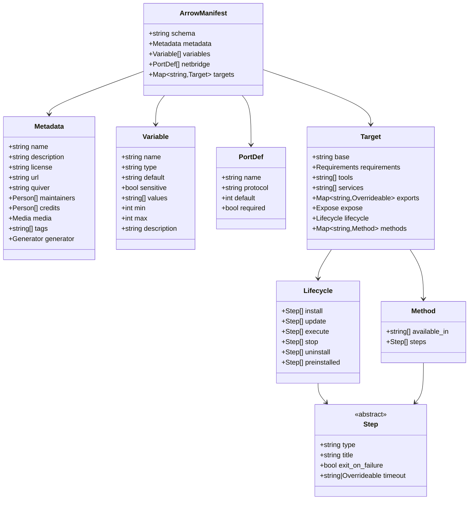
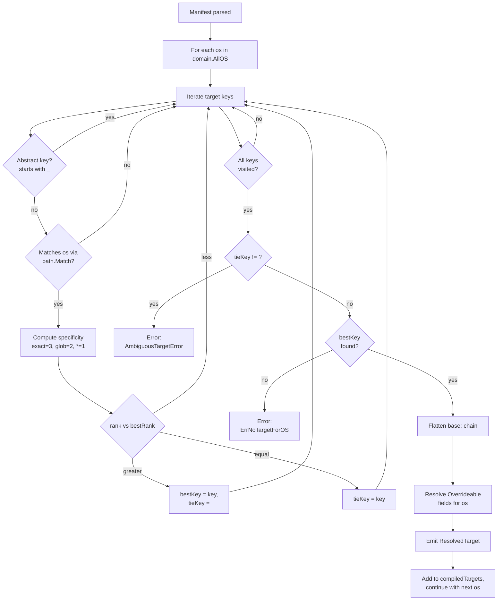

# Arrow Manifest — `arrow@v0` Spec

This document is the normative specification for the `arrow@v0` manifest format. All tooling
must conform to this document.

Cross-references: [versioning.md](./versioning.md) · [domain.md](../../domain.md) ·
[manifold.md](../../manifold.md) · [deptree.md](../../deptree.md) ·
[netbridge.md](../../netbridge.md)

---

## 1. Overview

An Arrow manifest describes a piece of software Quiver can install, run, and manage. It is
expressed as YAML — either standalone, embedded in a fenced markdown block, or contained
inside a Collection. The `arrow@v0` format introduces:

- **Per-platform `targets:`** as the first-class mechanism for expressing platform-specific
  recipes (`linux/amd64`, `darwin/arm64`, `linux/*`, `*`, etc.).
- **`base:` inheritance** between targets so platforms that share most of their recipe can
  reuse a common parent.
- **`Overrideable[T]` scalars** that handle per-arch variance within a single glob target —
  typically a download URL or binary name.
- **`tools:` / `services:` / `exports:`** as the explicit Arrow-to-Arrow relationship surface,
  replacing a single flat `dependencies:` list.

Pre-refactor manifests (no `targets:` section) are rejected at parse time. See
[§15 Migration note](#15-migration-note).

### 1.1 Progressive complexity tiers

Not every Arrow needs every feature. The format is designed so simple cases stay simple:

| Tier | Pattern | Typical use case |
|------|---------|-----------------|
| **1 — Universal** | Single `*` target, no `base:`, no Overrideable | Cross-platform, identical steps everywhere |
| **2 — Platform-aware** | Multiple targets, optional `base:`, optional Overrideable | Platform-specific steps or downloads |
| **3 — Multi-Arrow system** | `exports:`, `services:`, Overrideable on exports | Arrows that coordinate with other Arrows |

Developers should start at the lowest tier that covers their needs.

---

## 2. File forms

An `arrow@v0` manifest is delivered to Quiver in one of three file forms. The translator
accepts all three through the same entry point — it sniffs for a markdown fenced block first,
falling back to bare YAML.

| Form | Filename convention | Where it lives | Encoding |
|------|---------------------|----------------|----------|
| Standalone YAML | `arrow.yaml` | A repository whose root holds a single Arrow | YAML |
| Collection-scoped YAML | `<path>.yaml` | A `quiver-hosted` repository whose root holds a Collection; each Arrow's on-disk location is whatever `path:` its collection entry declares — see [collection.md §3.2](collection.md#32-arrow-entries), not necessarily the repository root | YAML |
| Markdown form | `ARROW.md` / `<path>.md` | Anywhere either of the above is accepted | Markdown with a fenced ` ```arrow ` block (see §2.1) |

The choice between `arrow.yaml` and `<path>.yaml` is purely a matter of where the Arrow lives:
a stand-alone repository uses `arrow.yaml`; an Arrow that ships inside a Collection lives at
whatever `path:` its collection entry declares — see
[collection.md §3.2](collection.md#32-arrow-entries). The manifest body is identical in both
cases.

### 2.1 Markdown form

When the file is markdown (`ARROW.md` / `<path>.md`), Quiver extracts the **first** fenced
codeblock whose opening fence is exactly the four characters ` ``` ` followed immediately by
the word `arrow`. Schematically:

    # My Arrow

    Some prose describing the Arrow for human readers.

    ```arrow
    schema: "arrow@v0"
    metadata:
      name: example
    targets:
      "*":
        lifecycle:
          install: []
          uninstall: []
    ```

    Any other prose can follow.

Extraction rules (`internal/engine/manifold/translator/markdown.go`):

- Only the first ` ```arrow ` block is read; subsequent ones are ignored.
- Other fence languages (`yaml`, `bash`, etc.) are not treated as Arrow content.
- An unclosed block is rejected.
- Carriage returns (`\r`) are stripped — CRLF and LF inputs are equivalent.
- An empty block is allowed structurally but will fail later validation (no `schema:`).

Once extracted, the YAML inside the block is passed through the same parser, schema validator,
mapper, and ruleset as a `arrow.yaml` file. There is no other difference between the two forms.

The prose surrounding the fenced block — before it, after it, or both — is captured separately as
the arrow's readme and served at `GET /v0/arrow/{ns}/readme`. An `arrow.yaml` manifest carries no
such prose, so it has no readme.

### 2.2 Schema declaration

Every manifest body must declare its schema as the first concern. Two YAML keys are accepted —
`schema:` is canonical, and `manifest:` is a legacy alias preserved by the translator
(`internal/engine/manifold/translator/parse.go::extractSchemaField`):

```yaml
schema: "arrow@v0"     # canonical
```

```yaml
manifest: "arrow@v0"   # legacy alias — accepted, but prefer `schema:`
```

The value must match `<schema-type>@<version>`. For an Arrow manifest:

- `<schema-type>` must be exactly `arrow`.
- `<version>` must be `v0` (the only version currently registered in `arrow.Registry`).

Any deviation is a parse-time error.

---

## 3. Top-level structure

```yaml
schema: "arrow@v0"           # required — exactly this string

metadata:                    # required (name is mandatory)
  name: string               # required — display name (≤ 255 chars)
  description: string        # optional — short one-line description (≤ 1000 chars)
  license: string            # optional — SPDX identifier
  url: string                # optional — homepage or documentation URL
  quiver: string             # optional — Quiver namespace this Arrow belongs to
  maintainers:               # optional
    - name: string           # required within entry
      email: string          # optional
      url: string            # optional
  credits:                   # optional — attribution to upstream authors
    - name: string
      email: string          # optional
      url: string            # optional
  media:                     # optional
    icon: string             # URL to icon image
    banner: string           # URL to banner image
  tags:                      # optional — free-form strings for store discovery
    - string
  generator:                 # optional — written by Quiver on synthesized manifests, see §3.2
    name: string             # required within generator — heuristics id, e.g. fletcher/1
    confidence: string       # required within generator — high | medium | low
    warnings: [string]       # optional

variables:                   # optional — manifest-level user-configurable parameters
  - name: string             # required — identifier used in ${VAR} interpolation
    type: string             # optional — one of: string, number, boolean, select
    default: string          # optional — default value (always a YAML string)
    description: string      # optional
    sensitive: boolean       # optional — display hint only, not a security boundary
    values: [string]         # optional — allowed values; required when type is select
    min: integer             # optional — minimum value (numeric variables)
    max: integer             # optional — maximum value (numeric variables)

netbridge:                   # optional — declared port intent
  - name: string             # required — identifier used in ${PORT} interpolation
    protocol: string         # required — one of: tcp, udp, tcp/udp
    default: integer         # optional — default port (1..65535 if non-zero)
    required: boolean        # optional (default: false)

targets:                     # required — at least one entry; see §4
  <target-key>:
    base: string             # optional — parent target key (see §5)
    requirements:            # optional — minimum system resources
      cpu_cores: integer     # ≥ 1
      ram_gb: integer        # ≥ 1
      disk_gb: integer       # ≥ 1
    tools:                   # optional — install-time tools/libraries
      - string               # namespace, optionally versioned
    services:                # optional — runtime service Arrows
      - string
    exports:                 # optional — named values exposed to dependents
      <name>: string         # plain string OR Overrideable map (§6)
    expose:                  # optional — CLI and desktop registration, see §7.4
      cli: [entries]
      desktop: [entries]
    lifecycle:               # required in every concrete (non-abstract) target
      install:   [steps]     # required if uninstall is present, see §8.3
      update:    [steps]     # optional — standalone (no pair)
      execute:   [steps]     # optional — service kind only
      stop:      [steps]     # optional — required only if execute is present
      uninstall: [steps]     # required if install is present (may be `[]`)
      preinstalled: [steps]  # optional — detect an existing install, see §8.6
    methods:                 # optional — developer-defined custom actions
      <method-name>:
        available_in: [string]   # required — states (ready / running)
        steps: [steps]
```

The top-level `variables:` and `netbridge:` sections are the Arrow's public contract — the
form the user fills in before install and the ports Netbridge allocates. Both are global:
they apply uniformly across all platforms and never live inside a target. Per-platform scalar
variance in step commands is handled by Overrideable fields (§6), not by variables.

**There is no `version:` field.** A manifest is always fetched at a git ref, and the resolved
ref *is* the version. Nothing anywhere carries a second copy of it: the aggregate records
the ref it resolved to (`Resolved.Ref`) and has no version field, while every read model,
cache entry and API response identifies an arrow by the `namespace@selector` it follows. A
manifest that restated its own version had to be edited in the very commit that got tagged,
and when the two drifted nothing detected it. See [versioning.md](./versioning.md) for the
resolution rules and `${REF}` (§10.1) for using the ref inside steps.

A `version:` key under `metadata:` is tolerated and ignored. The schema still lists the
property — `Metadata` sets `additionalProperties: false`, so dropping it would turn the key
into a hard validation error — but no Go type models it, so the authored value has nowhere to
land and is discarded during translation. Old manifests keep validating unchanged; they simply
no longer influence anything. Write nothing there.

### 3.1 Manifest tree


```mermaid
classDiagram
    class ArrowManifest {
        +string schema
        +Metadata metadata
        +Variable[] variables
        +PortDef[] netbridge
        +Map~string,Target~ targets
    }
    class Metadata {
        +string name
        +string description
        +string license
        +string url
        +string quiver
        +Person[] maintainers
        +Person[] credits
        +Media media
        +string[] tags
        +Generator generator
    }
    class Variable {
        +string name
        +string type
        +string default
        +bool sensitive
        +string[] values
        +int min
        +int max
        +string description
    }
    class PortDef {
        +string name
        +string protocol
        +int default
        +bool required
    }
    class Target {
        +string base
        +Requirements requirements
        +string[] tools
        +string[] services
        +Map~string,Overrideable~ exports
        +Expose expose
        +Lifecycle lifecycle
        +Map~string,Method~ methods
    }
    class Lifecycle {
        +Step[] install
        +Step[] update
        +Step[] execute
        +Step[] stop
        +Step[] uninstall
        +Step[] preinstalled
    }
    class Step {
        <<abstract>>
        +string type
        +string title
        +bool exit_on_failure
        +string|Overrideable timeout
    }
    class Method {
        +string[] available_in
        +Step[] steps
    }

    ArrowManifest --> Metadata
    ArrowManifest --> Variable
    ArrowManifest --> PortDef
    ArrowManifest --> Target
    Target --> Lifecycle
    Target --> Method
    Lifecycle --> Step
    Method --> Step
```

The on-disk shape is mapped into the runtime types defined in `internal/domain/` —
`domain.Arrow`, `domain.Target`, `domain.TargetLifecycle`, `domain.Variable`,
`domain.Requirement`, `domain.Method`, and `netbridge.PortDef`. See [domain.md](../../domain.md)
for the runtime contract.

### 3.2 `metadata.generator` — synthesized manifests

`generator:` marks a manifest Quiver synthesized itself (Fletcher, see
[manifold.md §4.1](../../manifold.md#41-fletcher--synthesized-manifests)) for a repository
that ships no `ARROW.md` / `arrow.yaml`. It travels inside the manifest bytes so that a
manifest re-parsed from the vault cache keeps its origin and confidence.

| Field | Required | Meaning |
|-------|----------|---------|
| `name` | yes | Heuristics identifier that produced the manifest (`fletcher/1`). |
| `confidence` | yes | `high`, `medium` or `low` (schema enum). Fletcher refuses a `low` build instead of emitting it. |
| `warnings` | no | Why confidence is not `high`: `assumed_arch`, `emulated`, `windows_exe_unverified`, `name_mismatch`, `unpinned_rolling_tag`. |

An Arrow's **origin** is derived from it: `inferred` when `generator.name` is non-empty,
`declared` otherwise. Hand-written manifests should omit `generator:`; the API reports any
manifest carrying it as inferred.

---

## 4. Targets

### 4.1 Target key forms

Every key in `targets:` is one of three forms:

| Form | Example | Description |
|------|---------|-------------|
| Exact | `linux/amd64` | Matches exactly one concrete `GOOS/GOARCH` |
| Glob | `linux/*`, `*/arm64`, `*` | Standard glob — `*` matches any single path segment |
| Abstract | `_common`, `_unix` | Key starts with `_`; never selected at runtime |

Concrete `GOOS/GOARCH` values Quiver recognises (`internal/domain/os.go`):

```
linux/amd64    linux/arm64
windows/amd64  windows/arm64
darwin/amd64   darwin/arm64
```

Any other `GOOS/GOARCH` is unrecognised and the runtime cannot match it.

### 4.2 Target selection — flowchart


```mermaid
flowchart TD
    A[Manifest parsed] --> B[For each os in domain.AllOS]
    B --> C[Iterate target keys]
    C --> D{Abstract key?<br/>starts with _}
    D -- yes --> C
    D -- no --> E{Matches os via<br/>path.Match?}
    E -- no --> C
    E -- yes --> F[Compute specificity<br/>exact=3, glob=2, *=1]
    F --> G{rank vs bestRank}
    G -- greater --> H[bestKey = key,<br/>tieKey = ""]
    G -- equal --> I[tieKey = key]
    G -- less --> C
    H --> C
    I --> C
    C --> J{All keys<br/>visited?}
    J -- no --> C
    J -- yes --> K{tieKey != ""?}
    K -- yes --> L[Error:<br/>AmbiguousTargetError]
    K -- no --> M{bestKey<br/>found?}
    M -- no --> N[Error:<br/>ErrNoTargetForOS]
    M -- yes --> O[Flatten base: chain]
    O --> P[Resolve Overrideable<br/>fields for os]
    P --> Q[Emit ResolvedTarget]
    Q --> R[Add to compiledTargets,<br/>continue with next os]
```

`SelectTarget(os)` lives in `internal/engine/manifold/translator/arrow/v0/selector.go`; the
all-OS loop lives in `internal/engine/manifold/compiler/compiler.go`. The compiler skips an
OS that returns `ErrNoTargetForOS` (the Arrow simply does not support that platform) but
fails the whole add operation on `AmbiguousTargetError` or any other selection error.

### 4.3 Compilation result

The aggregate stores the compiled result on the `Arrow` value as a `map[OS]Target`
(`Targets map[OS]Target` in `domain/arrow.go`). At runtime the app layer does a single map
lookup using `domain.CurrentOS()`; a missing key means "this Arrow does not support your
platform".

Platform compatibility is **implicit**: the keys of the compiled `Targets` map are exactly
the supported platform set. No separate declaration is needed.

If zero OS values compile successfully, the Arrow is rejected at validation time
(`ValidateCompiled` in `ruleset.go` raises `no_supported_platform`).

### 4.4 Specificity ranking

Among all non-abstract keys that match a given runtime OS:

| Rank | Form | Examples |
|------|------|----------|
| 3 | Exact | `linux/amd64`, `darwin/arm64` |
| 2 | One wildcard, non-catch-all | `linux/*`, `*/arm64` |
| 1 | Catch-all | `*` |

The highest rank wins. A tie between two keys with equal rank is a parse-time
`AmbiguousTargetError` — no two equally-specific keys may both match the same concrete
`GOOS/GOARCH`.

### 4.5 Abstract targets

A target whose key starts with `_` is abstract:

- It is never selected at runtime and never appears in the compiled `Targets` map.
- It may only be referenced via `base:`.
- It may omit `lifecycle:` entirely (useful as a base that only provides exports, methods, or
  a partial lifecycle).
- The `OverrideableCoverageRule` skips abstract targets — coverage is only enforced on
  concrete targets where it would actually matter at runtime.

---

## 5. `base:` inheritance

### 5.1 Purpose

`base:` allows a concrete (or abstract) target to inherit all fields from a single parent
target and selectively override what differs. It replaces copy-paste between platforms that
share most of their recipe.

```yaml
targets:
  _common:
    lifecycle:
      execute:
        - type: run
          command: ./server
          title: Starting server
          timeout: 10s
      stop:
        - type: signal
          signal: graceful
          timeout: 10s
          exit_on_failure: false
      uninstall: []

  "linux/*":
    base: _common
    lifecycle:
      install:
        - type: run
          command: ./setup.sh
          title: Installing
          timeout: 5m
      # execute, stop, uninstall inherited from _common
```

### 5.2 Override rules

The `base:` chain is walked in `selector.go::flattenBaseChain`. After flattening, child fields
override parent fields with these rules:

| Field category | Behavior |
|----------------|----------|
| Scalar requirement values (`cpu_cores`, `ram_gb`, `disk_gb`) | Child non-zero values override parent; zero means inherit |
| `tools:` and `services:` lists | Child overrides parent wholesale when non-`nil` |
| `exports:` map | Key-by-key merge; child entries override matching parent entries |
| `methods:` map | Key-by-key merge; child entries override matching parent entries |
| Lifecycle hooks (`install`, `update`, `execute`, `stop`, `uninstall`, `preinstalled`) | Child non-`nil` list wins wholesale; `nil` means inherit. An empty list `[]` is **not** `nil` — it is an explicit "I declare this hook empty" |

The rule is intentional and consistent: **what you write, you own**. If a child target
declares a lifecycle hook (even `[]`), it owns that hook entirely; if it does not declare it,
the base's version applies unchanged.

### 5.3 Constraints

- **Single parent only.** `base:` takes one key — multi-parent inheritance is not supported.
- **No cycles.** A chain that revisits a key is a `cyclic_base` error
  (`base_integrity.go::checkBaseChain`).
- **Parent must exist.** Referencing a missing target key is a `missing_base` error.

---

## 6. Overrideable fields

### 6.1 Purpose and scope

`Overrideable[T]` (defined in `internal/domain/runtime/step/overrideable.go`) handles scalar
variance within an otherwise-identical recipe. Its natural home is inside glob targets, where
the containing target matches multiple concrete `GOOS/GOARCH` values and a single scalar
(typically a download URL or binary name) differs per arch.

The Overrideable scalar fields are exactly:

| Step type | Overrideable fields |
|-----------|---------------------|
| `run` | `command`, `elevated`, `timeout` |
| `fetch` | `url`, `to`, `checksum`, `timeout` |
| `extract` | `from`, `to`, `timeout` |
| `signal` | `signal`, `timeout` |

Plus, `exports:` values are also Overrideable strings.

`type`, `title`, and `exit_on_failure` are **never** overrideable — `type` is fixed per step,
`title` is display-only, and `exit_on_failure` is a single bool flag captured outside the
overrideable mechanism.

### 6.2 YAML representation

A scalar field is either a plain scalar (no override) or a mapping with `GOOS/GOARCH`-pattern
keys and an optional `default:`. The two forms are mutually exclusive on a given field:

```yaml
# Plain scalar — identical on all platforms the target matches
command: ./mytool

# Overrideable — value varies per arch
url:
  linux/amd64: https://example.com/tool-linux-amd64.tar.gz
  linux/arm64: https://example.com/tool-linux-arm64.tar.gz

# Overrideable with default — fallback for unmapped arches
command:
  default: ./mytool
  "windows/*": '.\mytool.exe'
```

Glob keys (`linux/*`, `*/arm64`, `*`) are resolved on step fields and on `exports:` alike,
with the same specificity ranking. See §6.5.

The `default:` key is consumed by the YAML unmarshaller (`overrideableV0.UnmarshalYAML`) and
becomes `Default`; all other keys land in the `OSArch` map.

### 6.3 Key format

Every key in an Overrideable map (other than `default:`) must be either:

- The catch-all `*`, or
- A string containing `/` — i.e. a full `GOOS/GOARCH` exact key (`linux/amd64`) or a glob
  containing `/` (`linux/*`, `*/arm64`).

Bare OS family names (`linux`, `windows`, `darwin`) are rejected by `OverrideableKeysRule`.

### 6.4 Coverage rule

For every Overrideable field on a concrete target, every concrete `GOOS/GOARCH` value the
containing target can match must be reachable via either a non-empty `Default` or a key that
matches via `path.Match`. This is enforced by `OverrideableCoverageRule`:

- A non-empty `default:` always satisfies coverage.
- Otherwise, every value in `domain.AllOS()` must match at least one key in `OSArch`.
- Abstract targets are skipped — they never run.

Unreachable concrete `GOOS/GOARCH` values are a parse-time error.

This rule and step-field resolution (§6.5) are both glob-aware and use the same `path.Match`,
so a field that satisfies coverage through a glob resolves through that same glob.

### 6.5 Resolution

Every Overrideable field — `exports:` values and step fields alike — is resolved once, at
**compile time**, by `selector.go::resolveOverrideable`: the moment a precompiled target is
flattened into a `domain.Target` for one concrete `GOOS/GOARCH`. Nothing is resolved again at
step-execution time; a resolved step carries the single chosen value and no key map at all.

| Where | Resolver | Glob keys (`linux/*`, `*/arm64`, `*`) |
|-------|----------|----------------------------------------|
| `exports:` values | `selector.go::resolveOverrideable` | **Resolved** |
| Step fields (`run`, `fetch`, `extract`, `portable`, `signal`) | `selector.go::resolveStepList` → `resolveOverrideable` | **Resolved** |

`resolveOverrideable` selects the best-matching key for the target OS using the same
specificity ranking as target selection (§4.4): exact key (rank 3) beats a glob containing
`*` (rank 2), which beats the bare catch-all `*` (rank 1). Among the keys that match, the
most specific wins. If no key matches, the `Default` value is returned — so `default:` is the
fallback for unmatched platforms, not a competitor to a key that does match.

```yaml
# Resolves on every platform: one glob per OS family.
command:
  "darwin/*": ./mytool
  "linux/*": ./mytool
  "windows/*": '.\mytool.exe'
```

```yaml
# Equivalent, and equally valid: exact keys still win where both could match.
command:
  "*": ./mytool
  windows/amd64: '.\mytool.exe'
  windows/arm64: '.\mytool.exe'
```

An equal-specificity tie raises `AmbiguousTargetError` and the manifest is rejected at parse
time, naming both keys — resolution never picks a winner out of map iteration order:

```yaml
# REJECTED — on windows/amd64 both keys match and neither is more specific.
command:
  "windows/*": '.\mytool.exe'
  "*/amd64": ./mytool-amd64
```

This applies identically to `install`, `update`, `execute`, `stop`, `uninstall`,
`preinstalled` and to custom `methods:` steps, and to every Overrideable field each step type
carries (§6.1).

> **History.** Until this was fixed, step fields went through `Overrideable.Resolve` — a plain
> exact-key map lookup — so a glob key on a step field never matched and the field fell
> through to `Default`, or to the empty string when there was none. Because
> `OverrideableCoverageRule` was already glob-aware, such a manifest parsed clean and then
> handed the shell an empty command, which exits 0 and reports success. Manifests written with
> exact keys to work around this remain correct: an exact key is the most specific there is.
> `Overrideable.Resolve` still exists and is still an exact lookup, but it now only ever sees
> values this resolution has already flattened.

---

## 7. Arrow relationships

Arrows can relate to other Arrows in two distinct ways. Both are declared per-target, since
relationship needs can vary per platform.

### 7.1 `tools:` — install-time tools and libraries

`tools:` lists Arrows that must be installed before this Arrow installs. Their binaries and
files are available via exports (§7.3) or `${namespace.INSTALL_PATH}`. They are never started
or stopped by this Arrow's lifecycle.

```yaml
tools:
  - github.com/valve/steamcmd
```

### 7.2 `services:` — runtime service dependencies

`services:` lists service Arrows that must be running alongside this Arrow during execution.
Declaring an Arrow in `services:` implies install-time installation as well. The same
namespace must not appear in both `tools:` and `services:` within the same target —
`ToolsServicesRule` raises `tools_services_overlap`.

```yaml
services:
  - github.com/char2cs/myapp/database
```

A target that declares any `services:` must also define both `execute:` and `stop:` —
otherwise the consumer would have no way to bracket the service's lifetime. This is enforced
by `ServiceConsumerLifecycleRule`.

### 7.3 `exports:` — named values exposed to dependents

`exports:` is how an Arrow exposes a stable interface to Arrows that depend on it. Instead of
dependents reaching into `INSTALL_PATH` and guessing file locations, the Arrow declares named
exports, and dependents reference them by name.

Export values are Overrideable static strings. **Variable interpolation (`${VAR}`) is not
allowed inside an export value** — `ExportStaticRule` raises `export_var_interpolation` if it
finds `${` inside a resolved export. Exports must be fully static so they can be resolved at
compile time and stored on the aggregate.

```yaml
# steamcmd.yaml
targets:
  "*":
    exports:
      steamcmd:
        default: ./steamcmd.sh
        "windows/*": ./steamcmd.exe
      python: /usr/bin/python3
```

Dependents reference exports via `${namespace.EXPORT_NAME}`:

```yaml
# cs2.yaml
tools:
  - github.com/valve/steamcmd

targets:
  "linux/*":
    lifecycle:
      install:
        - type: run
          command: ${github.com/valve/steamcmd.steamcmd} +app_update 730 +quit
          title: Installing CS2 via SteamCMD
          timeout: 30m
```

The variable resolver (consumed by the wizard before steps run) anchors relative export
values against the dependency's `INSTALL_PATH` automatically. Absolute export values are
passed through as-is.

`${namespace.INSTALL_PATH}` is implicitly available for every Arrow regardless of whether it
defines an `exports:` section.

### 7.4 `expose:` — CLI and desktop registration

`expose:` declares CLI commands and desktop entries this Arrow wants registered on the host
system. Quiver — not this Arrow — applies and removes these registrations (the wizard, as the
last steps of `_install`/`_update` and the first of `_uninstall`; outside the scope of this
document); the manifest only declares intent.

```yaml
targets:
  "*":
    expose:
      cli:
        - name: mytool
          path: "${INSTALL_PATH}/bin/mytool"
      desktop:
        - name: MyApp
          path: auto
          icon: "${INSTALL_PATH}/icon.png"
          categories: [Utility]
```

`cli:` and `desktop:` are each a list of entries with:

| Field | Required | Meaning |
|-------|----------|---------|
| `name` | yes | Identifier for the registration. Must match `^[A-Za-z0-9][A-Za-z0-9._+-]{0,63}$`. |
| `path` | yes | `auto` (Quiver resolves the target at install time, see below) or a value starting with `${INSTALL_PATH}` or `${WORKDIR}`. Must not contain `..`. |
| `icon` | no | Empty (no icon), an `http://`/`https://` URL, or a path starting with `${INSTALL_PATH}` or `${WORKDIR}` with no `..`. `auto` is **not** accepted for `icon` — it is only meaningful for `path`. |
| `categories` | no | Free-form desktop menu categories. |

Per-OS meaning:

- **`cli`** — on macOS and Linux, a symlink in `~/.quiver/bin` pointing at the resolved path;
  putting `~/.quiver/bin` on `PATH` is a one-time, explicit user action (`POST
  /v0/system/path`, `quiver path setup`), which appends — never prepends. On Windows the
  resolved path must be an `.exe` inside the workdir, and its folder is appended to the user
  `Path` (never prepended, existing entries kept) as part of the Arrow's own install/update,
  and dropped by its uninstall — so the command is the executable's own name, whatever the
  entry's `name`. On macOS and Linux, a declared `cli`
  target that is a regular file inside the workdir but lacks exec bits is marked executable. On `darwin/arm64`
  an unsigned Mach-O `cli` target outside any `.app` bundle is ad-hoc signed.
- **`desktop`** — macOS: the `.app` bundle moved to `/Applications`, falling back to
  `~/Applications` if that is not writable; `path` must end in `.app` unless it is `auto`.
  Linux: a `.desktop` file in `~/.local/share/applications`. Windows: a `.lnk` Start Menu
  shortcut under `Programs\Quiver\`.

**`path: auto`.** Resolved against the installed workdir when the entries are applied:

- `cli` — every executable file in the workdir is scanned, down to four levels deep (hidden
  directories skipped). One executable → it. Several → those whose file name equals the
  repository name or the entry's `name`; failing that, every executable at the shallowest depth
  found. Each is registered under the executable's own base name (`.exe`
  stripped on Windows), not the entry's `name`: a `ripgrep` entry resolving to `rg` exposes
  `~/.quiver/bin/rg` (on Windows, the folder holding `rg.exe`). Ownership, collision and prune checks all use that name.
- `desktop` — candidates are taken from the first of these sources that yields any:
  1. the apps in `${WORKDIR}/.quiver-apps.json`, the record `portable` writes (§8.5). The
     record is untrusted input: it is read only when it is a regular file of at most 1 MiB
     inside the workdir, and an app is kept only when its `entry` is a non-empty relative path
     that stays inside the workdir (symlinks included) and exists — on Linux and Windows an
     executable regular file by the same rule the `cli` scan uses (exec bits; `.exe` on
     Windows), on macOS an `.app` bundle directory. An app `name` that is not a safe file name
     is replaced by the entry file's stem (`.exe` stripped; on macOS the bundle's own name is
     always used), and the app is skipped when that is not safe either. An `icon` failing the
     path checks (it must be a regular file) is dropped; the app is kept. A missing, oversized
     or malformed record counts as absent;
  2. the workdir's top-level `.app` bundles (macOS), `.AppImage` files (Linux) or `.exe` files
     (Windows); on macOS, once moved out of the workdir, the bundles this arrow placed;
  3. Linux and Windows only: the executable scan `cli` uses, keeping only files named after the
     repository or the entry's `name` — so a GUI app shipped as an archive gets a desktop entry.

  One candidate → it; several → the one named after the repository or the entry (a record app
  by its `name`); otherwise refused as ambiguous. On macOS the bundle is placed under its own
  name (`CC Switch.app` stays `CC Switch.app`, whatever the entry's `name` or the record's app
  `name`); once moved out of the workdir, a re-apply finds it again as the bundle this arrow
  placed. On Linux and Windows the launcher is named after the entry's `name`.
- A Linux `.desktop` file's `Name=` is the record app's `name` when the candidate came from
  the record (and contains no control characters), otherwise the entry's `name`; the file name
  always derives from the entry's `name`. `Icon=` takes the first that is set of: the entry's
  `icon`, the record app's `icon`, the arrow's media icon; only a local path is written, so a
  URL there yields no `Icon=` line.
- An `auto` entry that resolves to nothing (no executable, no desktop application) is skipped
  silently: it produces neither an entry nor a refusal. A declared path that does not exist is
  still refused as `target not found`. A workdir scan that fails (for example on an unreadable
  directory) is not a skip: it fails the apply, for `desktop` and `cli` alike.

`auto` is meant for synthesized manifests (§3.2). The ruleset accepts it in any manifest,
because it cannot tell declared bytes from synthesized ones; hand-written manifests should
spell the path out.

**When it happens.** Quiver applies the entries as the last steps of `install` and `update`
and removes them with the first step of `uninstall`. An update replaces the previous ref's
entries of the same name in one pass; a run that fails before its expose steps leaves the
previous entries in place. Each entry is reported as an ordinary step result of the run,
`completed` when placed, `failed` when refused (with a reason such as `owned by <ns>`, `exists
and is not managed by quiver`, `ambiguous auto resolution`); a refusal never fails the run.

Both lists follow the same glob-target inheritance as every other target field (§5.2): a
child target's `cli`/`desktop` list replaces the parent's when declared (even as `[]`); when
the child omits the key entirely (`nil`), it inherits the parent's list unchanged.

**Ownership and collisions.** A registration Quiver did not create — owned by another Arrow, or
by the user (a file Quiver never wrote) — is never overwritten. Ownership lives on the entry
itself, with no separate store: a symlink pointing into the Arrow's workdir, a Windows user
`Path` entry inside the Quiver namespaces directory, an
`X-Quiver-Namespace=` line in a `.desktop` file, an extended attribute on a moved `.app` naming
both the namespace and the bundle's own file name (so a Finder copy under another name is the
user's, never pruned), a
shortcut under the `Quiver` Start Menu folder whose description names the owner. On Windows,
an entry `name` that is a reserved device name (`CON`, `NUL`, `COM1`, …) or ends in a dot or a
space is refused. `ExposeEntriesRule` also
rejects duplicate `name`s within the same kind (`cli` or `desktop`) inside one target; the same
`name` may appear once in `cli` and once in `desktop`.

---

## 8. Lifecycle

### 8.1 Hooks

Each target's `lifecycle:` section can define six hooks. Their state-machine semantics live
in [domain.md](../../domain.md) — refer to that document for the complete state diagram.

| Hook | Pair | State transition (high level) |
|------|------|-------------------------------|
| `install` | install/uninstall | absent → installing → ready |
| `uninstall` | install/uninstall | * → uninstalling → removed |
| `update` | standalone | ready → updating → ready |
| `execute` | execute/stop | ready → running |
| `stop` | execute/stop | running → stopping → ready |
| `preinstalled` | standalone | runs at `Add`, before any state exists — see §8.6 |

The install execution always begins with a synthetic Step 0 — `type: dependencies` — injected
by Quiver. Manifests must not declare this step type themselves; `NoDependenciesStepRule`
raises `no_dependencies_step`. See [deptree.md](../../deptree.md) for the dependency
resolution flow.

### 8.2 Working directory

All steps execute with `${INSTALL_PATH}` as the working directory. Relative paths in `run`
commands (`./mytool`, `./setup.sh`) and `fetch` destinations (`to: ./binary`) are relative to
`INSTALL_PATH`. Every step's `${INSTALL_PATH}` and `${WORKDIR}` resolve to the same path.

### 8.3 Pairing rules

The `LifecyclePairsRule` enforces:

| Constraint | Field | Rule code |
|------------|-------|-----------|
| `install` and `uninstall` must both be defined, or `install` alone if every step is a workdir-anchored `fetch`/`extract` (see below), or both absent | `lifecycle.install` | `missing_pair` |
| `uninstall` without `install` is always invalid | `lifecycle.install` | `missing_pair` |
| `stop` requires `execute` | `lifecycle.stop` | `missing_pair` |

`execute` without `stop` **is allowed** — it covers tools that run once and exit on their own.
`stop` without `execute` is always invalid because there is nothing to stop.

**Install-only is allowed when nothing needs undoing.** An `install:` with no matching
`uninstall:` is valid iff every one of its steps is `fetch` or `extract` and that step's `to`
— the resolved default and every `OSArch` override — is *anchored* to `${INSTALL_PATH}` or
`${WORKDIR}`: the value must equal one of those two placeholders exactly, or continue with a
`/` immediately after it, and must not contain a `..` path segment anywhere. `${WORKDIR}extra`
(no `/` boundary) and `${WORKDIR}/../../etc/passwd` (a `..` escape after an otherwise valid
boundary) are both rejected as unanchored — only `${WORKDIR}`, `${WORKDIR}/...` and the
`${INSTALL_PATH}` equivalents count. Fetching or extracting into the Arrow's own working
directory leaves nothing behind that `quiver remove` needs a dedicated `uninstall:` to clean
up — removing `${INSTALL_PATH}` already does that. Any other step in `install:` (a `run` step,
a `fetch`/`extract` writing outside the workdir) still requires a paired `uninstall:`.

`update:` is standalone — it has no required pair. It runs in-place inside the existing
installation directory, preserving user data and runtime artifacts. If the current platform's
target omits `update:`, `quiver update` updates by reinstall instead: it resolves the ref the
arrow tracks (the recommended ref when a version check already found one, else the installed
constraint, a pinned ref, or the latest ref of its channel), moves the catalog row onto it and
runs that ref's `install:` in the new ref's own workdir. The old ref's row is removed, and its
workdir with it, without running its `uninstall:`. An arrow already at that ref is refused with
`cannot update: arrow is up to date`, unless it is `outdated` (its dependency set changed), in
which case the update only syncs its dependencies. A reinstall takes no variables (refused with
`cannot update with variables`), and a target ref that is already catalogued is refused as
already existing. Synthesized manifests never declare `update:`, since their `install:` pins
the exact release asset of one ref.

### 8.4 Service vs. package (kind inference)

Quiver infers the Arrow kind from the presence of `execute` (service) or absence (package)
across all compiled targets. `ServicePackageRule` rejects mixed manifests:

- **Package** — no compiled target declares `execute`.
- **Service** — every compiled target declares `execute`.
- **Mixed** — some compiled targets have `execute`, others do not. Raises `mixed_kind`.

There is no explicit `kind:` field — the structure is the declaration.

### 8.5 Step types

The JSON Schema enum (`schema.json`) accepts exactly five authored step types: `run`, `fetch`,
`extract`, `portable`, `signal`. Plus the synthetic `dependencies` type, which is rejected from
manifest input.

| `type` | Purpose | Required fields | Optional fields | Overrideable fields |
|--------|---------|-----------------|-----------------|---------------------|
| `run` | Execute a shell command | `command` | `elevated`, `ui`, `title`, `timeout`, `exit_on_failure` | `command`, `elevated`, `timeout` |
| `fetch` | Download a remote file | `url`, `to` | `checksum`, `title`, `timeout`, `exit_on_failure` | `url`, `to`, `checksum`, `timeout` |
| `extract` | Extract an archive to a directory | `from`, `to` | `title`, `timeout`, `exit_on_failure` | `from`, `to`, `timeout` |
| `portable` | Materialize an app package as a runnable, Quiver-owned app | `from`, `to` | `name`, `title`, `timeout`, `exit_on_failure` | `from`, `to`, `timeout` |
| `signal` | Send a cross-platform shutdown signal | `signal` | `title`, `timeout`, `exit_on_failure` | `signal`, `timeout` |

All steps also accept these common fields:

- `title` — human-readable label shown in the UI.
- `timeout` — maximum duration. Must match `^\d+[sm]$` — e.g. `30s`, `5m`. Hours, fractional
  values, and compound durations (`1h30m`) are rejected by `TimeoutFormatRule`.
- `exit_on_failure` — boolean. **Defaults to `true`** when omitted (`mapper.go::resolveExitOnFailure`).
  Set to `false` for steps that may fail without aborting (e.g. cleanup steps).

#### `run` — shell command

```yaml
- type: run
  command: ./mytool serve --addr ${LISTEN_ADDR}
  title: Starting mytool server
  timeout: 10s
  elevated: false             # optional; default false
  exit_on_failure: true       # optional; default true
```

When `elevated: true`, the command runs with platform-specific privilege escalation (sudo on
Linux/macOS, UAC on Windows). `elevated` is Overrideable — different platforms can opt in or
out independently.

##### `ui`: an interface for as long as the run lives

```yaml
execute:
  - type: run
    command: ./quiver-chat -listen "${ARROW_UI_LISTEN}"
    title: Starting Quiver Chat
    ui:
      title: Quiver Chat        # optional, shown in the shell
      path: /                   # optional, default "/"
      listen: [unix]            # optional, default [unix]
```

`run` is the only step that may carry a `ui` node, and the schema rejects it on any other
step type. The interface exists exactly while that run's process runs: it opens when the run
starts and closes when the run exits, whatever the cause (any exit code, a signal, a failure to
start, a timeout, a cancel or a stop). The method then continues without it. There is no
lifetime, sync or until field. Each `run` of a method may declare its own `ui`; steps are
sequential, so two never overlap.

`ui` works in every method that runs steps: `install`, `update`, `execute`, `stop`,
`uninstall` and custom methods. It is rejected in `preinstalled` (§8.6). While it is open it
appears as `active_run.surface` on the runtime and is served under `/v0/ui/{ns}/`.

| Field | Default | Meaning |
|-------|---------|---------|
| `title` | none | Name the shell shows for the interface |
| `path` | `/` | Initial path the shell opens. Must start with `/` |
| `listen` | `[unix]` unless `static` is set | Transports the arrow serves on. Kinds are `unix` and `pipe`; v0 provisions a unix socket only, so the list must include `unix` (`[pipe]` alone is rejected: "pipe is not provisioned in v0; include unix") |
| `static` | none | Alternative to `listen`: a directory relative to `INSTALL_PATH` the daemon serves read-only. It must exist, be a directory, and stay inside the install directory after symlinks are resolved |

`listen` and `static` are mutually exclusive. `upstream` (proxying to a TCP port) is not
supported in v0 and the schema rejects it.

With `listen`, the daemon provisions a unix socket address for the run and hands it over as
`${ARROW_UI_LISTEN}` (§10.1). The variable is valid only in the `command` of a run whose own
`ui` listens (explicitly or by default). It is rejected in any other run and in the run of a
`static` ui, by `run_ui`.

With `static`, the daemon serves the folder and the run is only the lifetime anchor: the
interface closes when the run exits, so the run has to be a long-running process even though it
serves nothing. A `static` ui that does not reference `${ARROW_UI_LISTEN}` is fine. The usual
keep-alive pattern is a command that blocks, for example `sleep infinity` on unix targets.
See [../../surface.md](../../surface.md).

#### `fetch` — remote download

```yaml
- type: fetch
  url:
    linux/amd64: https://example.com/binary-linux-amd64
    linux/arm64: https://example.com/binary-linux-arm64
  to: ./binary
  checksum: abc123...           # optional
  title: Downloading binary
  timeout: 5m
```

The optional `checksum` field is a case-insensitive SHA-256 hex digest, accepted in three forms:
bare (`abc123...`), algorithm-tagged with a case-insensitive `sha256:` prefix
(`sha256:abc123...`, `SHA256:abc123...`, the form GitHub publishes release asset digests in),
or `sha256sums:<url>[#<entry>]`, which names a published `sha256sum` list (`<hex>  ./<name>`
per line, as a release's `checksums.txt`) and takes the digest of `<entry>` from it. The entry
defaults to the file name of the fetched URL, and a list without it fails the step: a list
that does not vouch for the download is not a reason to accept it.
Surrounding whitespace is ignored. The `url` (and the list's) must be `http` or `https`; any
other scheme or a path is refused instead of being copied from the local machine.
The handler computes the downloaded file's own SHA-256 and compares it against the digest, and
removes the downloaded file when the two differ. Any other algorithm prefix (`sha512:`, `md5:`,
...) is rejected with an "unsupported checksum algorithm" error rather than reported as a
mismatch. The download timeout is governed by the step's `timeout` and applied at the
resolver layer.

The download is written to a uniquely named file beside `to`, verified there, and only then
renamed over `to` in one step, taking the mode of the file it replaces (an executable
fetched again stays executable). A download that fails (transport, timeout, checksum) never
touches `to`, so whatever it held before stays. Renaming, rather than writing into `to`,
also replaces a file that is being executed: a process running the old file keeps its own
image (writing into a running executable fails on Linux with "text file busy" — quiver.core's
second self-update in one daemon lifetime downloads over the binary it is running). Where
the OS refuses to replace a file in use (a running executable on Windows), the old file is
renamed aside first. Staging files a crashed download left and files moved aside are removed
by a later fetch of the same `to` once they are more than a day old and nothing uses them,
so a concurrent fetch of the same `to` never loses the staging file it is writing. A `to` naming a directory is
refused.

#### `extract` — archive extraction

```yaml
- type: extract
  from: ./myserver.tar.gz
  to: ./
  title: Extracting server
  timeout: 5m
```

`extract` unpacks an archive's files with no interpretation of what they are. Supported
formats are detected from content, not from the `from` extension: tar (plain, and
`.gz`/`.xz`/`.bz2`/`.zst` compressed), zip, and a single compressed file (`.gz`, `.xz`, `.bz2`,
`.zst`).

`to` is a directory, created if missing, and is anchored against `${INSTALL_PATH}` the same
way `fetch`'s `to` is (§8.2). Extraction refuses any archive entry whose resolved path would
escape `to` — an absolute path, a `../` traversal, or a symlink target leaving the destination
— and fails the step without writing anything outside `to`. It also fails once the total
uncompressed size exceeds the daemon's `arrows.extract_max_bytes` config (default 8 GiB), or
once the archive holds more than 1,000,000 entries.
Executable bits are preserved from tar modes and zip external attributes.

`extract` refuses an AppImage or a `.dmg` outright, with an error pointing at `portable`
(`ErrPortableFormat`): those are app packages, not archives to unpack blindly, and materializing
one as a runnable app is `portable`'s job.

#### `portable` — portable app

```yaml
- type: portable
  from: ${INSTALL_PATH}/bruno.AppImage
  to: ${INSTALL_PATH}
  title: Install Bruno
  timeout: 15m
```

`portable` materializes an app package as a runnable, Quiver-owned app inside the workdir.
`from`, `to`, path anchoring and timeout semantics are identical to `extract`. The optional
`name` is the file name a bare executable, or the payload of a single-file compressed archive
(`.gz`, `.xz`, `.bz2`, `.zst` holding one file, not a tar), is installed under (see 3 and 4
below); every other format ignores it. It must match `^[A-Za-z0-9][A-Za-z0-9._+-]{0,63}$`, so
it is always a single path element, must not end in a dot, and must not be a Windows
device name (`CON`, `PRN`, `AUX`, `NUL`, `COM1`–`COM9`, `LPT1`–`LPT9`, in any case, with or
without an extension) (`portable_name` rule, `invalid_name`); it is not overrideable. The same
`arrows.extract_max_bytes` and 1,000,000-entry caps apply to everything `portable` writes.

Format is detected from content, in this order:

1. **AppImage type 2** (ELF magic, `AI\x02` at byte 8) — the embedded squashfs image is read in
   pure Go and its contents written to `<to>/<stem>` (`<stem>` is `from`'s file name without a
   case-insensitive `.AppImage` suffix, or the file name plus `.AppDir` when it has none).
   Symlinks whose target is absolute or escapes the AppDir are skipped, not fatal. Type 1
   (`AI\x01`, ISO 9660) fails as unsupported. The image is unpacked into a hidden staging
   directory `<to>/.<stem>.quiver-tmp` (a leftover from an interrupted run is removed first) and
   only moved to `<to>/<stem>` once extraction, validation and the launcher all succeed, so a
   corrupt or oversized download never touches the installed AppDir. An existing `<to>/<stem>` is
   replaced only when it holds a `.quiver-run` launcher; any other directory there is left
   untouched and the step fails.
2. **DMG** (`koly` trailer) — `darwin/*` targets only; fails elsewhere.
3. **Archive** — anything `extract` accepts, unpacked into `to` with `extract`'s rules; a
   single-file compressed payload is written as `<to>/<name>` when the step sets `name`.
4. **Bare executable** (ELF, Mach-O, or PE) — copied to `<to>/<name>` when the step sets
   `name`, else to `<to>/<base name of from>`, with mode `0755`.
5. Anything else fails with `unknown format`.

On success, `from` is removed when it lies inside the workdir and is not the output itself.

**Owned destinations.** When `from` and `to` both lie inside the workdir (`to` strictly inside
it, never the workdir itself, and `from` not inside `to`) and `to` does not exist yet,
`portable` owns `to`, the application's own directory. It installs into a hidden staging
directory next to it, `<parent of to>/.<base of to>.quiver-tmp`, then writes a
`.quiver-portable` marker holding `from`'s workdir-relative path (whatever the package placed at
that name is removed first, never followed). Only then is `to` swapped: the previous `to` is
renamed to `<parent of to>/.<base of to>.quiver-old`, the staging directory is renamed to `to`,
and the old copy is deleted. If the second rename fails, the old copy is renamed back. Leftover
staging and old copies from an interrupted run are removed at the start of the next one. A later
run with the same `from` finds its marker and replaces `to` this way, whatever the format, so
nothing of the previous release survives, and a failed install leaves the previous `to` in
place. Any other `to` is never removed: the step installs into it as described above, merging
with what is there. That covers the workdir itself, a `to` outside the workdir, a directory the
user or another step created, and one owned by a different `from`. Anything written into an
owned `to` by something else, including data the application keeps next to itself, is lost on
the next run.

For an AppImage, `portable` reads the AppDir's root `.desktop` file for a display name
(`Name=`), a launch command (`Exec=`, desktop-entry-quoted, vendor arguments preserved), and an
icon (`Icon=`, resolved against the standard hicolor/`.DirIcon` search order), then writes
`<AppDir>/.quiver-run` — a small, relocatable launcher script that sets `APPDIR` and execs
`AppRun` with the vendor arguments, so it keeps working wherever the AppDir is moved.

`portable` records what it learned in `${WORKDIR}/.quiver-apps.json` (`domain.PortableRecord`,
`domain.PortableRecordFile`): an AppImage yields one app whose `entry` is the launcher; a DMG,
or an archive unpacked on a `darwin/*` target, yields one app per top-level `.app` bundle
written; other archives and bare executables record nothing. The record is merged by `entry` —
a re-run replaces its own apps and keeps the others, and a recorded app with the same `name` but a
different `entry` (an older build) is dropped — and written atomically. A `to` outside the
workdir still installs, but nothing is recorded, so no desktop entry is derived from the record.

#### `signal` — cross-platform process control

```yaml
- type: signal
  signal: graceful              # graceful | kill | interrupt
  timeout: 10s
  exit_on_failure: false
```

The `signal` value is an enum (`step.SignalKind`):

| Value | Linux / macOS | Windows |
|-------|---------------|---------|
| `graceful` | `SIGTERM` | `Stop-Process` |
| `kill` | `SIGKILL` | `taskkill /F` |
| `interrupt` | `SIGINT` | `GenerateConsoleCtrlEvent` |

#### `dependencies` — synthetic, never written by hand

The `dependencies` step type is reserved for the runtime. It is injected as Step 0 of every
install execution (so dependency resolution participates in step-level progress reporting) and
cannot appear in a manifest. The mapper rejects it explicitly; `NoDependenciesStepRule` is the
final guard.

### 8.6 `preinstalled` — detecting an existing install

`preinstalled:` is an **optional, opt-in** hook that answers one question: *is the software
this Arrow describes already present on this machine, put there by something other than
Quiver?* An Arrow that does not declare it behaves exactly as it always did.

```yaml
targets:
  darwin/arm64:
    lifecycle:
      preinstalled:
        - type: run
          command: test -d "/Applications/MyApp.app"
          title: Looking for an existing install
          timeout: 5s
      install:
        - type: run
          command: ./install.sh
          title: Installing
          timeout: 5m
      uninstall: []
```

**When it runs.** At `Add` time (`POST /v0/arrow/:ns`), after the manifest resolves and
*before* the catalog row is written. It is not a state transition and it does not appear in
the state diagram: it runs while the Arrow has no runtime aggregate at all.

**What the answer means.** Every declared step must succeed for the probe to count as a
detection. On a detection, the Arrow's runtime is landed directly at `ready` and the catalog
row is written with `user_installed: true` — the Arrow is treated as installed without
`install:` ever running. Any step failing is the ordinary negative answer, "not detected":
the Add proceeds normally and the Arrow starts out absent, exactly as it would have without
the hook. A probe failure is never an error that fails the Add.

Because a successful probe *skips installing software*, it is treated as a claim that has to
be earned. A probe that cannot verify anything — no steps, or a `run` step whose command
resolves to the empty string — is refused as "not detected" rather than accepted (`sh -c ""`
exits 0, which would otherwise read as a successful detection). Every probe is also bounded
at 30 seconds in total regardless of what the manifest's own `timeout` values say, because it
runs synchronously on the Add request.

**Restricted variable set.** A probe runs before any workdir, aggregate, execution or
netbridge allocation exists for the namespace, so it is expanded against a strict subset of
§10.1:

| Available | Not available |
|-----------|---------------|
| `${ARROW_NAMESPACE}`, `${PLATFORM}`, `${REF}` | `${WORKDIR}`, `${INSTALL_PATH}` |
| Manifest `variables:` **that declare a `default:`** | Netbridge port names |
| | Manifest variables with no `default:` |

`VariableRefsRule` enforces this: referencing an unavailable name inside a `preinstalled`
step is a parse-time `unresolved_variable` error, not a silent expansion to empty. In
particular, a check for software Quiver did not install has no use for the directory Quiver
*would* have installed it into — hence no `${WORKDIR}` / `${INSTALL_PATH}`.

**Other rules.** `preinstalled` is a full lifecycle key everywhere else too: it inherits and
is overridden through `base:` by the same rules as the other five (§5.2), its steps are
checked by `overrideable_keys`, `overrideable_coverage`, `timeout_format` and
`no_dependencies_step`, and it has no pairing requirement of its own — it is standalone, like
`update:`. It plays no part in service-vs-package kind inference (§8.4). A `ui` node on a
`run` is rejected in `preinstalled` by `run_ui`: a probe opens no surface and is given no socket.

---

## 9. Methods

Methods are developer-defined custom actions. Unlike lifecycle hooks they do not transition
the Arrow between states; they are actions the user can invoke when the Arrow is in a
specific state.

### 9.1 Structure

```yaml
methods:
  <method-name>:
    available_in: [string]   # required — enum[]: ready, running
    steps: [steps]           # required
```

### 9.2 Per-target autonomy

Each target declares only the methods that are meaningful for it. There is no cross-target
method contract — a method that exists on `linux/*` does not need to exist on `windows/*` and
vice versa.

`available_in` is also per-target; a `restart` method may gate on `[running]` on Linux and
`[ready, running]` on Windows.

### 9.3 `available_in` gating

Valid states are exactly `ready` and `running` (`MethodStatesRule.validMethodStates`). Any
other value is `invalid_state`.

The runtime enforces `available_in` at invocation time — invoking a method from a state not
in its list returns an error to the caller.

---

## 10. Variable resolution pipeline

The app layer assembles the variable map after target compilation and hands it to the wizard,
which substitutes every `${...}` reference into `run.command`, `fetch.url` and `fetch.to` just
before the step runs. Assembly uses a layered priority stack; later layers override earlier
ones.

| Priority | Source | Example |
|----------|--------|---------|
| 1 (lowest) | Built-in runtime variables | `${INSTALL_PATH}`, `${WORKDIR}`, `${ARROW_NAMESPACE}`, `${PLATFORM}`, `${REF}` |
| 2 | Dependency exports + their built-ins | `${github.com/valve/steamcmd.steamcmd}` |
| 3 | Manifest-level `variables:` defaults | `variables[].default` |
| 4 | Netbridge port allocations | Port `name` → allocated port number as string |
| 5 | Stored variables | Most recent completed execution — answers only: never a built-in such as `${REF}` or a dependency's value, which are computed for every run |
| 6 (highest) | User-provided overrides | Key-value pairs from the request body |

### 10.1 Built-in variables

| Variable | Description |
|----------|-------------|
| `${INSTALL_PATH}` | Home directory for this Arrow |
| `${WORKDIR}` | Alias for `INSTALL_PATH` (recognised by the variable-refs rule) |
| `${ARROW_NAMESPACE}` | This Arrow's full namespace |
| `${PLATFORM}` | Current platform as `GOOS/GOARCH` (e.g. `linux/amd64`) |
| `${ARROW_UI_LISTEN}` | Unix socket address the arrow serves its interface on. Set only for a method with a `run` step whose `ui` listens; valid only in that run's `command`; see §8.5 |
| `${REF}` | The git ref the arrow resolved to (e.g. `v1.2.0`, `main`) — during `_update`, the ref being updated to — verbatim, with no version derived from it. Never the selector: `pkg@stable` runs with `${REF} = v1.2.0` |

These five names, plus `${ARROW_UI_LISTEN}`, are also registered in `VariableRefsRule.buildKnownVars` so step-field
references to them do not trigger `unresolved_variable` errors.

`preinstalled:` steps get a strict subset of this table — only `${ARROW_NAMESPACE}`,
`${PLATFORM}`, `${REF}` and manifest variables that declare a `default:`. A probe runs before
any workdir, execution or port allocation exists, so nothing supplies the rest. See §8.6.

`${REF}` is substituted verbatim — no version is derived from it, and no `${VERSION}` exists.
It is the arrow's resolved ref, not its selector, so an arrow followed as `crowbar@stable`
still downloads from a real release (see [versioning.md §7.1](./versioning.md#71-ref)).
Where an Arrow ships in the same repository it installs from, this lets a release-asset URL
be written once instead of being re-edited for every tag:

```yaml
- type: fetch
  url: https://github.com/char2cs/crowbar/releases/download/${REF}/crowbar-universal.dmg
  to: ./crowbar.dmg
```

Because the ref lands in the URL *path*, a stale reference can only miss inside a real
release, which `404`s. It can no longer silently resolve to a file from a different release.

For an Arrow that ships inside a Collection, `${REF}` is the ref of the Collection's
repository — it says nothing about the version of third-party software the Arrow downloads
from an upstream host.

### 10.2 Reference syntax

- `${NAME}` — a single token without `.` or `:`. Must resolve to a built-in, a manifest
  variable, or a netbridge port name. Otherwise `unresolved_variable`.
- `${namespace.NAME}` — a dependency reference. The variable-refs rule **skips** these (they
  contain `.`); they are validated by the dep-edge / export-resolution layer instead.

### 10.3 What Quiver substitutes, and what it does not

`${...}` is the manifest's syntax for injecting Quiver's own variables. It is not an
environment-variable mechanism: Quiver never adds its variables to the process environment, so
a `run` step's command inherits the ordinary OS environment and `$HOME` and `$PATH` keep
behaving normally.

Substitution happens on the raw string before it reaches the shell — the shell only ever sees
final values. Exactly two rules apply:

| Form | Result |
|------|--------|
| `${NAME}` / `${namespace.NAME}` that Quiver resolved | replaced with the value |
| `${NAME}` that Quiver did not resolve | **left verbatim** — a typo stays visible instead of silently becoming an empty string |

Every other dollar form belongs to the shell and reaches it byte for byte: `$HOME`, `$PATH`,
`"$@"`, `$1`, `$?`, `$(cmd)`, backticks, `${VAR:-default}`, `${#VAR}`, `$$` and `\$`. A bare
`$NAME` is always the shell's — Quiver only ever consumes the `${` … `}` form. Note that
`${VAR:-default}` is left alone because its brace body is `VAR:-default`, which is not a name
Quiver resolved; the lookup key is the entire body, never the identifier inside it.

---

## 11. Variables

### 11.1 Types

`domain.VariableType` accepts four values:

| Type | Meaning | Validation hooks |
|------|---------|------------------|
| `string` | Free-form text | None beyond name |
| `number` | Integer-bounded value | `min` / `max` may be set; `min > max` is rejected |
| `boolean` | True/false | None beyond name |
| `select` | One-of values | `values:` must be non-empty (`missing_values`); `default`, if present, must be a member |

### 11.2 Default value

`Default` is always parsed as a YAML string (`schema.json`: `"default": { "type": "string" }`).
A user supplying `default: 5` for a `number` variable should quote it as `default: "5"` —
otherwise the YAML library will accept it but the schema validator will reject it before
reaching the mapper.

### 11.3 Validation

`VariablesRule` runs `Variable.Validate()` on each entry and additionally enforces:

- Names are unique (`duplicate_name`).
- Names are non-empty and ≤ 255 chars.
- For `type: select`, `values:` must be non-empty.
- If `default` is set, it must appear in `values:` (for select variables).
- If both are set, `min ≤ max`.

---

## 12. Validation rules

All rules apply at parse time. The orchestrator runs **precompile rules** on the raw
`PrecompiledTarget` map and **compiled rules** on the per-OS-resolved `Targets` map. Each rule
is a separate `*.go` file under `internal/engine/manifold/ruleset/arrow/`.

### Precompile rules (run on the raw, pre-target-selection shape)

| Rule | File | What it checks |
|------|------|----------------|
| `metadata` | `metadata.go` | `name` non-empty + ≤ 255 chars; `description` ≤ 1000 chars |
| `variables` | `variables.go` | Per-variable validity, uniqueness, select needs `values` |
| `netbridge` | `netbridge.go` | Per-port validity (name, protocol, range), uniqueness |
| `base_integrity` | `base_integrity.go` | No cycles in `base:`; parent must exist |
| `overrideable_keys` | `overrideable_keys.go` | Every key is `*` or contains `/`; bare OS names rejected |
| `overrideable_coverage` | `overrideable_coverage.go` | Every concrete OS the target matches is reachable; abstract targets skipped |

### Compiled rules (run on the per-OS resolved `domain.Target` map)

| Rule | File | What it checks |
|------|------|----------------|
| `tools_services` | `tools_services.go` | Same namespace must not appear in both `tools:` and `services:` of one target |
| `export_static` | `export_static.go` | Resolved export values must not contain `${` (no variable interpolation) |
| `variable_refs` | `variable_refs.go` | Every `${TOKEN}` (without `.` or `:`) must resolve to a known name; `preinstalled` steps are held to the restricted set in §8.6 |
| `service_package` | `service_package.go` | Manifest must not mix service targets and package targets |
| `lifecycle_pairs` | `lifecycle_pairs.go` | `install`/`uninstall` paired, unless `install` is workdir-anchored `fetch`/`extract` only (§8.3); `stop` requires `execute` |
| `service_consumer_lifecycle` | `service_consumer_lifecycle.go` | Targets with `services:` must define both `execute` and `stop` |
| `timeout_format` | `timeout_format.go` | Every `timeout` matches `^\d+[sm]$` |
| `method_states` | `method_states.go` | Every `available_in` value is `ready` or `running` |
| `no_dependencies_step` | `no_dependencies_step.go` | `type: dependencies` may not appear in any manifest step list |
| `expose_entries` | `expose_entries.go` | Every `expose` entry's `path` is `auto` or workdir-anchored with no `..`; `icon` is empty, an http(s) URL, or workdir-anchored with no `..` (`invalid_expose_icon`); `name` matches `^[A-Za-z0-9][A-Za-z0-9._+-]{0,63}$`; darwin `desktop` paths end in `.app` unless `auto`; no duplicate `name` within a kind |
| `run_ui` | `run_ui.go` | For the `ui` node of a `run` step: none in `preinstalled`; `listen` and `static` are mutually exclusive; every `listen` kind is `unix` or `pipe` and the list includes `unix` (v0 provisions no pipe); `static` is a local relative path; `path` starts with `/`; `${ARROW_UI_LISTEN}` in a `run` command only when that run's own `ui` listens |
| `portable_name` | `portable_name.go` | A `portable` step's optional `name` matches `^[A-Za-z0-9][A-Za-z0-9._+-]{0,63}$`, does not end in a dot, and is not a Windows device name (`CON`, `PRN`, `AUX`, `NUL`, `COM1`–`COM9`, `LPT1`–`LPT9`, any case, with or without an extension) (`invalid_name`) |

### Aggregate post-checks

After all compiled rules have run, `ruleset.go::ValidateCompiled` adds one final check:

- If the compiled `Targets` map is empty (zero supported platforms), raise
  `no_supported_platform` on the `targets` field. This is the catch-all for an Arrow whose
  target keys cover no platform in `domain.AllOS()`.

### Selection-time errors

Some failures only surface during `SelectTarget` (called by the compiler):

- `AmbiguousTargetError` — two non-abstract keys with equal specificity match the same OS.
- `ErrNoTargetForOS` — no key matches the OS. This is **not** an error per se; the compiler
  treats it as "this Arrow does not support that platform" and simply omits the OS from the
  compiled map.

---

## 13. Use cases

The four examples below are the canonical worked manifests for `arrow@v0`.

---

### 13.1 Universal package — Claude Skill (WASM plugin)

**Tier 1.** A WASM plugin that runs identically on all platforms. Single `"*"` target; no
`execute`/`stop`, so the Arrow is a package, not a service.

```yaml
schema: "arrow@v0"

metadata:
  name: anthropic.claude-skill-web-search
  description: Web search skill for Claude Code
  license: Apache-2.0
  quiver: github.com/anthropic/claude-skills
  url: https://anthropic.com/claude-code
  maintainers:
    - name: Anthropic
      url: https://anthropic.com
  tags:
    - claude
    - skill
    - ai

variables:
  - name: SEARCH_PROVIDER
    type: select
    default: "default"
    values: ["default", "google", "bing"]
    description: Search provider backend
  - name: SEARCH_API_KEY
    type: string
    default: ""
    description: API key for the selected search provider
    sensitive: true

targets:
  "*":
    lifecycle:
      install:
        - type: fetch
          url: https://skills.anthropic.com/web-search/v1.0.0/skill.wasm
          to: ./skill.wasm
          title: Downloading web search skill
          timeout: 5m
        - type: run
          command: ./skill.wasm --setup --provider ${SEARCH_PROVIDER}
          title: Configuring skill
          timeout: 2m
      uninstall: []

    methods:
      reconfigure:
        available_in: [ready]
        steps:
          - type: run
            command: ./skill.wasm --setup --provider ${SEARCH_PROVIDER}
            title: Reconfiguring skill
            timeout: 2m
```

---

### 13.2 Linux-only service — game server

**Tier 2.** A Linux-only game server. `linux/*` target with Overrideable URLs per arch.
Service kind. Demonstrates per-arch URL variance within a glob target and Netbridge port
allocation.

```yaml
schema: "arrow@v0"

metadata:
  name: char2cs.myserver
  description: My awesome Linux game server
  license: MIT
  quiver: github.com/char2cs/gaming.quiver
  maintainers:
    - name: char2cs
      email: me@char2cs.net

variables:
  - name: MAX_PLAYERS
    type: number
    default: "16"
    description: Maximum concurrent players
    min: 1
    max: 128

netbridge:
  - name: GAME_PORT
    default: 27015
    protocol: tcp/udp
    required: true

targets:
  "linux/*":
    requirements:
      cpu_cores: 2
      ram_gb: 4
      disk_gb: 20

    lifecycle:
      install:
        - type: fetch
          url:
            linux/amd64: https://releases.myserver.io/v1.0.0/myserver-linux-amd64.tar.gz
            linux/arm64: https://releases.myserver.io/v1.0.0/myserver-linux-arm64.tar.gz
          to: ./myserver.tar.gz
          title: Downloading server binary
          timeout: 10m
        - type: run
          command: tar -xzf ./myserver.tar.gz
          title: Extracting server
          timeout: 5m
        - type: run
          command: chmod +x ./myserver
          title: Setting executable bit
          timeout: 10s

      execute:
        - type: run
          command: ./myserver --port ${GAME_PORT} --maxplayers ${MAX_PLAYERS}
          title: Starting game server
          timeout: 30s

      stop:
        - type: signal
          signal: graceful
          timeout: 30s
          exit_on_failure: false

      uninstall:
        - type: run
          command: rm -f ./myserver ./myserver.tar.gz
          title: Removing server binary
          timeout: 30s
          exit_on_failure: false
```

The compiled `Targets` map will contain `linux/amd64` and `linux/arm64` only. The compiler
silently skips `windows/*` and `darwin/*` (no matching target → `ErrNoTargetForOS`); the
`no_supported_platform` rule does not fire because at least one OS does compile.

---

### 13.3 Cross-platform divergent install — Firefox

**Tier 2.** Three self-contained targets with no shared abstract base — each platform's
install is so different (`tar.bz2` + `chmod` on Linux, `.dmg` on macOS, MSI on Windows) that
sharing buys nothing. Methods are declared per-target.

```yaml
schema: "arrow@v0"

metadata:
  name: mozilla.firefox
  description: Mozilla Firefox web browser
  license: MPL-2.0
  url: https://www.mozilla.org/firefox/

variables:
  - name: FIREFOX_PROFILE
    type: string
    default: default
    description: Firefox profile name to create and use

targets:
  "linux/*":
    requirements:
      cpu_cores: 2
      ram_gb: 2
      disk_gb: 3

    lifecycle:
      install:
        - type: fetch
          url:
            linux/amd64: https://download.mozilla.org/?product=firefox-130.0&os=linux64&lang=en-US
            linux/arm64: https://download.mozilla.org/?product=firefox-130.0&os=linux64-aarch64&lang=en-US
          to: ./firefox.tar.bz2
          title: Downloading Firefox
          timeout: 15m
        - type: run
          command: tar -xjf ./firefox.tar.bz2
          title: Extracting Firefox
          timeout: 5m
        - type: run
          command: ./firefox/firefox --createprofile ${FIREFOX_PROFILE}
          title: Creating Firefox profile
          timeout: 1m

      execute:
        - type: run
          command: ./firefox/firefox --profile ${FIREFOX_PROFILE}
          title: Launching Firefox
          timeout: 15s

      stop:
        - type: signal
          signal: graceful
          timeout: 10s
          exit_on_failure: false

      uninstall:
        - type: run
          command: rm -rf ./firefox ./firefox.tar.bz2
          title: Removing Firefox
          timeout: 1m
          exit_on_failure: false

    methods:
      set-default-browser:
        available_in: [ready]
        steps:
          - type: run
            command: xdg-settings set default-web-browser firefox.desktop
            title: Setting Firefox as default browser
            timeout: 30s
            exit_on_failure: false

  "windows/*":
    requirements:
      cpu_cores: 2
      ram_gb: 2
      disk_gb: 3

    lifecycle:
      install:
        - type: fetch
          url:
            windows/amd64: https://download.mozilla.org/?product=firefox-130.0&os=win64&lang=en-US
            windows/arm64: https://download.mozilla.org/?product=firefox-130.0&os=win64-aarch64&lang=en-US
          to: ./firefox-setup.exe
          title: Downloading Firefox installer
          timeout: 15m
        - type: run
          command: '.\firefox-setup.exe /S /InstallDirectoryPath="${INSTALL_PATH}\firefox"'
          title: Installing Firefox silently
          timeout: 10m
        - type: run
          command: '.\firefox\firefox.exe --createprofile ${FIREFOX_PROFILE}'
          title: Creating Firefox profile
          timeout: 1m

      execute:
        - type: run
          command: '.\firefox\firefox.exe --profile ${FIREFOX_PROFILE}'
          title: Launching Firefox
          timeout: 15s

      stop:
        - type: run
          command: taskkill /IM firefox.exe /F
          title: Stopping Firefox
          timeout: 10s
          exit_on_failure: false

      uninstall:
        - type: run
          command: '.\firefox\uninstall\helper.exe /S'
          title: Uninstalling Firefox
          timeout: 5m
          exit_on_failure: false

    methods:
      clear-windows-registry:
        available_in: [ready]
        steps:
          - type: run
            command: 'reg delete "HKCU\Software\Mozilla\Firefox" /f'
            title: Clearing Firefox registry entries
            timeout: 30s
            exit_on_failure: false

  "darwin/*":
    requirements:
      cpu_cores: 2
      ram_gb: 2
      disk_gb: 3

    lifecycle:
      install:
        - type: fetch
          url:
            darwin/amd64: https://download.mozilla.org/?product=firefox-130.0&os=osx&lang=en-US
            darwin/arm64: https://download.mozilla.org/?product=firefox-130.0&os=osx-aarch64&lang=en-US
          to: ./Firefox.dmg
          title: Downloading Firefox disk image
          timeout: 15m
        - type: run
          command: hdiutil attach ./Firefox.dmg -mountpoint /Volumes/Firefox -nobrowse -quiet
          title: Mounting Firefox disk image
          timeout: 2m
        - type: run
          command: cp -R /Volumes/Firefox/Firefox.app ${INSTALL_PATH}/Firefox.app
          title: Copying Firefox to install directory
          timeout: 3m
        - type: run
          command: hdiutil detach /Volumes/Firefox -quiet
          title: Unmounting disk image
          timeout: 1m
          exit_on_failure: false

      execute:
        - type: run
          command: open -a ${INSTALL_PATH}/Firefox.app --args --profile ${FIREFOX_PROFILE}
          title: Launching Firefox
          timeout: 15s

      stop:
        - type: run
          command: osascript -e 'quit app "Firefox"'
          title: Stopping Firefox
          timeout: 10s
          exit_on_failure: false

      uninstall:
        - type: run
          command: rm -rf ${INSTALL_PATH}/Firefox.app ./Firefox.dmg
          title: Removing Firefox
          timeout: 2m
          exit_on_failure: false

    methods:
      set-default-browser:
        available_in: [ready]
        steps:
          - type: run
            command: defaultbrowser firefox
            title: Setting Firefox as default browser
            timeout: 30s
            exit_on_failure: false
```

---

### 13.4 Shared recipe with `_common` + `base:` — Go/Rust CLI

**Tier 2.** A Go or Rust CLI tool compiled for all six platforms. The execute/stop/uninstall
and all methods are identical across OS families; only `install` differs (download URL,
binary name, `chmod` on Unix). An abstract `_common` base holds the shared structure.
Overrideable `command` fields use `"windows/*"` + `default` to handle the
`./mytool` vs `.\mytool.exe` binary-name difference.

```yaml
schema: "arrow@v0"

metadata:
  name: char2cs.mytool
  description: My cross-platform CLI tool
  license: MIT

variables:
  - name: LISTEN_ADDR
    type: string
    default: "0.0.0.0:8080"
    description: Address and port the server binds to

targets:
  # Abstract base — shared execute/stop/methods across all platforms
  _common:
    lifecycle:
      execute:
        - type: run
          command:
            default: ./mytool serve --addr ${LISTEN_ADDR}
            "windows/*": '.\mytool.exe serve --addr ${LISTEN_ADDR}'
          title: Starting mytool server
          timeout: 10s

      stop:
        - type: signal
          signal: graceful
          timeout: 10s
          exit_on_failure: false

      uninstall: []

    methods:
      version:
        available_in: [ready, running]
        steps:
          - type: run
            command:
              default: ./mytool --version
              "windows/*": '.\mytool.exe --version'
            title: Checking installed version
            timeout: 5s

      config-reset:
        available_in: [ready]
        steps:
          - type: run
            command:
              default: ./mytool config reset
              "windows/*": '.\mytool.exe config reset'
            title: Resetting configuration to defaults
            timeout: 10s

  "linux/*":
    base: _common
    requirements:
      cpu_cores: 1
      ram_gb: 1
      disk_gb: 1

    lifecycle:
      install:
        - type: fetch
          url:
            linux/amd64: https://github.com/char2cs/mytool/releases/download/v2.1.0/mytool-linux-amd64
            linux/arm64: https://github.com/char2cs/mytool/releases/download/v2.1.0/mytool-linux-arm64
          to: ./mytool
          title: Downloading mytool
          timeout: 5m
        - type: run
          command: chmod +x ./mytool
          title: Setting executable bit
          timeout: 10s

  "darwin/*":
    base: _common
    requirements:
      cpu_cores: 1
      ram_gb: 1
      disk_gb: 1

    lifecycle:
      install:
        - type: fetch
          url:
            darwin/amd64: https://github.com/char2cs/mytool/releases/download/v2.1.0/mytool-darwin-amd64
            darwin/arm64: https://github.com/char2cs/mytool/releases/download/v2.1.0/mytool-darwin-arm64
          to: ./mytool
          title: Downloading mytool
          timeout: 5m
        - type: run
          command: chmod +x ./mytool
          title: Setting executable bit
          timeout: 10s

  "windows/*":
    base: _common
    requirements:
      cpu_cores: 1
      ram_gb: 1
      disk_gb: 1

    lifecycle:
      install:
        - type: fetch
          url:
            windows/amd64: https://github.com/char2cs/mytool/releases/download/v2.1.0/mytool-windows-amd64.exe
            windows/arm64: https://github.com/char2cs/mytool/releases/download/v2.1.0/mytool-windows-arm64.exe
          to: ./mytool.exe
          title: Downloading mytool
          timeout: 5m
      # no chmod step on Windows
```

The three concrete targets each inherit `lifecycle.execute`, `lifecycle.stop`,
`lifecycle.uninstall`, and both methods from `_common`; each adds only its own
`lifecycle.install`. The Overrideable `command` fields in `_common` use `"windows/*"` +
`default` keys — valid because the concrete targets collectively cover `windows/*`,
`linux/*`, and `darwin/*`, and `default` handles the Unix cases.

---

## 14. Honest gaps

The following are explicit non-goals for `arrow@v0`:

1. **Distro-level variance.** Ubuntu vs. Alpine vs. Arch Linux cannot be distinguished by
   target keys. Use runtime detection inside step commands.

2. **Libc variant targeting.** glibc vs. musl is not addressable by target keys. Ship a
   statically-linked binary or detect at install time.

3. **OS version gating.** Windows 10 vs. 11, macOS Sequoia vs. Ventura — not expressible as
   target keys. Handle in step commands.

4. **Non-primary OS support.** The `GOOS/GOARCH` enum covers Linux, Windows, and Darwin only.
   BSDs, illumos, and others are out of scope for v0.

5. **Sub-method step-level override.** A child rewriting a method's step list overrides it
   wholesale — there is no way to override a single step inside a method inherited via
   `base:`.

6. **Partial install rollback.** If install fails midway, Quiver transitions to the absent
   state and removes the workdir. Steps that produced external side effects (registering a
   Windows service, writing to system directories outside `INSTALL_PATH`) are not rolled
   back. Manifest authors should prefer reversible steps and defer irreversible ones to the
   end of the install sequence.

7. **Multi-Arrow files.** A single `arrow.yaml` declares exactly one Arrow. To ship multiple
   related Arrows together, use a `collection@v0` manifest; see
   `docs/spec/manifests/v0/collection.md` (for the collection spec) — the collection's
   `arrows:` list points to files at whatever `path:` each entry declares, `.yaml` or `.md`,
   anywhere in the repository.

---

## 15. Migration note

`arrow@v0` is still in active development. The pre-refactor v0 shape — with top-level
`lifecycle:`, `methods:`, `requirements:`, `dependencies:`, and Overrideable fields using
bare OS keys — is structurally incompatible with this spec.

The Manifold Translator **must reject** manifests that lack a `targets:` section with a
clear error (`mapper.go::toAggregate`):

> `this manifest uses the pre-refactor arrow@v0 shape (no "targets:" section); rewrite it
> according to docs/spec/manifests/v0/arrow.md — no migration shim is provided, v0 is still
> in development`

Similarly, Overrideable keys in the bare-OS format (`linux`, `windows`, `darwin`) are
rejected by `OverrideableKeysRule` — every key must be `*` or contain `/`.
