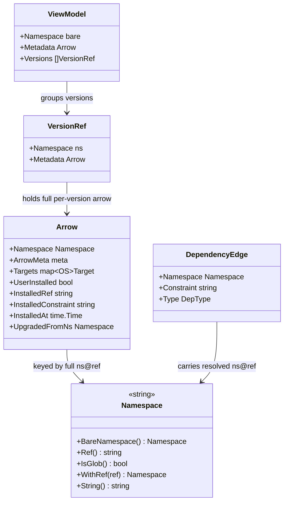
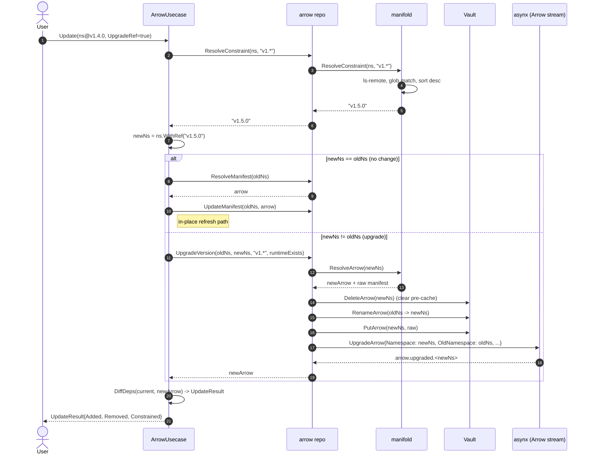

# Arrow Versioning Model

This document describes how Quiver identifies, resolves, and tracks versions of an
Arrow. It supplements [arrow.md](./arrow.md), [../../domain.md](../../domain.md),
[../../manifold.md](../../manifold.md), [../../deptree.md](../../deptree.md), and
[../../vault.md](../../vault.md).

---

## 1. Identity: `namespace@ref` is primary

A Quiver `Namespace` is a string of the form:

```
domain/user/repo[/auid][@ref]
```

The `@ref` suffix is part of the identity. Two arrows whose `@ref` differs are two
distinct aggregates with their own vault entry, dependency edges, and runtime — see
[domain.md §Namespace](../../domain.md). There is no separate "version" type; the
`Namespace` string is the key everywhere.

`Namespace` exposes the following accessors over the `@ref` suffix:

| Method | Returns |
|---|---|
| `BareNamespace()` | The namespace without the `@ref` suffix (`domain/user/repo[/auid]`) |
| `Ref()` | The substring after `@`, or `""` if absent |
| `IsGlob()` | `true` if `Ref()` contains `*` |
| `WithRef(ref)` | A new `Namespace` with `ref` replacing any existing ref; `WithRef("")` returns the bare namespace |

---

## 2. The `@ref` syntax

Three classes of refs are supported. All are valid wherever a namespace appears —
at the top level (`quiver add ...`) or inside a manifest's `tools:` / `services:`
lists.

| Class | Example | Meaning |
|---|---|---|
| Empty | `github.com/valve/steamcmd` | Latest — HEAD of the upstream default branch at fetch time (see §6) |
| Literal | `github.com/valve/steamcmd@v1.2.3` | Exact git tag, branch, or commit SHA — passed to fetchers unchanged |
| Literal | `github.com/valve/steamcmd@release-jan-2026` | Any literal ref the upstream resolves |
| Glob | `github.com/valve/steamcmd@v1.*` | Pattern resolved at install time against upstream tags (see §3) |
| Glob | `github.com/valve/steamcmd@2.*` | Glob; no `v` prefix required |

A ref is a glob if and only if it contains `*` — `Namespace.IsGlob()` checks
exactly this. Anything else is a literal and is forwarded to the fetchers as-is,
including the token `latest` (see §6 for how it relates to the empty form).

```yaml
tools:
  - github.com/valve/steamcmd              # empty ref -> latest
  - github.com/valve/steamcmd@v1.2.3       # exact pin
  - github.com/valve/steamcmd@v1.*         # glob -> resolved at add time

services:
  - github.com/char2cs/myapp/database@v2.*
```

---

## 3. Constraint resolution

When `Namespace.IsGlob()` is true, the manifold engine resolves the glob to a
concrete tag before any manifest fetch. The entry point is
`Manifold.ResolveConstraint(ctx, ns, pattern)`, called from
`arrow.ResolveForInstall` and from `graph.resolveEdgeNs` when walking dependency
edges. The implementation lives in
`internal/engine/manifold/resolver/resolvers/constraint.go`.

### 3.1 Algorithm

| Step | Action |
|---|---|
| 1 | Compute the upstream clone URL from `ns.BareNamespace().CloneURL()` |
| 2 | Run `git ls-remote` against the URL with the configured fetch timeout |
| 3 | Keep only refs where `Name().IsTag()` is true; collect `Short()` names |
| 4 | Filter by `path.Match(pattern, tagName)` — Go shell glob, not regex |
| 5 | If every matching tag parses as 2- or 3-part numeric semver (with optional leading `v`), sort numerically descending; otherwise sort lexicographically descending |
| 6 | Return the first element |
| 7 | If no tags match, return an error — the install is rejected |

Branches are not searched. Only annotated and lightweight tags. There is no
fallback to the default branch when no tags match.

### 3.2 What is stored after resolution

For top-level installs (`Arrow.Add`), `ResolveForInstall` returns the resolved
namespace plus the original glob pattern as a separate `constraint` string. The
arrow is stored with:

| Field | Value |
|---|---|
| `Namespace` | Concrete `namespace@<resolved-tag>` |
| `InstalledConstraint` | Original pattern (e.g. `v1.*`) — empty if the user did not supply a glob |
| `UserInstalled` | `true` for `quiver add`, `false` for transitive installs |

For dependency edges inside a manifest, the translator stores a
`DependencyEdge{Namespace, Constraint, Type}` — `Constraint` is `ns.Ref()` from the
manifest, `Namespace` carries the same ref unresolved. `graph.Resolve` calls
`ResolveConstraint` lazily as it walks the tree, replacing the edge namespace with
the concrete tag before recursing.

---

## 4. Multi-version coexistence

Two arrows with the same `BareNamespace()` but different `Ref()` are completely
distinct throughout the system. There is no conflict resolution and no SAT solving.

| Layer | Keying |
|---|---|
| Arrow aggregate (`asynx`) | Full `namespace@ref` string (`Namespace.String()`) |
| Vault | Full `namespace@ref`, URL-encoded as a flat filename |
| Vault workdir | Full `namespace@ref`, expanded as a directory tree under `namespacesPath` |
| Runtime aggregate | Full `namespace@ref` — each version has its own lifecycle state |
| Dep edge graph | Stored as `(from_ns_bare, from_version, to_ns_bare, to_version)` tuples |
| Catalog `ViewModel` | Bare namespace key, with a `Versions []VersionRef` slice for grouping |

`pkg@v1.0.0` and `pkg@v2.0.0` are two arrows. Both can be installed. Both can be
running. Removing one does not affect the other. The catalog read model groups them
under the bare namespace for display, but every other operation works on the full
namespace.



---

## 5. `UserInstalled` vs `InstalledConstraint`

The `Arrow` aggregate carries two independent fields that govern update behavior.

| Field | Set by | Meaning |
|---|---|---|
| `UserInstalled` | `Arrow.Add` (true) or `Arrow.AddDep` (false) | Whether the user explicitly requested this version. A dependency-only arrow can be promoted with `SetUserInstalled` (no demotion path) |
| `InstalledConstraint` | `Arrow.Add` from `ResolveForInstall` | The original glob the user typed (`v1.*`). Empty if the user supplied an exact ref or empty ref |
| `InstalledRef` | `MarkInstalled` after `_install` succeeds | The concrete ref that was installed, persisted onto the aggregate as a stamp |
| `InstalledAt` | `MarkInstalled` | Wall-clock time the install completed |
| `UpgradedFromNs` | `UpgradeArrow` only | The previous namespace, used by `arrow.upgraded.*` reactions to clean up the old aggregate |

`InstalledConstraint` is what makes the `--upgrade-ref` path of `Arrow.Update`
meaningful: only arrows with a non-empty constraint can be re-resolved to a newer
tag, because exact pins and empty refs have no constraint to re-evaluate.

The `Validate` rule on `AddArrow` rejects any command targeting an aggregate that
already exists — install of an existing `namespace@ref` is a no-op error. Promoting
a dep-installed aggregate uses `SetUserInstalled` instead.

---

## 6. Empty ref vs the literal `latest`

Empty-ref arrows are stored under the bare namespace key — `Namespace.String()`
equals `BareNamespace().String()` when `Ref()` is empty. There is no separate
"latest slot" directory or aggregate.

The empty ref affects three layers:

| Layer | Behavior with empty ref |
|---|---|
| HTTP fetcher | Uses the platform's `DefaultBranch` as the `{branch}` URL segment |
| Git fetcher | Omits `ReferenceName` from `CloneOptions` — clones default branch |
| Dep-edge graph projection | Normalizes the empty `from_version` to `domain.VersionLatestRef = "latest"` when writing rows in `internal/app/repositories/graph/internal/projections.go` |

Equivalence with the literal `@latest` is not symmetric:

- In the dep-edge store, an arrow keyed by `pkg` (empty ref) is recorded as
  `from_version = "latest"`. An arrow keyed by `pkg@latest` is also recorded as
  `from_version = "latest"`. From the graph's point of view they look identical.
- In every other layer (asynx aggregate, vault, runtime, catalog), `pkg` and
  `pkg@latest` are different keys. `Namespace.Ref()` returns `""` for the first
  and `"latest"` for the second.
- The fetchers behave differently too: empty triggers the default-branch path;
  `@latest` is sent to the upstream as a literal ref named `latest`, which the
  remote may or may not resolve.

`domain.VersionLatestRef = "latest"` is used only by the dep-edge projection.
Manifests should write the empty form (no `@ref` suffix) to mean "latest". The
literal `@latest` is supported but discouraged.

---

## 7. Manifest display version vs git ref

`ArrowMeta.Version` (the `version:` field at the top of the manifest) is a free-form
display string — `"1.4.0"`, `"v1.4.0"`, `"2026-01-build-3"`, anything. It is shown
in lists and detail views. It is independent from `Namespace.Ref()` and from
`InstalledRef`.

The only place these connect is `Arrow.Seed`:

> If the seed namespace has no `@ref` and the seeded manifest declares a non-empty
> `metadata.version`, the namespace is upgraded to `ns.WithRef(m.Version)` before
> writing to the vault. This is a convenience for offline-imported manifests so the
> identity reflects what the file declares.

Everywhere else, the display version is decorative. Two installs of the same
upstream tag with different display versions in their manifests produce two
arrows under the same `namespace@ref` key — they cannot coexist (the second
`AddArrow` is rejected).

---

## 8. Update flow

`ArrowUsecase.Update` has two branches, selected by `models.UpdateOptions.UpgradeRef`.

### 8.1 In-place manifest refresh (`UpgradeRef = false`, or constraint empty)

1. Refuse if the runtime is `running`.
2. Re-fetch the manifest for the same `Namespace` via `arrow.ResolveManifest`.
3. Compute `graph.DiffDeps(current, newArrow)` — added, removed, constrained changes.
4. Apply `UpdateArrowManifest` to the aggregate (replaces meta, variables, netbridge, targets in place).
5. If the arrow is `ready` and the dep set drifted, mark the runtime `outdated`
   so the user can opt in to re-install dependencies.

The aggregate's `Namespace` does not change. `InstalledRef` and
`InstalledConstraint` do not change. Only the manifest body is refreshed.

### 8.2 Constraint re-resolution (`UpgradeRef = true` and `InstalledConstraint != ""`)



Key points:

- The new aggregate is created with `UpgradeArrow.EmitEvent`, which sets
  `UpgradedFromNs = oldNs` so `OnArrowUpgraded` reactions can clean up the old
  runtime / mark the old aggregate forgotten.
- `UpgradeArrow.Validate` rejects the command if a `newNs` aggregate already
  exists — the upgrade target must be a fresh slot, not a collision.
- Vault `RenameArrow` moves the cached manifest file and metadata from `oldNs` to
  `newNs`. If a runtime for `newNs` already exists, the rename is skipped (the
  pre-existing slot owns its workdir already).
- Indirect dependencies are re-collected from the new manifest's `Targets[OS]`
  via `graph.SyncDependencies`, which fires from the `arrow.upgraded.*`
  subscription downstream. The dep diff returned to the caller distinguishes
  added (in new not old), removed (in old not new), and constrained (same
  namespace, different `Constraint` string).

### 8.3 Update commands surface

| Command | Path taken |
|---|---|
| `quiver update <ns>` | In-place refresh of the bare-keyed aggregate |
| `quiver update <ns@v1.2.3>` | In-place refresh of the exact-ref aggregate (no constraint to re-resolve) |
| `quiver update <ns@v1.4.0>` with `UpgradeRef=true` and `InstalledConstraint="v1.*"` | Constraint re-resolution; jumps to `<ns@v1.5.0>` if upstream has a newer match |
| Update of a `UserInstalled=false` arrow | Allowed, but typically driven by reaction from a parent's update |

There is no `DirectInstall: false` exclusion at the use-case layer; any arrow
with a constraint can be re-resolved.

---

## 9. Removal

`Arrow.Remove` calls `axArrow.Forget(ns.String())` against the full namespace.
The catalog projection (`removeVersionAndCleanup`) deletes the matching
`VersionRef` from the bare-keyed `ViewModel`; if no versions remain, the parent
`ViewModel` row is deleted. `OnForget` triggers a vault `DeleteWorkDir` for the
specific `namespace@ref`.

Removing `pkg@v1.0` does not touch `pkg@v2.0`. Removing the catalog row for the
bare namespace requires every version to be forgotten first.

The use-case-layer `ArrowUsecase.Remove` adds two guards on top:

- The runtime must not be in an active state.
- `graph.HasDependents(ns, "")` must be false — no other installed arrow lists
  this `ns` as a dep.

There is no explicit `DirectInstall` flag check; `UserInstalled` is informational.
A dependency-only arrow can still be force-removed if no dependents exist.

---

## 10. Cross-references

| Topic | Document |
|---|---|
| `Namespace`, `Arrow`, `DependencyEdge`, `ArrowState` types | [../../domain.md](../../domain.md) |
| Manifest schema, `tools:`/`services:` syntax, exports | [./arrow.md](./arrow.md) |
| `ResolveArrow`, `ResolveCollection`, `ResolveConstraint` engine surface | [../../manifold.md](../../manifold.md) |
| DFS dependency walk, cycle detection | [../../deptree.md](../../deptree.md) |
| Vault keying, `RenameArrow`, `ListVersions`, sweep | [../../vault.md](../../vault.md) |
