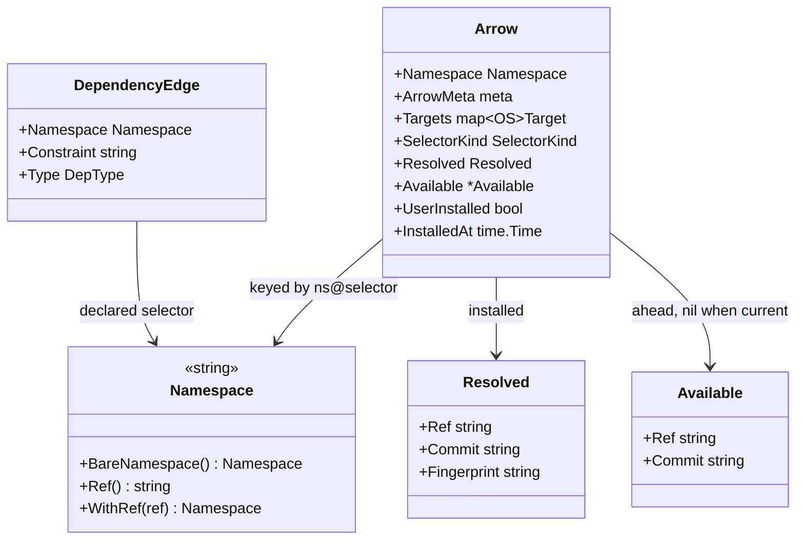

# Arrow Versioning Model

This document describes how Quiver identifies an Arrow, what it records about the version
that is installed, how it notices that something newer exists, and how an update moves an
installed Arrow forward. It supplements [arrow.md](./arrow.md), [../../domain.md](../../domain.md),
[../../manifold.md](../../manifold.md), [../../deptree.md](../../deptree.md), and
[../../vault.md](../../vault.md).

The model in one paragraph: a catalog row is keyed by `namespace@selector`, where the
selector is **what the user follows** — a channel (`crowbar@stable`), a constraint
(`crowbar@v1.*`), a pinned ref (`crowbar@v1.2.0`) or a commit. The selector never changes for
the life of the row. **What is installed** is state inside the row (`Resolved`), and **what
is ahead** is state inside the row too (`Available`). Every update is one in-place
`advance` of that same row; there are no successor rows.

---

## 1. Identity: `namespace@selector`

A Quiver `Namespace` is a string of the form:

```
domain/user/repo[/auid][@selector]
```

For a catalog row the `@selector` suffix is part of the identity, and it is the key on
every route, aggregate, cache entry and read model. It is the request the user made, not
the answer the remote gave: `crowbar@stable` stays `crowbar@stable` while the ref it
resolves to moves from `v1.2.0` to `v1.3.0`. An API client holding `crowbar@stable` never
loses it to an update.

`Namespace` exposes the following accessors over the suffix:

| Method | Returns |
|---|---|
| `BareNamespace()` | The namespace without the suffix (`domain/user/repo[/auid]`) |
| `Ref()` | The substring after `@` — for a catalog row, its selector — or `""` if absent |
| `IsGlob()` | `true` if `Ref()` contains `*` |
| `WithRef(ref)` | A new `Namespace` with `ref` replacing any existing suffix; `WithRef("")` returns the bare namespace |

A row is never keyed by a bare namespace. A refless request (`quiver add
github.com/char2cs/crowbar`) is given a selector before the row is written — the
repository's default channel (§6) — so the identity exists from day one.

**Switching what a row follows is uninstall + install.** There is no retarget operation:
`crowbar@stable` cannot become `crowbar@nightly-latest`. Removing one row and adding the
other creates a second, independent identity.

---

## 2. Selectors

### 2.1 Kinds

| Kind | Example | Follows |
|---|---|---|
| `channel` | `crowbar@stable`, `crowbar@nightly-latest` | The channel's latest member; a pointer channel (a rolling tag) is itself |
| `constraint` | `crowbar@v1.*` | The highest matching tag |
| `pin` | `crowbar@v1.2.0`, `crowbar@main` | Exactly that ref; a tag or branch that moves to another commit is still detected |
| `commit` | `crowbar@3f2a9c1` | Exactly that commit; never outdated |

Channels are the buckets `GET /v0/arrow/{ns}/channels` lists. How a tag is sorted into a
channel is the tag-name classifier in
`internal/engine/manifold/resolver/resolvers/channel.go`: a tag with a numeric-dot version
core and no suffix belongs to `stable`; a suffix names the channel (`v2.0.0-beta.1` is
`beta`); every tag the classifier cannot place is its own **pointer** channel, named after
itself (`nightly`, `nightly-latest`). A repository with no tags at all lists its default
branch as a single pointer channel.

A prefix before the core names the channel too (`beta-26.5-4` is `beta`) when it is a known
channel word — `alpha`, `beta`, `canary`, `dev`, `edge`, `hotfix`, `insiders`, `next`,
`nightly`, `preview`, `rc`, `stable` — or, for any other prefix, when the repository's
unknown prefixes differ from tag to tag (a prefix every tag shares, such as `v` or a
project name, is noise). Behind a channel word, a `YYYY-MM-DD` date stands in for a
version core, with an optional `.N` patch after it, so a dated release groups under its
channel instead of becoming a pointer channel of its own. A date with no channel word in
front (`2026-01-02`, `snapshot-2026-01-02`) is not a version: it stays a standalone pointer
channel and is never ranked against a repository's semver releases. The date is recognised before a dotted core, so the
names quiver.core's own release workflows publish for a dated series
(`.github/scripts/release-tag.sh`, pinned by `tests/releasetags`) all group correctly:
`beta-2026-09-27`, `beta-2026-09-27-1` (a rebuild), `stable-2026-09-27`,
`stable-2026-09-27.1` (a patch), `hotfix-2026-09-27.1`, `hotfix-2026-09-27.1-1`.

Within a channel, members are ranked by core, then by the numeric ordinal of a suffix
(`beta-26.5-4` above `beta-26.5-3`), then by tag name, so two equal-rank spellings (`v1.2`
and `v1.2.0`) always settle the same way. A date core ranks as `YY.MM.DD.patch` — its year
within the century — so it orders among calendar-versioned `YY.M` tags by release month,
and a later date outranks every patch of an earlier one:
`stable-26.5.1` < `stable-2026-09-27` < `stable-2026-09-27.1` < `stable-2026-10-01` <
`stable-26.11`.

### 2.2 Parse rule

`manifold.ClassifySelector(selector, snapshot)` decides the kind against the repository's
ref snapshot (§5.1), in this order:

| Step | Rule | Kind |
|---|---|---|
| 1 | A selector with an empty path component (leading `/`, trailing `/`, or `//`) names nothing | error |
| 2 | Equal to a listed channel name (an ordered channel wins over a pointer channel of the same name) | `channel` |
| 3 | An exact tag or branch name — a tag wins over a branch of the same name — or an explicit `refs/tags/<name>` / `refs/heads/<name>` escape | `pin` |
| 4 | Contains `*`, `?` or `[` and is a valid `path.Match` pattern | `constraint` |
| 5 | 7–40 hexadecimal characters that name no ref | `commit` |
| 6 | Anything else | error — `ErrUnknownSelector`, surfaced as `ErrInvalidNamespace` (400) |

Step 2 runs before step 3 on purpose: a rolling tag such as `nightly-latest` is both a tag
and a pointer channel, and on the snapshot it is classified against both readings follow
the same ref. A repository tag literally named `stable` is shadowed by the `stable` channel;
install it with `crowbar@refs/tags/stable`.

A commit selector is catalogued in lower case: `crowbar@ABCDEF1` and `crowbar@abcdef1` are
one identity, `crowbar@abcdef1`, and either spelling names that row: every verb, every
catalog read (detail, manifest, readme) and a dependent's orphan cleanup of a dependency it
declared in another case. Every other kind keeps its exact spelling. Adopting (§10.1) a namespace whose selector has an empty path component
is refused with `ErrInvalidNamespace` (400), the same as step 1, so no seed or collection
member can alias another identity's workdir.

The implementation is `internal/engine/manifold/selector.go`.

### 2.3 The kind is stored

The kind is decided once, when the row is created, and stored on it as
`Arrow.SelectorKind`. It is authoritative from then on: a later tag push that would
classify the same string differently never changes what an existing identity means.

The stored kind is refined by the ref the selector named at that moment, because the
family alone cannot say it: after someone pushes a tag `develop`, the string `develop`
names both a branch and a tag, and after CI publishes `nightly-2026.09.30`, the string
`nightly` names both a rolling tag and an ordered channel.

| Stored kind | Family (wire) | Follows | Looks up refs in |
|---|---|---|---|
| `channel:ordered` | `channel` | The newest member of the ordered channel of that name | Tags |
| `channel:pointer` | `channel` | The rolling tag of that name | Tags |
| `channel:branch` | `channel` | The `HEAD` branch a tagless repository was added from | Branches |
| `pin:tag` | `pin` | Exactly that tag (`refs/tags/` escape stripped) | Tags |
| `pin:branch` | `pin` | Exactly that branch (`refs/heads/` escape stripped) | Branches |
| `constraint` | `constraint` | The highest matching tag | Tags |
| `commit` | `commit` | That commit | — |

`ClassifySelector` returns the refined kind; `Target`, `Drift`, `Admit` and the update
commit's re-check (`manifold.RefCommit`, §8.2 step 7) read only where the stored kind says
the row's refs live. A branch pin therefore never reads a same-name tag, a pointer channel
never turns into the ordered channel of its name, and a tag pin whose tag was deleted is
not found rather than silently following a branch. The wire reports the family (§11).

Rows stored before the refinement carry the unrefined kinds and keep the dynamic reading
they were created with: a zero-value `pin` is the identity's tag, else its branch (an
escape still says which); an unrefined `channel` is the ordered channel of its name, else
the rolling tag, else the default branch it settled on (§5.2).

The zero value of `SelectorKind` is `pin`. A row with no stored kind — any row written
before the selector model existed — behaves as a pin of its identity's ref, so old data
keeps working without a migration. On the wire the zero value is spelled `"pin"`, never
`""` (§11).

### 2.4 Selectors in manifests

The same syntax is valid wherever a namespace appears — at the top level (`quiver add ...`)
or inside a manifest's `tools:` / `services:` lists.

```yaml
tools:
  - github.com/valve/steamcmd              # refless -> the repository's default channel
  - github.com/valve/steamcmd@v1.2.3       # pin
  - github.com/valve/steamcmd@v1.*         # constraint

services:
  - github.com/char2cs/myapp/database@v2.*
```

A dependency edge carries the selector the dependent **declared** (`DependencyEdge.Constraint`,
falling back to the edge namespace's own ref), never the ref it resolves to today. The row a
declared dependency installs is `bare@<declared selector>`; a bare declaration is catalogued
through the same refless resolution as a top-level add (§6) the first time it is installed.
See `graph.dependencyIdentity` and `arrow.AddDependency`.

---

## 3. Row state

Everything that changes as versions move lives inside the row:

| Field | Type | Meaning |
|---|---|---|
| `SelectorKind` | `SelectorKind` | How the identity's selector is followed (§2.3) |
| `Resolved` | `Resolved{Ref, Commit, Fingerprint}` | What is installed: the ref name, its full commit, and a fingerprint |
| `Available` | `*Available{Ref, Commit}` | What the last check found ahead of `Resolved`; `nil` when current |
| `UserInstalled` | `bool` | Whether a user asked for this row directly (`true`) or it was pulled in as a dependency (`false`) |
| `InstalledAt` | `time.Time` | When `_install` last succeeded; zero until then and again after `_uninstall` |

- `Resolved` is set when the row is created (from the target the selector pointed at) and
  moved only by an advance (§8) or an adoption (§10). `Fingerprint` is the commit today:
  nothing verifies a release-asset checksum yet, so every writer stamps the commit there.
- "Outdated" is derived, not stored: a row is outdated exactly when `Available` is set.
  The API's `outdated` field is that derivation (§11).
- `InstalledAt` answers "is it on disk"; `Resolved` answers "which version". A row that was
  catalogued but never installed has a `Resolved` and a zero `InstalledAt`.

The runtime aggregate keeps its own `outdated` **state** — the badge Quiver Desktop reads.
It is reconciled from the row: whenever a check records `Available`, the runtime is moved
`ready → outdated` (`MarkVersionOutdated`) or back (`ClearVersionOutdated`) to match the row
as it stands at that moment, never the answer the check computed. The end of any execution
re-derives it the same way, except the end of `_update`, whose badge the update bracket
re-derives once its commit has landed (§8.2 step 7). While a row is settling, a check that
lands (a detail read's passive check, a `PATCH`) records what it found but leaves the badge
alone for the same reason: the row still names the target about to be stamped.

---

## 4. Multi-version coexistence

Different selectors of one repository are different rows, and every layer keys them
independently. There is no conflict resolution and no SAT solving.

| Layer | Keying |
|---|---|
| Arrow aggregate (`asynx`) | Full `namespace@selector` (`Namespace.String()`) |
| Vault manifest cache | Full `namespace@selector`, percent-encoded into one flat filename (§12) |
| Vault workdir | Full `namespace@selector`, the selector as one directory segment under `namespacesPath` (§12) |
| Runtime aggregate | Full `namespace@selector` — each row has its own lifecycle state |
| Dep edge graph | `(from_namespace, from_version, to_namespace, to_version)` tuples, versions being selectors |
| Catalog read model | Bare namespace key, with one version row per selector for grouping |

`pkg@v1.*` and `pkg@v2.*` are two rows. Both can be installed, both can be running, and
removing one does not affect the other. Two selectors that resolve to the same ref today
(`pkg@stable` and `pkg@v1.3.0`) are still two rows, each with its own workdir and runtime.


```mermaid
classDiagram
    class Namespace {
        <<string>>
        +BareNamespace() Namespace
        +Ref() string
        +WithRef(ref) Namespace
    }

    class Arrow {
        +Namespace Namespace
        +ArrowMeta meta
        +Targets map~OS~Target
        +SelectorKind SelectorKind
        +Resolved Resolved
        +Available *Available
        +UserInstalled bool
        +InstalledAt time.Time
    }

    class Resolved {
        +Ref string
        +Commit string
        +Fingerprint string
    }

    class Available {
        +Ref string
        +Commit string
    }

    class DependencyEdge {
        +Namespace Namespace
        +Constraint string
        +Type DepType
    }

    Arrow --> Namespace : keyed by ns@selector
    Arrow --> Resolved : installed
    Arrow --> Available : ahead, nil when current
    DependencyEdge --> Namespace : declared selector
```

---

## 5. Remote view and drift

### 5.1 One snapshot per check

Everything Quiver knows about a remote comes from one `RefSnapshot`: a single ref
advertisement (`git ls-remote`, in memory through go-git) folded into

| Field | Content |
|---|---|
| `Tags` | tag name → commit; an annotated tag is peeled to the commit it points at |
| `Branches` | branch name → commit |
| `Head` | the branch the remote's `HEAD` points at, when it names one |

Channels, constraint matches, pins and commits are all derived from that one value, so a
decision can never combine two inconsistent views of the remote. `Manifold.Snapshot` caches
it per bare namespace for the manifold cache TTL (tied to `arrows.version_check_ttl`,
default `1h`); `Manifold.FreshSnapshot` reads it live and refreshes the cache. Installs
resolve through `Snapshot`; every version check and the update commit use `FreshSnapshot`.

### 5.2 Target and drift

`manifold.Target(kind, selector, snapshot)` names what a selector points at right now, and
`manifold.Drift(kind, selector, resolved, snapshot)` compares it with `Resolved`. Both are
pure functions (`internal/engine/manifold/drift.go`):

| Kind | Target | Outdated when |
|---|---|---|
| `channel` | The channel's latest member (a pointer channel: its own ref) | Target ref or commit differs from `Resolved` |
| `constraint` | The highest matching tag (§5.3) | Target ref or commit differs |
| `pin` | The same ref (escape stripped) at its current commit, read as a tag or a branch as the stored kind says (§2.3) | Its commit moved |
| `commit` | The commit itself | Never |

- A row with an empty `Resolved.Commit` reports outdated once — unknown is not current.
  After the next advance it carries a commit and behaves normally.
- A row that settled on a repository's default branch (a refless add of a repository with
  no tags, stored as `channel:branch`) keeps following that branch after the repository
  publishes its first tag, even though the branch is no longer listed as a channel. An
  unrefined `channel` row does the same only for the `HEAD` branch it itself resolved to,
  so an ordered channel or a deleted pointer tag never turns into a same-name branch.
- A selector never crosses its own bounds: `v1.*` never drifts to `v2.0.0`.
- An ordered selector never offers a downgrade: a target its own order ranks below the
  installed tag is not an update. A channel compares only tags of one channel (each read on
  its own: `v1.2.0-rc.1` is `rc`, `v1.2.0` is `stable`); a constraint uses the order it
  picks its target in (§5.3), so a `v1.*` row on `v1.2.0-rc.1` or `v1.2.0-1` is offered
  `v1.2.0`. The guard needs the installed tag to still exist: an installed tag the snapshot
  no longer holds (a yanked release, a deleted tag) has no rank, and the channel's or
  constraint's current head is offered, even when it is older. A tag that moved under the
  same name, a pointer channel and a pin follow their ref whichever way it moved.
- A row whose ordered channel is no longer listed under its name — a later tag made the
  classifier regroup the repository's tags, as `beta-2.0` could once turn `release-1.x` from
  `stable` into a `release` channel — follows the ordered channel that holds its installed
  tag today, instead of failing every check. Only if no channel holds it is there no answer.
- Any resolution error produces no answer, and nothing is written.

### 5.3 Stable semver and constraint ranking

A tag is **stable semver** when it is two or three non-negative integer components with
an optional leading `v` — `1.2`, `v1.2.3`. Anything carrying a prerelease component is not:
`v1.2.0-rc.1`, `2.0.0-beta`, `nightly`. `resolvers.IsStableSemver` is the single definition.

A constraint's matches are ranked by `resolvers.HighestMatch`: stable-semver matches sort
numerically descending and always rank ahead of the rest, which sort lexicographically
descending. Equal-rank matches (`v1.2`, `v1.2.0`, `1.2.0`) are ordered by tag name,
descending, so the answer never depends on what else the repository holds. Partitioning rather than degrading the whole set to string order is what keeps
`v1.10.0` above `v1.9.0` when an unrelated `nightly` tag also matches. Branches are never
searched, and a constraint no tag matches is rejected.

### 5.4 When checks run

| Trigger | Snapshot | Writes |
|---|---|---|
| `GET /v0/arrow/{ns}` on a catalogued row whose last check is older than `version_check_ttl` | fresh | `Available`, detached from the request |
| `PATCH /v0/arrow/{ns}` | fresh | `Available`; may advance an uninstalled row (§8.1) |
| Opening an update bracket (§8.2) | fresh | `Available` |
| Core boot (`CheckVersionNow` on its own row, §10.2) | fresh | `Available`, detached |
| Periodic: within a minute of daemon start, then every `arrows.version_check_interval` (default `6h`, each run pushed back by up to a tenth of it; `0s` turns it off), for every installed row under the same TTL claim as a detail read — a row checked within `version_check_ttl` is skipped (`Arrow.CheckInstalledVersions`) | fresh, one row at a time | `Available`; the badge follows |

A check records its answer only when it differs from the row's current `Available`, and
only while the row still holds the `Resolved` the answer was judged against:
`RecordAvailable` carries that `Resolved` and is refused if the row has moved since (an
update committed in between). A refused or conflicting write is re-read and re-judged, up to
three attempts, so an answer about a version the row has already left is never recorded.
The runtime badge is then reconciled from the row (§3).

---

## 6. Refless resolution

`quiver add github.com/char2cs/crowbar` names no selector. `ResolveInstall` reads the
snapshot and asks `manifold.DefaultChannel` for one, which returns the first entry of the
deterministic channel order `manifold.ChannelsOf` produces:

| Order | Channel |
|---|---|
| 1 | `stable`, when the repository has at least one stable-classified tag |
| 2 | Other ordered channels (`beta`, `rc`, …), by name |
| 3 | Pointer channels (unclassified tags such as `nightly`), by name |
| 4 | The `HEAD` branch — listed only when the repository has no tags at all |

The row is then written as `bare@<that channel>` with the channel's refined kind
(`channel:ordered`, `channel:pointer` or `channel:branch`, §2.3). A
repository with no tags and no `HEAD` branch has no default channel, and the add fails with
not found.

There is no latest-release shortcut. Earlier versions asked the git host for its
"latest release" permalink before listing refs; that path is gone. Every refless add is
decided from the tag snapshot alone, on any git host, with no API quota involved.

A default channel whose target serves no manifest — a definitive not found, such as a
latest release that ships neither a manifest nor assets Fletcher can draft one from — does
not end the add. `ResolveInstall` then tries the other listed channels in the same order,
and finally the `HEAD` branch (catalogued as a `pin:branch` on it), and returns the original not
found only if every one of them fails. Any other failure (transport, rate limit, invalid
manifest) is returned at once, and a namespace that names a selector never falls back.

A refless namespace is also accepted by every other route. Once the catalog holds rows for
that repository, `ResolveCatalogued` maps the bare namespace to the preferred row —
user-installed first, then the most recently installed — so `quiver run
github.com/char2cs/crowbar` reaches `crowbar@stable`. A bare namespace the catalog does
not hold resolves, for read-only previews (`GET /arrow/{ns}`, `/manifest`, `/readme`),
exactly the way an add would.

### 6.1 The literal `@latest`

`latest` has no special meaning. `pkg@latest` is classified like any other selector: a
channel if the repository publishes a `latest` tag or channel, a pin if it names a branch,
otherwise an unknown selector. Manifests that mean "the repository's default" should write
the refless form.

---

## 7. The ref is the version

There is no version field anywhere — not on either manifest, not on either aggregate, not on
an Arrow's or a Collection's API responses. **The resolved ref is the version.** For a
catalog row that is `Resolved.Ref`; the identity's selector is what the user follows, which
is not a version (`stable` names no release).

A manifest used to restate the ref in `metadata.version`, which meant editing the value in
the same commit that got tagged. When that edit was missed the failure was silent: a
repository tagged `v1.2.0` whose manifest still said `nightly` produced a URL that was a
perfectly good `200` for the *nightly* build, recorded under `v1.2.0`, with nothing to
detect the disagreement. Quiver exposes facts; the resolved ref is a fact, and a version
string derived from it is an inference belonging to whoever owns the naming convention.

`version:` is therefore not part of the `arrow@v0` authored surface — see
[arrow.md §3](./arrow.md#3-top-level-structure). Leaving the key in an existing manifest is
inert and non-breaking: the schema still lists the property so it does not trip
`additionalProperties`, no Go type models it, and the value is discarded during translation.

`collection@v0` is the same, for a stronger reason. An arrow at least *had* a version to
restate; a collection is a curated list, and a list is not an artifact. Nothing is fetched
at a collection's `metadata.version`, nothing resolves against it, and every member already
carries the selector it follows on its own namespace. The field named nothing, so it is gone
under the identical tolerate-and-ignore rule — see
[collection.md §3.1](./collection.md#31-metadata-fields).

### 7.1 `${REF}`

Steps read the version through the `${REF}` built-in
([arrow.md §10.1](./arrow.md#101-built-in-variables)). There is no `${VERSION}` built-in and
no ref-to-version transform. The assembler picks, in order:

| Situation | `${REF}` |
|---|---|
| During `_update` | The target ref the update began toward: the `Available.Ref` the bracket staged, even when a later check has recorded a newer `Available` |
| Otherwise, when the row has a `Resolved.Ref` | `Resolved.Ref` |
| Otherwise (a row with nothing resolved, such as a seed without a commit) | The identity's own ref, `ns.Ref()` |

`${REF}` is never the selector of a channel or constraint identity: `crowbar@stable`
installs with `${REF} = v1.2.0`, so a release-asset URL built from it names a real release.
`preinstalled:` probes use the same `Resolved.Ref`, falling back to `ns.Ref()`.

`${REF}` is computed for every run and never remembered. The variables a previous run
returned (`LastReturn.Variables`) carry answers forward — a declared variable's value, an
undeclared one a caller passed — but never a built-in (`${REF}`, `${WORKDIR}`,
`${INSTALL_PATH}`, `${ARROW_NAMESPACE}`, `${PLATFORM}`) nor a dependency's value
(`<namespace>.<name>`): a row advanced since (by `PATCH`, §8.1) or a failed update's
target left in the last run must never lend its `${REF}` to another release's steps.

---

## 8. Update flow (`advance`)

Every update is one in-place operation on the same aggregate. `AdvanceArrow` (event
`arrow.advanced.<ns>`) replaces the row's manifest with the one at the target commit, sets
`Resolved` to the target and clears `Available` — except that an update's commit keeps an
`Available` naming something other than the target it stamps (a newer release a check
recorded while the update's steps ran stays offered). An adoption (§10) always clears it
for the next check to judge. Identity, runtime aggregate and workdir are
untouched; the update steps overwrite files in place. Before every advance the vault
manifest cache for the identity is replaced with the manifest fetched at the target commit
(`ns.WithRef(commit)`; hosts serve raw files by SHA). On a host that cannot serve a SHA (one
reached only by cloning, such as a self-hosted git server) the fetch falls back to the
RESOLVED ref — the target's ref, never the identity's selector, which for `pkg@stable` or
`pkg@v1.*` names no git ref. That ref may move between the snapshot and the fetch, which is
why the update bracket's snapshot re-check verifies the commit afterwards, before it stamps
anything (see [manifold.md §2](../../manifold.md#2-public-api)). An add or an adoption on such
a host has no re-check: the row records the snapshot's commit, so a moving tag that advanced in
between is offered as an update by the next check.

Two entry points reach it.

### 8.1 `PATCH /v0/arrow/{ns}` — check, and advance only what is not installed

`ArrowUsecase.Update` re-resolves the row against a fresh snapshot and records `Available`
(§5.4). Then:

| Row | Result |
|---|---|
| Current (`Available` is nil) | Nothing changes; the result is empty |
| Installed (runtime in any state but absent/removed) | The row stays where it is; the result carries `available` |
| Not installed | The row is advanced at once — there are no update steps to run for bits nobody installed — and the result reports the dependency diff (`added_deps`, `removed_from_manifest`, `constrained_deps`) |

The advance of a row that is not installed takes the row's bracket (the one §8.2 serializes
updates with) and reads the runtime state again inside it. An install of a row that is not
installed takes the same bracket before it plans its dependencies and holds it through
`BeginInstall`. An install that starts during the advance therefore plans and assembles the
advanced manifest, and an advance that reaches a row whose install is under way finds it
installed and moves nothing. Only a row that still needs an install takes its bracket: an
update that installs the dependencies its target gained never waits on the bracket of an
installed row, which may be its own or another update's.

The request takes no body. It never runs update steps.

### 8.2 `POST /v0/runtime/{ns}/update` — the update bracket

This is the only path that runs a manifest's `update:` steps. `RuntimeUsecase.Execute`
routes `_update` to `executeUpdate`, which opens a bracket that `onUpdateEnded` closes:

```mermaid
sequenceDiagram
    autonumber
    actor User
    participant U as RuntimeUsecase
    participant A as arrow repo
    participant M as manifold
    participant R as runtime repo

    User->>U: POST /runtime/{ns}/update
    U->>U: open per-row bracket; refuse if a previous one is unsettled
    U->>A: CheckAvailable(ns)
    A->>M: FreshSnapshot + Drift
    A-->>U: Available (nil -> nothing to do, HTTP 200 no-op)
    U->>R: stop and wait, if running
    U->>A: RefreshToTarget(ns, target)
    A->>M: manifest at target commit
    A-->>U: target manifest staged (arrow.manifest_refreshed)
    U->>R: MarkOutdated + dep sync, if the target's deps differ
    U->>R: BeginUpdate (target's update: steps, ${REF} = target ref)
    R-->>U: runtime.ended (_update)
    U->>A: TargetUnmoved(ns, target)
    A->>M: FreshSnapshot
    alt target ref still at target commit
        U->>A: Advance(ns, target) (arrow.advanced)
    else target moved during the update
        U->>A: RefreshToTarget(ns, Resolved) (restore the installed manifest)
    end
    U->>R: ReconcileVersionBadge (from the row as it stands)
```

1. **Serialize.** Brackets of one row are serialized up to `BeginUpdate`, and with the
   installs and catalog advances of that row (§8.1); a bracket whose
   predecessor began but has not settled yet — its steps still running, or ended with its
   commit or restore not landed (the row reads `settling`) — is refused with a state
   violation (422), so the update steps never run twice toward one target.
2. **Re-resolve.** The last check may be an hour old, so the target is resolved again
   against a fresh snapshot and recorded as `Available`. Nothing ahead: nothing to do, and
   the request is answered **200** as an idempotent no-op (no runtime event follows)
   instead of 202.
   A runtime not in `ready`, `outdated` or `running` skips the bracket and goes to the
   runtime's ordinary method path, which applies its own state rules.
3. **Stop.** A running arrow is stopped, and the bracket waits for the stop to finish.
4. **Stage the target manifest.** `RefreshToTarget` fetches the manifest at the target
   commit, replaces the vault cache and sends `RefreshManifest`
   (`arrow.manifest_refreshed.<ns>`). `Resolved` and `Available` are left alone, so the
   row still says what is installed while the target's own `update:` steps are assembled.
5. **Dependencies.** Dependencies the target gained or lost are marked on the runtime
   (`MarkOutdated`) and synced before the update begins. A target that gains a dependency
   on the row itself, or whose dependencies form a cycle the graph sees, is refused as an
   invalid manifest (422) before anything is installed.
6. **Begin.** The target is remembered in memory for this row and `BeginUpdate` runs the
   target manifest's `update:` steps with `${REF}` set to that remembered target's ref
   (§7.1), never to an `Available` a check recorded while the bracket was staging.
7. **Commit on success.** When `_update` ends successfully, the target is re-resolved
   against a fresh snapshot. The target ref is looked up where the row's stored kind says
   its refs live (`manifold.RefCommit`): an escaped branch pin `@refs/heads/master` reads
   the branch even when a tag `master` exists. Only if the target ref still stands at the
   target commit is the row advanced; a newer release a check recorded while the steps ran
   stays in `Available` and keeps being offered. If the target moved while the steps ran,
   the installed bits may not be the target's, so nothing is stamped and the row stays
   outdated. The worst case is an extra update, never a wrong stamp or a missed one.
   Either way the runtime's version badge is then re-derived from the row as it stands
   (`ReconcileVersionBadge`): `ready` when nothing is available, `outdated` otherwise.
   The badge is re-derived here, once, and not when `_update` ends: until the commit lands
   the row still names the target as available, and reading it then made the runtime go
   `ready → outdated → ready` right after every update.
8. **Failure** stamps nothing: `Resolved` and `Available` stay as they were, and the
   manifest of the installed release is staged on the row again (fetched at
   `Resolved.Commit`, replacing the target manifest step 4 staged), so an install or
   execution that follows runs the installed release's own steps for its own `${REF}`. The
   same restore follows a commit that stamps nothing because the target moved (step 7). A
   row with no recorded commit, or a restore whose fetch fails, keeps the staged manifest
   until the next update restages it. The badge is then re-derived from the row, as in
   step 7. A bracket that fails after step 4 but before its update began (a dependency the
   target gained fails to sync, `BeginUpdate` is refused, the caller gives up) restores the
   installed manifest the same way before it answers, inside the bracket and under a
   context of its own: no run began, so nothing would end to restore it.

The commit runs detached from the event handler that observes `runtime.ended`, because
clearing the badge waits on the same runtime event queue the handler is delivered on.

Detached is not untracked. From `BeginUpdate` until its commit (or its restore, step 8)
has landed, the row is **settling**: `GET /v0/runtime` reports `settling: true` even once the runtime reads
`ready` or `outdated`, and the CLI never idle-stops a daemon with a settling row. A graceful
shutdown drains the commits in flight before any aggregate or store closes, under a budget
of its own (30 s in the daemon); a commit that begins after the drain started is refused,
and one the budget runs out on is aborted. An aborted settling writes nothing more. A
commit that runs out of its own time (`commitTimeout`, 2 min) outside a shutdown stamps
nothing either, but it still restores the installed manifest (step 8) and re-derives the
badge, under a short context of its own, so the badge never stays `ready` on a row that
has something available. Either way, and when the daemon dies outright,
nothing is stamped: the row stays outdated at what it had installed, and the next update
runs the update steps again. That is the same worst case as a target that moved.

quiver.core's own row is excluded from step 7: its update replaces the running process,
and the relaunched build adopts its new state on boot (§10.2). A failed update of it is not:
the running build stays in charge, so its manifest is restored as in step 8.

---

## 9. Removal

`Arrow.Remove` calls `axArrow.Forget(ns.String())` against the full identity. The catalog
projection deletes the matching version row from the bare-keyed read model, and drops the
parent row when no versions remain. The forget cascade drops the row's dependency edges,
forgets its runtime aggregate and deletes its vault workdir.

Removing `pkg@v1.*` does not touch `pkg@v2.*`.

The use-case-layer `ArrowUsecase.Remove` adds two guards on top:

- The runtime must not be in an active state.
- `graph.HasDependents(ns, "")` must be false — no other catalogued arrow depends on this
  identity.

`UserInstalled` is informational here; a dependency-only row with no dependents can be
removed.

---

## 10. Adoption

### 10.1 `Adopt`

`Arrow.Adopt(ns, kind, resolved, manifest, filename)` is the one way to register something
that is already installed, from manifest bytes the caller holds, without touching the
network. It requires a namespace with a selector and a manifest filename.

| Row | What `Adopt` does |
|---|---|
| Absent | Caches the manifest and writes a new user-installed row with `kind` and `resolved` |
| Present, `Resolved` differs | Replaces the cache and advances the row (`arrow.advanced`) |
| Present, `resolved` has no commit and names the row's own `Resolved.Ref` | Not an advance: the row keeps the commit it learned; only a changed manifest is refreshed |
| Present, only the manifest differs | Replaces the cache and refreshes the manifest (`arrow.manifest_refreshed`) |
| Present, identical | Nothing |

An existing row that is not user-installed is promoted (`SetUserInstalled`): whoever adopts
a row installed it.

Two callers use it besides core registration:

- `POST /v0/arrow/{ns}/manifest` (seed) adopts the posted manifest as a **pin of its own
  ref**, with `Resolved{Ref: ns.Ref()}` and no commit. Seeding the same identity again
  replaces the row's manifest. A seeded row has no commit, so its first version check
  reports it outdated if the ref exists upstream (§5.2). Once an update has stamped the
  ref's commit, seeding the same ref again keeps that commit: the row is not offered the
  update it already ran.
- Following a collection adopts each of its local arrows the same way, at the collection's
  ref, and keeps a commit the row already learned the same way.

**Adopting declared state.** `POST /v0/arrow/{ns}/adopt` with `{"resolved_ref": "<ref>"}`
(`Arrow.AdoptInstalled`) lets a client that installed itself declare what it runs, so its
row is behind when the running build is. `{ns}` settles the identity and kind exactly as
`POST /v0/arrow/{ns}` does (refless → default channel). `resolved_ref` is then admitted
against a fresh snapshot (`manifold.Admit`) so the row's state can never contradict its
identity: a channel admits its members (a pointer channel, or the default-branch fallback,
only its own ref), a constraint the tags its glob matches, a pin its own ref, a commit
selector itself or a ref at a commit it prefixes. A ref the remote does not hold is not
found; one the selector could never resolve to is an invalid namespace. The manifest is
fetched at that commit and passed to `Adopt` with `Resolved{ref, commit, commit}`, so the
row table above applies unchanged. Nothing is judged inline: the next version check
(the passive one a detail read triggers, or `PATCH`) records what is ahead. `/adopt`
declares the catalog state only and leaves the runtime untouched; a client that also
needs the arrow's installed state detected (the `preinstalled:` probe) must
`POST /v0/arrow/{ns}` first and then call `/adopt` — the order the tests cover.

### 10.2 quiver.core's own row

The build stamps three values through `-ldflags`: `main.version` (the release ref the build
is published under), `main.commit` (the full commit hash) and `main.channel` (the channel the
release pipeline publishes it under: `stable`, `beta`, `hotfix` or `nightly-latest`). An
explicit `arrows.self_update_channel` in the config wins over `main.channel`.

On every boot `selfarrow.EnsureRegistered`:

1. Does nothing for an unstamped build (`version` empty or `dev`).
2. Adopts the embedded `ARROW.md` offline as `quiver.core@<channel>` with
   `Resolved{version, commit, commit}` — kind `channel:pointer` when the build is published
   under the channel's own name (`nightly-latest`), `channel:ordered` otherwise (`stable`,
   `beta`, `hotfix`) — or as `quiver.core@<version>`, a `pin:tag`, when no channel is known.
   An existing row keeps the kind it was stored with.
3. Settles the row's runtime: an absent runtime is marked ready; an `outdated` badge left
   over from before this build's own update is cleared when the row has nothing available.
4. Launches an immediate version check.
5. Removes every other `quiver.core` row, such as rows earlier builds filed under a
   resolved ref.

Because the identity is the channel, an update of core keeps `quiver.core@stable` for its
whole life; the boot after an update only moves `Resolved` onto the new build.

The release workflows name their tags with `.github/scripts/release-tag.sh`, pinned by
`tests/releasetags`. A `beta/<series>` branch must name a calendar series (`26.5`) or a date
(`2026-09-27`); any other name is refused, so no release lands in a pointer channel of its
own. A calendar series publishes `beta-26.5`, `beta-26.5-1`, …, `stable-26.5`,
`stable-26.5.1`, … and `hotfix-26.5.2`; a dated series `beta-2026-09-27`,
`beta-2026-09-27-1`, …, `stable-2026-09-27`, `stable-2026-09-27.1`, … and
`hotfix-2026-09-27.1`. The two schemes rank on one calendar (§2.1): a dated series sits
between the calendar series of its month and the next — after `26.9`, before `26.10` — so a
`beta/26.6` cut after `beta/2026-09-27` is older and never offered to rows already on the
dated beta. The latest stable a hotfix builds on is picked in that same order.

---

## 11. API shape

`ns@selector` is the key on every route. Neither `POST /v0/arrow/{ns}` nor
`PATCH /v0/arrow/{ns}` takes a body: the selector is in the path, and an update always
moves to what the selector points at.

`GET /v0/arrow/{ns}` (`ArrowDetailDTO`) carries the row state:

| Field | Meaning |
|---|---|
| `namespace` | The identity, `ns@selector` |
| `selector_kind` | `pin`, `channel`, `constraint` or `commit` — the stored kind's family (§2.3); the zero kind is spelled `pin` |
| `resolved_ref` | `Resolved.Ref` |
| `installed_commit` | `Resolved.Commit` |
| `available` | `{ref, commit}` of what is ahead; omitted when current |
| `outdated` | `true` exactly when `available` is set |
| `license`, `user_installed`, `installed_at`, `last_used_at`, `state`, `active_run`, `last_return` | Unchanged catalog and runtime fields |

`GET /v0/arrow` groups rows by bare namespace. Each `versions[]` entry is
`{ref, resolved_ref, state, installed_at, last_used_at}`, where `ref` is the identity's
selector (always set), `resolved_ref` the installed ref, and `installed_at` / `last_used_at`
are omitted until they happen.

`POST /v0/arrow/{ns}/adopt` takes `{"resolved_ref"}` and registers the identity as already
installed at that ref (§10.1).

`PATCH /v0/arrow/{ns}` answers with the update result in `data`: `available` for an
installed row that has something ahead, or the dependency diff for a row it advanced
(§8.1).

`GET /v0/arrow/{ns}/manifest` returns the manifest as its author wrote it under `manifest`
(`metadata`, `variables`, `netbridge`, `targets`, `readme`). Row state is never there; it
belongs to the detail.

`GET /v0/arrow/{ns}/channels` lists the channels a repository publishes, for picking a
selector at install time.

Removed from the wire with this model: `channel`, the stored ref-name and
tracking-policy fields of the old detail DTO, the update body's channel/ref/upgrade
options, and `POST /v0/arrow/{ns}`'s channel option.

---

## 12. Path-safe identities

A selector can carry characters a filesystem cannot hold (`v1.*`), and two identities must
never share a path or nest one inside the other, so every path component derived from an
identity is encoded before it reaches the disk (`internal/engine/vault/pathsafe.go`,
[vault.md §4.1](../../vault.md)):

| Where | Encoding |
|---|---|
| Manifest cache filename (`vaultPath/`) | `url.PathEscape` of the bare namespace, `@`, then the selector as one identity segment — `github.com%2Fchar2cs%2Fcrowbar@v1.%2A.md` |
| Workdir directory (`namespacesPath/`) | The bare namespace as directories; the last is `repo@<selector as one identity segment>` — `crowbar@release%2F1.0` |

The identity segment percent-encodes `/` (so `@release/1.0` is never inside `@release`'s
workdir, and uninstalling one never deletes the other's files), upper-case letters and
non-ASCII bytes (so `@Nightly` and `@nightly` stay apart on case-insensitive filesystems),
the Windows-reserved characters `<>:"|?*\`, `%`, `~`, control characters and a trailing `.`
or space. A name over 96 bytes is cut and suffixed with a digest of the full identity, which
keeps a workdir under a typical Windows home well under `MAX_PATH`.
A plain lower-case tag or branch keeps its spelling, so its layout is unchanged; a workdir
or cache entry an earlier layout created (a selector with `/` nested as directories, or one
with upper-case letters) is still found where it is, so no installed arrow loses its files.

## 13. Worked examples

### 13.1 `crowbar@nightly` — a rolling tag moves

The repository publishes a tag `nightly` that CI force-moves to every new build.

1. `quiver install github.com/char2cs/crowbar@nightly`: `nightly` is not classified into
   an ordered channel, so it is a pointer channel and the row is
   `crowbar@nightly`, kind `channel`, `Resolved{nightly, a1b2…}`.
2. CI moves `nightly` to `c3d4…`. The next check's target is `{nightly, c3d4…}`; the ref
   name is the same but the commit differs, so `Available = {nightly, c3d4…}` and the
   runtime shows `outdated`.
3. `quiver update github.com/char2cs/crowbar@nightly` runs the bracket: the manifest at
   `c3d4…` is staged, its `update:` steps run with `${REF} = nightly`, the commit step
   confirms `nightly` still points at `c3d4…`, and the row advances to
   `Resolved{nightly, c3d4…}`, `Available = nil`.
4. Had CI moved `nightly` again while the update ran, step 3's commit would have found a
   different commit and stamped nothing: the row stays outdated and the next update picks
   up the newer build.

### 13.2 `crowbar@stable` — a release keeps its identity

1. The repository has `v1.2.0`. `quiver add github.com/char2cs/crowbar` has no selector;
   the default channel is `stable`, so the row is `crowbar@stable`, kind `channel`,
   `Resolved{v1.2.0, …}`. `${REF}` is `v1.2.0` at install.
2. `v1.3.0` is tagged. The check finds the channel's latest member is `v1.3.0`:
   `Available = {v1.3.0, …}`.
3. `PATCH /v0/arrow/github.com/char2cs/crowbar@stable` reports `available: {ref: "v1.3.0",
   …}` and changes nothing else, because the row is installed.
4. `POST /v0/runtime/github.com/char2cs/crowbar@stable/update` runs `v1.3.0`'s `update:`
   steps with `${REF} = v1.3.0` and advances the row to `Resolved{v1.3.0, …}`. The identity
   is `crowbar@stable` before, during and after: the same workdir, the same runtime
   aggregate, the same API key.

### 13.3 A legacy row

A row written before selectors existed is keyed by the ref it resolved to, say
`crowbar@v1.2.0`, and carries no `SelectorKind` and no `Resolved`.

1. The zero kind is `pin`, so it follows exactly `v1.2.0`; it is never reinterpreted as a
   channel.
2. Its `Resolved.Commit` is empty, so its first check reports it outdated once, with
   `Available = {v1.2.0, <commit>}`.
3. One update (or, for an uninstalled row, one `PATCH`) records the commit. From then on it
   is an ordinary pin: outdated only if the `v1.2.0` tag is moved.

To follow a channel instead, uninstall `crowbar@v1.2.0` and install `crowbar@stable`.

---

## 14. Cross-references

| Topic | Document |
|---|---|
| `Namespace`, `Arrow`, `DependencyEdge`, `ArrowState` types | [../../domain.md](../../domain.md) |
| Manifest schema, `tools:`/`services:` syntax, `${REF}` | [./arrow.md](./arrow.md) |
| `Snapshot`, `ResolveArrowAtCommit`, selector and drift functions | [../../manifold.md](../../manifold.md) |
| DFS dependency walk, cycle detection | [../../deptree.md](../../deptree.md) |
| Vault keying, path encoding, sweep | [../../vault.md](../../vault.md) |
| Routes and DTOs | [../../http-api.md](../../http-api.md) |
