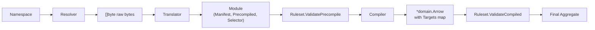
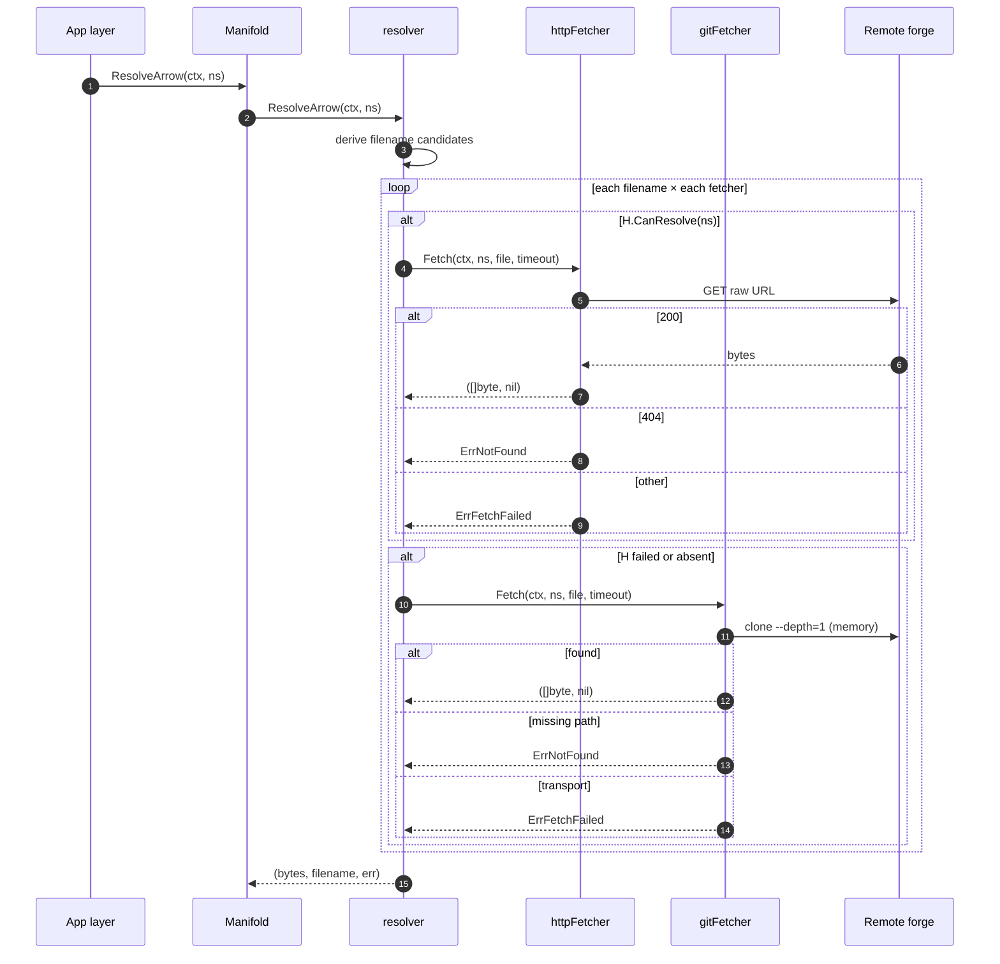
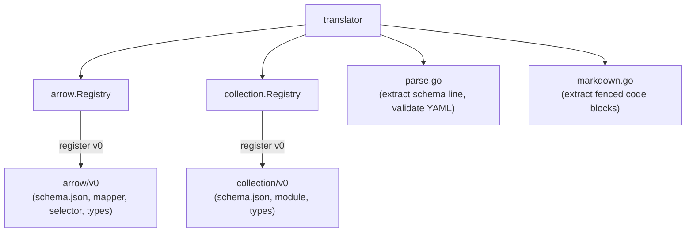

# Quiver — Manifold

## 1. Purpose

`manifold` is the engine that resolves a `Namespace` (`domain/user/repo[/auid][@ref]`) to a fully validated, OS-compiled domain aggregate. The app layer hands it a namespace and gets back either a `*domain.Arrow` (with `Targets` precompiled for every supported `domain.OS`) or a `*domain.Collection` (with arrow entries materialized as namespaces). The app layer never sees git, HTTP, YAML, JSON Schema, or markdown.

Manifold is a stateless, in-memory pipeline. It does **no** disk I/O, holds **no** cache, and emits **no** events. Caching is the job of `vault`; orchestration is the job of `runtime`. Manifold is pure resolution + validation.

The package lives at `internal/engine/manifold` and is composed of five concrete sub-modules: `resolver`, `translator`, `compiler`, `ruleset`, and the in-package `manifold` service that wires them together.

---

## 2. Public API

The `Manifold` interface is the only surface the app layer imports.

| Method | Inputs | Outputs |
|---|---|---|
| `ResolveArrow` | `ctx`, `namespace` | `*domain.Arrow`, raw `[]byte`, resolved filename, `error` |
| `ResolveCollection` | `ctx`, `namespace` | `*domain.Collection`, `error` |
| `ParseArrow` | raw `[]byte` | `*domain.Arrow`, `error` |
| `ParseCollection` | raw `[]byte`, `domain.Namespace` (collection ns) | `*domain.Collection`, `error` |
| `ResolveConstraint` | `ctx`, `namespace`, glob `pattern` | concrete tag/ref string, `error` |

`ResolveArrow` returns the raw bytes alongside the parsed aggregate so the app layer (Vault, primarily) can persist exactly what was fetched without re-serializing. The filename is whichever of `ARROW.md` / `arrow.yaml` / `<auid>.md` / `<auid>.yaml` was actually picked up.

`Parse*` skip the resolver entirely — they translate, validate, and compile bytes already in hand. Used in tests, by the wizard for ad-hoc validation, and anywhere the bytes come from a non-resolver source.

`ResolveConstraint` does no manifest fetching at all — it lists the remote's tags via `git ls-remote` (in-memory `gogit.Remote.ListContext`), filters by `path.Match`, and sorts semver-aware to pick the highest. Used by deptree to resolve `@v1.*` style globs to concrete refs before the next `ResolveArrow` call.

The constructor `New(fetchTimeout time.Duration)` builds a default Manifold with HTTP+git fetchers and the v0 translator registries. `NewWithResolvers` exists for tests that need to inject stub resolvers.

---

## 3. End-to-end flow



For arrows the ordering is deliberate — precompile rules need access to the abstract `PrecompiledTarget` map (with bases, glob keys, `Overrideable` values) before flattening. Compiled rules need the OS-specific `Target` map after the selector has resolved bases, globs, and overrideables. Each phase runs all of its rules concurrently and aggregates failures into a single `RuleErrors` value.

For collections the flow is shorter: resolve → translate → `ValidateCollectionEntries` → `deriveArrows` (path entries become namespaces under the collection's bare namespace) → `ValidateCollection`.

---

## 4. Resolver

The resolver layer takes a `Namespace` and returns raw manifest bytes plus the filename it was found at. It composes two `Fetcher` strategies in priority order:

| Fetcher | When it applies | How it fetches |
|---|---|---|
| `httpFetcher` | `namespace.Domain()` is in `metadata.GetPlatforms()` (currently `github.com`, `gitlab.com`, `bitbucket.org`) | Single `GET` against the platform's `RawURL` template, substituting `{user}/{repo}/{branch}/{file}`. Branch defaults to the platform's `DefaultBranch` (currently `main`) unless `namespace.Ref()` overrides it. |
| `gitFetcher` | Always (universal fallback) | `gogit.CloneContext` with `Depth=1` into `memory.NewStorage()` + `memfs.New()`, optionally pinned to `Ref()` as tag (then retried as branch). Reads the file from the in-memory worktree. |

The fetcher loop tries each candidate filename, and for each filename tries each fetcher that returns `CanResolve(ns) == true`. First success wins.

Filename candidates per call:

| Resolution | Candidates (in order) |
|---|---|
| `ResolveArrow` for `domain/user/repo` (3 segments) | `ARROW.md`, `arrow.yaml` |
| `ResolveArrow` for `domain/user/repo/auid` (4 segments) | `<auid>.md`, `<auid>.yaml` |
| `ResolveCollection` | `COLLECTION.md`, `collection.yaml` |

The HTTP-first design gets a TLS-only round trip on the happy path for the three known platforms; git is reserved for self-hosted forges and other domains the HTTP fetcher cannot match. There is no auth — only public repos.



Every fetch derives a `context.WithTimeout(ctx, fetchTimeout)`. The timeout is constructor-injected and defaults to 30s; a tighter caller deadline always wins. The git fetcher's tag-then-branch retry happens only when `Ref()` is non-empty, since `gogit` requires a `ReferenceName` to disambiguate.

Resolver-side errors:

| Sentinel | Meaning |
|---|---|
| `resolver.ErrNotFound` | Manifest file does not exist at any candidate path on the remote (HTTP 404 or missing path in cloned worktree). |
| `resolver.ErrFetchFailed` | Network/transport failure: non-2xx HTTP status, clone failure, body read error, etc. |
| `resolver.ErrUnsupportedPlatform` | Reserved for namespaces whose domain neither HTTP nor git can serve (currently unused — git is universal). |

---

## 5. Translator

The translator turns raw bytes into typed in-memory structures and runs JSON Schema validation against the version-specific schema embedded in the binary.

Steps for `Translator.Arrow(data)`:

1. `extractArrowCodeblock` — if `data` is markdown (e.g. `ARROW.md`), pull out the contents of the first `` ```arrow `` fenced block. Otherwise pass through.
2. `extractManifestFromYAML` — unmarshal just the `schema:` (or legacy `manifest:`) string into `ManifestInfo{SchemaType, Version, ManifestKey}`.
3. Reject if `SchemaType != "arrow"`.
4. Look up the version handler in the arrow `Registry` (`v0` is the only one registered today).
5. Validate the YAML body against the handler's embedded JSON Schema (YAML → JSON conversion → `gojsonschema.Validate`).
6. Call the handler's `Parse(data)` → `(*domain.Arrow, map[string]PrecompiledTarget, error)`.
7. Return a `Module{Manifest, Precompiled, Selector}` that the Manifold service feeds into ruleset + compiler.

`Translator.Collection(data)` is the same shape with `` ```collection `` extraction, `SchemaType == "collection"`, the collection registry, and a `CollectionModule{Manifest, Entries}` return — entries are deferred to manifold-level processing so they can be resolved against the collection namespace.

`Translator.ReadSchemaInfo(data)` exposes the cheap front-half (schema-line parse only) for callers that want to peek at version without paying for full validation.

The translator's submodule layout:



### 5.1 Markdown extraction

`markdown.go` finds the first fenced block whose opening fence is exactly `` ```arrow `` or `` ```collection `` and returns everything between that line and the next `` ``` ``. Any prose around the block is ignored. If no fence is found, the original bytes are passed through — so plain `arrow.yaml` / `collection.yaml` files still translate normally.

### 5.2 Schema-line parser

`parse.go` accepts both `schema: arrow@v0` and the legacy `manifest: arrow@v0`. The string is split on `@` into `(SchemaType, Version)`; both must be non-empty. `ManifestKey` is just `schemaType + "@" + version` and is used in error messages to identify which registry entry was looked up.

### 5.3 JSON Schema validation

YAML is unmarshalled to `map[string]interface{}` and re-encoded to JSON, then both the schema (loaded from the version handler's `Schema()` / `GetSchema()` method as embedded bytes) and document are passed to `gojsonschema.Validate`. All schema violations are concatenated into a single human-readable error message.

### 5.4 Module/version registry

Each `Registry` maps a version string to a handler interface. New schema versions register a new handler at `NewRegistry()` construction; the registry is stateless after that.

| Registry | Interface | Versions registered |
|---|---|---|
| `arrow.Registry` | `Schema() []byte`, `Parse([]byte) (*domain.Arrow, map[string]PrecompiledTarget, error)`, `Selector() models.Selector` | `v0` |
| `collection.Registry` | `Version() string`, `GetSchema() ([]byte, error)`, `Map([]byte) (*domain.Collection, []CollectionArrowEntry, error)` | `v0` |

There is no version upcasting — an unknown version returns an error and the manifest is rejected.

### 5.5 Arrow v0 mapper specifics

`arrow/v0/mapper.go` walks the YAML struct (`arrowV0`) and produces:

- A `*domain.Arrow` carrying only the version-independent shell: metadata, variables, netbridge ports. `Targets` is left empty — the compiler fills it.
- A `map[string]PrecompiledTarget` keyed by the YAML target key (`*`, `linux/*`, `linux/amd64`, `_base`, etc.). Each `PrecompiledTarget` keeps `base`, requirements, tools, services, exports as `Overrideable[string]`, lifecycle (with overrideables), and methods.
- Pre-refactor manifests (no top-level `targets:`) are rejected with an explanatory error; there is no migration shim.
- Step kinds: `run`, `fetch`, `signal`. The synthetic `dependencies` step is rejected if seen in a manifest — the runtime injects it.

### 5.6 Selector (target selection algorithm)

The selector lives next to the arrow v0 module because it is part of the v0 compilation contract. The compiler invokes it once per `domain.OS` via the `models.Selector` interface.

For a given OS:

1. **Filter to non-abstract keys** — keys beginning with `_` are abstract bases that may only appear via `base:` references.
2. **Match candidates** — `*` matches everything; otherwise `path.Match(key, os)`.
3. **Rank by specificity** — `*` = 1, glob containing `*` = 2, exact = 3. Higher wins.
4. **Tie at the top rank** is `AmbiguousTargetError` — fail compile.
5. **No match** is `ErrNoTargetForOS` — silently omitted from `Targets` (some OSes simply aren't supported).
6. **Flatten the base chain** — walk `base:` references depth-first, merging parent into child (requirements field-wise, namespaces child-wins, exports/methods merged maps, step lists child-wins-if-non-nil). Cycles produce a hard error.
7. **Resolve overrideables** — for each `Overrideable[T]`, run the same specificity algorithm against the OS, falling back to `Default` when nothing matches. Tools/services become `DependencyEdge` carrying their `Constraint` from `namespace@ref`. Steps are resolved via `Step.Resolve(os)`.

### 5.7 Collection v0 mapper specifics

`collection/v0/module.go` decodes `quiverV0` and copies metadata into a `domain.Collection`. The arrows array is returned separately as `[]CollectionArrowEntry{Path, Namespace}` because either form is legal in YAML — a bare string is a remote namespace, a `{path: …}` is a local path within the collection repo. Manifold (not the translator) decides what each entry resolves to.

---

## 6. Compiler

`compiler.Compile(manifest, precompiled, selector)` runs once per resolution. For every value of `domain.AllOS()` it calls `selector.SelectTarget(precompiled, os)`:

| Outcome | Action |
|---|---|
| Success | `manifest.Targets[os] = target` |
| `ErrNoTargetForOS` | Skip (this OS isn't supported) |
| `AmbiguousTargetError` | Return wrapped error (compile fails) |
| Other | Return wrapped error (compile fails) |

After this loop `manifest.Targets` is the map the runtime queries by host OS. It may be empty — the post-compile ruleset rejects that case with `no_supported_platform`.

---

## 7. Ruleset

The ruleset is a set of independent business rules composed concurrently. Each rule implements one of two interfaces:

| Interface | Sees | Runs |
|---|---|---|
| `PrecompileRule` | `*domain.Arrow` (shell) + `map[string]PrecompiledTarget` | Before compile |
| `CompiledRule` | `*domain.Arrow` (with `Targets` populated) | After compile |

`arrow.RunPrecompile` and `arrow.RunCompiled` fan out a goroutine per rule, collect `RuleError`s under a mutex, and return the aggregated `RuleErrors`. A rule produces zero or more `RuleError{Field, Rule, Message}` records — `Field` is a YAML-path-like locator for IDE pointing, `Rule` is a stable machine ID for tooling, `Message` is the human string. All rule failures unwrap to `aerrors.ErrInvalidManifest`.

### 7.1 Arrow precompile rules

| Rule | Checks |
|---|---|
| `MetadataRule` | `metadata.name` required; `name` ≤ `MaxNameLength`; `description` ≤ `MaxDescriptionLength`. |
| `VariablesRule` | Per-variable `Validate()`; `select` variables must have `values`; variable names unique. |
| `NetbridgeRule` | Per-port `Validate()`; port names unique. |
| `BaseIntegrityRule` | Each target's `base` chain resolves, has no cycle, and all referenced keys exist. |
| `OverrideableKeysRule` | Every key in `Overrideable.OSArch` is either `*` or contains `/` (`linux/amd64`, `linux/*`, etc.). Applies to exports, every step's overrideable fields, and method steps. |
| `OverrideableCoverageRule` | For non-abstract targets, every overrideable string field with no `Default` must cover all `domain.AllOS()` values via `OSArch` keys (using the same `path.Match` rules as the selector). |

### 7.2 Arrow compiled rules

| Rule | Checks |
|---|---|
| `ToolsServicesRule` | A namespace cannot appear in both `tools` and `services` of the same compiled target. |
| `ExportStaticRule` | Export values cannot contain `${…}` — exports are static strings. |
| `VariableRefsRule` | Every `${TOKEN}` in `run.command`, `fetch.url`, `fetch.to` must reference a known variable, netbridge port, or one of the built-ins (`WORKDIR`, `INSTALL_PATH`, `ARROW_NAMESPACE`, `PLATFORM`, `REF`). Tokens with `.` or `:` are treated as module-scoped and skipped. |
| `ServicePackageRule` | A manifest cannot mix service targets (with `execute`) and pure package targets (without `execute`). |
| `LifecyclePairsRule` | `install`/`uninstall` must both be present or both absent. `stop` requires `execute`. |
| `ServiceConsumerLifecycleRule` | A target that declares `services:` must define both `execute` and `stop`. |
| `TimeoutFormatRule` | Step timeouts (default value only) match `^\d+[sm]$`. |
| `MethodStatesRule` | Method `available_in` values are `ready` or `running`. |
| `NoDependenciesStepRule` | `type: dependencies` must not appear in any manifest step — the runtime injects the synthetic dependency-resolve step. |

After all compiled rules run, the manifold ruleset adds one more check: `len(manifest.Targets) == 0` becomes a `no_supported_platform` rule failure, so a manifest that compiles cleanly but yields zero usable targets fails fast.

### 7.3 Collection rules

| Rule | Checks |
|---|---|
| `CheckArrowEntries` | Each `CollectionArrowEntry` has exactly one of `Path` or `Namespace` (XOR). |
| `ValidateCollection` | `meta.name`, `meta.description`, and a non-empty `Arrows` list are required; and `CheckDuplicateNamespaces` ensures resolved namespaces are unique. |

`Arrows` is populated by `manifold.deriveArrows` from the validated entries: a `Namespace` entry passes through as `IsLocal: false`; a `Path` entry has its last segment appended to the collection's bare namespace and is marked `IsLocal: true`. Empty path segments are an error.

---

## 8. Error categories

| Category | Sentinel(s) | Source |
|---|---|---|
| Resolution | `resolver.ErrNotFound`, `resolver.ErrFetchFailed`, `resolver.ErrUnsupportedPlatform` | Resolver / fetchers |
| Parsing | Wrapped `fmt.Errorf` from YAML unmarshal, schema-line extraction, codeblock extraction, JSON Schema validation, mapper errors | Translator |
| Validation | `aerrors.ErrInvalidManifest` (via `RuleError.Unwrap`); also `aerrors.ErrNoSupportedPlatform` | Ruleset |
| Assembly/compile | Wrapped errors from selector (`AmbiguousTargetError`, `ErrNoTargetForOS`) and base-chain walk | Compiler / selector |
| Constraint | Wrapped `fmt.Errorf` for "no tags match", invalid pattern, transport failure | Constraint resolver |

Callers use `errors.Is` for the sentinels and `errors.As` for `RuleErrors` / `AmbiguousTargetError` to extract structured detail.

---

## 9. Constraints and non-goals

- No disk I/O. All clones go through `memory.NewStorage()` + `memfs.New()`; HTTP responses are buffered into memory; YAML is parsed in-place. Persistence is `vault`'s job.
- No event emission, no command bus, no orchestration. Pure functions over namespaces.
- No authentication. Public repositories only.
- No mutation of the input bytes. The bytes returned from `ResolveArrow` are exactly what was fetched; the parsed aggregate is a separate value.
- No version upcasting. Each `schema@version` is a distinct, isolated translator entry.
- The selector and v0 schema are intentionally co-located — the selector is part of the v0 compilation contract, not a generic engine concern. Future versions will register their own selector.

---

## 10. Cross-references

- Arrow manifest schema and conventions: [manifests/v0/arrow.md](./manifests/v0/arrow.md)
- Arrow ref/version semantics: [manifests/v0/versioning.md](./manifests/v0/versioning.md)
- Collection manifest: [manifests/v0/collection.md](./manifests/v0/collection.md)
- Caching and persistence: [vault.md](./vault.md)
- Domain types (`Namespace`, `Arrow`, `Collection`, `Target`, `OS`): [domain.md](./domain.md)
- Netbridge (port definitions): [netbridge.md](./netbridge.md)
- Dependency resolution that consumes manifold: [deptree.md](./deptree.md)
