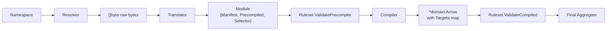
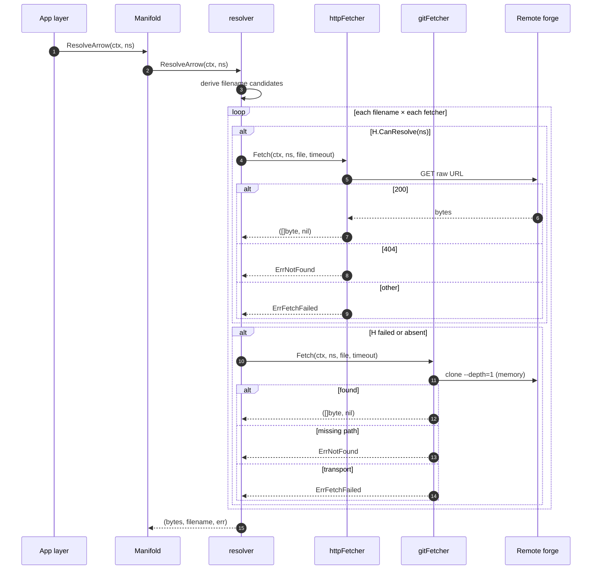
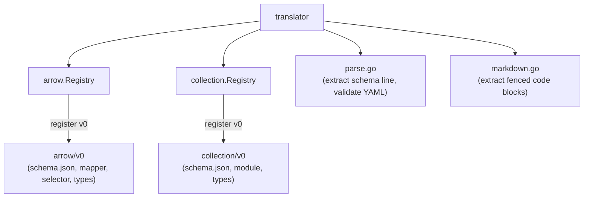

# Quiver — Manifold

## 1. Purpose

`manifold` is the engine that resolves a `Namespace` (`domain/user/repo[/auid][@ref]`) to a fully validated, OS-compiled domain aggregate. The app layer hands it a namespace and gets back either a `*domain.Arrow` (with `Targets` precompiled for every supported `domain.OS`) or a `*domain.Collection` (with arrow entries materialized as namespaces). The app layer never sees git, HTTP, YAML, JSON Schema, or markdown.

Manifold is a stateless, in-memory pipeline. It does **no** disk I/O, holds **no** cache, and emits **no** events. Caching is the job of `vault`; orchestration is the job of `runtime`. Manifold is pure resolution + validation.

The package lives at `internal/engine/manifold` and is composed of five concrete sub-modules: `resolver`, `translator`, `compiler`, `ruleset`, and the in-package `manifold` service that wires them together.

---

## 2. Public API

The `Manifold` interface is the only surface the app layer imports.

| Method | Inputs | Outputs |
|---|---|---|
| `ResolveArrow` | `ctx`, `namespace` | `*domain.Arrow`, raw `[]byte`, resolved filename, `error` |
| `ResolveCollection` | `ctx`, `namespace` | `*domain.Collection`, `error` |
| `ParseArrow` | raw `[]byte` | `*domain.Arrow`, `error` |
| `ParseCollection` | raw `[]byte`, `domain.Namespace` (collection ns) | `*domain.Collection`, `error` |
| `ResolveConstraint` | `ctx`, `namespace`, glob `pattern` | concrete tag/ref string, `error` |
| `ResolveLatestStable` | `ctx`, `namespace` | ref of the latest stable release, `error` |

`ResolveArrow` returns the raw bytes alongside the parsed aggregate so the app layer (Vault, primarily) can persist exactly what was fetched without re-serializing. The filename is whichever of `ARROW.md` / `arrow.yaml` / `<auid>.md` / `<auid>.yaml` was actually picked up.

`Parse*` skip the resolver entirely — they translate, validate, and compile bytes already in hand. Used in tests, by the wizard for ad-hoc validation, and anywhere the bytes come from a non-resolver source.

`ResolveConstraint` does no manifest fetching at all — it lists the remote's tags via `git ls-remote` (in-memory `gogit.Remote.ListContext`), filters by `path.Match`, and sorts semver-aware to pick the highest. Used by deptree to resolve `@v1.*` style globs to concrete refs before the next `ResolveArrow` call.

`ResolveLatestStable` is what a namespace with no `@ref` resolves through. It tries the platform's `LatestReleaseURL` permalink first, reading only the redirect `Location` — a `Location` naming `/releases/tag/<ref>` is a hit, anything else is a miss — then falls back to `ResolveConstraint(ns, "*")`, keeping that answer only when it is a stable semver tag. A repository with neither returns `ErrNoLatestStable`, which is the caller's cue to fall back to the platform's default branches. Because `ls-remote` enumerates every ref, this runs where a refless namespace is resolved to a version — add, and details of an uncatalogued namespace — and inside Fletcher's ref selection (§4.1), never on `GET /v0/search`. Discovery resolves each candidate at the default branch its search response named. See [manifests/v0/versioning.md §6](./manifests/v0/versioning.md).

The constructor `New(fetchTimeout time.Duration)` builds a default Manifold with HTTP+git fetchers and the v0 translator registries. `NewWithResolvers` exists for tests that need to inject stub resolvers.

---

## 3. End-to-end flow


```mermaid
flowchart LR
    NS[Namespace] --> R[Resolver]
    R --> B["[]byte raw bytes"]
    B --> T[Translator]
    T --> M["Module<br/>(Manifest, Precompiled, Selector)"]
    M --> RP[Ruleset.ValidatePrecompile]
    RP --> C[Compiler]
    C --> A["*domain.Arrow<br/>with Targets map"]
    A --> RC[Ruleset.ValidateCompiled]
    RC --> OUT[Final Aggregate]
```

For arrows the ordering is deliberate — precompile rules need access to the abstract `PrecompiledTarget` map (with bases, glob keys, `Overrideable` values) before flattening. Compiled rules need the OS-specific `Target` map after the selector has resolved bases, globs, and overrideables. Each phase runs all of its rules concurrently and aggregates failures into a single `RuleErrors` value.

For collections the flow is shorter: resolve → translate → `ValidateCollectionEntries` → `deriveArrows` (path entries become namespaces under the collection's bare namespace) → `ValidateCollection`.

---

## 4. Resolver

The resolver layer takes a `Namespace` and returns raw manifest bytes plus the filename it was found at. It composes two `Fetcher` strategies in priority order:

| Fetcher | When it applies | How it fetches |
|---|---|---|
| `httpFetcher` | `namespace.Domain()` is in `metadata.GetPlatforms()` (currently `github.com`, `gitlab.com`, `bitbucket.org`) | Single `GET` against the platform's `RawURL` template, substituting `{user}/{repo}/{branch}/{file}`. Branch defaults to the platform's `DefaultBranch` (currently `main`) unless `namespace.Ref()` overrides it. |
| `gitFetcher` | Always (universal fallback) | `gogit.CloneContext` with `Depth=1` into `memory.NewStorage()` + `memfs.New()`, optionally pinned to `Ref()` as tag (then retried as branch). Reads the file from the in-memory worktree. |

The resolver hands each fetcher that returns `CanResolve(ns) == true` the full candidate list, in fetcher order: every candidate over HTTP, then every candidate via git. First success wins.

A namespace that carries a ref is settled by HTTP alone when HTTP can answer: if the host's raw
URL at that exact ref returns 404 for every candidate, the HTTP fetcher reports
`resolvers.ErrAbsentAtRef` and the resolver returns `ErrManifestNotFound` without cloning. A
clone could only confirm the absence, and on large repositories (`astral-sh/uv`,
`torvalds/linux`) it times out first, which would keep Fletcher from ever running. Any non-404
answer (5xx, 429, transport failure) on any candidate is a failure, not absence, and the git
fallback still runs. A refless namespace guesses the host's default branches, so a 404 there is
not definitive and git still runs. A ref naming a branch trusts the raw 404 too: a manifest
pushed to that branch moments ago can still 404 while the host's raw CDN serves a cached miss,
so Fletcher may synthesize for it until the cache expires. The declared manifest wins on the
next re-resolve (vault TTL, refresh or update), so this only delays the switch.

Filename candidates per call:

| Resolution | Candidates (in order) |
|---|---|
| `ResolveArrow` for `domain/user/repo` (3 segments) | `ARROW.md`, `arrow.yaml` |
| `ResolveArrow` for `domain/user/repo/auid` (4 segments) | `<auid>.md`, `<auid>.yaml` |
| `ResolveCollection` | `COLLECTION.md`, `collection.yaml` |

The HTTP-first design gets a TLS-only round trip on the happy path for the three known platforms; git is reserved for self-hosted forges and other domains the HTTP fetcher cannot match. There is no auth — only public repos.


```mermaid
sequenceDiagram
    autonumber
    participant App as App layer
    participant M as Manifold
    participant R as resolver
    participant H as httpFetcher
    participant G as gitFetcher
    participant Web as Remote forge

    App->>M: ResolveArrow(ctx, ns)
    M->>R: ResolveArrow(ctx, ns)
    R->>R: derive filename candidates
    loop each filename × each fetcher
        alt H.CanResolve(ns)
            R->>H: Fetch(ctx, ns, file, timeout)
            H->>Web: GET raw URL
            alt 200
                Web-->>H: bytes
                H-->>R: ([]byte, nil)
            else 404
                H-->>R: ErrNotFound
            else other
                H-->>R: ErrFetchFailed
            end
        end
        alt H failed or absent
            R->>G: Fetch(ctx, ns, file, timeout)
            G->>Web: clone --depth=1 (memory)
            alt found
                G-->>R: ([]byte, nil)
            else missing path
                G-->>R: ErrNotFound
            else transport
                G-->>R: ErrFetchFailed
            end
        end
    end
    R-->>M: (bytes, filename, err)
```

Every fetch derives a `context.WithTimeout(ctx, fetchTimeout)`. The timeout is constructor-injected and defaults to 30s; a tighter caller deadline always wins. The git fetcher's tag-then-branch retry happens only when `Ref()` is non-empty, since `gogit` requires a `ReferenceName` to disambiguate.

Resolver-side errors:

| Sentinel | Meaning |
|---|---|
| `resolver.ErrNotFound` | Manifest file does not exist at any candidate path on the remote (HTTP 404 or missing path in cloned worktree). |
| `resolver.ErrManifestNotFound` | Wraps `ErrNotFound`; returned only when **every** fetcher definitively reported the file absent, or when HTTP alone reported it absent at a pinned ref (`resolvers.ErrAbsentAtRef`, see above). A transport, timeout or rate-limit failure on any fetcher that ran keeps its own error instead. This is the only error that lets Fletcher run (§4.1). |
| `resolver.ErrFetchFailed` | Network/transport failure: non-2xx HTTP status, clone failure, body read error, etc. |
| `resolver.ErrUnsupportedPlatform` | Reserved for namespaces whose domain neither HTTP nor git can serve (currently unused — git is universal). |

### 4.1 Fletcher — synthesized manifests

Fletcher (`internal/engine/manifold/fletcher`) synthesizes an `arrow@v0` manifest for a
repository that ships no `ARROW.md` / `arrow.yaml`, from its release assets, README and public
repo page. It outputs manifest **bytes**, never a `domain.Arrow`: the bytes enter the normal
translate → ruleset → compile pipeline with filename `ARROW.md`, exactly like a declared
manifest, and double as a ready-to-PR `ARROW.md`.

**Layout.** The package root is only the public API: `fletcher.go` (`Fletcher`, whose one method
`Recover(ctx, ns, cause)` is the single call `ResolveArrow` makes; `Releases`, the release
questions Fletcher asks manifold; `New`) and `errors.go` (`NotFletchableError`, its reasons,
`ErrNotFletchable`). The implementation is in `fletcher/internal/`: `fallback` (when to run, ref
selection, error mapping), `gather` (the per-tag build: sources, repo page, README, fetch bounds,
draft), `confidence`, `picker`, `readme`, `forge`, `media` and `models`. Manifold builds its
Fletcher itself when constructed with `manifold.WithFletcher(true)`, from its own host lookup and
fetch timeout (0 means 30 s, as for the resolver), and answers `Releases` from
`ResolveLatestStable`, `ListChannels` and `ResolveDefaultBranch` (`manifold/fletcher_releases.go`);
nothing outside manifold builds one. `Fletcher` and `Releases` are declared in
`fletcher/internal/models` and aliased from the root.

**When it runs.** `ResolveArrow` falls back to Fletcher only when all of these hold:

- the flag `manifold.fletcher.enabled` is `true` (default `false`, read once at construction
  by the engine container and passed to `manifold.WithFletcher` — a change needs a daemon
  restart);
- the resolver returned `resolver.ErrManifestNotFound` — never on a network, timeout or
  rate-limit error, so a real manifest is never silently replaced;
- the namespace is not quiver-hosted (4 segments).

A declared manifest always wins: every re-resolve (update, refresh) tries the declared file
first, so a maintainer's `ARROW.md` takes over the moment it exists. With the flag off, behaviour is
unchanged: `ErrManifestNotFound` surfaces as not found, and an already installed inferred arrow
keeps working from its cached manifest.

**Ref selection.** The namespace's ref is tried first. When it has no release and the ref is
empty or a default branch, Fletcher retries on `ResolveLatestStable`, then on the latest tag of
the newest non-stable channel (`ListChannels` re-ordered by
`resolvers.NewestFirst`: highest version core first, pointer channels last; the default-branch
fallback entry is skipped), never an older channel just because its name sorts first; a
prerelease-only repository resolves this way. An exact tag with no release never falls back.
If no draft was produced and any of those lookups failed with anything other than
`ErrNoLatestStable` / `ErrNoTagInChannel` (for example `ls-remote` failing), that lookup error
is returned rather than `no_release_assets`, even when the other lookup did yield a tag that was
tried: a failed lookup means a release may exist that was never seen.

**Host sources.** Fletcher reaches the host only through `hosts.Host`, the same contract the
declared-manifest lookup uses: `ReleaseAssets`, `RawFileURL`, `BlobFileURL`, `RepoPageURL`,
`OwnerAvatarURL` and `RepoMetadata`. Everything else it fetches itself through `core/fns` (see **Fetch bounds**). On
GitHub it makes **one** metered API call per repository (60/h unauthenticated), `RepoMetadata`;
everything else is unmetered pages and raw files:

| Source | Where it comes from |
|---|---|
| Release assets | GitHub provider: `github.com/<repo>/releases/expanded_assets/<tag>` HTML fragment — asset names, download URLs, `sha256:` digests. A fragment whose shape stops matching fails loudly, never with a partial list. A 404 is an empty list. |
| README, icon probes | `RawFileURL` (`raw.githubusercontent.com`). |
| Repo page | `RepoPageURL` (`github.com/<repo>`), parsed by Fletcher for the banner and as the description fallback. |
| Owner avatar (icon fallback) | `OwnerAvatarURL`: the stable, unmetered `github.com/<owner>.png` (`owner_avatar_url` in `metadata.yaml`), fetched once through the same 64 KiB prefix probe and image sniff as any icon, and stored as that stable URL, never the `avatars.githubusercontent.com` address it redirects to. A host with no template returns `""`. |
| Description (and avatar, secondarily) | `RepoMetadata`: GitHub provider, `api.github.com/repos/<repo>` (`repo_api_url`), at most one request per bare repository, memoized in-process (concurrent callers share it; a failure is remembered for 10 minutes). Unauthenticated; any failure, rate limits included, is a miss and never fails a draft. |
| README links | `RawFileURL` for images, `BlobFileURL` for other relative links, both pinned to the ref. |

On GitLab the provider uses the public REST API anonymously (500/min) for release assets only:
`release_api_url` — one asset per `assets.links[]` entry (source archives ignored), URL =
`direct_asset_url`. Digest, first hit wins: the generic package file's `file_sha256`
(`packages_api_url`, one lookup per package; 401/403 is a miss), then a checksum file among the
links (`checksums.txt`, `sha256sums[.txt]`, `*checksums*.txt`, `X.sha256`; names mentioning another
algorithm are skipped; ≤ 1 MiB; fetched only over https, every redirect hop included, and only
while an installable asset still lacks a digest; any failure is a miss). Names match on the link
name and on the basename of the link and download URLs; an entry listed twice with different
digests is dropped. An asset whose link or download URL is not https never carries a digest, so
the picker drops it. A 404 on the release is an empty list. The README, icon probes and repo page
(`gitlab.com/<repo>`) come through `RawFileURL` and `RepoPageURL` exactly as on GitHub. GitLab
and Bitbucket offer no `RepoMetadata` (it is always a miss), so their description comes from the
repo page and they have no avatar fallback.

**Repo page.** Fletcher reads the page's Open Graph tags with one host-agnostic rule set: text or
images that name the repository's own `owner/repo` slug are the site's template, not the
author's. `og:description` is the description only when `RepoMetadata` gave none; it becomes the description after a trailing ` - <slug>` and every
sentence naming the slug are dropped. `og:image` is a banner candidate only when its URL does not
name the slug and its sniffed dimensions (one capped fetch) are banner-shaped; it is never an
icon. A host with no repo page (`RepoPageURL` empty) contributes neither.

URL templates live in `internal/core/metadata/metadata.yaml`.

**Which ref a build lives under.** `Recover` reports the ref it actually drafted from, and
`ResolveArrow` stamps it on the arrow's `Namespace` (bare namespace at that ref) whenever it
differs from the ref asked. This matters for a branch: discovery asks for the default branch the
search response named, but a repository whose only manifest is inferred has no release assets at
a branch, so the draft comes from a release tag (the same tag details, add and install pick when
they ask for the stable channel, or the newest non-stable one when there is no stable). Discovery
files the arrow under that tag, so the ref shown in search is the ref installed, and opening the
details, adding or installing a discovered arrow reads the vault row and builds nothing again. A
declared manifest keeps the branch discovery fetched it from.

**Caching of resolution.** `ResolveLatestStable`, `ResolveConstraint` and `ListChannels` share
one TTL cache keyed by the namespace as asked, so the release-permalink request that picks the
stable tag happens once per TTL, not once per detail sub-endpoint (every one of them asks the
same refless namespace). A failed lookup is never cached.

A manifest built while `RepoMetadata` was failing is cached like any other (the vault has one TTL
per entry and no per-entry override): no icon depends on that call any more, and the only loss
is an API-authored description where the page has no `og:description`.

**One build.** There is a single Fletcher mode, `Recover` (used by `ResolveArrow`), and it builds
the whole manifest: picks, page metadata, a transformed README (relative URLs absolutized and
pinned to the ref; badge rows, the leading title block and install/download sections stripped;
an English README preferred when the default is CJK-dominant; a literal ` ```arrow ` fence
escaped) and a media cascade: icon from the icon probes, then the owner's avatar from
`OwnerAvatarURL` (unmetered, validated as an image), then the avatar `RepoMetadata` reported
(no README image is ever parsed for media). The icon therefore never depends on the metered API:
a rate-limited `RepoMetadata` costs the API description and nothing else, since the page's
`og:description` still covers it; banner from the repo page's `og:image` only. Search results, details and adds
all come from this build and the same vault cache.

**Latency.** Once the tag is known, the release assets, the repo page, the README and the icon
probes are fetched concurrently (a fixed set of goroutines, all bound to the caller's context).
Errors keep the sequential precedence — release assets, then repo page, then README — and a
release-asset failure cancels the other fetches. Icon probes are an ordered table of
raw-file paths (`src-tauri/icons/…`, then `icon|logo|app-icon` as `png|svg` under the root,
`assets`, `.github`, `docs`, `images`, `icons`, `resources`, `build` and `public`), pinned to the
tag first and then to each default branch, all candidates ranked ref-major and path-minor and
fetched 24 at a time; the highest-ranked accepted candidate wins regardless of which answered
first, and a hit stops every lower-ranked candidate from being fetched. A raster icon must be square within 2% and
at least 128 px; an SVG is judged by its root `<svg>` start tag alone (`width`/`height`, else
`viewBox` when those are missing, non-numeric or percentages) and must be square within 2%; an
unparsable file is never an icon.

**Fetch bounds.** Fletcher fetches through `core/fns` and refuses anything but an `http(s)` URL
before calling it. Every fetch is bounded by manifold's `fetch_timeout` through its context;
fns's own fixed client timeout is disabled. Media probes (icon probes, the
`og:image` sniff) stream and read at most 64 KiB. The repo page streams and reads at most 1 MiB
(Open Graph tags sit in `<head>`). The README is read whole under `fns.Do`'s own body cap (20
MiB): a 404 moves on to the next README name, while any other status, a transport failure or a
body over the cap is `resolver.ErrFetchFailed`.

**Picker rules (summary).** For each of the six `domain.OS` targets, independently
(`fletcher/internal/picker`):

- Skip checksums/signatures/SBOMs, source archives, debug symbols, docs, language packages,
  mobile packages, shared libraries and fonts — skip words match on token boundaries.
- Classify OS by tokens (`linux|musl|gnu|appimage…`, `darwin|macos|mac|osx|apple…`,
  `windows|win|win64|msvc|mingw…`) or by extension (`.dmg`, `.AppImage`, `.exe`), and arch by
  `arm64|aarch64…`, `x86_64|amd64|x64|64bit…`, `universal`; 32-bit and exotic arches are
  excluded.
- Prefer exact arch, then an arch-less asset assumed to be amd64, then emulation (darwin and
  windows arm64 may run amd64). **Linux arm64 is never assumed.**
- Prefer archive / bare binary / AppImage / dmg; installer-only targets (`.pkg`, `.msi`,
  `.deb`, `.rpm`, …) are dropped.
- Tiebreak on the fewest extra tokens after removing OS, arch, version, libc, extension and
  channel tokens; an asset whose product token equals the repo name beats a suffixed one
  (`zed` over `zed-remote-server`). When candidates of one product still differ only in
  packaging (`zen-x86_64.AppImage` vs `zen.linux-x86_64.tar.xz`), a linux target takes the
  AppImage if the release ships GUI packaging, else the archive; an arch-less `.dmg` with no
  same-stem archive competes with the darwin universal/native picks and wins as the canonical
  GUI package (`Ghostty.dmg` over `ghostty-macos-universal.zip`), while a `.dmg` sharing a stem
  with an archive loses to it. Candidates still differing after the tiebreak refuse the
  target — Fletcher never guesses. A release shipping several unrelated products (none named
  after the repo) yields no pick at all.
- Format follows the file name's extension, never the dots in the product name: an asset ending
  in an archive suffix (`.zip`, `.tar.gz`, `.tgz`, `.tar.xz`, …) is an archive
  (`GitHub.Desktop-arm64.zip`, `Some.App-darwin-arm64.tar.gz`), and only a name without a
  recognised suffix and without a dot in its last six characters is a bare binary.
- `domain.ReleaseAsset.Name` is always the real file name (the download URL's unescaped
  basename). A host that also shows a human label for the file (GitHub's `expanded_assets` page:
  `GitHub Desktop 3.6.6 macOS arm64` for `GitHub.Desktop-arm64.zip`) fills `Label` when it
  differs; the REST-style hosts leave it empty. The picker reads the format, the skip rules, the
  product and the stem from `Name`, and the OS family and architecture from `Name` plus `Label`,
  so an asset whose file name names no OS can still be recognised by its label, and a label can
  never change a file's format. A trailing `setup`/`installer` glued onto the product token
  (`GitHubDesktopSetup`) is not part of the product.
- A pick without a `sha256` digest, whose download URL is not `https`/`http`, or whose file
  name (taken from the download URL) is not a plain `[A-Za-z0-9._+-]` name, is dropped.

`picker.Pick` also carries `Product` (the normalized product token) and `GUI bool`: whether the release ships a GUI package (`.dmg` /
`.AppImage`, the same `shipsGUI` check used to drop GUI installer `.exe`s above).

The forged target installs every format, bare binaries included, with `fetch` (checksum-pinned)
plus `portable`. `fetch` always saves the asset as `${INSTALL_PATH}/.<name>.download` (the
expose name, hidden at the workdir root so its parent always exists and the wizard's expose scan skips it;
`portable` detects the format from content, not the extension), and `portable` installs it into
`${INSTALL_PATH}/<name>`, a directory it owns and replaces on every run (see
[manifests/v0/arrow.md §8.5](./manifests/v0/arrow.md#portable--portable-app)), with
`name: <name>` (`<name>.exe` on Windows targets), so a bare binary, or the one file inside a
single-file compressed asset (`tool-linux-amd64.gz`, `tool.exe.gz`), lands there under that
name. The expose name is capped at 60 characters so `<name>.exe` still fits the 64-character
name rule, loses trailing dots, and gets an `app-` prefix when it would be a Windows device
name.
A "binary" pick whose content is not a native ELF, Mach-O or PE executable (a shell script,
say) fails the install with `unknown format`. Every release and format of an arrow uses
the same two paths, so a reinstall over a workdir that still holds the previous release leaves
nothing of it behind, even when a release switches between an archive, a bare binary and an
AppImage. The target emits no `update` (the steps pin one ref's asset, so an update reinstalls
at the new ref instead, see [usecases.md](./usecases.md)), emits no `uninstall` (everything
lands in `${INSTALL_PATH}`, which the relaxed pairing rule allows), and declares `expose`
entries with `path: auto`, except a bare binary, which gets an explicit `cli` path
(`${INSTALL_PATH}/<name>/<name>`, `.exe` on Windows); a DMG or AppImage gets a `desktop` entry; an archive gets a
`cli` entry, plus a `desktop` entry too on `darwin` or when `pick.GUI` is set.

**Confidence.** Recorded in the manifest as `metadata.generator` (see
[manifests/v0/arrow.md §3.2](./manifests/v0/arrow.md#32-metadatagenerator--synthesized-manifests)):

| Level | When |
|---|---|
| `high` | No warnings: every pick is exact-arch and named after the repo. |
| `medium` | Any `assumed_arch`, `emulated`, `windows_exe_unverified`, `name_mismatch` or `unpinned_rolling_tag` warning. |
| `low` | No platform survives the name-consistency check. |

A pick is name-consistent when its product is the repo name, or equals the release's dominant
product (the repo-named product if any pick has it, else the most common product among the
picks; a tie has no dominant product) **and** the pick's companion tokens all appear in the repo
name. A companion token (`cli`, `api`, `server`, `remote`, `agent`, `daemon`, `client`, `plugin`,
`extension`, `helper`, `headless`, `worker`, `proxy`, `bridge`, `updater`, `go`, `py`, `python`)
marks an asset as a satellite of the main product, so a release whose only product is
`gadget-cli` counts as consistent for repo `gadget-cli` but not for repo `gadget`. Earlier, the picker
already restricts a platform to assets whose companions the repo name carries whenever the release
ships any such asset. Consistency is judged per platform: an inconsistent
platform is **dropped** from the manifest and raises `name_mismatch`; a consistent pick that
merely is not named after the repo (`zen` in repo `desktop`) also raises `name_mismatch` (medium).
`low` is reached only when no platform survives.

**Rolling tags.** A ref with no version core (`tip`, `nightly`; see `resolvers.ParseTag`) names
assets replaced on every build, so a pinned `sha256` would fail later installs. Fletcher then
omits the `fetch` checksum from every target, tolerates assets that carry no digest, and raises
`unpinned_rolling_tag` (confidence at most `medium`). Versioned releases still require a digest.

A `low` build is refused: `Recover` returns `NotFletchableError{Reason: low_confidence}` instead
of a manifest, so every synthesized manifest is `high` or `medium`. The generator block is data
exposed for debugging; nothing outside Fletcher branches on it.

**`NotFletchableError` reasons.** `fletcher.NotFletchableError{Reason}` wraps
`fletcher.ErrNotFletchable`, and `ResolveArrow` wraps it in `resolver.ErrManifestNotFound`: to
every caller outside manifold, a repository Fletcher cannot build is a repository without a
manifest (the app layer's `ErrNotFound`, 404), exactly as with Fletcher disabled. The reason
stays in the wrapped chain for logs:

| Reason | Meaning |
|---|---|
| `host_unsupported` | No host serves the namespace, or the namespace is quiver-hosted. |
| `no_release_assets` | No release, or a release with no assets, at any ref tried. |
| `no_usable_asset` | Releases exist but no OS target produced a usable, checksummed pick. |
| `no_digest` | Releases exist and would have produced a pick, but no candidate asset carries a `sha256` digest (older GitHub releases publish none). |
| `low_confidence` | No platform's pick is consistent with the release's dominant product. |

**Transient failures.** Any other `Recover` failure (a 5xx or 429 on the release
assets, repo page or README, or a failed tag lookup) is wrapped in `resolver.ErrFetchFailed`,
which the app layer maps to `apperrors.ErrFetchFailed` (502). It is never cached.

**Caching.** Fletcher output is cached by the vault like any manifest (24h TTL). Manifold never
touches the vault: caching is the app layer's job. The arrow store's resolver
(`arrow/internal/store/resolver.go`) reads the vault first, else calls `ResolveArrow` and
`PutArrow`s the result. Discovery (both passes) calls `ResolveArrow` at the default branch the
search response named and `PutArrow`s the manifest with the index metadata before streaming it,
so every streamed result is returned by the `GET /v0/search` that follows. A candidate that fails to resolve is skipped, not streamed. A
repository Fletcher cannot build is recorded as confirmed-absent, like any repository without a
manifest, by the arrow store's resolver and by discovery alike (`verifyOne` calls `PutArrowNotFound`
on a definitive not-found). `discovery.Browse`, the query-less pass behind `GET /v0/home`, reads
those markers: it drops a confirmed-absent candidate and answers a vault-fresh one from the cached
manifest, so a repeat pass spends no metered request on either. Discovery's unmarked pass (repositories with no discovery topic) always runs; it is tuned by
`search.unmarked` (`min_stars`, `probe_limit`) and, unlike Fletcher, has no on/off switch
(`manifold.fletcher.enabled` gates only Fletcher). **Caveat:** a confirmed-absent entry persists until the vault TTL
expires, so each of these keeps answering 404 for up to one TTL: a namespace resolved while
Fletcher was disabled (enabling the flag does not retroactively fletch it), a release published
after a `no_release_assets` verdict, and a daemon upgrade whose picker or confidence rules would
now build a repository refused before.

---

## 5. Translator

The translator turns raw bytes into typed in-memory structures and runs JSON Schema validation against the version-specific schema embedded in the binary.

Steps for `Translator.Arrow(data)`:

1. `extractArrowCodeblock` — if `data` is markdown (e.g. `ARROW.md`), pull out the contents of the first `` ```arrow `` fenced block. Otherwise pass through.
2. `extractManifestFromYAML` — unmarshal just the `schema:` (or legacy `manifest:`) string into `ManifestInfo{SchemaType, Version, ManifestKey}`.
3. Reject if `SchemaType != "arrow"`.
4. Look up the version handler in the arrow `Registry` (`v0` is the only one registered today).
5. Validate the YAML body against the handler's embedded JSON Schema (YAML → JSON conversion → `gojsonschema.Validate`).
6. Call the handler's `Parse(data)` → `(*domain.Arrow, map[string]PrecompiledTarget, error)`.
7. Return a `Module{Manifest, Precompiled, Selector}` that the Manifold service feeds into ruleset + compiler.

`Translator.Collection(data)` is the same shape with `` ```collection `` extraction, `SchemaType == "collection"`, the collection registry, and a `CollectionModule{Manifest, Entries}` return — entries are deferred to manifold-level processing so they can be resolved against the collection namespace.

`Translator.ReadSchemaInfo(data)` exposes the cheap front-half (schema-line parse only) for callers that want to peek at version without paying for full validation.

The translator's submodule layout:


```mermaid
flowchart TB
    T[translator] --> AR[arrow.Registry]
    T --> CR[collection.Registry]
    T --> P["parse.go<br/>(extract schema line, validate YAML)"]
    T --> MD["markdown.go<br/>(extract fenced code blocks)"]
    AR -->|register v0| AV0["arrow/v0<br/>(schema.json, mapper, selector, types)"]
    CR -->|register v0| CV0["collection/v0<br/>(schema.json, module, types)"]
```

### 5.1 Markdown extraction

`markdown.go` finds the first fenced block whose opening fence is exactly `` ```arrow `` or `` ```collection `` and returns everything between that line and the next `` ``` ``. Any prose around the block is ignored. If no fence is found, the original bytes are passed through — so plain `arrow.yaml` / `collection.yaml` files still translate normally.

### 5.2 Schema-line parser

`parse.go` accepts both `schema: arrow@v0` and the legacy `manifest: arrow@v0`. The string is split on `@` into `(SchemaType, Version)`; both must be non-empty. `ManifestKey` is just `schemaType + "@" + version` and is used in error messages to identify which registry entry was looked up.

### 5.3 JSON Schema validation

YAML is unmarshalled to `map[string]interface{}` and re-encoded to JSON, then both the schema (loaded from the version handler's `Schema()` / `GetSchema()` method as embedded bytes) and document are passed to `gojsonschema.Validate`. All schema violations are concatenated into a single human-readable error message.

### 5.4 Module/version registry

Each `Registry` maps a version string to a handler interface. New schema versions register a new handler at `NewRegistry()` construction; the registry is stateless after that.

| Registry | Interface | Versions registered |
|---|---|---|
| `arrow.Registry` | `Schema() []byte`, `Parse([]byte) (*domain.Arrow, map[string]PrecompiledTarget, error)`, `Selector() models.Selector` | `v0` |
| `collection.Registry` | `Version() string`, `GetSchema() ([]byte, error)`, `Map([]byte) (*domain.Collection, []CollectionArrowEntry, error)` | `v0` |

There is no version upcasting — an unknown version returns an error and the manifest is rejected.

### 5.5 Arrow v0 mapper specifics

`arrow/v0/mapper.go` walks the YAML struct (`arrowV0`) and produces:

- A `*domain.Arrow` carrying only the version-independent shell: metadata, variables, netbridge ports. `Targets` is left empty — the compiler fills it.
- A `map[string]PrecompiledTarget` keyed by the YAML target key (`*`, `linux/*`, `linux/amd64`, `_base`, etc.). Each `PrecompiledTarget` keeps `base`, requirements, tools, services, exports as `Overrideable[string]`, lifecycle (with overrideables), and methods.
- Pre-refactor manifests (no top-level `targets:`) are rejected with an explanatory error; there is no migration shim.
- Step kinds: `run`, `fetch`, `signal`. The synthetic `dependencies` step is rejected if seen in a manifest — the runtime injects it.

### 5.6 Selector (target selection algorithm)

The selector lives next to the arrow v0 module because it is part of the v0 compilation contract. The compiler invokes it once per `domain.OS` via the `models.Selector` interface.

For a given OS:

1. **Filter to non-abstract keys** — keys beginning with `_` are abstract bases that may only appear via `base:` references.
2. **Match candidates** — `*` matches everything; otherwise `path.Match(key, os)`.
3. **Rank by specificity** — `*` = 1, glob containing `*` = 2, exact = 3. Higher wins.
4. **Tie at the top rank** is `AmbiguousTargetError` — fail compile.
5. **No match** is `ErrNoTargetForOS` — silently omitted from `Targets` (some OSes simply aren't supported).
6. **Flatten the base chain** — walk `base:` references depth-first, merging parent into child (requirements field-wise, namespaces child-wins, exports/methods merged maps, step lists child-wins-if-non-nil). Cycles produce a hard error.
7. **Resolve overrideables** — for each `Overrideable[T]`, run the same specificity algorithm against the OS, falling back to `Default` when nothing matches. Tools/services become `DependencyEdge` carrying their `Constraint` from `namespace@ref`. Steps are resolved via `Step.Resolve(os)`.

### 5.7 Collection v0 mapper specifics

`collection/v0/module.go` decodes `quiverV0` and copies metadata into a `domain.Collection`. The arrows array is returned separately as `[]CollectionArrowEntry{Path, Namespace}` because either form is legal in YAML — a bare string is a remote namespace, a `{path: …}` is a local path within the collection repo. Manifold (not the translator) decides what each entry resolves to.

---

## 6. Compiler

`compiler.Compile(manifest, precompiled, selector)` runs once per resolution. For every value of `domain.AllOS()` it calls `selector.SelectTarget(precompiled, os)`:

| Outcome | Action |
|---|---|
| Success | `manifest.Targets[os] = target` |
| `ErrNoTargetForOS` | Skip (this OS isn't supported) |
| `AmbiguousTargetError` | Return wrapped error (compile fails) |
| Other | Return wrapped error (compile fails) |

After this loop `manifest.Targets` is the map the runtime queries by host OS. It may be empty — the post-compile ruleset rejects that case with `no_supported_platform`.

---

## 7. Ruleset

The ruleset is a set of independent business rules composed concurrently. Each rule implements one of two interfaces:

| Interface | Sees | Runs |
|---|---|---|
| `PrecompileRule` | `*domain.Arrow` (shell) + `map[string]PrecompiledTarget` | Before compile |
| `CompiledRule` | `*domain.Arrow` (with `Targets` populated) | After compile |

`arrow.RunPrecompile` and `arrow.RunCompiled` fan out a goroutine per rule, collect `RuleError`s under a mutex, and return the aggregated `RuleErrors`. A rule produces zero or more `RuleError{Field, Rule, Message}` records — `Field` is a YAML-path-like locator for IDE pointing, `Rule` is a stable machine ID for tooling, `Message` is the human string. All rule failures unwrap to `aerrors.ErrInvalidManifest`.

### 7.1 Arrow precompile rules

| Rule | Checks |
|---|---|
| `MetadataRule` | `metadata.name` required; `name` ≤ `MaxNameLength`; `description` ≤ `MaxDescriptionLength`. |
| `VariablesRule` | Per-variable `Validate()`; `select` variables must have `values`; variable names unique. |
| `NetbridgeRule` | Per-port `Validate()`; port names unique. |
| `BaseIntegrityRule` | Each target's `base` chain resolves, has no cycle, and all referenced keys exist. |
| `OverrideableKeysRule` | Every key in `Overrideable.OSArch` is either `*` or contains `/` (`linux/amd64`, `linux/*`, etc.). Applies to exports, every step's overrideable fields, and method steps. |
| `OverrideableCoverageRule` | For non-abstract targets, every overrideable string field with no `Default` must cover all `domain.AllOS()` values via `OSArch` keys (using the same `path.Match` rules as the selector). |

### 7.2 Arrow compiled rules

| Rule | Checks |
|---|---|
| `ToolsServicesRule` | A namespace cannot appear in both `tools` and `services` of the same compiled target. |
| `ExportStaticRule` | Export values cannot contain `${…}` — exports are static strings. |
| `VariableRefsRule` | Every `${TOKEN}` in `run.command`, `fetch.url`, `fetch.to` must reference a known variable, netbridge port, or one of the built-ins (`WORKDIR`, `INSTALL_PATH`, `ARROW_NAMESPACE`, `PLATFORM`, `REF`). Tokens with `.` or `:` are treated as module-scoped and skipped. |
| `ServicePackageRule` | A manifest cannot mix service targets (with `execute`) and pure package targets (without `execute`). |
| `LifecyclePairsRule` | `install`/`uninstall` must both be present or both absent. `stop` requires `execute`. |
| `ServiceConsumerLifecycleRule` | A target that declares `services:` must define both `execute` and `stop`. |
| `TimeoutFormatRule` | Step timeouts (default value only) match `^\d+[sm]$`. |
| `MethodStatesRule` | Method `available_in` values are `ready` or `running`. |
| `NoDependenciesStepRule` | `type: dependencies` must not appear in any manifest step — the runtime injects the synthetic dependency-resolve step. |

After all compiled rules run, the manifold ruleset adds one more check: `len(manifest.Targets) == 0` becomes a `no_supported_platform` rule failure, so a manifest that compiles cleanly but yields zero usable targets fails fast.

### 7.3 Collection rules

| Rule | Checks |
|---|---|
| `CheckArrowEntries` | Each `CollectionArrowEntry` has exactly one of `Path` or `Namespace` (XOR). |
| `ValidateCollection` | `meta.name`, `meta.description`, and a non-empty `Arrows` list are required; and `CheckDuplicateNamespaces` ensures resolved namespaces are unique. |

`Arrows` is populated by `manifold.deriveArrows` from the validated entries: a `Namespace` entry passes through as `IsLocal: false`; a `Path` entry has its last segment appended to the collection's bare namespace and is marked `IsLocal: true`. Empty path segments are an error.

---

## 8. Error categories

| Category | Sentinel(s) | Source |
|---|---|---|
| Resolution | `resolver.ErrNotFound`, `resolver.ErrFetchFailed`, `resolver.ErrUnsupportedPlatform` | Resolver / fetchers |
| Parsing | Wrapped `fmt.Errorf` from YAML unmarshal, schema-line extraction, codeblock extraction, JSON Schema validation, mapper errors | Translator |
| Validation | `aerrors.ErrInvalidManifest` (via `RuleError.Unwrap`); also `aerrors.ErrNoSupportedPlatform` | Ruleset |
| Assembly/compile | Wrapped errors from selector (`AmbiguousTargetError`, `ErrNoTargetForOS`) and base-chain walk | Compiler / selector |
| Constraint | Wrapped `fmt.Errorf` for "no tags match", invalid pattern, transport failure | Constraint resolver |
| Synthesis | `fletcher.NotFletchableError` wrapped in `resolver.ErrManifestNotFound` (§4.1); transient failures as `resolver.ErrFetchFailed` | Fletcher |

Callers use `errors.Is` for the sentinels and `errors.As` for `RuleErrors` / `AmbiguousTargetError` to extract structured detail.

---

## 9. Constraints and non-goals

- No disk I/O. All clones go through `memory.NewStorage()` + `memfs.New()`; HTTP responses are buffered into memory; YAML is parsed in-place. Persistence is `vault`'s job.
- No event emission, no command bus, no orchestration. Pure functions over namespaces.
- No authentication. Public repositories only.
- No mutation of the input bytes. The bytes returned from `ResolveArrow` are exactly what was fetched; the parsed aggregate is a separate value.
- No version upcasting. Each `schema@version` is a distinct, isolated translator entry.
- The selector and v0 schema are intentionally co-located — the selector is part of the v0 compilation contract, not a generic engine concern. Future versions will register their own selector.

---

## 10. Cross-references

- Arrow manifest schema and conventions: [manifests/v0/arrow.md](./manifests/v0/arrow.md)
- Arrow ref/version semantics: [manifests/v0/versioning.md](./manifests/v0/versioning.md)
- Collection manifest: [manifests/v0/collection.md](./manifests/v0/collection.md)
- Caching and persistence: [vault.md](./vault.md)
- Domain types (`Namespace`, `Arrow`, `Collection`, `Target`, `OS`): [domain.md](./domain.md)
- Netbridge (port definitions): [netbridge.md](./netbridge.md)
- Dependency resolution that consumes manifold: [deptree.md](./deptree.md)
