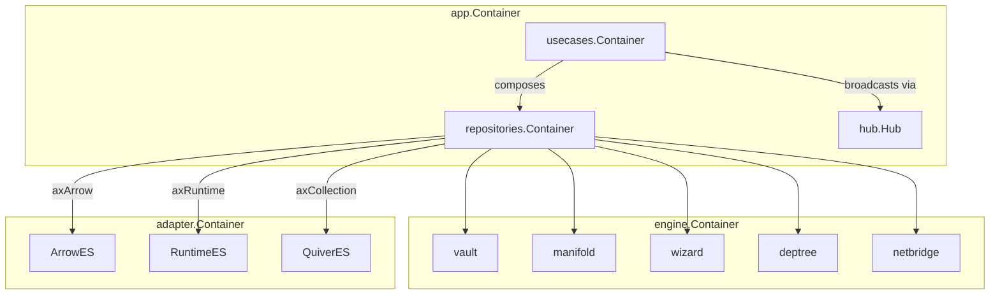
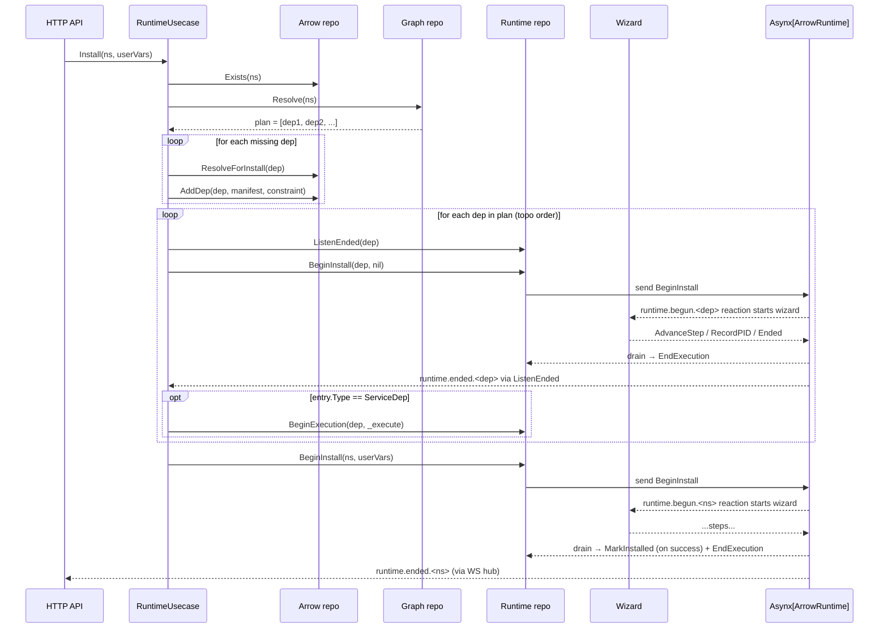
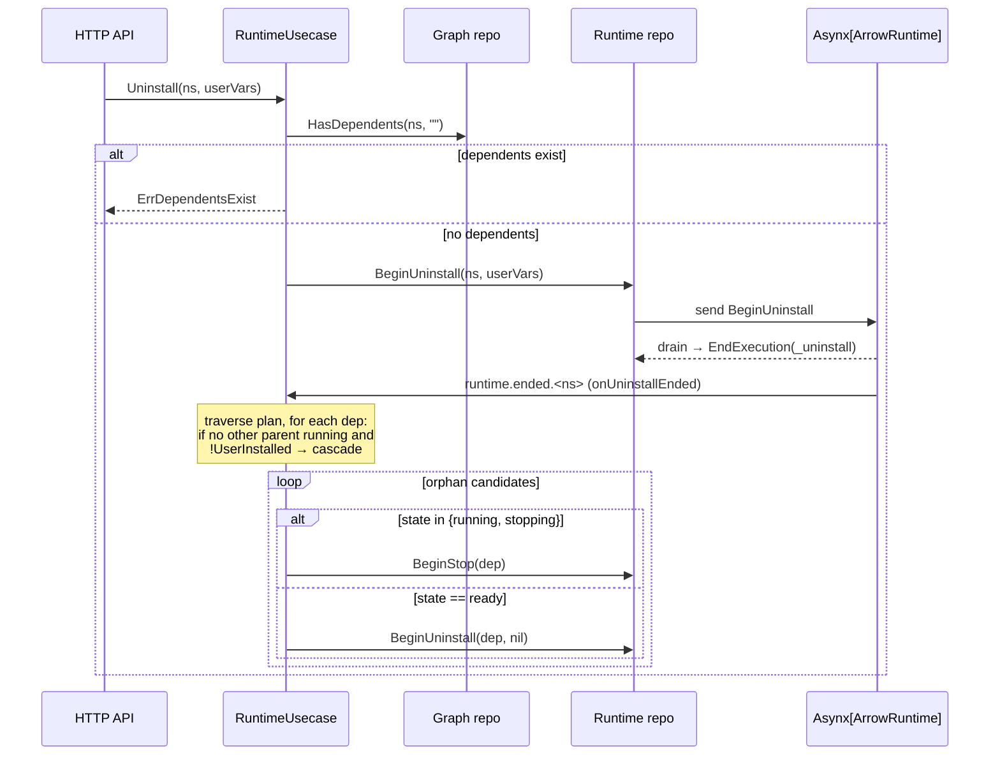
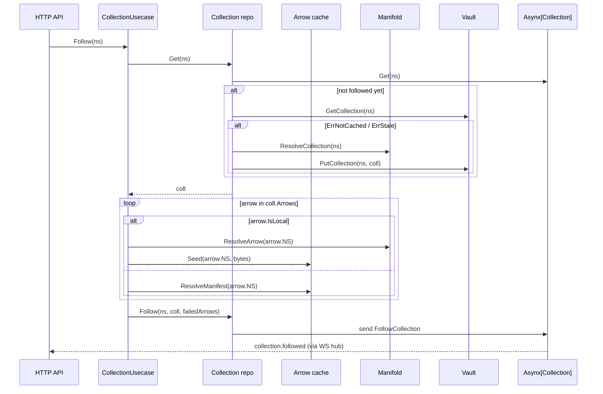

# Quiver — App / Use-Case Layer

## Overview

The app layer is the **orchestration layer** of Quiver core. It is the only layer that composes multiple engines (`vault`, `manifold`, `wizard`, `deptree`, `netbridge`) and the `domain` package together. Engines are independent capabilities: the app layer wires them into the higher-level workflows that the API and CLI consume.

It exposes three top-level use cases — `ArrowUsecase`, `RuntimeUsecase`, `CollectionUsecase` — backed by four repositories that own the Asynx event-sourced aggregates and the projection-derived storage.

Related specs: [architecture.md](architecture.md), [domain.md](domain.md), [commands.md](commands.md), [subscriptions.md](subscriptions.md), [runtime.md](runtime.md), [wizard.md](wizard.md), [vault.md](vault.md), [manifold.md](manifold.md), [deptree.md](deptree.md), [netbridge.md](netbridge.md), [manifests/v0/arrow.md](manifests/v0/arrow.md), [manifests/v0/collection.md](manifests/v0/collection.md), [http-api.md](http-api.md), [websocket.md](websocket.md).

---

## 1. Module Layout

The full package is `internal/app/`:

| Subdir | Role |
|--------|------|
| `usecases/` | Top-level use case interfaces — the public contract the API/CLI calls. Compose repositories. |
| `repositories/` | One repository per Asynx aggregate (Arrow, Runtime, Collection) plus a `Graph` repository that owns the dependency-edge projection. Each repository owns command construction, projection registration, store wiring, and reactive callbacks. |
| `models/` | DTOs returned by use cases — version-agnostic shapes carried across the API boundary. Includes `mappers/` for view→DTO conversion. |
| `hub/` | `WebSocketHub` interface plus a default `Hub` fan-out implementation. Defined in the app layer so app builders can broadcast without importing `internal/api/`. |
| `errors/` | Shared sentinel errors (`ErrNotFound`, `ErrAlreadyExists`, `ErrStateViolation`, `ErrDependentsExist`, `ErrInvalidNamespace`, `ErrInvalidManifest`, `ErrPlatformNotSupported`, `ErrMissingVariable`, `ErrMethodNotFound`, `ErrFetchFailed`). The HTTP layer maps these to status codes. |
| `mocks/` | Cross-cutting test doubles (Asynx aggregates, hub). |
| `container.go` | Top-level dependency-injection wiring (engines + adapters → repositories → use cases). |

Inside each repository the layout is:

| Path | Purpose |
|------|---------|
| `<repo>.go` | Public interface, constructor, and direct delegations to internal packages. |
| `internal/commands/*.go` | One file per Asynx `Command` (`AggregateID`, `EventName`, `ShouldSnapshot`, `Validate`, `EmitEvent`). |
| `internal/store/` | View-model storage and projection-driven reader queries. |
| `internal/upcasters/` | Event schema migrations (currently empty placeholders). |
| `internal/<reactions, recovery, hooks, assembler, ...>` | Repository-specific orchestration helpers. |

---

## 2. Repositories

Each repository owns exactly one Asynx aggregate (or in `Graph`'s case, a derived projection over `Asynx[Arrow]`). All commands flow through these repositories — the use case layer never sends to Asynx directly.

| Repository | Aggregate / store | Engines used | Owns |
|------------|-------------------|--------------|------|
| `repositories/arrow.Arrow` | `Asynx[domain.Arrow]` + GORM view-model store (`arrows.db`) | `vault`, `manifold` | Catalog CRUD, manifest resolution, version upgrade, manifest validation, `MarkInstalled` post-install hook. |
| `repositories/runtime.Runtime` | `Asynx[domainRuntime.ArrowRuntime]` | `wizard`, `vault`, `netbridge` (via assembler) | Begin* commands, drain goroutine that consumes wizard events, crash recovery, drain-tracking shutdown. |
| `repositories/collection.Collection` | `Asynx[domain.Collection]` + Bolt store at `collections.db` | `vault`, `manifold` | Follow / Unfollow lifecycle, vault fallback for unfollowed-but-cached collections. |
| `repositories/graph.Graph` | Derived dep-edge table on the shared GORM DB | `manifold`, `deptree` | Topological resolution, reverse-dependency lookup, dep diffing, glob constraint resolution. Listens to `arrow.added.*`, `arrow.updated.*`, `arrow.upgraded.*`, and `OnForget` to keep edges in sync. |

### 2.1 Arrow repository

Public methods (selected): `Add`, `AddDep`, `Remove`, `Get`, `Exists`, `List`, `GetDetail`, `GetManifest`, `ResolveManifest`, `ResolveForInstall`, `ResolveConstraint`, `UpgradeVersion`, `UpdateManifest`, `Seed`, `ValidateManifest`, `MarkInstalled`, `Forget`, `Shutdown`, plus four `On*` callbacks.

Commands sent (one file each in `internal/commands/`):

| Command | Event | Notes |
|---------|-------|-------|
| `AddArrow` | `arrow.added.<ns>` | Carries full manifest plus `DirectInstall` (UserInstalled) and `InstalledConstraint`. Validation rejects if aggregate already exists. |
| `SetUserInstalled` | `arrow.user_installed.<ns>` | Promotes an existing dep-installed arrow to user-installed when the user explicitly adds it. |
| `UpdateArrowManifest` | `arrow.updated.<ns>` | Replaces meta/variables/netbridge/targets, preserves install state. |
| `UpgradeArrow` | `arrow.upgraded.<ns>` | New aggregate at `newNs`; carries `OldNamespace` so reactions can clean up the old aggregate. |
| `MarkInstalled` | `arrow.installed.<ns>` | Stamps `InstalledAt` after `_install` succeeds. Sent from the runtime drain goroutine via the injected `MarkInstalledFn`. |

`Add` resolves the manifest (Vault cache-first, Manifold fallback) via `ResolveForInstall`, sets `UserInstalled = true`, then either `AddArrow` or `SetUserInstalled` if the aggregate already exists as a dep. `AddDep` uses the same `addArrowCommand` helper without setting `UserInstalled`.

`Remove` calls `axArrow.Forget(ns)` — the `OnForget` projection deletes the work-dir from Vault.

`UpgradeVersion` fetches the new manifest from Manifold, renames the Vault entry, and emits `UpgradeArrow{newNs, oldNs, ...}`. The use case layer subscribes to `arrow.upgraded.*` and drives post-upgrade cleanup via `runtimeUsecase.onArrowUpgraded` (see §3.2).

`ResolveManifest` is layered: Vault first, then Manifold on `ErrNotCached` / `ErrStale`. Stale entries return cached content if Manifold is unreachable. `ResolveForInstall` additionally resolves glob constraints (e.g. `pkg@^1.2.3`) via `manifold.ResolveConstraint` before fetching the concrete manifest.

### 2.2 Runtime repository

Public methods: `BeginInstall`, `BeginExecution`, `BeginStop`, `BeginUninstall`, `BeginUpdate`, `RuntimeExists`, `GetState`, `GetRuntime`, `ListenEnded`, `MarkOutdated`, `Forget`, `Start`, `Shutdown`, plus eight `OnRuntime*` callbacks (`Begun`, `Ended`, `Recovered`, `Detached`, `PIDRecorded`, `Outdated`, `OutdatedCleared`, `StepAdvanced`).

Commands (one file each in `internal/commands/`):

| Command | Event | Emits state | Validate guard |
|---------|-------|-------------|----------------|
| `BeginInstall` | `runtime.begun.<ns>` | `installing` | Only from `absent`/`removed` (or no aggregate) when `Execution == nil`. |
| `BeginExecution` | `runtime.begun.<ns>` | `running` | Honours `AvailableIn` from manifest; defaults to requiring `ready`. Rejects if execution already active. |
| `BeginStop` | `runtime.begun.<ns>` | `stopping` | Allowed from `running` or `detached`. Retried up to 5× on `ErrPipelineFailed` (drain goroutine OCC contention). |
| `BeginUninstall` | `runtime.begun.<ns>` | `uninstalling` | Only from `ready` with no active execution. |
| `BeginUpdate` | `runtime.begun.<ns>` | `updating` | Allowed from `ready` or `outdated`; clears `PendingDepSync`. |
| `MarkOutdated` | `runtime.outdated.<ns>` | `outdated` | Only from `ready`; sets `PendingDepSync` for the deferred sync flow. |
| `AdvanceStep` | `runtime.step_advanced.<ns>` | unchanged | Sent by the drain goroutine for each wizard step event. |
| `RecordPID` | `runtime.pid_recorded.<ns>` | unchanged | Sent on `EventKindPID` from the wizard. |
| `EndExecution` | `runtime.ended.<ns>` | per-method state machine (`stateAfterEnd`) | Sent after the wizard execution finishes. |
| `RecordDetached` | `runtime.detached.<ns>` | `detached` | Sent during recovery when the running PID is still alive. |
| `RecoverInterrupted` | `runtime.recovered.<ns>` | `absent` or `ready` (per `stableStateFor`) | Resets transient states after a crash. |

Every Begin* method follows the same pattern: call `assembler.Assemble(ctx, ns, method, vars)` to produce `ResolvedExecution` (steps, vars, AvailableIn, work dir), then `axRuntime.Send` the corresponding command. Validation errors are mapped to `apperrors.ErrStateViolation`.

#### Drain goroutine — Wizard ⇄ Asynx bridge

Registered in `internal/reactions.go`:

1. On every `runtime.begun.*` event, the runtime repository calls `wizard.Start(ctx, RunRequest{...})` which returns an `Execution` value with an event channel.
2. `tryAddDrain` registers one goroutine with the shutdown WaitGroup. If shutdown has already started the goroutine never runs.
3. The goroutine in `internal/hooks.go::drainExecution` ranges over `exec.Events()` and translates each wizard event:
   - `EventKindStepStarted/Completed/Failed` → `AdvanceStep`
   - `EventKindPID` → `RecordPID`
   - `EventKindEnded` → loop exits
4. After the loop, `onEnd` reads `exec.Outcome()`. For `MethodInstall + Success` it calls the injected `markInstalledFn` (which sends `MarkInstalled` to `Asynx[Arrow]`). Then it sends `EndExecution{ns, outcome}` regardless of method.

This decouples Wizard from event sourcing: the wizard only emits events; the runtime repository converts them into commands.

#### Crash recovery — `RecoverTransients`

Invoked from `Start(ctx)` (called by the container's `Start` hook). Walks every arrow version produced by the injected `listArrows` callback, preloads each runtime aggregate, and dispatches based on state:

| State on disk | PID alive? | Action |
|---------------|------------|--------|
| `running` | yes | `RecordDetached{ns}` — preserves the live process; the user must stop and restart through Quiver to restore monitoring. |
| `running` | no | `RecoverInterrupted{ns}` (reset to `ready`). |
| `installing`, `uninstalling`, `updating` | n/a | `RecoverInterrupted{ns}` (reset to `absent` — partial work is unsafe). |
| `stopping`, `draining` | n/a | `RecoverInterrupted{ns}` (reset to `ready`). |
| `absent`, `ready`, `detached`, `removed`, `outdated` | n/a | No-op (already stable). |

#### Shutdown

`runtime.Shutdown(ctx)` (1) calls `wizard.Shutdown` which cascades to a graceful SIGTERM/SIGKILL on tracked processes, (2) closes the drain gate so no new drain goroutines start, (3) `Wait()`s for outstanding drain goroutines so all in-flight `EndExecution` / `AdvanceStep` events flush, (4) shuts down the Asynx instance.

### 2.3 Collection repository

Public methods: `Follow`, `Unfollow`, `List`, `Get`, `IsFollowed`, `OnCollectionFollowed`, `OnCollectionUnfollowed`.

Commands (one file each in `internal/commands/`):

| Command | Event | Notes |
|---------|-------|-------|
| `FollowCollection` | `collection.followed` | Stamps `FollowedAt`. Validate rejects if already followed. |

`Unfollow` uses `axCollection.Forget(ns)` and additionally calls `vault.DeleteCollection(ctx, ns)` so the cache is consistent.

`Get` is layered:
1. `axCollection.Get` for followed collections.
2. `vault.GetCollection` for unfollowed-but-cached collections, with `ErrStale` triggering a manifold refresh and `ErrNotCached` triggering a full fetch.
3. Manifold fetches are persisted back to Vault via `vault.PutCollection`.

A projection on `collection.followed` mirrors the aggregate into a Bolt store (`collections.db`) that powers `List` without scanning Asynx.

### 2.4 Graph repository

Public methods: `Resolve`, `Unplan`, `HasDependents`, `Orphans`, `GetDependents`, `SyncDependencies`, `RemoveDependencies`, `DiffDeps`.

Owns a `dep_edges` table keyed by (from\_namespace, from\_version, to\_namespace, to\_version, constraint, dep\_type). The projection in `internal/projections.go` upserts edges on `arrow.added.*`, `arrow.updated.*`, `arrow.upgraded.*`, and deletes them on `OnForget`.

`Resolve` walks the `deptree.DepTree` engine using a resolver callback that:
1. Calls the injected `resolveManifest` (Asynx-first, Manifold fallback) to get the dependency manifest.
2. Selects the OS-specific `Target` and emits both `Tools` and `Services` as children, tagging each with `domain.ToolDep` or `domain.ServiceDep`.
3. Resolves glob constraints inline via `manifold.ResolveConstraint`.

The result is a `Plan = []PlanEntry{Namespace, Type}` in topological order with the root excluded.

`HasDependents` performs a single SQL query against `dep_edges`, optionally excluding one namespace. `Orphans` re-runs `Resolve` and filters to entries with no other dependents. `DiffDeps` compares two manifests' edge sets and returns added / removed / constraint-changed lists.

---

## 3. Use cases

### 3.1 ArrowUsecase — `usecases/arrow.go`

Read/write surface over the catalog. Composes `arrow` + `graph` + `runtime` repositories.

| Method | Calls | Behaviour | Errors |
|--------|-------|-----------|--------|
| `Add(ctx, ns)` | `arrow.Add` | Resolves manifest (with constraint resolution), seeds the aggregate as `UserInstalled = true`. | `ErrInvalidNamespace`, `ErrAlreadyExists`, `ErrFetchFailed`. |
| `Remove(ctx, ns)` | `runtime.GetState` → `graph.HasDependents` → `arrow.Remove` | Refuses if state is active (`ArrowState.IsActive()`) or any other arrow depends on this one. | `ErrStateViolation`, `ErrDependentsExist`, `ErrNotFound`. |
| `Update(ctx, ns, opts)` | `runtime.GetState`, `arrow.Get`, `arrow.ResolveManifest` (or `arrow.UpgradeVersion` when `opts.UpgradeRef`), `graph.DiffDeps`, `arrow.UpdateManifest`, `runtime.MarkOutdated` | Two paths: refresh manifest in place (and `MarkOutdated` if deps drifted on a `ready` arrow), or upgrade ref (`upgradeRef`) when `opts.UpgradeRef && InstalledConstraint != ""`. Returns the diff as `UpdateResult{AddedDeps, RemovedFromManifest, ConstrainedDeps}`. | `ErrStateViolation` (running), `ErrFetchFailed`. |
| `List(ctx, userInstalled)` | `arrow.List` → `runtime.GetState` per version | Hydrates each version's `State` from the runtime aggregate. | — |
| `Get(ctx, ns)` | `arrow.Get` | Bare metadata fetch. | `ErrNotFound`. |
| `GetDetail(ctx, ns)` | `arrow.GetDetail` → `runtime.GetRuntime` | Merges runtime state, active execution, last return into the detail view. | `ErrNotFound`. |
| `GetManifest(ctx, ns)` | `arrow.ResolveManifest` | Refuses if `ns.Ref()` is non-empty (manifest fetch is namespace-only). | `ErrInvalidNamespace`, `ErrFetchFailed`. |
| `HasDependents(ctx, ns, excludeNs)` | `graph.HasDependents` | Direct passthrough. | — |
| `Seed(ctx, ns, data)` | `arrow.Seed` | Used by tests/CLI to inject a manifest directly. | `ErrInvalidNamespace`, `ErrInvalidManifest`. |
| `ValidateManifest(ctx, data)` | `arrow.ValidateManifest` | Returns `ValidationResult` with supported/unsupported platforms. | — |

### 3.2 RuntimeUsecase — `usecases/runtime.go`

The execution lifecycle layer. Composes `arrow` + `runtime` + `graph` repositories.

| Method | Engines / repositories | Behaviour | Errors |
|--------|------------------------|-----------|--------|
| `Install(ctx, ns, userVars)` | `arrow.Exists`, `graph.Resolve`, `arrow.ResolveForInstall`, `arrow.AddDep`, `runtime.BeginInstall` (per dep, then root), `runtime.ListenEnded` (sync wait), `runtime.BeginExecution` for service deps. | Resolves the dep plan; for each missing dep, fetches the manifest and seeds the aggregate as a non-user-installed dep; installs each dep synchronously by sending `BeginInstall` and waiting on `runtime.ended.<dep>`; auto-starts service deps; finally sends `BeginInstall` for the root. Idempotent — skips deps already in non-absent states. | `ErrNotFound`, `ErrFetchFailed`, plus dep-install failures. |
| `Uninstall(ctx, ns, userVars)` | `graph.HasDependents`, `runtime.BeginUninstall` | Refuses if any other installed arrow depends on `ns`. The `runtime.ended.<ns>` reaction (`onUninstallEnded`) handles cascading orphan cleanup of non-user-installed deps. | `ErrDependentsExist`, `ErrStateViolation`. |
| `Execute(ctx, ns, method, userVars)` | `runtime.BeginExecution` (default) or `executeUpdate` (when `method == _update`) | For `_update`, dispatches to `BeginUpdate` for `ready`/`outdated`; for `outdated` it first runs `syncDeps` to install added deps and prune removed ones. For all other methods, plain `BeginExecution`. | `ErrStateViolation`. |
| `Stop(ctx, ns)` | `runtime.BeginStop` | Direct passthrough — the wizard cancellation happens inside the runtime repository's drain machinery. | `ErrStateViolation`. |
| `RuntimeExists(ctx, ns)` | `runtime.RuntimeExists` | — | — |
| `Start(ctx)` | `runtime.Start` | Triggers `RecoverTransients`. Called by `app.Container.Start`. | — |
| `Shutdown(ctx)` | `runtime.Shutdown` | Drains in-flight executions, then shuts down Asynx. Called by `app.Container.Shutdown`. | — |

#### Reactive callbacks wired in `usecases.New`

| Source event | Handler | Behaviour |
|--------------|---------|-----------|
| `runtime.ended.*` | `onRuntimeEnded` | Dispatches on `LastReturn.Method`: `_stop` runs the cascading service-dep stop / orphan auto-uninstall flow; `_uninstall` runs orphan cleanup of non-user-installed deps. |
| `arrow.upgraded.*` | `onArrowUpgraded` | Removes the old aggregate; if deps drifted on an upgraded `ready` arrow, sends `MarkOutdated`; otherwise sends `BeginInstall` for the new version. |

### 3.3 CollectionUsecase — `usecases/collection.go`

Lightweight catalog of curated arrow lists. Composes `collection` repository, `arrow` repository (for cache seeding), and the `manifold` + `vault` engines.

| Method | Behaviour | Errors |
|--------|-----------|--------|
| `Follow(ctx, ns)` | Resolves the collection manifest, then for each member arrow pre-warms the cache (local arrows via `manifold.ResolveArrow` + `arrow.Seed`; remote arrows via `arrow.ResolveManifest`). Caching uses `withRetry` driven by `config.GetArrows().AutoRetry`. Failed members are recorded in `coll.FailedArrows`. Finally sends `FollowCollection`. | `ErrNotFound`, `ErrAlreadyExists`. |
| `Unfollow(ctx, ns)` | `collection.Unfollow` (Forget + Vault delete). | `ErrNotFound`. |
| `Get(ctx, ns)` | Resolves via `collection.Get` (Asynx → Vault → Manifold). For each non-failed member, calls `arrow.ResolveManifest` to populate name/version/description in the DTO. | `ErrNotFound`. |
| `List(ctx, followed)` | Returns followed collections from the Bolt store; when `followed == nil` or `false`, also lists unfollowed-but-cached collections via `vault.ListCachedCollections`. | — |
| `Seed(ctx, ns, data)` | Parses the collection manifest with `manifold.ParseCollection` and writes to Vault. | `ErrInvalidManifest`. |
| `GetManifest(ctx, ns)` | Returns a JSON-serialised view of namespace + meta + arrow namespaces. | `ErrNotFound`. |
| `ValidateManifest(ctx, data)` | Calls `manifold.ParseCollection` and returns a `ValidationResult` with field-level errors when ruleset validation fails. | — |

---

## 4. Variable resolution

Variable resolution happens inside the runtime repository's assembler — specifically `repositories/runtime/internal/assembler/internal/variables.go`. It is invoked from every `Begin*` method during `assembler.Assemble`.

The assembler builds the variable map in six priority layers (later layers win):

| Layer | Source | Provided by |
|-------|--------|-------------|
| 1 | Built-ins | `INSTALL_PATH` and `WORKDIR` from `vault.WorkDir(ns)`; `ARROW_NAMESPACE` from the namespace; `REF` from the namespace ref; `PLATFORM` from the configured `domain.OS`. |
| 2 | Dep built-ins + named exports | For each `Tool` and `Service` edge in the OS target: `<dep>.INSTALL_PATH` from `vault.WorkDir(depNs)`, plus every entry in the dep target's `Exports` map (relative paths anchored to the dep's `INSTALL_PATH`). |
| 3 | Manifest defaults | `arrow.Variables[].Default`. |
| 4 | Netbridge ports | `netbridge.Allocate(ns, protocol, default)` per `arrow.Netbridge` entry; the allocated port number is stored as a string under the port name. Required ports abort the assembly on failure; optional ports are skipped. |
| 5 | Stored vars | `runtime.LastReturn.Variables` from the previous execution. |
| 6 | User overrides | `userVars` passed by the API caller. |

After all layers merge, `variables.go` enforces that every manifest variable without a `Default` has been resolved by some later layer; otherwise it returns `ErrMissingVariable`.

The resolved map is attached to the `Begin*` command and flows through to the wizard via the runtime aggregate's `Execution.Variables`.

> Netbridge currently exists as a registered engine but the production wiring passes `nil` for the assembler's netbridge dependency (`assembler.New(... nil ... )` in `repositories/container.go`). Layer 4 is therefore inactive until netbridge is wired in.

---

## 5. Crash recovery

`RuntimeUsecase.Start(ctx)` — invoked by `app.Container.Start` from the host process — delegates to `runtime.Start(ctx)`, which calls `RecoverTransients` (see §2.2). Recovery is best-effort: per-arrow failures log a warning and continue.

Recovery emits regular events on `Asynx[ArrowRuntime]` (`runtime.recovered.*` or `runtime.detached.*`), so any subscriber — including the WebSocket hub — sees the post-recovery state.

---

## 6. Hub registration

`app.Hub` (in `hub/hub.go`) implements `WebSocketHub` and fan-outs broadcasts to every registered `Subscriber` (the `Subscriber` interface is implemented by API-version WS handlers in `internal/api/`).

`repositories.Container.RegisterHubProjections(hub)` is called from `container.go` after construction. It wires:

| Asynx topic | Handler | Hub call |
|-------------|---------|----------|
| `runtime.begun.*` | `OnRuntimeBegun` | `BroadcastArrowRuntime(rt)` |
| `runtime.ended.*` | `OnRuntimeEnded` | `BroadcastArrowRuntime(rt)` |
| `runtime.recovered.*` | `OnRuntimeRecovered` | `BroadcastArrowRuntime(rt)` |
| `runtime.detached.*` | `OnRuntimeDetached` | `BroadcastArrowRuntime(rt)` |
| `runtime.pid_recorded.*` | `OnRuntimePIDRecorded` | `BroadcastArrowRuntime(rt)` |
| `runtime.outdated.*` | `OnRuntimeOutdated` | `BroadcastArrowRuntime(rt)` |
| `runtime.outdated_cleared.*` | `OnRuntimeOutdatedCleared` | `BroadcastArrowRuntime(rt)` |
| `runtime.step_advanced.*` | `OnRuntimeStepAdvanced` | `BroadcastArrowRuntime(rt)` |
| `collection.followed` | `OnCollectionFollowed` | `BroadcastCollection(coll)` |
| Collection `OnForget` | `OnCollectionUnfollowed` | `BroadcastCollection({Namespace})` (empty body except namespace) |

Arrow broadcasts are wired separately: the arrow store's internal projection (`repositories/arrow/internal/store/internal/projections/projections.go`) is registered when `arrow.New(... hub)` is constructed. After persisting each `arrow.added.*`, `arrow.upgraded.*`, `arrow.updated.*`, `arrow.installed.*` event — and after the `OnForget` cleanup — the projection calls `hub.BroadcastArrow(evt.Aggregate)`.

See [subscriptions.md](subscriptions.md) for the broader coordinator/subscription picture and [websocket.md](websocket.md) for DTO shapes.

---

## 7. Container wiring

`app.New(engines, adapters, opts...)` is the single entry point. It:

1. Resolves the home dir (default or via `WithHomeDir`) and computes the store path under it.
2. Builds three Asynx instances (`Arrow`, `ArrowRuntime`, `Collection`), each with `8` shards and a `1000`-deep queue, backed by the adapter event stores.
3. Opens the shared GORM DB at `<store>/arrows.db` and prepares the Bolt path at `<store>/collections.db`.
4. Creates an in-process `Hub`.
5. Builds `repositories.Container` (`Arrow`, `Runtime`, `Collection`, `Graph`) and wires their cross-callbacks (`OnArrowAdded` / `OnArrowUpdated` → `Graph.SyncDependencies`; `OnArrowRemoved` → `Graph.RemoveDependencies` + `Runtime.Forget`).
6. Calls `repos.RegisterHubProjections(hub)`.
7. Builds `usecases.Container` (`Arrow`, `Runtime`, `Collection`) and wires its reactive callbacks (`OnRuntimeEnded` → `runtimeUsecase.onRuntimeEnded`; `OnArrowUpgraded` → `runtimeUsecase.onArrowUpgraded`).

The lifecycle hooks `Container.Start(ctx)` and `Container.Shutdown(ctx)` delegate to the runtime use case so the host process only owns one start / shutdown path.

---

## 8. Install flow

If any dep install fails, `Install` returns the error immediately. There is no automatic rollback in the use case — already-installed deps stay installed and become orphan-eligible only after a future `_uninstall` of the requesting arrow (via `onUninstallEnded` cascading cleanup).

---

## 9. Uninstall and orphan cleanup

`onStopEnded` runs an analogous cascade for service deps when a `_stop` ends (and may auto-uninstall a stopped non-user-installed dep with no remaining running parents).

---

## 10. Follow / Unfollow

`Unfollow` is a straight delete: `axCollection.Forget(ns)` plus `vault.DeleteCollection(ns)`.

---

## 11. Error → HTTP mapping

The HTTP layer (not the app layer) maps app-layer errors to status codes. The set of sentinels in `internal/app/errors/errors.go` is:

| Sentinel | Typical HTTP |
|----------|--------------|
| `ErrInvalidNamespace` | 400 |
| `ErrInvalidManifest` | 400 |
| `ErrNotFound` | 404 |
| `ErrAlreadyExists` | 409 |
| `ErrStateViolation` | 422 |
| `ErrDependentsExist` | 422 |
| `ErrPlatformNotSupported` | 422 |
| `ErrMissingVariable` | 422 |
| `ErrMethodNotFound` | 404 |
| `ErrFetchFailed` | 502 |

---

## 12. Key design points

| Decision | Rationale |
|----------|-----------|
| **Repository pattern around Asynx** | Each repository owns one aggregate's commands, projections, and store. The use case layer never sends to Asynx directly, never assembles commands itself. |
| **Variable resolution in the assembler** | Centralised in one file; every Begin\* method goes through `assembler.Assemble`, so install/uninstall/update/execute/stop all share the same resolution logic. |
| **Drain goroutine inside runtime repo** | Wizard events and Asynx commands meet here, not in the use case layer. The use case layer only sees the shape of `Runtime` (commands in, callbacks out). |
| **Crash recovery in runtime repo** | The repository owns the aggregate's transient → stable mapping. `RuntimeUsecase.Start` is a thin delegate. |
| **Reactive cascading in use cases** | Dep install / orphan cleanup is multi-engine — it crosses Arrow and Runtime aggregates and reads the Graph. The use case layer is the only place wired to all three, so cascade logic lives there. |
| **Hub interface in app layer** | API-version handlers depend on `hub.Subscriber`, not the other way around; the app builder can broadcast without importing the API. |
| **One sentinel error file** | The HTTP layer has a single import for status mapping. |
| **Single Asynx config** | Sharding (8) and queue depth (1000) chosen in `container.go::newAsynx` apply uniformly across all three aggregates. |
