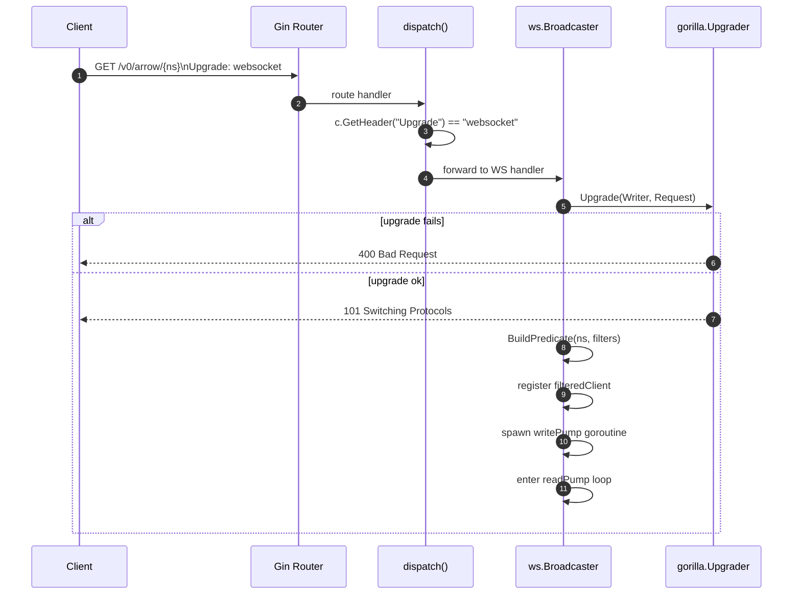
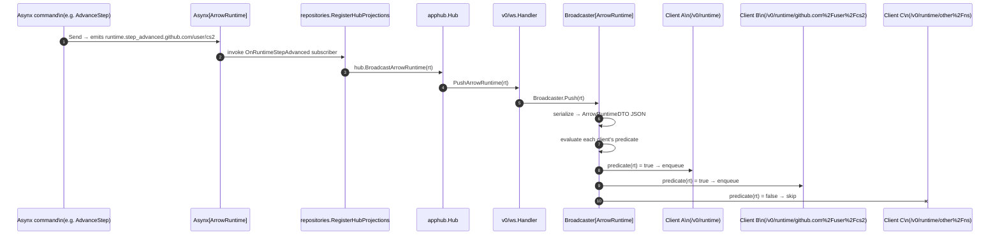

# Quiver — WebSocket Protocol

## Overview

The WebSocket layer is a one-way notification pipe. When Asynx events fire, projection handlers in the repository layer call the version-agnostic `WebSocketHub`. The hub fans out to every registered API-version subscriber (today only `v0`). Each version's WS handler maps the domain aggregate to its versioned DTO and pushes it to clients connected to the matching channel. The WS layer has no business logic — it only filters, maps, and delivers.

Clients connect to resource-scoped endpoints. The endpoint URL **is** the subscription — no subscribe/unsubscribe protocol, no room joins. Connect and receive. Filtering is performed server-side via path parameters and query strings.

Base path: `/v0`

Related specs: [subscriptions.md](subscriptions.md) (Asynx handlers and the projection wiring), [domain.md](domain.md) (aggregate definitions), [http-api.md](http-api.md) (REST endpoints sharing the same routes).

---

## 1. Design Principles

- **URL-as-subscription** — no room joins, no subscribe/unsubscribe messages. Connect to an endpoint, receive pushes.
- **Aggregate push model** — every push is the full versioned DTO for the corresponding aggregate. The state tells the client what happened. WS DTOs are intentionally narrower than REST detail responses — they carry only fields that come from the aggregate itself, not composite views.
- **No initial snapshot** — client fetches current state via REST, then connects WS for incremental updates.
- **One-way pipe** — server to client only. The server `readPump` reads any client frames purely to detect disconnects; payload is discarded. Pong frames are processed by gorilla's pong handler and reset the read deadline.
- **Fire and forget** — no delivery guarantees, no message IDs, no acknowledgement. Slow consumers drop messages (see § Hub Semantics).
- **No auth in v0** — `CheckOrigin` returns true for all origins; no token validation.
- **Protocol-level heartbeat** — RFC 6455 ping/pong (opcodes 0x9/0xA), not application-level.
- **HTTP/WS shared routes** — the GET endpoints for arrows, runtime, and collections accept both REST and WS clients. A `dispatch` helper inspects the `Upgrade` header on each request and routes to the WS broadcaster or the REST handler.
- **Versioned** — REST and WS share the same `/v0/` routes today. Future API versions can register additional subscribers on the same hub and reshape DTOs independently.

---

## 2. Namespace Encoding

Namespaces contain `/` characters that conflict with URL path parsing. They are **percent-encoded into a single path segment** — same rule as REST ([http-api.md § Namespace Encoding](http-api.md#1-namespace-encoding)). Gin's router is configured with `UseRawPath = true` and `UnescapePathValues = true` so the encoded segment is captured intact then decoded into the route parameter.

| Raw Namespace | Encoded Path Segment |
|---|---|
| `github.com/valve/steamcmd` | `github.com%2Fvalve%2Fsteamcmd` |
| `github.com/char2cs/gaming.collection/cs2` | `github.com%2Fchar2cs%2Fgaming.collection%2Fcs2` |

The `{namespace}` placeholder in all endpoint definitions below refers to the **encoded** form. Once captured by Gin, the raw namespace is matched against pushed aggregates using `path.Match` (Go glob), so callers may also send literal glob patterns (e.g. `github.com/user/*`) as the path segment to subscribe to multiple namespaces.

---

## 3. Channel Catalog

| Endpoint | DTO Pushed | Scope |
|---|---|---|
| `ws://host/v0/arrow` | `arrowEventDTO` | All arrows — catalog changes |
| `ws://host/v0/arrow/{namespace}` | `arrowEventDTO` | Single arrow (or glob) — catalog changes |
| `ws://host/v0/runtime` | `ArrowRuntimeDTO` | All arrows — runtime/execution events |
| `ws://host/v0/runtime/{namespace}` | `ArrowRuntimeDTO` | Single arrow (or glob) — runtime/execution events |
| `ws://host/v0/collection` | `collectionEventDTO` | All collections — follow/unfollow events |
| `ws://host/v0/collection/{namespace}` | `collectionEventDTO` | Single collection (or glob) — follow/unfollow events |

Every arrow and collection message carries an `event` field (`"upserted"` or `"removed"`) so clients can act without re-fetching. Runtime messages carry no `event` field — the `state` field already communicates what happened.

The Arrow channel additionally honours a `user_installed` query filter (see § 4.1). Other channels expose no filters today.

---

### 3.1 Arrow Channel — `/v0/arrow` and `/v0/arrow/{namespace}`

Pushes an `ArrowDTO` whenever the catalog mutates: an arrow is added, updated, upgraded, marked installed, or forgotten. Routes are registered in `internal/api/v0/endpoints/arrows/routes.go` via the `dispatch` helper, which forwards to the WS broadcaster when the request carries `Upgrade: websocket`.

**Triggers:** `arrow.added.*`, `arrow.upgraded.*`, `arrow.updated.*`, `arrow.installed.*`, plus the asynx `OnForget` hook when an arrow is deleted.

```json
// upserted (add, update, upgrade, or install)
{ "event": "upserted", "namespace": "github.com/char2cs/gaming.collection/cs2",
  "name": "CS2 Server", "version": "0.0.1", "description": "...", "tags": ["fps"], "user_installed": true }

// removed (OnForget)
{ "event": "removed", "namespace": "github.com/char2cs/gaming.collection/cs2",
  "name": "", "version": "", "description": "", "tags": null, "user_installed": false }
```

#### `user_installed` filter

The Arrow broadcaster registers a single filter on the `user_installed` query parameter:

| Query | Behaviour |
|---|---|
| _omitted_ | Default `"true"` — only user-installed arrows are pushed. |
| `?user_installed=true` | Same as default. |
| `?user_installed=false` | Only dependency arrows (not user-installed) are pushed. |

The filter compares with `ExactMatch` against `strconv.FormatBool(a.UserInstalled)`. There is no "all arrows" mode in v0 — every connection chooses one side.

---

### 3.2 Runtime Channel — `/v0/runtime` and `/v0/runtime/{namespace}`

Pushes an `ArrowRuntimeDTO` on every transition or progress tick of an arrow's lifecycle. This is the high-frequency channel — `runtime.step_advanced` fires as often as the wizard advances steps.

**Triggers:** `runtime.begun.*`, `runtime.ended.*`, `runtime.recovered.*`, `runtime.detached.*`, `runtime.pid_recorded.*`, `runtime.outdated.*`, `runtime.outdated_cleared.*`, `runtime.step_advanced.*`.

```json
{ "namespace": "github.com/user/cs2", "state": "running",
  "active_run": { "method": "_install", "pid": 1234, "steps": [...], "variables": {...} },
  "last_return": null }
```

Routes are registered in `internal/api/v0/endpoints/runtime/routes.go`. Unlike arrow and collection, the runtime route is WS-only — there is no REST GET handler on `/runtime`, so the routes pass `runtimeWS` directly without a `dispatch` wrapper.

---

### 3.3 Collection Channel — `/v0/collection` and `/v0/collection/{namespace}`

Pushes a `collectionEventDTO` whenever a collection is followed or unfollowed.

**Triggers:**
- `collection.followed` — broadcasts the full collection aggregate.
- Asynx `OnForget` (unfollow) — broadcasts a `"removed"` event with only namespace populated.

Routes are registered in `internal/api/v0/endpoints/collections/routes.go` via the same `dispatch` helper as arrows.

```json
// upserted (followed)
{ "event": "upserted", "namespace": "github.com/char2cs/gaming.collection",
  "name": "Gaming Collection", "description": "...", "tags": ["gaming"], "followed": true }

// removed (unfollowed)
{ "event": "removed", "namespace": "github.com/char2cs/gaming.collection",
  "name": "", "description": "", "tags": null, "followed": false }
```

The DTO is intentionally minimal in v0 — `media`, `arrows`, `maintainers`, and `failed_arrows` are not pushed over WS. Clients fetch full collection detail via `GET /v0/collection/{namespace}` after a notification.

---

## 4. DTO Definitions

DTOs are produced by the `From()` mappers in `internal/api/v0/dto/`. The same DTOs are reused by REST list/detail endpoints where applicable — but the WS variants are the bare aggregate views and do not include the cross-aggregate fields some REST detail responses synthesise.

### 4.1 `arrowEventDTO`

Every arrow channel message is an `arrowEventDTO` — a single struct that wraps `ArrowDTO` with an `event` discriminant.

| Field | JSON | Type | Notes |
|---|---|---|---|
| Event | `event` | `string` | `"upserted"` or `"removed"`. |
| Namespace | `namespace` | `string` | Decoded namespace (e.g. `github.com/user/repo`). Always populated. |
| Name | `name` | `string` | From `ArrowMeta.Name`. Empty on `"removed"`. |
| Version | `version` | `string` | From `ArrowMeta.Version`. Empty on `"removed"`. |
| Description | `description` | `string` | From `ArrowMeta.Description`. Empty on `"removed"`. |
| Tags | `tags` | `string[]` | From `ArrowMeta.Tags`. Null on `"removed"`. |
| UserInstalled | `user_installed` | `bool` | True for user-intent arrows; false for deps or on `"removed"`. |

Clients should branch on `event` first. For `"upserted"`, upsert the payload into the local store. For `"removed"`, remove the entry by `namespace`. The non-namespace fields on a `"removed"` message carry no meaning.

`license`, `url`, `maintainers`, `credits`, `requirements`, `dependencies`, `variables`, `netbridge`, `targets`, `installed_at`, etc. are **not** projected onto the WS DTO. Clients needing those fields call REST.

### 4.2 `ArrowRuntimeDTO`

| Field | JSON | Type | Notes |
|---|---|---|---|
| Namespace | `namespace` | `string` | Mapped from `ArrowRuntime.Ref` (the runtime aggregate's identity is `Ref`, which holds the same namespace string). |
| State | `state` | `string` | One of: `absent`, `installing`, `updating`, `ready`, `running`, `stopping`, `draining`, `detached`, `uninstalling`, `removed`, `outdated` (see [domain.md § ArrowState](domain.md#3-arrowstate-and-the-runtime-state-machine)). |
| ActiveRun | `active_run` | `RunRecordDTO \| null` | `omitempty` — `null` when no execution is in progress. |
| LastReturn | `last_return` | `ReturnDTO \| null` | `omitempty` — `null` when no execution has completed yet. |

**`RunRecordDTO`** (active execution):

| Field | JSON | Type | Notes |
|---|---|---|---|
| Method | `method` | `string` | `_install`, `_execute`, `_stop`, `_uninstall`, `_update`, or a custom method. |
| PID | `pid` | `int` | `omitempty` — set after `runtime.pid_recorded`. |
| Variables | `variables` | `map[string]string` | `omitempty` — resolved variables for this run. |
| Steps | `steps` | `StepProgressDTO[]` | `omitempty` — current step progress. |

**`ReturnDTO`** (last completed execution):

| Field | JSON | Type | Notes |
|---|---|---|---|
| Method | `method` | `string` | Method that completed. |
| Outcome | `outcome` | `string` | `success`, `failed`, `cancelled`. |
| Variables | `variables` | `map[string]string` | `omitempty`. |
| Steps | `steps` | `StepProgressDTO[]` | `omitempty` — final step states. |

**`StepProgressDTO`**:

| Field | JSON | Type | Notes |
|---|---|---|---|
| Index | `index` | `int` | |
| Status | `status` | `string` | `pending`, `running`, `completed`, `failed`. |
| Title | `title` | `string` | Extracted by re-marshalling the underlying `Step` and reading its `title` JSON field. |
| Type | `type` | `string` | `run`, `fetch`, `signal`, `dependencies`, etc. — from `Step.Type()`. |
| Error | `error` | `string \| null` | `omitempty`. |

### 4.3 `collectionEventDTO`

Every collection channel message is a `collectionEventDTO` — a single struct that wraps `QuiverDTO` with an `event` discriminant.

| Field | JSON | Type | Notes |
|---|---|---|---|
| Event | `event` | `string` | `"upserted"` or `"removed"`. |
| Namespace | `namespace` | `string` | Always populated. |
| Name | `name` | `string` | From `Collection.Meta.Name`. Empty on `"removed"`. |
| Description | `description` | `string` | From `Collection.Meta.Description`. Empty on `"removed"`. |
| Tags | `tags` | `string[]` | From `Collection.Meta.Tags`. Null on `"removed"`. |
| Followed | `followed` | `bool` | False on `"removed"`. |

The underlying Go type wrapping the WS payload is named `collectionEventDTO` (embedding `QuiverDTO`, which retains the legacy name in code; the domain type is `Collection`). Clients should branch on `event` first — same pattern as arrows.

---

## 5. Event-to-Push Mapping

The mapping is implemented in two places: arrow catalog projections in `internal/app/repositories/arrow/internal/store/internal/projections/projections.go`, and runtime + collection projections in `internal/app/repositories/container.go`'s `RegisterHubProjections`.

### Arrow catalog feed — `Asynx[Arrow]`

| Event topic | Where wired | Push | `event` field |
|---|---|---|---|
| `arrow.added.*` | catalog projection | `arrowEventDTO` | `"upserted"` |
| `arrow.upgraded.*` | catalog projection | `arrowEventDTO` | `"upserted"` |
| `arrow.updated.*` | catalog projection | `arrowEventDTO` | `"upserted"` |
| `arrow.installed.*` | catalog projection | `arrowEventDTO` | `"upserted"` |
| `OnForget(Arrow)` | catalog projection | `arrowEventDTO` | `"removed"` |

The broadcast is gated on storage projection success — if `aggregateAndSave` fails, no broadcast fires.

### Runtime feed — `Asynx[ArrowRuntime]`

| Event topic | Repository hook | Push |
|---|---|---|
| `runtime.begun.*` | `OnRuntimeBegun` | `ArrowRuntimeDTO` |
| `runtime.ended.*` | `OnRuntimeEnded` | `ArrowRuntimeDTO` |
| `runtime.recovered.*` | `OnRuntimeRecovered` | `ArrowRuntimeDTO` |
| `runtime.detached.*` | `OnRuntimeDetached` | `ArrowRuntimeDTO` |
| `runtime.pid_recorded.*` | `OnRuntimePIDRecorded` | `ArrowRuntimeDTO` |
| `runtime.outdated.*` | `OnRuntimeOutdated` | `ArrowRuntimeDTO` |
| `runtime.outdated_cleared.*` | `OnRuntimeOutdatedCleared` | `ArrowRuntimeDTO` |
| `runtime.step_advanced.*` | `OnRuntimeStepAdvanced` | `ArrowRuntimeDTO` |

`runtime.step_advanced` is the highest-frequency event — fires twice per wizard step (pending → running, running → completed/failed).

### Collection feed — `Asynx[Collection]`

| Event topic | Repository hook | Push | `event` field |
|---|---|---|---|
| `collection.followed` | `OnCollectionFollowed` | `collectionEventDTO` (full aggregate) | `"upserted"` |
| `OnForget(Collection)` | `OnCollectionUnfollowed` | `collectionEventDTO` (namespace only) | `"removed"` |

Note: `collection.followed` is a single literal topic (not pattern-based), because the FollowCollection command uses a fixed event name. Unfollow flows through asynx's `OnForget` hook.

---

## 6. Connection Lifecycle

### 6.1 Handshake



Dispatching:
- Arrow and Collection routes use `dispatch(rest, ws)` — the same path serves REST GET when the request has no `Upgrade: websocket` header, and WS when it does.
- Runtime routes are WS-only — `GET /v0/runtime` and `GET /v0/runtime/{ns}` go straight to the broadcaster.

Failure responses:

| Condition | Response |
|---|---|
| `Upgrade` header missing on a WS-only route, or upgrade negotiation fails | `400 Bad Request` |
| Path doesn't match any registered route | `404 Not Found` (Gin default) |

There is no `404` for "namespace not found" — the namespace path parameter is treated as a glob and matched against pushed events at runtime, so unknown namespaces simply receive nothing.

### 6.2 Steady State

The server pushes JSON text frames whenever events arrive. Clients send nothing useful — `readPump` reads incoming frames purely to detect close events and pong activity. Any payload sent by the client is discarded.

### 6.3 Heartbeat

Defined in `internal/api/ws/client.go`:

| Constant | Value | Role |
|---|---|---|
| `pingInterval` | 30 s | `writePump` ticker — sends ping frames. |
| `pongTimeout` | 60 s | `readPump` deadline — extended on pong, expires connection if silent. |
| `writeTimeout` | 10 s | Per-frame write deadline. |
| `sendBuffer` | 64 | Per-client send channel capacity. |

`SetPongHandler` resets the read deadline by `pongTimeout` whenever a pong arrives. If 60 s elapses with no pong (and no other client traffic), `NextReader` errors and `readPump` returns, triggering teardown.

### 6.4 Disconnect & Reconnect

Either side may close. Termination paths:
1. Client closes — `readPump.NextReader` errors, returns.
2. Pong timeout — `readPump` read deadline expires, returns.
3. Server-side write error or push frame failure — `writePump` returns, deferred `conn.Close()` runs.

After `readPump` returns, the broadcaster `Handle` removes the client from its map and closes `cl.done`, which signals `writePump` to exit.

There is no reconnection protocol. Clients reconnecting must:
1. Fetch current state via REST (`GET` endpoints).
2. Re-establish the WebSocket connection.

This pattern ensures missed events during the disconnect window are reconciled by the REST snapshot.

---

## 7. Hub Semantics

### 7.1 Two-tier hub

The hub is split across two packages so the app layer can broadcast without importing the API layer:

| Type | Location | Role |
|---|---|---|
| `apphub.WebSocketHub` (interface) | `internal/app/hub/hub.go` | Three methods: `BroadcastArrow(ArrowEvent)`, `BroadcastArrowRuntime(ArrowRuntime)`, `BroadcastCollection(CollectionEvent)`. App-layer projections depend on this interface. |
| `apphub.Hub` (struct) | `internal/app/hub/hub.go` | Implements `WebSocketHub`. Holds a slice of `Subscriber`s under an `RWMutex`. Fans broadcasts out to every registered subscriber. |
| `apphub.Subscriber` (interface) | `internal/app/hub/hub.go` | Three methods: `PushArrow(ArrowEvent)`, `PushArrowRuntime(ArrowRuntime)`, `PushCollection(CollectionEvent)`. Implemented by each API version's WS handler. |
| `apphub.ArrowEvent` | `internal/app/hub/hub.go` | Embeds `domain.Arrow` with a `CatalogEventKind` (`CatalogUpserted` / `CatalogRemoved`). Carries the semantic distinction between catalog mutations and deletions. |
| `apphub.CollectionEvent` | `internal/app/hub/hub.go` | Embeds `domain.Collection` with a `CatalogEventKind`. Same pattern as `ArrowEvent`. |
| `api.Hub` / `api.WSVersion` | `internal/api/hub.go` | Type aliases for `apphub.Hub` and `apphub.Subscriber` so api-layer wiring code can refer to them by their api-layer names. `api.NewHub()` returns an `*apphub.Hub`. |

Fan-out: when a projection calls `hub.BroadcastArrow(ArrowEvent{Kind: CatalogUpserted, Arrow: ...})`, the hub iterates its subscribers under `RLock` and invokes `PushArrow(evt)` on each. `v0/ws.Handler.PushArrow` forwards to the underlying `apiws.Broadcaster[apphub.ArrowEvent]`, which serializes to `arrowEventDTO` and routes per-channel.

### 7.2 Per-version broadcaster

Each version's `Handler` (today only `v0/ws.Handler`) wraps three `apiws.Broadcaster[T]` instances — one per aggregate — defined by a `StreamDef[T]`:

| `StreamDef` field | Purpose |
|---|---|
| `Namespace(T) string` | Extracts the aggregate's identity for path-glob matching. |
| `Serialize(T) ([]byte, error)` | Marshals the event to its versioned DTO via `dto.ArrowEventDTOFrom` / `dto.CollectionEventDTOFrom`. |
| `Filters []FilterDef[T]` | Optional query-parameter filters (only Arrow has one — `user_installed`). |

The Arrow broadcaster is `Broadcaster[apphub.ArrowEvent]` and the Collection broadcaster is `Broadcaster[apphub.CollectionEvent]`. The `Serialize` function for each switches on `Kind` to produce the correct `arrowEventDTO` or `collectionEventDTO`.

`BuildPredicate` composes the path-glob test (`path.Match` over `c.Param("ns")`) with the active filters into a single predicate. Each connected client carries its own predicate; on every push, the broadcaster evaluates each client's predicate and writes the serialized payload only to those that match.

### 7.3 Slow-consumer policy

Each client has a `send chan []byte` of capacity 64. `Push` performs a non-blocking send:

| Channel state | Outcome |
|---|---|
| Buffer space available | Frame queued for `writePump`. |
| Buffer full | `default` branch fires — frame **dropped silently**. |

This means a slow client that fills its 64-frame buffer simply misses subsequent pushes until `writePump` drains the channel. The broadcaster never blocks on a slow client. Clients that need authoritative state must reconcile via REST after detecting gaps.

### 7.4 Mid-connection lifecycle

Connections survive arbitrary domain-state changes:

- **Namespace deletion (Arrow forgotten)** — the `OnForget` hook fires a broadcast with `Kind: CatalogRemoved`, producing an `arrowEventDTO` with `event: "removed"`. Clients use this to remove the entry from their local store without re-fetching. Clients connected to the now-defunct namespace channel keep the connection open; they simply receive no further messages until a new aggregate matching the glob appears.
- **Namespace creation** — clients already connected to a glob (e.g. `/v0/arrow/github.com/user/*`) automatically begin receiving pushes for newly-added matching arrows; no reconnect needed.
- **Slow consumer** — see § 7.3. Connection stays alive; messages drop.
- **Server shutdown** — connections close at the TCP level; clients re-fetch via REST and reconnect.

---

## 8. Event Fan-out Diagram



---

## 9. Open Questions

| # | Question | Default if unresolved |
|---|---|---|
| 1 | Should `runtime.step_advanced` pushes be throttled/coalesced server-side? | No throttling in v0 — clients accept high-frequency pushes or rely on the slow-consumer drop policy. |
| 2 | Should the unfollow `QuiverDTO` carry a `removed: true` flag instead of being a sentinel with empty meta? | Resolved — all arrow and collection messages now carry an `event` field (`"upserted"` / `"removed"`). Clients branch on `event`, not on empty meta. |
| 3 | Should there be a `ws://host/v0/collection/{namespace}/arrows` endpoint scoping arrow events to a collection's arrow list? | No in v0 — clients connect to per-arrow channels or filter client-side. |
| 4 | Maximum connections per client / total? | No limit in v0. |
| 5 | Authentication / origin enforcement? | None in v0 — `CheckOrigin` returns true for all origins. |
